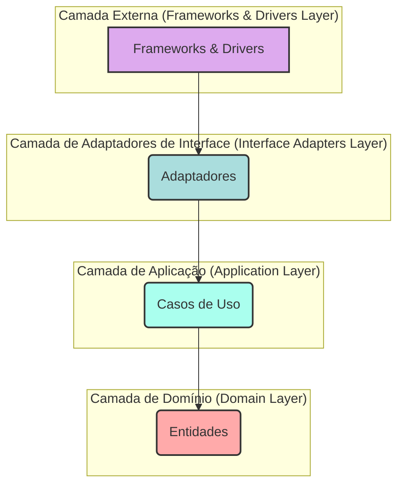

# Padrões de Código e Diretrizes de Desenvolvimento

Manter um padrão de código consistente e seguir as diretrizes de desenvolvimento é crucial para a qualidade, legibilidade e manutenção do Project Wiz. Este documento consolida os principais padrões de código, estilo, formatação, nomenclatura, e melhores práticas específicas para tecnologias, servindo como fonte única de verdade.
### Visualização da Clean Architecture

A arquitetura do Project Wiz adota os princípios da Clean Architecture. Para uma discussão detalhada, consulte **[Boas Práticas e Diretrizes de Desenvolvimento Detalhadas](../reference/02-best-practices.md)**. A visualização abaixo ilustra as camadas e a regra de dependência:


*   **Regra de Dependência:** As dependências fluem sempre para dentro. Código em camadas internas não deve saber nada sobre código em camadas externas.

A seção **Princípios de Object Calisthenics (Exemplos Práticos)** mais abaixo neste documento detalha algumas dessas regras com exemplos.

## Padrões de Estilo de Código

### Linguagem Principal: TypeScript

*   **Configuração `strict`:**
    *   **Regra:** Utilizamos a configuração `strict: true` (ou todas as suas flags individuais como `noImplicitAny`, `strictNullChecks`, etc.) ativada no `tsconfig.json`.
    *   **Porquê:** Garante maior segurança de tipo, detectando muitos erros comuns (como referências nulas ou tipos implícitos `any`) em tempo de compilação, resultando em código mais robusto, confiável e fácil de refatorar.
*   **Path Aliases:**
    *   **Regra:** Path aliases como `@/components`, `@/lib`, `@/core` são utilizados para facilitar a importação de módulos.
    *   **Porquê:** Evita caminhos de importação relativos longos e frágeis (ex: `../../../../components/Button`), tornando o código mais limpo, fácil de mover entre diretórios e melhorando a legibilidade das importações.
*   **Tipagem Forte:**
    *   **Regra:** Priorize a tipagem forte; evite `any` sempre que possível. Se `any` for estritamente necessário (ex: interagir com bibliotecas de terceiros sem tipos ou código dinâmico complexo), justifique seu uso com um comentário e restrinja seu escopo ao mínimo. Considere `unknown` como uma alternativa mais segura a `any`.
    *   **Porquê:** `any` desabilita a verificação de tipos do TypeScript para a variável ou expressão específica, anulando os benefícios de segurança de tipo e aumentando o risco de erros em tempo de execução que poderiam ser pegos em compilação. `unknown` força verificações de tipo antes do uso.
*   **Aplicação de Tipos:**
    *   **Regra:** Defina explicitamente tipos para todas as declarações de variáveis, parâmetros de função e valores de retorno de função, a menos que o tipo inferido pelo TypeScript seja óbvio, correto e não prejudique a clareza.
    *   **Porquê:** Melhora a clareza do código, serve como documentação, auxilia na detecção precoce de erros de tipo e facilita o entendimento das estruturas de dados e contratos de função por outros desenvolvedores.
*   **Interface vs. Type:**
    *   **Regra:** Use `interface` para definir a forma de objetos públicos (especialmente aqueles que podem ser estendidos ou implementados por classes) ou quando desejar a capacidade de "declaration merging" (útil para estender interfaces de bibliotecas de terceiros). Use `type` para tipos de união, interseção, tuplas, tipos mapeados, tipos condicionais, ou para nomear tipos primitivos e formas de objeto mais complexas que não necessitam de "declaration merging" ou herança de interface explícita.
    *   **Porquê:** `interface` oferece melhor performance em algumas verificações de tipo e mensagens de erro potencialmente mais claras para estruturas de objeto simples e hierarquias. `type` é mais versátil para construções de tipo mais complexas e operações de tipo. A escolha deve visar clareza e intenção.
    *   **Exemplo Avançado (Type para Mapped Type):**
        ```typescript
        // Interface para descrever uma entidade
        interface Product {
          id: string;
          name: string;
          price: number;
          inStock: boolean;
        }

        // Type para criar um tipo parcial com todos os campos opcionais, útil para updates
        type PartialProductUpdate = Partial<Product>;
        // Resultado: { id?: string; name?: string; price?: number; inStock?: boolean; }

        // Type para criar um tipo onde todas as propriedades são readonly
        type ReadonlyProduct = Readonly<Product>;

        // Type para um DTO que omite certos campos
        type ProductListingDTO = Omit<Product, 'inStock'>;
        ```
*   **Propriedades Readonly:**
    *   **Regra:** Aplique `readonly` a propriedades de interfaces/tipos, a arrays (`ReadonlyArray<T>`) e a tuplas que não devem ser reatribuídos ou modificados após a inicialização da instância que os contém.
    *   **Porquê:** Promove a imutabilidade e a previsibilidade do estado, prevenindo modificações acidentais e tornando mais claro quais dados são fixos e quais podem mudar.
    *   **Exemplo (ReadonlyArray e Tupla):**
        ```typescript
        interface AppConfig {
          readonly adminEmails: ReadonlyArray<string>;
          readonly defaultCoordinates: readonly [number, number]; // Tupla readonly
        }
        const config: AppConfig = {
          adminEmails: ["admin@example.com", "support@example.com"],
          defaultCoordinates: [10.0, 20.5]
        };
        // config.adminEmails.push("new@example.com"); // Erro
        // config.defaultCoordinates[0] = 5.0; // Erro
        ```
*   **Enums vs. Tipos de União Literal:**
    *   **Regra:** Prefira tipos de união literal (ex: `'status-ativo' | 'status-inativo'`) para um conjunto pequeno e fixo de valores literais conhecidos, especialmente strings. Use `enum` do TypeScript (preferencialmente `const enum` para evitar código JavaScript extra) para conjuntos distintos de constantes numéricas relacionadas, quando a interoperabilidade com código legado que usa enums for necessária, ou quando se deseja um objeto iterável no runtime com nomes e valores.
    *   **Porquê:** Tipos de união literal geralmente oferecem melhor tree-shaking, não introduzem um objeto extra no runtime (no caso de `const enum`, são inlined), e podem ser mais fáceis de depurar. `enum`s podem ser mais verbosos e ter algumas armadilhas (como enums numéricos reversos).
*   **Genéricos para Reusabilidade:**
    *   **Regra:** Empregue genéricos (`<T>`) para criar componentes, funções, classes e tipos reutilizáveis que podem operar em uma variedade de tipos de dados enquanto mantêm a segurança de tipo.
    *   **Porquê:** Permite escrever código flexível, abstrato e DRY (Don't Repeat Yourself) sem sacrificar a segurança de tipos, evitando a necessidade de `any` ou duplicação de código para diferentes tipos.
    *   **Exemplo Avançado (Função Genérica com Constraints):**
        ```typescript
        interface Lengthwise {
          length: number;
        }

        // Esta função genérica aceita qualquer tipo T que tenha uma propriedade 'length' do tipo number.
        function logLength<T extends Lengthwise>(arg: T): T {
          console.log(arg.length);
          return arg;
        }

        logLength("hello"); // OK, string tem length
        logLength([1, 2, 3]); // OK, array tem length
        // logLength(123); // Erro: number não tem propriedade length
        logLength({ length: 10, value: "test" }); // OK

        // Exemplo com múltiplas constraints ou classes
        // function createInstance<T extends SomeBaseClass & SomeInterface>(constructor: new () => T): T {
        //   return new constructor();
        // }
        ```
*   **Tratamento de Null e Undefined (`strictNullChecks`):**
    *   **Regra:** Com `strictNullChecks` ativado, trate explicitamente a possibilidade de valores `null` ou `undefined`. Utilize encadeamento opcional (`?.`), coalescência nula (`??`), guardas de tipo (type guards como `typeof x === 'string'` ou `x instanceof MyClass`), asserções de tipo (com cautela, ex: `value!`), ou utilitários como `NonNullable<T>`.
    *   **Porquê:** `strictNullChecks` é uma das funcionalidades mais poderosas do TypeScript para prevenir erros comuns de "cannot read property 'foo' of undefined/null" em tempo de execução. Exige um manejo explícito desses valores, tornando o código mais seguro e robusto.
    *   **Exemplo Avançado (Type Guard e NonNullable):**
        ```typescript
        interface UserProfile { name: string; bio?: string | null; }

        function printUserProfile(profile: UserProfile) {
          console.log(`Name: ${profile.name}`);
          // Usando type guard para refinar o tipo de bio
          if (typeof profile.bio === 'string') {
            console.log(`Bio: ${profile.bio.toUpperCase()}`); // profile.bio é string aqui
          } else {
            console.log("Bio not provided or is null.");
          }
        }
        // Exemplo com NonNullable
        // function getBioOrFail(bio: string | null | undefined): NonNullable<string | null | undefined> /* string */ {
        //   if (bio === null || bio === undefined) throw new Error("Bio is missing!");
        //   return bio;
        // }
        ```
*   **Módulos ESM:**
    *   **Regra:** Sempre prefira a sintaxe de módulo ES (`import`/`export`) em vez de outros sistemas de módulos como CommonJS (`require`/`module.exports`) no código TypeScript.
    *   **Porquê:** É o padrão moderno para módulos JavaScript/TypeScript, suportado nativamente por navegadores e Node.js (em versões recentes), e permite melhor análise estática por ferramentas de build e linters, facilitando otimizações como tree-shaking.
*   **Opções Estritas do Compilador:**
    *   **Regra:** Mantenha todas as opções do compilador relacionadas à `strict` (ou a própria `strict: true`) habilitadas no `tsconfig.json`. Escreva código que seja compatível com essas verificações rigorosas.
    *   **Porquê:** Ajuda a escrever código mais seguro, robusto e de melhor qualidade, pegando uma gama maior de erros potenciais em tempo de compilação antes que se tornem problemas em produção.

### Formatação (Prettier)

*   **Regra:** O projeto utiliza Prettier para garantir consistência na formatação automática do código. As configurações estão definidas em `.prettierrc.js` (ou similar).
    *   Indentação: 2 espaços.
    *   Aspas: Simples (`singleQuote: true`).
    *   Ponto e vírgula: Sempre no final das instruções (`semi: true`).
    *   Outras configurações conforme o arquivo do projeto.
*   **Porquê:** Formatação automática e consistente elimina debates sobre estilo pessoal, garante um visual uniforme em toda a codebase, melhora a legibilidade e permite que os desenvolvedores se concentrem na lógica de negócios em vez de se preocuparem com detalhes de formatação.
*   **Ação:** Recomenda-se configurar seu editor para formatar ao salvar (Format On Save) ou executar o script de formatação (ex: `npm run format`) regularmente.
*   **Consistência na Formatação:**
    *   **Regra:** Adira ao estilo de formatação de código consistente imposto pelo Prettier. Evite desabilitar regras do Prettier ou introduzir formatação manual que divirja do padrão.
    *   **Porquê:** Garante que as diferenças de código (diffs) em revisões e merges reflitam apenas mudanças lógicas, não de estilo pessoal, facilitando a colaboração e a manutenção do histórico.

### Linting (ESLint)

*   **Regra:** ESLint é usado para análise estática de código e para impor padrões de qualidade de código, boas práticas e estilo não cobertos pelo Prettier. A configuração base (`eslint.config.js`) estende-se de presets recomendados e é customizada para as necessidades do projeto.
*   **Porquê:** Ajuda a prevenir erros comuns, identificar anti-padrões, promover consistência no uso de construções da linguagem, e manter a qualidade geral do código, melhorando sua robustez e manutenibilidade a longo prazo.
*   **Ação:** Execute `npm run lint` para verificar o código e `npm run lint:fix` para tentar correções automáticas para as regras que o suportam.
*   **Instrução Crucial:**
        *   **Regra:** Após criar ou modificar um arquivo, **SEMPRE execute o ESLint (`npx eslint path/to/your/file.tsx --fix` ou o script do projeto `npm run lint:fix`) e realize TODOS os ajustes e refatorações necessários para eliminar erros e avisos.** Não prossiga com o commit de código que possua erros de linting.
        *   **Porquê:** Garante que apenas código em conformidade com os padrões de qualidade seja integrado à base principal, mantendo a alta qualidade e prevenindo a introdução de "code smells" ou potenciais bugs.

### Convenções de Nomenclatura

*   **Variáveis, Funções, Classes, Pastas:**
    *   **Regra:** Use nomes claros, descritivos, autoexplicativos e em **inglês** para todas as construções de código.
        *   Variáveis e funções: `camelCase` (e.g., `currentUser`, `calculateTotalPrice`).
        *   Classes, Interfaces, Tipos, Enums: `PascalCase` (e.g., `UserService`, `IOrderRepository`, `PaymentStatus`).
        *   Constantes (valores fixos e imutáveis): `UPPER_SNAKE_CASE` (e.g., `MAX_RETRIES`, `DEFAULT_TIMEOUT_MS`).
    *   **Porquê:** Inglês é a língua universal no desenvolvimento de software, facilitando a colaboração. Nomes descritivos e consistentes com as convenções de casing melhoram drasticamente a legibilidade, reduzem ambiguidades e o tempo necessário para entender o código.
*   **Pastas:**
    *   **Regra:** Devem ser nomeadas em inglês e, para este projeto, **prioritariamente em `kebab-case`** (ex: `user-authentication`, `data-processing`), a menos que uma convenção específica de um framework ou ferramenta exija outro padrão (ex: componentes React podem estar em pastas `PascalCase` se essa for a convenção do projeto para componentes).
    *   **Porquê:** Consistência na nomeação de pastas melhora a navegabilidade do projeto e `kebab-case` é comum em muitos ecossistemas web para nomes de diretórios.

### Convenções de Nomenclatura de Arquivos

*   **Regra:** **Todos os nomes de arquivos devem estar em kebab-case** (e.g., `user-profile.component.ts`, `data-fetcher.service.ts`, `auth-constants.ts`).
    *   **Porquê:** `kebab-case` é fácil de ler em nomes de arquivo, é URL-friendly (embora menos relevante para arquivos de código-fonte), e evita problemas de sensibilidade de caixa em diferentes sistemas operacionais, garantindo consistência entre ambientes de desenvolvimento.
*   **Aplicabilidade:** Esta regra se aplica a todos os tipos de arquivo criados dentro do projeto (.ts, .tsx, .md, .json, etc.).
*   **Exceções Justificáveis:**
    *   Frameworks ou bibliotecas que exigem explicitamente uma convenção diferente (e.g., roteamento de páginas Next.js como `page.tsx` ou `layout.tsx` dentro de diretórios específicos).
    *   Arquivos de configuração com nomes padronizados pela comunidade ou ferramentas (e.g., `vite.config.ts`, `tailwind.config.ts`, `README.md`, `Dockerfile`, `Procfile`).
    *   Arquivos de definição de tipo globais ou de bibliotecas de terceiros que seguem suas próprias convenções (ex: `custom.d.ts`).
    *   **Importante:** Tais exceções devem ser limitadas e, se não forem universalmente reconhecidas, justificadas internamente ou documentadas se necessário.
*   **Exemplos:**
    *   **Bom:** `user-service.ts`, `invoice-generator.util.ts`, `use-auth-session.hook.tsx`, `api-error.model.ts`, `contributing-guide.md`
    *   **Ruim:** `UserService.ts`, `InvoiceGenerator.util.ts`, `useAuthSession.tsx`, `ApiErrorModel.ts`, `ContributingGuide.md`
    *   **Exceções Aceitáveis:** `vite.config.ts`, `next.config.js`, `src/app/admin/users/[userId]/page.tsx` (Next.js), `src/components/Button/Button.stories.tsx` (Storybook convention), `jest.setup.ts`
### Comentários

*   **Evitar Comentários Desnecessários:**
    *   **Regra:** Evite comentários o máximo possível. O código deve ser autoexplicativo através de boa nomenclatura, estrutura clara e design expressivo.
    *   **Porquê:** Comentários tendem a ficar desatualizados à medida que o código evolui, tornando-se enganosos ou irrelevantes. Código claro não precisa de comentários para explicar o que faz. Comentários que parafraseiam o código são redundantes.
*   **Comentários Necessários (O "Porquê" e o "Trade-off"):**
    *   **Regra:** Se um comentário for *absolutamente necessário*, ele deve explicar o *porquê* de uma decisão de design particular, as consequências de uma otimização, um workaround para um problema conhecido de uma biblioteca externa, ou a razão de uma lógica de negócios complexa que não pode ser simplificada mais sem perder clareza. Não comente o *o quê* o código faz.
    *   **Porquê:** O "o quê" o código faz deve ser óbvio pela leitura do próprio código. O "porquê" ou o contexto de decisões não óbvias são informações valiosas que o código por si só não pode transmitir.
*   **Idioma dos Comentários:**
    *   **Regra:** Escreva todos os comentários (quando necessários) em inglês.
    *   **Porquê:** Consistência com o restante do código e mensagens de commit, e facilita a colaboração e compreensão por uma audiência global de desenvolvedores.
*   **Não Comentar Código:**
    *   **Regra:** Não use comentários para desabilitar ou "comentar" blocos de código. Se o código não é necessário, remova-o. Se for experimental ou para referência futura, use branches do Git ou outras ferramentas.
    *   **Porquê:** O controle de versão (Git) é a ferramenta apropriada para manter o histórico das versões anteriores e gerenciar diferentes linhas de desenvolvimento. Código comentado polui a codebase, dificulta a leitura e pode ser confundido com código ativo.
*   **Sem Comentários de Metadados Supérfluos:**
    *   **Regra:** Não inclua comentários no início de um arquivo indicando seu caminho, autor, data de criação/modificação, ou no final de um arquivo indicando `[fim do arquivo]`.
    *   **Porquê:** Estas informações são fornecidas e gerenciadas de forma mais eficaz pelo sistema de controle de versão (Git) e pelo IDE. Tais comentários adicionam ruído visual e se tornam rapidamente desatualizados.
*   **Sem Comentários de Log de Mudanças no Código:**
    *   **Regra:** REMOVA TODOS OS COMENTÁRIOS EXPLICATIVOS PARA MODIFICAÇÕES DE CÓDIGO (e.g., `'// Corrigido bug X em DD/MM/AAAA por Fulano'`, `'// Adicionada feature Y'`).
    *   **Porquê:** O histórico do Git (`git blame`, `git log`, mensagens de commit semânticas) serve a esse propósito de forma muito mais eficaz e organizada. Comentários de log no código poluem e se tornam obsoletos.
*   **Priorize Clareza Sobre Comentários:**
    *   **Regra:** Em vez de adicionar um comentário para explicar uma seção confusa ou complexa do código, dedique tempo para refatorá-la até que se torne autoexplicativa. Use nomes melhores, divida funções/métodos, simplifique a lógica.
    *   **Porquê:** Código claro é inerentemente mais fácil de manter, entender e depurar do que código complexo com explicações adicionais. O esforço para tornar o código autoexplicativo compensa a longo prazo.

## Convenções de Estrutura de Diretórios

Manter uma estrutura de diretórios consistente facilita a navegação, a localização de código e a compreensão da arquitetura do projeto. A estrutura de diretórios do Project Wiz é baseada nos princípios da Clean Architecture e em convenções comuns para aplicações frontend modernas. Consulte `docs/reference/01-software-architecture.md` para detalhes arquiteturais completos.

**Porquê:** Uma estrutura bem definida acelera o desenvolvimento, pois os desenvolvedores sabem onde encontrar ou colocar diferentes tipos de arquivos, reforça a separação de responsabilidades arquiteturais, e facilita a integração de novos membros à equipe.

### Backend (`src_refactored/`)

A estrutura do backend segue as camadas da Clean Architecture, promovendo separação de responsabilidades e testabilidade:

*   `core/`: Coração da aplicação, contendo a lógica de negócios pura, independente de frameworks ou detalhes de infraestrutura.
    *   `domain/`: Define as entidades de negócio, objetos de valor, regras de domínio intrínsecas e as interfaces dos repositórios (contratos de persistência). É o núcleo mais interno e estável.
        *   **Porquê:** Isola a lógica de negócio fundamental de preocupações externas, tornando-a reutilizável e testável independentemente de UI, banco de dados, etc.
        *   **Exemplo:** `user.entity.ts`, `job-status.vo.ts`, `i-project.repository.ts`
    *   `application/`: Orquestra os casos de uso da aplicação. Contém serviços de aplicação, DTOs (Data Transfer Objects) para comunicação entre camadas, e as interfaces (portas) para serviços externos que a aplicação necessita (ex: gateways de notificação, sistemas de arquivos).
        *   **Porquê:** Define o que a aplicação pode fazer e como os dados fluem para executar essas operações, conectando o domínio à infraestrutura através de abstrações.
        *   **Exemplo:** `create-user.use-case.ts`, `project.service.ts`, `i-notification.gateway.ts`
*   `infrastructure/`: Implementações concretas de componentes externos e detalhes técnicos.
    *   `persistence/`: Implementações dos repositórios definidos no domínio (e.g., usando Drizzle ORM para interagir com SQLite).
        *   **Porquê:** Abstrai os detalhes de como os dados são armazenados e recuperados, permitindo trocar a tecnologia de persistência sem impactar o core da aplicação.
        *   **Exemplo:** `drizzle-user.repository.ts`
    *   `adapters/`: Adaptadores para serviços externos (LLMs, APIs de terceiros), implementações de gateways, e outros componentes que traduzem dados entre o formato da aplicação e o formato de sistemas externos.
        *   **Porquê:** Isola a aplicação das particularidades de ferramentas e serviços externos.
        *   **Exemplo:** `openai-llm.adapter.ts`, `bullmq-job.queue.ts`
    *   `electron/`: Código específico do processo principal do Electron (configuração de IPC, ciclo de vida da aplicação, gerenciamento de janelas).
        *   **Porquê:** Concentra a lógica relacionada ao ambiente desktop Electron.
    *   `frameworks/`: Configurações e código de "cola" (glue code) para frameworks específicos (ex: configuração de um servidor HTTP se houver um).
        *   **Porquê:** Mantém o código específico de framework separado da lógica de aplicação.
    *   `ioc/`: Configuração de Injeção de Dependência (ex: usando InversifyJS) para montar a aplicação, conectando abstrações às suas implementações concretas.
        *   **Porquê:** Facilita o baixo acoplamento e a testabilidade, permitindo que as dependências sejam injetadas em vez de serem codificadas diretamente.
*   `presentation/`: Camada responsável pela interação com o usuário ou outros sistemas (frequentemente considerada parte da infraestrutura na Clean Architecture).
    *   `electron/`: (Pode ser subdividido em `main/` e `preload/` scripts).
    *   `ui/`: Contém a aplicação frontend React. (Ver detalhes abaixo).
*   `shared/`: Código utilitário, tipos comuns, ou lógica que precisa ser compartilhada entre diferentes camadas (usar com cautela para não violar as regras de dependência da Clean Architecture – idealmente, o core não deve depender do shared se o shared tiver dependências de infraestrutura).
    *   **Porquê:** Evita duplicação de código para funcionalidades transversais como logging, tratamento de resultados, etc.
    *   **Exemplo:** `result.ts` (para encapsular sucesso/falha de operações), `logger.interface.ts`

### Frontend (`src_refactored/presentation/ui/`)

A interface do usuário (UI) é uma SPA React organizada para clareza, escalabilidade e Developer Experience (DX). A estrutura visa agrupar arquivos por funcionalidade (feature-sliced) e por tipo.
**Porquê Geral da Estrutura Frontend:** Esta organização visa facilitar a localização do código, promover a reutilização de componentes, isolar funcionalidades para melhor manutenção, e alinhar-se com as práticas modernas de desenvolvimento React para projetos de médio a grande porte.

```mermaid
graph LR
    subgraph "src_refactored/presentation/ui/"
        A[index.html]
        B[main.tsx]
        C[assets/]
        D[components/]
        E[config/]
        F[features/]
        G[hooks/]
        H[lib/]
        I[services/]
        J[store/]
        K[styles/]
        L[types/]
        M[routeTree.gen.ts]

        D --- D1[common/]
        D --- D2[layout/]
        D --- D3[ui/ (shadcn)]
        F --- F1[feature-A/]
        F --- F2[feature-B/]
        F1 --- F1a[components/]
        F1 --- F1b[hooks/]
        F1 --- F1c[pages/]
    end
```

*   **Raiz (`index.html`, `main.tsx`):** Ponto de entrada da aplicação React. `main.tsx` configura providers globais (tema, query client, router).
    *   **Porquê:** Padrão para aplicações Vite/React, centralizando a inicialização da aplicação e contextos globais.
*   `assets/`: Recursos estáticos como imagens, fontes, etc.
    *   **Porquê:** Localização padrão para arquivos que são servidos diretamente ou importados pelo sistema de build.
*   `components/`: Componentes React reutilizáveis em toda a aplicação.
    *   `common/`: Componentes UI genéricos, pequenos e altamente reutilizáveis, sem lógica de negócio específica (ex: `LoadingSpinner`, `ErrorFallback`, `PageTitle`, `CustomButton`).
        *   **Porquê:** Promove máxima reutilização, consistência visual para elementos básicos e evita duplicação de componentes de UI simples.
    *   `layout/`: Componentes responsáveis pela estrutura visual principal das páginas e seções da aplicação (ex: `AppShell` para o container principal, `MainSidebar`, `ContextSidebar` para barras laterais contextuais, `PageHeader`).
        *   **Porquê:** Separa a estrutura geral da aplicação (o "esqueleto") do conteúdo específico das páginas/features, facilitando mudanças globais de layout.
    *   `ui/`: Componentes base da biblioteca de UI (e.g., Shadcn/UI como `button.tsx`, `card.tsx`, `dialog.tsx`). Geralmente adicionados via CLI e podem ser customizados.
        *   **Porquê:** Mantém os componentes da biblioteca de UI externa organizados e permite fácil customização ou extensão sem modificar diretamente o código da biblioteca.
*   `config/`: Centraliza configurações principais da UI (instâncias de router, query client, configuração de i18n).
    *   **Porquê:** Facilita encontrar e modificar configurações globais da aplicação frontend, como comportamento de rotas ou cache de dados.
*   `features/<nome-da-feature>/`: Agrupamento modular por funcionalidade de negócio (ex: `auth`, `project-dashboard`, `chat-module`). Esta é uma abordagem chave para escalabilidade e organização.
    *   `components/`: Componentes React reutilizáveis *exclusivamente* dentro desta feature.
    *   `hooks/`: Hooks React contendo lógica de UI, estado e efeitos colaterais específicos da feature.
    *   `pages/` ou `views/`: Componentes de página completos que são os pontos de entrada para as rotas da feature (ex: `ProjectListPage.tsx`, `AuthPage.tsx`).
    *   `services/` (opcional): Funções encapsulando chamadas IPC ou lógica de busca de dados específica da feature.
    *   `types/` (opcional): Definições de tipo TypeScript específicas desta feature.
    *   `index.ts` (opcional): Ponto de entrada para exportar elementos públicos da feature (componentes, hooks, tipos), facilitando importações em outras partes da aplicação.
    *   **Porquê (Feature-Sliced Design):** Promove alta coesão (tudo relacionado a uma feature está agrupado) e baixo acoplamento (features são mais independentes umas das outras). Facilita o desenvolvimento paralelo por diferentes equipes, a manutenção (mudanças em uma feature têm menos chance de quebrar outra) e a eventual remoção ou alteração significativa de features.
*   `hooks/`: Contém hooks React globais, utilitários e reutilizáveis através de múltiplas features (ex: `useDebounce`, `useLocalStorage`, `useAppTheme`).
    *   **Porquê:** Permite reutilizar lógica de UI comum que não é específica de uma única feature, evitando duplicação.
*   `lib/`: Utilitários JavaScript/TypeScript puros (não-React) que podem ser usados em qualquer parte do frontend (ex: `cn` para classnames, utilitários de data, formatação de strings, helpers de validação).
    *   **Porquê:** Separa lógica puramente funcional e utilitária do código React (componentes, hooks), tornando-os mais fáceis de testar e reutilizar em contextos não-React se necessário.
*   `services/`: Define a camada de abstração para comunicação com o backend (Electron main process via IPC ou APIs HTTP). Contém funções que encapsulam chamadas, tratam dados e erros de comunicação.
    *   **Porquê:** Decoupla a lógica da UI e dos componentes dos detalhes da comunicação com o backend. Isso facilita a manutenção, a testabilidade (mockando a camada de serviço) e a potencial troca de implementações de transporte (ex: de IPC para HTTP) no futuro.
*   `store/`: Para gerenciamento de estado global do cliente que não é estado de servidor (o qual é geralmente gerenciado por bibliotecas como TanStack Query). Pode usar Zustand, Jotai, ou React Context API para estados mais simples.
    *   **Porquê:** Centraliza o estado que precisa ser acessado e modificado por múltiplas partes não relacionadas da árvore de componentes, evitando prop drilling excessivo e complexidade na sincronização de estado.
*   `styles/`: Arquivos de estilo globais (ex: `globals.css` com importações do Tailwind CSS, variáveis de tema CSS globais, reset/normalize CSS).
    *   **Porquê:** Local padrão para estilos que afetam toda a aplicação ou definem a base visual.
*   `types/`: Definições de tipo TypeScript globais para o frontend, usáveis através de múltiplas features ou componentes (ex: tipos para objetos de usuário, temas, configurações globais da UI).
    *   **Porquê:** Centraliza tipos que são comuns a várias partes da UI, evitando duplicação e facilitando a manutenção.
*   `routeTree.gen.ts`: Arquivo gerado automaticamente pelo TanStack Router Vite plugin, contendo a árvore de rotas da aplicação baseada na estrutura de arquivos em `features/**/pages/`.
    *   **Porquê:** Facilita o roteamento type-safe e a organização de rotas baseada em convenções de arquivos, reduzindo a necessidade de configuração manual de rotas.

## Validação da Camada de Domínio (Entidades e Objetos de Valor)

*   **Autovalidação:**
    *   **Regra:** Entidades e Objetos de Valor (VOs) na Camada de Domínio (`src_refactored/core/domain/`) são responsáveis por garantir sua própria consistência interna e aderir a invariantes de negócios. Eles devem validar seus dados na criação (construtor ou método de fábrica estático) ou em mudanças significativas de estado.
    *   **Porquê:** Centraliza as regras de negócio e as invariantes nos próprios objetos de domínio, tornando o domínio mais rico, robusto e garantindo que um objeto nunca exista em estado inválido. Isso previne a propagação de dados inválidos pelo sistema.
*   **Zod para Validação de Domínio:**
    *   **Regra:** Zod é a biblioteca padrão para definir esquemas de validação concisos e poderosos dentro da Camada de Domínio. VOs e Entidades devem usar esquemas Zod em seus métodos de fábrica `create` (preferencial) ou construtores para validar dados de entrada. Falhas de validação devem lançar erros específicos do domínio (ex: `ValueError`, `EntityError`), que podem encapsular os detalhes do erro Zod.
    *   **Porquê:** Zod fornece uma forma declarativa, type-safe e poderosa de definir e aplicar validações complexas, com excelente integração com TypeScript para inferência de tipos. Isso mantém as regras de validação próximas aos dados que elas protegem.
*   **Confiança do Caso de Uso na Validação do Domínio:**
    *   **Regra:** Casos de Uso da Camada de Aplicação devem confiar na validação realizada pelos VOs e Entidades para regras de negócio e consistência de dados. Eles podem usar Zod para validar a forma e os tipos de DTOs de entrada (input port), mas a lógica de negócio central e as invariantes são responsabilidade do domínio.
    *   **Porquê:** Evita duplicação de lógica de validação em múltiplas camadas e mantém os casos de uso focados na orquestração de interações com o domínio, não na validação detalhada de regras de negócio que pertencem às entidades.
*   **Benefícios:** Esta abordagem garante que os objetos de domínio sejam sempre consistentes e válidos, reduz a duplicação de código de validação, torna o sistema mais fácil de manter e entender, e aumenta a confiabilidade geral da aplicação.

## Padrão de Resposta e Tratamento de Erros de Caso de Uso

*   **DTO de Resposta Padronizado:**
    *   **Regra:** Todos os Casos de Uso da Camada de Aplicação (`src_refactored/application/use-cases/`) devem retornar um objeto de resposta padronizado, como `IUseCaseResponse<TOutput, TErrorDetails>` (definida em `src_refactored/shared/application/use-case-response.dto.ts`). Este objeto indica sucesso/falha e carrega os dados de saída ou detalhes do erro.
    *   **Porquê:** Cria um contrato consistente e previsível para os consumidores dos casos de uso (e.g., camada de apresentação, controladores de API, outros serviços), simplificando o tratamento de resultados de sucesso e de condições de falha de forma uniforme.
*   **Implementação via `UseCaseWrapper` (Decorator ou Função de Ordem Superior):**
    *   **Regra:** A lógica de `try/catch` para erros genéricos, logging de erros e o mapeamento de exceções (tanto erros de domínio esperados quanto exceções inesperadas) para o DTO de erro padronizado devem ser centralizados, idealmente através de um Decorator (se a sintaxe for suportada e desejada) ou uma função de ordem superior que "envolve" a execução do caso de uso. Casos de uso focam na lógica de negócio e lançam exceções específicas do domínio ou de aplicação em caso de falha.
    *   **Porquê:** Mantém os casos de uso limpos e focados em sua responsabilidade principal (SRP), evita boilerplate de tratamento de erro repetitivo em cada caso de uso (DRY), e garante um tratamento de erro uniforme e consistente em toda a camada de aplicação.
*   **Referência ADR:** ADR-008 ("Padrão de Tratamento de Erros e Resposta para Casos de Uso") detalha este padrão e a hierarquia de erros (`CoreError`).
*   **Benefícios:** Consistência na comunicação de resultados, clareza no tratamento de erros, manutenibilidade melhorada devido à centralização da lógica de erro, e casos de uso mais limpos e focados.

## Melhores Práticas Específicas de Tecnologia/Ferramenta

### Electron.js
*   **Separar Processos Principal e de Renderização:**
    *   **Regra:** Separe estritamente a lógica. O processo principal lida com o ciclo de vida do aplicativo, gerenciamento de janelas e APIs nativas do sistema operacional. Processos de renderização são responsáveis exclusivamente pela interface do usuário (UI) de cada janela. Evite misturar preocupações.
    *   **Porquê:** Melhora a segurança (sandboxing do renderizador, que pode executar código de terceiros se carregar conteúdo web), estabilidade (um crash no renderizador não derruba o processo principal e, consequentemente, a aplicação inteira) e performance (distribuição de carga e responsividade da UI).
*   **Comunicação IPC Segura:**
    *   **Regra:** Use `ipcMain` (no processo principal) e `ipcRenderer` (em scripts de preload) para toda comunicação entre os processos. Defina nomes de canal claros e descritivos. Utilize `contextBridge.exposeInMainWorld` no script de preload para expor APIs do processo principal ao renderizador de forma segura e controlada, em vez de habilitar `nodeIntegration` no renderizador.
    *   **Porquê:** Previne que o código do renderizador acesse APIs Node.js e do Electron diretamente e de forma irrestrita, o que é uma grande vulnerabilidade de segurança. O `contextBridge` garante que apenas as funcionalidades explicitamente expostas estejam disponíveis, mantendo o isolamento de contexto.
*   **Uso do Context Bridge:**
    *   **Regra:** Exponha apenas as funções e objetos estritamente necessários e seguros do processo principal para o renderizador via `contextBridge` no script de preload. Evite expor `ipcRenderer` diretamente, módulos Node.js inteiros (como `fs`, `child_process`), ou objetos complexos com referências internas ao processo principal.
    *   **Porquê:** Garante que apenas as APIs absolutamente necessárias sejam expostas ao renderizador, minimizando a superfície de ataque e reforçando o princípio do menor privilégio para o código que roda no renderizador.
*   **Manuseio de Recursos:**
    *   **Regra:** Gerencie recursos da aplicação (como acesso a arquivos do sistema, conexões de banco de dados, configurações sensíveis) primariamente no processo principal. Processos de renderização devem solicitar acesso ou dados desses recursos via IPC, e o processo principal atua como um gatekeeper.
    *   **Porquê:** Centraliza o gerenciamento de recursos sensíveis ou pesados, melhorando a segurança (renderizador não acessa diretamente), o controle sobre o uso desses recursos, a consistência dos dados e permite que o processo principal gerencie concorrência ou bloqueios se necessário.
*   **Considerações de Performance:**
    *   **Regra:** Otimize o tempo de inicialização da aplicação e o uso de recursos. Carregue módulos preguiçosamente (`Lazy-loading`) quando possível, minimize operações síncronas bloqueantes no processo principal (especialmente durante a inicialização), e gerencie a memória eficientemente, especialmente se a aplicação puder ter múltiplas janelas ou processos de renderização.
    *   **Porquê:** Impacta diretamente a experiência do usuário; uma aplicação desktop responsiva e eficiente, que inicia rapidamente e não consome recursos excessivos, é crucial para a satisfação e retenção do usuário.
*   **Tratamento de Erros e Logging:**
    *   **Regra:** Implemente tratamento de erros robusto em ambos os processos (principal e renderizador). Utilize mecanismos para capturar exceções não tratadas em cada processo. Centralize o logging de erros e eventos importantes para facilitar a depuração e monitoramento (ex: usando um logger que pode escrever para console e/ou arquivo).
    *   **Porquê:** Permite identificar e diagnosticar problemas de forma eficaz, tanto durante o desenvolvimento quanto em produção (se logs forem coletados), melhorando a estabilidade e a capacidade de manutenção da aplicação.
*   **Integração de Módulo Nativo:**
    *   **Regra:** Ao usar módulos Node.js nativos (escritos em C/C++), garanta que sejam corretamente reconstruídos para a versão específica do Node.js usada pelo Electron (usando ferramentas como `electron-rebuild`). Idealmente, mantenha o uso de módulos nativos restrito ao processo principal.
    *   **Porquê:** Módulos nativos precisam ser compilados especificamente para o ambiente Electron para funcionar corretamente. Restringi-los ao processo principal simplifica o processo de build, a distribuição da aplicação e evita potenciais problemas de segurança ou compatibilidade se expostos diretamente ao renderizador.

### React
*   **Componentes Funcionais & Hooks:**
    *   **Regra:** Sempre use componentes funcionais e React Hooks (como `useState`, `useEffect`, `useContext`, `useCallback`, `useMemo`, etc.) para criar componentes UI, gerenciar estado e lidar com efeitos colaterais. Evite componentes de classe em novo código.
    *   **Porquê:** Hooks oferecem uma maneira mais direta, concisa e funcional de reutilizar lógica com estado e lidar com o ciclo de vida e efeitos colaterais dos componentes, resultando em código geralmente mais legível, testável e fácil de compor.
*   **Estrutura de Componentes:**
    *   **Regra:** Organize componentes logicamente, seguindo padrões como Atomic Design (átomos, moléculas, organismos, templates, páginas) ou agrupando por funcionalidade (feature-based). Cada componente deve idealmente aderir ao Princípio da Responsabilidade Única (SRP), focando em uma única tarefa ou aspecto da UI. Quebre componentes complexos em componentes menores e mais focados.
    *   **Porquê:** Melhora a reutilização, testabilidade e manutenibilidade dos componentes. Uma estrutura clara torna a base de código mais fácil de navegar, entender e modificar sem causar efeitos colaterais inesperados.
*   **Evitar Prop Drilling:**
    *   **Regra:** Minimize o "prop drilling" (passar props por múltiplos níveis de componentes aninhados que não usam diretamente essas props, apenas as repassam). Para dados que são necessários em muitos lugares distantes na árvore de componentes, considere `React Context` (para dados que não mudam com frequência extrema) ou bibliotecas de gerenciamento de estado mais robustas (como Zustand, Jotai, Redux).
    *   **Porquê:** Prop drilling excessivo torna os componentes intermediários menos reutilizáveis, mais acoplados à estrutura de dados dos pais e muito mais difíceis de refatorar, pois a assinatura de muitos componentes precisa ser alterada.
*   **Memoização para Performance:**
    *   **Regra:** Use `React.memo` para componentes funcionais, `useCallback` para funções passadas como props, e `useMemo` para valores computados de forma custosa, mas faça-o criteriosamente. Aplique memoização apenas quando o custo do recálculo/re-render for comprovadamente significativo (através de profiling) e puder ser evitado sem introduzir complexidade excessiva.
    *   **Porquê:** Renderizações desnecessárias de componentes e recálculos de funções/valores podem levar a problemas de performance em aplicações React complexas. No entanto, a memoização em si também tem um custo (overhead de comparação de props/dependências), então seu uso indiscriminado pode ser prejudicial.
*   **Prop `key` para Listas:**
    *   **Regra:** Sempre forneça uma prop `key` estável, única dentro da lista e previsível ao renderizar listas de elementos React. A `key` deve idealmente ser derivada de um ID único e imutável do item de dados que o elemento representa. Evite usar o índice do array como `key` se a lista puder ser reordenada, itens puderem ser adicionados/removidos do meio, ou se os itens tiverem estado interno.
    *   **Porquê:** Keys são cruciais para o algoritmo de reconciliação do React. Elas ajudam o React a identificar eficientemente quais itens foram alterados, adicionados ou removidos, otimizando as atualizações da DOM e evitando comportamentos inesperados com o estado interno dos componentes da lista (ex: perda de foco em inputs).
*   **Acessibilidade (A11y):**
    *   **Regra:** Priorize a acessibilidade web (a11y) em todos os componentes e interações da UI. Use HTML semântico (e.g., `<button>`, `<nav>`, `<article>`), atributos ARIA (`aria-label`, `aria-hidden`, `role`, etc.) quando o HTML semântico não for suficiente, e garanta navegação completa por teclado, contraste adequado de cores e compatibilidade com leitores de tela.
    *   **Porquê:** Torna a aplicação utilizável por um público mais amplo, incluindo pessoas com diversas deficiências (visuais, motoras, auditivas, cognitivas). Além de ser uma prática inclusiva e ética, é um requisito legal em muitas jurisdições e contextos.
*   **Renderização Condicional:**
    *   **Regra:** Use técnicas de renderização condicional claras e legíveis. Para lógica simples, operadores ternários (`condição ? <ComponenteA /> : <ComponenteB />`) ou o operador `&&` (`condição && <ComponenteA />`) são aceitáveis dentro do JSX. Para lógica mais complexa ou múltiplas condições, considere extrair a lógica para variáveis descritivas antes do `return` do JSX, ou até mesmo para funções auxiliares ou componentes menores.
    *   **Porquê:** JSX excessivamente complexo e aninhado com muita lógica condicional inline pode se tornar rapidamente difícil de ler, entender e manter. Clareza e legibilidade são fundamentais para a manutenibilidade.
*   **Gerenciamento de Estado:**
    *   **Regra:** Gerencie o estado local do componente (que não é necessário por outros componentes) com `useState`. Para estado que precisa ser compartilhado entre alguns componentes irmãos ou entre pai e filho distante, considere levantar o estado (lifting state up) para o ancestral comum mais próximo. Para estado global complexo ou que afeta muitas partes não relacionadas da aplicação, utilize `React Context` com `useReducer` para lógica de atualização mais complexa, ou uma biblioteca de gerenciamento de estado dedicada (e.g., Zustand, Jotai, Redux Toolkit).
    *   **Porquê:** Escolher a ferramenta e o escopo corretos para o gerenciamento de estado simplifica o fluxo de dados, melhora a performance (evitando re-renders desnecessários de partes não afetadas da UI) e facilita a depuração e o rastreamento de como o estado muda ao longo do tempo.
*   **Hooks Customizados para Reuso de Lógica:**
    *   **Regra:** Extraia lógica reutilizável que envolve estado (usando `useState`, `useReducer`) e/ou efeitos colaterais (`useEffect`) para Hooks customizados. Nomeie-os começando com `use` (e.g., `useFormInput`, `useFetchData`, `useWindowSize`).
    *   **Porquê:** Promove o DRY (Don't Repeat Yourself), organiza melhor a lógica relacionada ao estado e efeitos colaterais que pode ser compartilhada entre múltiplos componentes, facilita testes dessa lógica de forma isolada e torna os componentes que os utilizam mais limpos, focados na apresentação e mais fáceis de entender.
*   **Efeitos Colaterais com `useEffect`:**
    *   **Regra:** Manipule todos os efeitos colaterais (como busca de dados, inscrições a eventos, timers, e manipulações diretas do DOM que não podem ser feitas declarativamente) dentro de hooks `useEffect`. Sempre forneça um array de dependências correto e completo para controlar quando o efeito é re-executado. Implemente funções de limpeza (cleanup functions) retornadas pelo `useEffect` para evitar memory leaks ou comportamento inesperado (e.g., cancelar inscrições a eventos, limpar timers, abortar requisições fetch).
    *   **Porquê:** `useEffect` fornece um ciclo de vida claro e declarativo para efeitos colaterais dentro de componentes funcionais, garantindo que eles sejam executados e limpos de forma previsível e eficiente em relação ao ciclo de vida do componente e suas dependências. Um array de dependências incorreto ou ausente é uma fonte comum de bugs difíceis de rastrear (loops infinitos, closures obsoletas, memory leaks).

### Vite.js
*   **Recursos Nativos do Vite:**
    *   **Regra:** Utilize as importações de módulo ES nativas do Vite para Hot Module Replacement (HMR) extremamente rápido e um servidor de desenvolvimento eficiente.
    *   **Porquê:** Proporciona uma experiência de desenvolvimento significativamente mais ágil e responsiva em comparação com bundlers tradicionais, pois não precisa re-empacotar toda a aplicação a cada mudança, apenas os módulos afetados.
*   **Configuração (`vite.config.ts`):**
    *   **Regra:** Mantenha `vite.config.ts` (ou `.js`/`.mts`) limpo, organizado e focado. Use plugins do ecossistema Vite para estender funcionalidades quando necessário (ex: para React, SVGR, otimizações específicas).
    *   **Porquê:** Facilita o entendimento e a manutenção da configuração de build e desenvolvimento. Uma configuração clara torna mais fácil diagnosticar problemas de build ou otimizar o processo.
*   **Manuseio de Ativos:**
    *   **Regra:** Gerencie ativos estáticos usando o manuseio de ativos embutido do Vite. Coloque ativos na pasta `public/` para que sejam copiados para a raiz do diretório de build sem processamento e acessíveis via caminhos absolutos. Importe ativos diretamente no código JavaScript/TypeScript (ex: `import logoUrl from './logo.svg'`) para que sejam incluídos no grafo de dependências, processados, hasheados para cache busting e otimizados.
    *   **Porquê:** Oferece uma integração eficiente e flexível com o processo de build, com versionamento automático de assets importados (cache busting) e fácil acesso a assets públicos que não precisam de processamento.
*   **Variáveis de Ambiente:**
    *   **Regra:** Use `import.meta.env` para acessar variáveis de ambiente no código do cliente, seguindo a convenção do Vite de prefixá-las com `VITE_` (e.g., `VITE_API_URL`, `VITE_FEATURE_FLAG_XYZ`) para que sejam expostas ao código do frontend durante o build.
    *   **Porquê:** É a maneira padronizada e segura de expor variáveis de ambiente para o código do cliente. O prefixo `VITE_` previne o vazamento acidental de variáveis de ambiente sensíveis do servidor ou do sistema de build que não deveriam estar acessíveis no frontend.

### Zod
*   **Abordagem Schema First:**
    *   **Regra:** Sempre defina um esquema Zod para validação de entrada antes de processar quaisquer dados externos (recebidos de APIs, formulários de usuário, chamadas IPC) ou dados que cruzam limites de camadas importantes dentro da aplicação.
    *   **Porquê:** Garante a integridade, a forma esperada e os tipos dos dados desde o ponto de entrada, prevenindo erros em tempo de execução devido a dados malformados ou inesperados. Os esquemas Zod também servem como uma documentação clara e concisa da estrutura de dados esperada.
*   **Esquemas de Objeto Estritos (`.strict()`):**
    *   **Regra:** Prefira `z.object({...}).strict()` para esquemas de objeto, a menos que haja uma razão explícita e bem compreendida para permitir chaves desconhecidas (nesse caso, documente o porquê).
    *   **Porquê:** Ajuda a capturar dados inesperados ou chaves extras que podem ter sido enviadas inadvertidamente, aumentando a robustez da validação e prevenindo que dados não modelados se propaguem pela aplicação.
*   **Inferência de Tipo (`z.infer<>`):**
    *   **Regra:** Utilize `z.infer<typeof seuSchema>` do Zod para derivar tipos TypeScript diretamente de seus esquemas de validação Zod. Evite definir manualmente interfaces/tipos que espelham esquemas Zod.
    *   **Porquê:** Mantém os tipos TypeScript e as regras de validação Zod perfeitamente sincronizados (DRY - Don't Repeat Yourself). Qualquer alteração no esquema Zod reflete automaticamente no tipo TypeScript, reduzindo a chance de inconsistências e erros de dessincronização.
*   **Refinamento para Lógica Complexa (`.refine()`, `.superRefine()`):**
    *   **Regra:** Use `.refine()` (para validações em um único campo após as checagens de tipo) ou `.superRefine()` (para validações que envolvem múltiplos campos do objeto ou lógica mais complexa) para implementar validações customizadas que vão além das verificações de tipo e forma básicas.
    *   **Porquê:** Permite encapsular regras de validação complexas e específicas do domínio (ex: uma data final deve ser posterior à data inicial, a soma de percentuais não deve exceder 100) dentro do próprio esquema, mantendo a lógica de validação centralizada, coesa com a definição da forma dos dados e reutilizável.
*   **Customização de Mensagem de Erro:**
    *   **Regra:** Forneça mensagens de erro customizadas e descritivas nos esquemas Zod, especialmente para validações cujos erros podem ser expostos ao usuário final ou necessitam de clareza em logs de depuração. Use o parâmetro `message` ou `errorMap` de Zod.
    *   **Porquê:** Melhora a experiência do desenvolvedor durante a depuração, fornecendo contexto sobre a falha de validação, e permite apresentar feedback mais útil e acionável ao usuário sobre entradas de dados inválidas, em vez de mensagens genéricas.
*   **Campos Opcionais, Anuláveis e Padrão (`.optional()`, `.nullable()`, `.default()`):**
    *   **Regra:** Distinga claramente e use corretamente os modificadores `.optional()` (o campo pode estar ausente), `.nullable()` (o campo pode ser `null`), e `.default(valor)` (o campo terá um valor padrão se ausente na entrada) nos esquemas Zod, conforme a necessidade semântica do modelo de dados.
    *   **Porquê:** Garante que o esquema reflita precisamente a estrutura de dados esperada e como lidar com valores ausentes, nulos ou que devem ter um fallback padrão, prevenindo erros de lógica e tornando o contrato de dados mais explícito.
*   **Transformações (`.transform()`, `.pipe()` com `z.coerce`):**
    *   **Regra:** Use `.transform()` para realizar transformações de dados (e.g., sanitização, conversão de tipo segura, formatação de strings) *após* a validação ser bem-sucedida. Para coerção de tipos antes da validação (ex: string para número), use `z.coerce` (disponível em Zod 3.20+), frequentemente dentro de um `.pipe()`.
    *   **Porquê:** `.transform()` assegura que as transformações sejam aplicadas apenas a dados que já foram validados como corretos. `z.coerce` permite que dados de entrada (como strings de query params) sejam convertidos para o tipo esperado antes da validação principal, simplificando o esquema. Isso mantém a lógica de validação e transformação separada mas encadeada de forma segura e explícita.
*   **Validação em Pontos de Entrada/Limites de Camada:**
    *   **Regra:** Realize a validação com esquemas Zod no ponto de entrada mais cedo possível para dados externos (e.g., em handlers IPC, controladores de API HTTP, ao receber dados de formulários da UI) e idealmente ao cruzar limites entre camadas arquiteturais importantes (ex: DTOs de entrada para casos de uso).
    *   **Porquê:** Previne que dados inválidos ou malformados se propaguem pela aplicação, garantindo que as camadas internas e a lógica de negócios operem sempre com dados já validados e conformes com a estrutura esperada, aumentando a robustez e segurança do sistema.

## Qualidade do Código e Refatoração

*   **Revisão de Código:**
    *   **Regra:** Todos os Pull Requests (ou Merge Requests) devem ser revisados por pelo menos um outro desenvolvedor qualificado da equipe antes de serem mesclados à branch principal. (Ver seção "Diretrizes para Revisão de Código (Code Review)" para mais detalhes).
    *   **Porquê:** (Já coberto em Princípios Fundamentais) É uma etapa crucial para a detecção de bugs, melhoria da qualidade do código, compartilhamento de conhecimento, disseminação de boas práticas e garantia de conformidade com os padrões estabelecidos.
*   **Refatoração Contínua:**
    *   **Regra:** Dedique tempo para refatorar o código regularmente e reduzir o débito técnico acumulado. Siga a "Boy Scout Rule": deixe o código sempre um pouco mais limpo do que você o encontrou.
    *   **Porquê:** (Já coberto em Princípios Fundamentais) Mantém o código saudável, flexível, fácil de entender e adaptável a futuras mudanças, prevenindo que se torne um "legado" difícil e custoso de manter.

## Diretrizes para Revisão de Código (Code Review)

**Objetivo da Revisão de Código:** Garantir a qualidade, conformidade com os padrões, identificar bugs potenciais, promover o compartilhamento de conhecimento e manter a consistência do codebase.

**Checklist para Revisores:**

*   [ ] **Conformidade com `coding-standards.md`:** Aderência a todos os padrões de nomenclatura, estilo, formatação, Object Calisthenics, etc?
*   [ ] **Clareza e Legibilidade:** O código é fácil de entender? Nomes são descritivos? A lógica é direta?
*   [ ] **Corretude:** A implementação atende aos requisitos da tarefa/issue? Cobre casos de borda?
*   [ ] **Testes:** Existem testes unitários/integração? São adequados e passam?
*   [ ] **Performance:** Há alguma preocupação óbvia de performance? Loops desnecessários, consultas ineficientes?
*   [ ] **Segurança:** Há alguma vulnerabilidade de segurança aparente (ex: XSS, injeção de SQL, tratamento inadequado de dados sensíveis)?
*   [ ] **Documentação:** Comentários (se necessários) são claros e em inglês? Código autoexplicativo é priorizado?
*   [ ] **Mensagens de Commit:** São semânticas e descritivas?
*   [ ] **Princípios de Design:** SOLID, DRY, KISS, YAGNI foram considerados?
*   [ ] **Tratamento de Erros:** Erros são tratados de forma robusta e consistente?

**Tom da Revisão:** Construtivo, respeitoso e focado no código, não no autor. O objetivo é melhorar o produto e ajudar a equipe a crescer, não criticar. Forneça sugestões claras e acionáveis.
