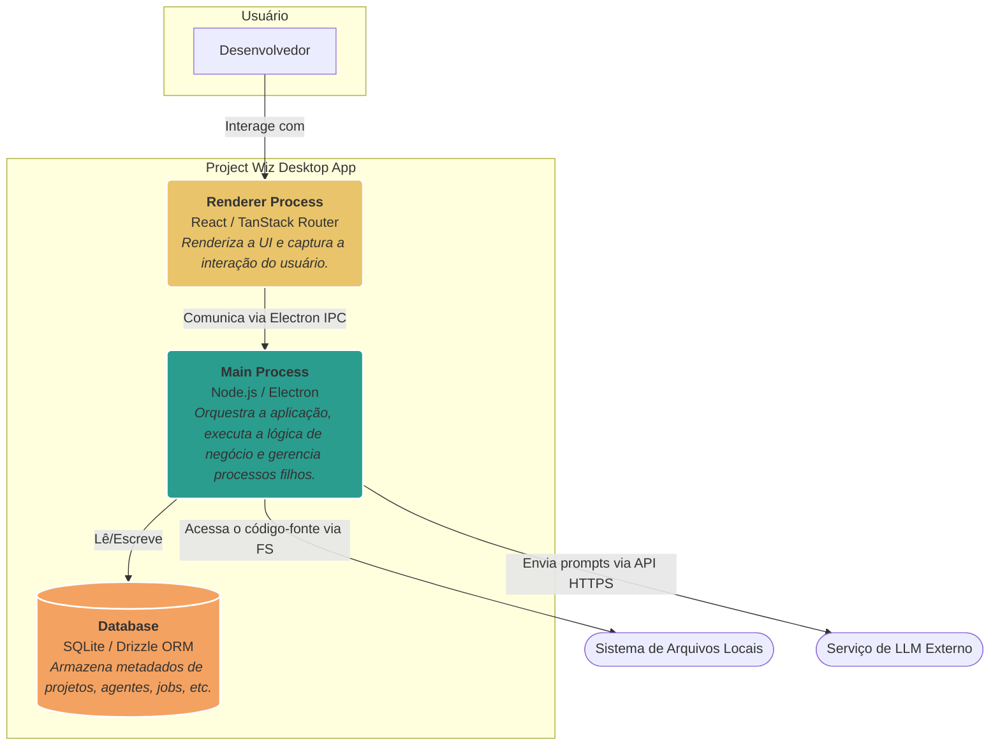
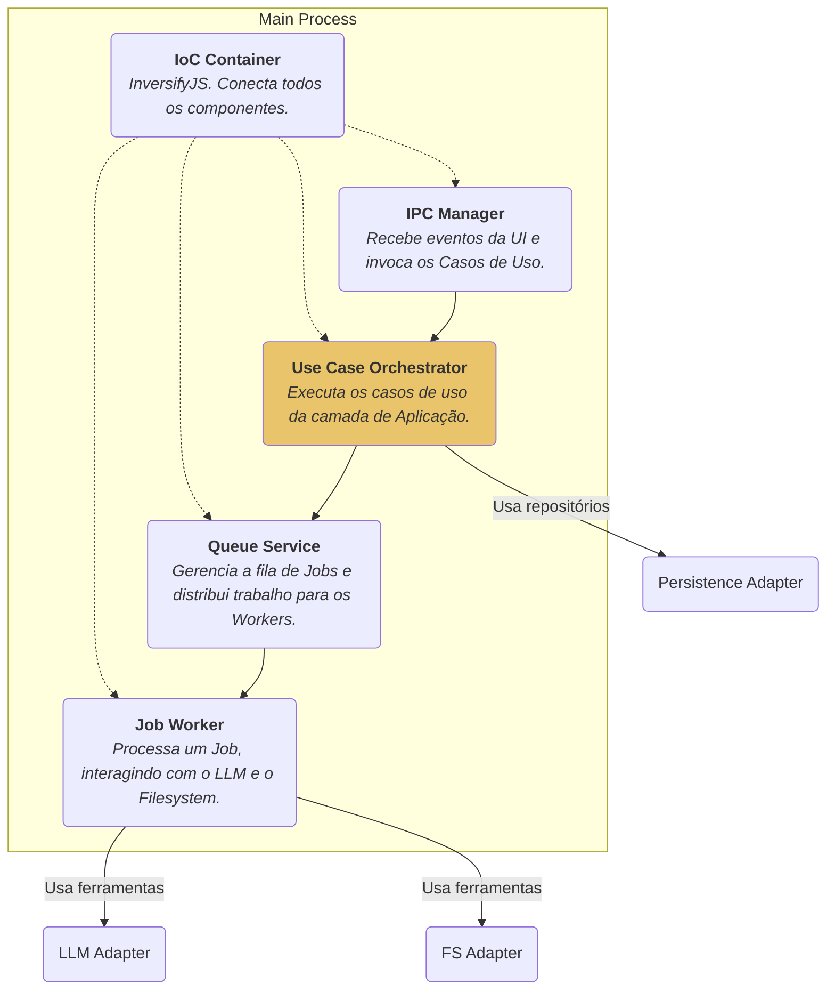
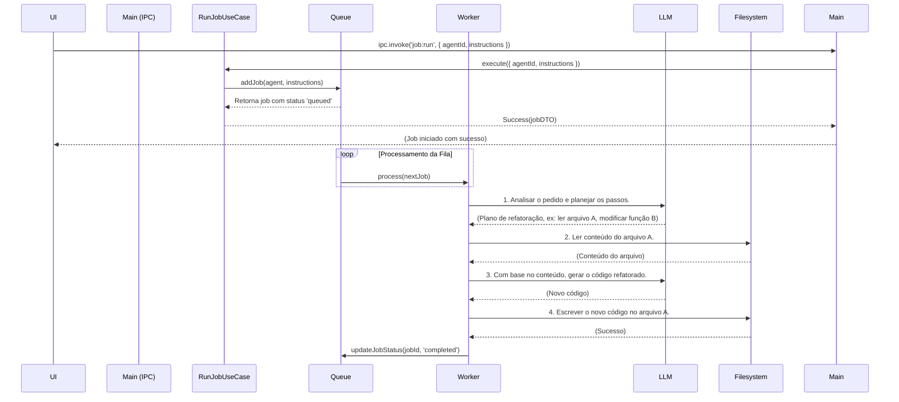

# Project Wiz: Documento Mestre de Produto e Arquitetura

**Versão:** 1.0
**Público-Alvo:** Equipes de Produto, Engenharia, Design e Liderança.

---

## Parte 1: Visão Estratégica e de Produto (O Quê e o Porquê)

Esta seção define o Project Wiz do ponto de vista de mercado e de usuário, focando nos problemas que resolvemos e no valor que entregamos.

### 1.1. Resumo Executivo

O **Project Wiz** é uma plataforma de automação inteligente para engenharia de software. Ele funciona como um "colega de trabalho de IA" que reside no desktop do desenvolvedor, utilizando agentes autônomos para executar tarefas complexas como refatoração de código, geração de testes, análise de bugs e otimização de performance. O objetivo é transformar o fluxo de trabalho de desenvolvimento, eliminando o trabalho repetitivo (toil), aplicando as melhores práticas de forma consistente e permitindo que os engenheiros humanos se concentrem na resolução de problemas de alto nível.

### 1.2. O Problema: As Dores do Desenvolvimento Moderno

O desenvolvimento de software, apesar dos avanços, ainda é atormentado por ineficiências:

*   **Inconsistência de Código:** Manter um padrão de qualidade e estilo em equipes crescentes é um desafio constante, levando a uma base de código heterogênea e difícil de manter.
*   **Curva de Aprendizagem:** Novos desenvolvedores levam semanas ou meses para se tornarem totalmente produtivos, precisando absorver a arquitetura, as convenções e as ferramentas do projeto.
*   **Trabalho Repetitivo (Toil):** Engenheiros gastam uma quantidade significativa de tempo em tarefas de baixo valor cognitivo, como escrever testes boilerplate, refatorar código para seguir novos padrões ou configurar ambientes.
*   **Silos de Conhecimento:** O conhecimento sobre partes críticas do sistema muitas vezes reside na cabeça de poucos desenvolvedores sêniores, criando gargalos e riscos.

### 1.3. A Solução: Um Assistente de IA Proativo

O Project Wiz ataca esses problemas de frente ao fornecer uma equipe de "especialistas de IA" sob demanda:

*   **Padronização Ativa:** Agentes podem ser configurados para aplicar automaticamente padrões de código, regras de linting e decisões de arquitetura, funcionando como guardiões da qualidade.
*   **Onboarding Acelerado:** Um agente pode guiar um novo desenvolvedor, sugerindo os arquivos relevantes para uma tarefa ou explicando a lógica de um módulo complexo.
*   **Automação de Tarefas:** Jobs podem ser criados para tarefas como "Converter todos os componentes de classe para componentes funcionais em React" ou "Adicionar testes de unidade para todos os serviços no diretório X".
*   **Democratização do Conhecimento:** As "Personas" dos agentes capturam o conhecimento de especialistas, tornando-o replicável e acessível a toda a equipe.

### 1.4. Personas de Usuário

Construímos o Project Wiz para três perfis principais:

*   **Priya, a Tech Lead:**
    *   **Dores:** Preocupada com a qualidade do código, a consistência da arquitetura e o tempo gasto em code reviews repetitivos.
    *   **Como o Wiz Ajuda:** Priya cria "Personas" que encapsulam as melhores práticas da equipe (ex: "Persona Reator Sênior"). Ela configura Agentes para garantir que novos PRs sigam essas práticas, automatizando parte do processo de revisão.

*   **Alex, o Desenvolvedor Sênior:**
    *   **Dores:** Frustrado com tarefas repetitivas que o impedem de focar em desafios complexos. Quer experimentar novas tecnologias sem perder tempo com setup.
    *   **Como o Wiz Ajuda:** Alex usa um Agente para refatorar módulos legados ou para gerar a estrutura inicial (scaffolding) de um novo serviço, economizando horas de trabalho manual.

*   **Carlos, o Desenvolvedor Júnior:**
    *   **Dores:** Sente-se sobrecarregado pela complexidade do projeto. Tem medo de fazer perguntas "bobas" e demora para encontrar as informações de que precisa.
    *   **Como o Wiz Ajuda:** Carlos usa o chat interativo para perguntar a um Agente: "Onde está a lógica de autenticação?" ou "Como eu deveria tratar erros neste serviço?". O Agente fornece respostas contextuais e aponta para os arquivos corretos.

### 1.5. Conceitos Fundamentais do Produto

*   **Projeto (Project):** Representa uma base de código local que o Wiz pode analisar e modificar. É o "workspace" de um Agente.
*   **Persona:** Um **template** para um Agente. Define a especialidade (ex: "Especialista em Testes", "Arquiteto de Microsserviços"), as ferramentas que pode usar e a configuração do LLM (ex: modelo, temperatura). Personas são criadas por usuários experientes para encapsular conhecimento.
*   **Agente (Agent):** Uma **instância** de uma Persona. É o "funcionário de IA" que efetivamente realiza o trabalho. Vários agentes podem existir a partir da mesma persona, talvez com pequenas customizações.
*   **Job:** Uma tarefa assíncrona de longa duração atribuída a um Agente (ex: "Refatorar todo o projeto").
*   **Fila (Queue):** O sistema que gerencia a execução dos Jobs, garantindo que eles rodem em segundo plano sem travar a aplicação.

---

## Parte 2: Arquitetura e Engenharia (O Como)

Esta seção detalha a arquitetura de software, os padrões e as decisões técnicas que sustentam o Project Wiz.

### 2.1. Filosofia e Princípios de Design

Nossa arquitetura é guiada por um objetivo principal: **manter a complexidade gerenciável e permitir a evolução futura**. Para isso, adotamos:

*   **Clean Architecture:** Desacoplamos estritamente a lógica de negócio (Core) dos detalhes de implementação (Infrastructure, UI). Isso nos permite trocar o banco de dados, a UI ou até mesmo a plataforma (de Desktop para Web) sem reescrever o coração da aplicação.
*   **Domain-Driven Design (DDD):** Modelamos o software em torno do domínio do negócio (Projetos, Agentes, Jobs), usando um vocabulário onipresente (Ubiquitous Language) que faz sentido tanto para desenvolvedores quanto para a área de produto.
*   **SOLID e Object Calisthenics:** Seguimos rigorosamente esses princípios para criar um código de alta coesão, baixo acoplamento, legível e fácil de manter (ver ADRs 006 e 016).

### 2.2. Diagrama de Arquitetura (Modelo C4)

#### Nível 2: Diagrama de Contêineres

Mostra a estrutura geral da aplicação e suas interações com sistemas externos.

#### Nível 3: Diagrama de Componentes (Processo Principal)

Um zoom no contêiner `Main Process` para mostrar seus principais componentes internos.

### 2.3. Fluxo de Dados Detalhado: Executando um Job de Refatoração

Este fluxo demonstra a interação entre todos os principais componentes do sistema.

### 2.4. Decisões de Arquitetura Chave (ADRs)

*   **ADR-017 (Persistência com Drizzle):** Escolhemos o Drizzle ORM por sua segurança de tipos (type-safety) e abordagem "SQL-like", que nos dá controle sobre as queries enquanto abstrai a complexidade do driver do banco de dados.
*   **ADR-019 (Injeção de Dependência):** Usamos o InversifyJS para implementar o princípio da Inversão de Dependência. Isso é CRUCIAL para a testabilidade e flexibilidade do sistema, permitindo-nos "injetar" implementações falsas (mocks) em testes ou trocar uma implementação real por outra (ex: de `SQLiteRepository` para `PostgresRepository`) sem alterar a lógica de negócio.
*   **ADR-020 (Arquitetura do Sistema de Filas):** Decidimos por uma implementação de fila customizada, inspirada no BullMQ, para ter controle total sobre a lógica de processamento de jobs, priorização e tratamento de falhas, que são requisitos centrais do produto.

---

## Parte 3: Guia de Colaboração e Onboarding

### 3.1. Configuração Inicial

1.  **Clone:** `git clone ...`
2.  **Instale:** `npm install`
3.  **Configure:** `cp .env.example .env` e preencha as chaves de API necessárias.
4.  **Rode:** `npm run dev`

### 3.2. Sua Primeira Semana no Project Wiz

Siga este guia para uma imersão estruturada no projeto:

*   **Dia 1: A Visão Geral.** Leia este documento por completo. Em seguida, leia os ADRs mais importantes (016, 017, 019, 020). O objetivo é entender o *porquê* das coisas serem como são.

*   **Dia 2: O Coração do Negócio.** Explore `src/core/domain/`. Entenda as entidades `Project`, `Persona`, `Agent` e `Job`. Esses são os substantivos do nosso sistema. Rabisque em um papel como eles se relacionam.

*   **Dia 3: As Ações do Usuário.** Navegue por `src/core/application/use-cases/`. Escolha um caso de uso simples como `CreateProjectUseCase.ts`. Siga seu fluxo de execução, desde a chamada no `main` process até a interação com o repositório.

*   **Dia 4: Conectando as Peças.** Estude `src/infrastructure/ioc/inversify.config.ts`. Este arquivo é o mapa que conecta as interfaces (ports) do `core` com suas implementações concretas do `infrastructure`. Entender isso é a chave para entender o desacoplamento.

*   **Dia 5: Sua Primeira Contribuição.** Encontre um bug simples ou uma tarefa de "good first issue". Crie um novo caso de uso de leitura (ex: `GetAgentStatisticsUseCase`) e exponha-o via IPC. Não se preocupe com a UI ainda. O objetivo é se familiarizar com o fluxo de backend.

### 3.3. Como Contribuir

*   **Branches:** Use o padrão `feature/<nome-da-feature>`, `fix/<nome-do-bug>`.
*   **Commits:** Siga o padrão [Conventional Commits](https://www.conventionalcommits.org/). Ex: `feat(agent): add ability to pause an agent`.
*   **Pull Requests:** Um PR deve resolver UMA coisa. Descreva o que foi feito e por quê. Link para a issue correspondente. Peça review de pelo menos um outro desenvolvedor.
*   **Código Limpo:** A responsabilidade de manter o código limpo é de todos. Deixe o código sempre um pouco melhor do que você o encontrou.