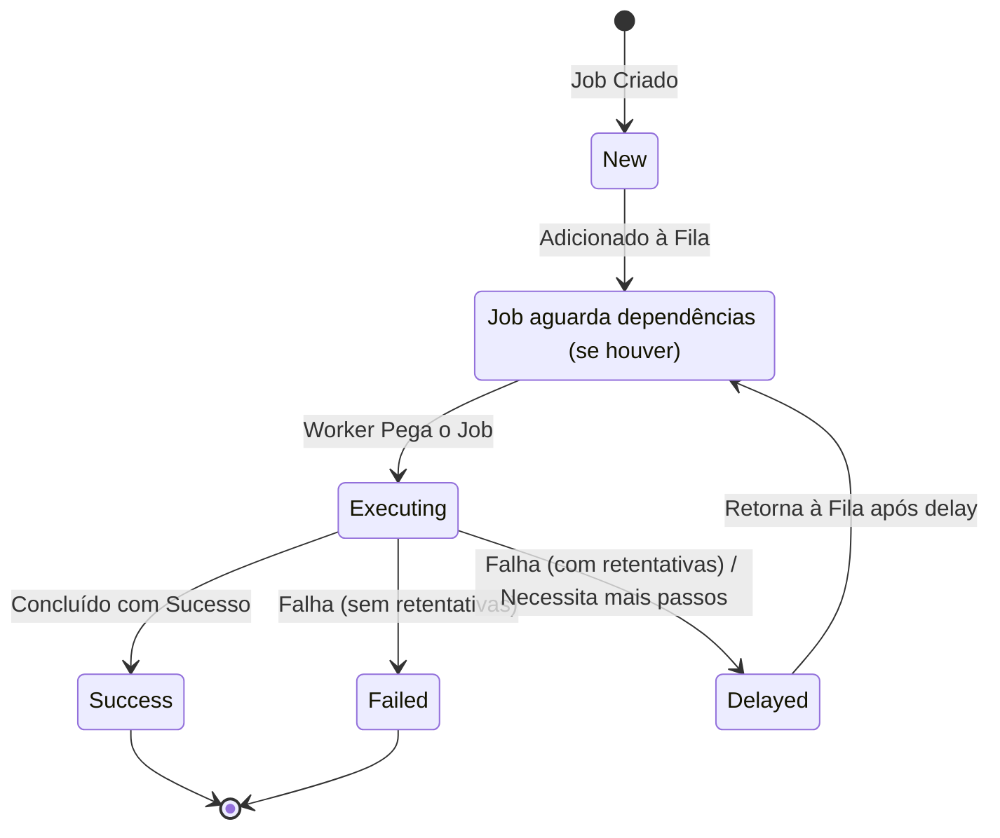

# Project Wiz [](https://opensource.org/licenses/MIT)

## Visão Geral

O Project Wiz é uma aplicação desktop desenvolvida com Electron, apresentando uma interface de usuário inspirada no Discord. Seu objetivo principal é funcionar como uma **fábrica de software autônoma**. Isso é alcançado através da orquestração de Agentes de Inteligência Artificial (as Personas) que são capazes de executar tarefas complexas (Jobs) de forma coordenada. O sistema permite a automação de diversas etapas do ciclo de vida de desenvolvimento de software, desde a análise e design até a implementação, testes e deployment. O objetivo final é aumentar significativamente a produtividade, permitir a paralelização do trabalho e liberar os desenvolvedores humanos para que possam focar em tarefas de mais alto nível, como arquitetura de soluções, inovação e interação com stakeholders. Em essência, o Project Wiz visa transformar a maneira como o software é criado, tornando o processo mais eficiente e inteligente.

## Principais Funcionalidades

### Interface do Usuário (Estilo Discord)

A interface do Project Wiz é projetada para ser familiar e intuitiva, seguindo o layout popular do Discord. Ela oferece diferentes áreas para interação e gerenciamento:

*   **Home (Visão Geral - `/`)**:
    *   **Dashboard:** Apresenta um overview de todos os projetos ativos, status geral e atividades recentes.
    *   **Tarefas:** Permite visualizar e gerenciar tarefas em andamento de todos os projetos centralizadamente.
    *   **Agentes (Personas):** Área para listar, gerenciar, cadastrar ou gerar novas Personas para a fábrica de software. O usuário pode definir o Papel, Objetivos e Backstory de cada Persona.
    *   **Integrações:** Permite configurar e gerenciar integrações com sistemas externos como GitHub, Confluence, Jira, etc.
    *   **MCPs (Master Control Programs):** Configuração de servidores MCP que habilitam e gerenciam o acesso das Personas às suas Tools.
    *   **Analytics:** Exibe relatórios e análises sobre a produtividade geral, desempenho dos agentes e progresso dos projetos.
    *   **Chat:** Funcionalidade de chat global para interagir com Personas específicas, grupos de Personas, ou visualizar logs gerais.

*   **Visão por Projeto (`/project/{projectId}`)**:
    *   **Dashboard do Projeto:** Overview com métricas e status específicos do projeto selecionado.
    *   **Tarefas do Projeto:** Gerenciamento detalhado das tarefas (Jobs) atribuídas às Personas dentro do escopo do projeto.
    *   **Fórum do Projeto:** Espaço dedicado para discussões, troca de ideias e colaboração entre usuários e Personas relacionadas ao projeto.
    *   **Documentação do Projeto:** Acesso e gerenciamento da documentação técnica e de negócios associada ao projeto.
    *   **Analytics do Projeto:** Relatórios e análises de desempenho específicos do projeto.
    *   **Canais do Projeto:** Canais de comunicação (chat, logs) específicos para o contexto do projeto, permitindo interações focadas.
    *   **Cadastro de Projetos:** O sistema permite a criação de novos projetos, seja começando do zero (em branco) ou importando a partir de um repositório GitHub existente.

*   **Configurações Gerais (`/settings`)**:
    *   Área destinada a configurações globais da aplicação, como personalização de avatar do usuário, gerenciamento de conta (login), preferências de notificação e temas da interface.

### Agentes Autônomos (Personas)

As Personas são o núcleo da 'fábrica de software autônoma' do Project Wiz. São agentes de Inteligência Artificial especializados, projetados para colaborar no desenvolvimento de software, automatizando uma variedade de tarefas e processos.

**Interação e Propósito:**

*   **Cadastro e Configuração:** O usuário pode cadastrar novas Personas ou utilizar mecanismos para gerá-las com base em templates. Ao configurar uma Persona, o usuário define seu **Papel** (ex: Engenheiro de Software, Analista de QA, Gerente de Projeto), seus **Objetivos** específicos (ex: "Desenvolver API para módulo de usuários", "Criar casos de teste para funcionalidade X") e uma **Backstory** que contextualiza suas habilidades e "personalidade".
*   **Atribuição de Jobs:** O usuário atribui **Jobs** (tarefas) para as Personas executarem. Esses Jobs são unidades de trabalho que as Personas processam de forma autônoma ou semi-autônoma.
*   **Colaboração e Automação:** O propósito das Personas é aumentar a eficiência e a capacidade de entrega da equipe de desenvolvimento, assumindo tarefas repetitivas, complexas ou que podem ser paralelizadas, contribuindo para a visão do Project Wiz como uma fábrica de software inteligente.

**Ferramentas (Tools):**

Para executar seus Jobs e interagir com o ambiente de desenvolvimento e o próprio sistema Project Wiz, as Personas utilizam um conjunto de **Tools**. Essas ferramentas são os mecanismos que capacitam as Personas a realizar ações concretas:

*   `MemoryTool`: Permite à Persona acessar e armazenar informações em uma memória de curto ou longo prazo, essencial para aprendizado e contexto.
*   `TaskTool`: Capacita a Persona a criar, gerenciar, delegar e acompanhar o progresso de subtarefas, permitindo a decomposição de Jobs complexos.
*   `AnnotationTool`: Utilizada para que a Persona possa adicionar anotações, comentários ou metadados a artefatos do projeto, como código, documentos ou tarefas.
*   `FilesystemTool`: Concede à Persona a capacidade de ler, escrever, modificar e navegar por arquivos e diretórios no sistema de arquivos do projeto.
*   `TerminalTool`: Permite à Persona executar comandos shell no ambiente de desenvolvimento, possibilitando a execução de scripts, compilação de código, gerenciamento de dependências, etc.
*   `ProjectTool`: Oferece à Persona informações e controle sobre o projeto ao qual está atribuída, como acesso a metadados do projeto, estrutura e status.
*   `MessageTool`: Facilita a comunicação da Persona, permitindo enviar e receber mensagens através dos canais de chat da plataforma, seja para usuários ou outras Personas.

Essas ferramentas são fundamentais para que as Personas possam efetivamente contribuir para o ciclo de vida do desenvolvimento de software dentro do Project Wiz.

**Fluxo de Interação do Agente (Persona) com Job:**

```mermaid
graph TD
    A[Persona/Worker verifica Fila por Jobs] --> B{Job Disponível?};
    B -- Sim --> C[Job Pego da Fila (status: executing)];
    C --> D[Persona instancia Task apropriada];
    D --> E{Execução da Task};
    E --> F[Uso de LLMs];
    E --> G[Uso de Tools (Filesystem, Terminal, etc.)];
    E --> H[Interação (MessageTool)];
    F --> I{Resultado da Execução};
    G --> I;
    H --> I;
    I -- Sucesso --> J[Job Concluído (status: success, resultado enviado)];
    I -- Falha --> K[Erro Capturado (status: failed/delayed)];
    I -- Continuação --> L[Job Re-enfileirado (status: delayed/waiting)];
    J --> M[Fim do Processo do Job];
    K --> M;
    L --> A;
```

### Sistema de Gerenciamento de Tarefas (Jobs)

O sistema de Jobs é o coração da funcionalidade de automação do Project Wiz.

*   **Jobs:** Representam unidades de trabalho que as Personas podem executar. Cada Job possui um ciclo de vida definido (ex: Pendente, Em Progresso, Concluído, Falhou).
*   **Filas (Queues):** Os Jobs são organizados em filas, permitindo o processamento ordenado e a priorização de tarefas.
*   **Ciclo de Vida:** Um Job passa por diferentes status desde sua criação até a conclusão, permitindo o acompanhamento e gerenciamento do progresso.

**Ciclo de Vida de um Job:**



## Arquitetura

### Visão Geral da Arquitetura

O Project Wiz é construído sobre uma arquitetura moderna e robusta, utilizando:

*   **Electron:** Para o desenvolvimento da aplicação desktop multiplataforma.
*   **React (com Vite):** Para a construção da interface do usuário.
*   **Node.js:** Como ambiente de execução para o backend e lógica core.
*   **TypeScript:** Para tipagem estática e desenvolvimento mais seguro.
*   **SQLite (com Drizzle ORM):** Para persistência de dados local.

### Princípios de Design

A arquitetura do projeto segue princípios de:

*   **Arquitetura Limpa (Clean Architecture):** Para separação de responsabilidades e desacoplamento entre as camadas da aplicação (Interface, Casos de Uso, Entidades, Infraestrutura).
*   **Domain-Driven Design (DDD):** Foco no domínio do problema, modelando entidades e lógica de negócios de forma clara e coesa.

### Componentes Chave

*   **Personas Core:** Módulo responsável pela lógica e gerenciamento dos agentes de IA.
*   **Sistema de Jobs/Queue:** Gerencia a criação, execução e o ciclo de vida das tarefas.
*   **Módulos LLM:** Integração com modelos de linguagem grande (LLMs) para alimentar a inteligência das Personas.
*   **Interface do Usuário (React):** Camada de apresentação da aplicação.
*   **Camada de Infraestrutura:** Responsável pela persistência de dados (SQLite com Drizzle ORM), comunicação com APIs externas, etc.

## Tecnologias Utilizadas

*   **Frontend:**
    *   React
    *   Vite
    *   Tailwind CSS
    *   shadcn/ui (biblioteca de componentes UI)
    *   React Router DOM
*   **Backend & Core:**
    *   Node.js
    *   Electron
    *   TypeScript
*   **IA:**
    *   Integração com Modelos de Linguagem Grande (LLMs) utilizando bibliotecas como `@ai-sdk/openai`, `@ai-sdk/deepseek` e `ai` (detalhes da integração profunda e modelos específicos em evolução).
*   **Banco de Dados:**
    *   SQLite
    *   Drizzle ORM
*   **Build/Package:**
    *   Electron Forge
    *   Electron Builder
    *   Vite
    *   TypeScript Compiler (tsc)
*   **Testes:**
    *   Vitest
    *   Testing Library (React)
*   **Linting:**
    *   ESLint
    *   Prettier

## Como Começar (Desenvolvimento)

### Pré-requisitos

*   Node.js (versão recomendada no `.nvmrc` ou a mais recente LTS)
*   npm ou yarn (ou pnpm, conforme `packageManager` no `package.json`)

### Instalação e Execução

1.  **Clone o repositório:**
    ```bash
    git clone https://github.com/seu-usuario/project-wiz.git
    cd project-wiz
    ```

2.  **Instale as dependências:**
    ```bash
    npm install
    # ou
    yarn install
    # ou
    pnpm install
    ```

3.  **Execute em modo de desenvolvimento:**
    ```bash
    npm run dev
    # ou
    yarn dev
    # ou
    pnpm dev
    ```
    Isso iniciará a aplicação Electron com hot-reload para o frontend e backend.

### Scripts Úteis

*   `npm run build`: Compila a aplicação para produção.
*   `npm run package`: Empacota a aplicação para distribuição.
*   `npm run make`: Cria instaladores para a aplicação.
*   `npm test`: Executa os testes unitários e de integração.
*   `npm run lint`: Executa o linter para verificar a qualidade do código.
*   `npm run lint:fix`: Tenta corrigir automaticamente os problemas de lint.
*   `npm run db:generate`: Gera as migrações do banco de dados com base nas definições do Drizzle ORM.
*   `npm run db:migrate`: Aplica as migrações pendentes ao banco de dados.
*   `npm run db:studio`: Abre o Drizzle Studio para visualização e gerenciamento do banco de dados.

## Status do Projeto

O Project Wiz está atualmente em **desenvolvimento ativo**, com foco contínuo na implementação e refinamento das funcionalidades core. A persistência completa de Personas, a expansão de suas capacidades de interação e a robustez do sistema de Jobs são prioridades atuais.

Além disso, o roadmap do projeto inclui as seguintes direções futuras e funcionalidades planejadas:

*   **Aprimoramento da Inteligência e Autonomia dos Agentes:**
    *   Capacidade de autoanálise e correção de falhas em Jobs.
    *   Aprendizado contínuo e adaptação baseada em interações e resultados anteriores.
*   **Integrações Mais Profundas com Plataformas de Desenvolvimento:**
    *   Interação avançada com GitHub (gerenciamento de Issues, Pull Requests, code review assistido por IA).
    *   Conexão com outras plataformas como GitLab, Bitbucket, e ferramentas de CI/CD.
*   **Funcionalidades de Gerenciamento de Projeto Mais Robustas:**
    *   Organização de trabalho dos agentes em sprints ou ciclos iterativos.
    *   Melhorias na visualização de progresso e dependências entre tarefas complexas.
    *   Geração de relatórios de projeto mais detalhados.
*   **Maior Personalização para Usuários e Agentes:**
    *   Implementação de sistema de login de usuário e perfis personalizados (ex: avatares).
    *   Configurações avançadas por Persona, como escolha do modelo LLM e ajuste de parâmetros (ex: temperatura para criatividade vs. precisão).
*   **Expansão do Ecossistema de Tools:**
    *   Desenvolvimento de novas Tools para cobrir mais aspectos do desenvolvimento e análise de software.
    *   Permitir que a comunidade possa contribuir com novas Tools.

O objetivo é evoluir o Project Wiz para uma plataforma cada vez mais poderosa e flexível, consolidando sua visão de ser uma fábrica de software autônoma e inteligente.

## Como Contribuir

Agradecemos o interesse em contribuir com o Project Wiz! No momento, estamos focados em estabelecer a arquitetura e as funcionalidades principais. Em breve, forneceremos diretrizes mais detalhadas sobre como contribuir.

Por enquanto, sinta-se à vontade para:

1.  Abrir Issues para relatar bugs ou sugerir novas funcionalidades.
2.  Fork o repositório e explorar o código.

## Licença

Este projeto está licenciado sob a **Licença MIT**. Veja o arquivo [LICENSE](LICENSE) para mais detalhes.
---
**Observação:** O arquivo `LICENSE` mencionado acima ainda não existe no repositório. Ele precisará ser criado com o texto da licença MIT.
