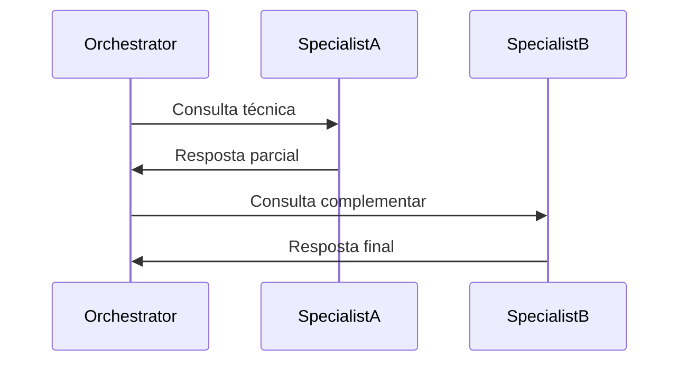

# Agent

## Interactions between tasks

O agente funciona como um worker, executando um step por vez de uma tarefa. Entre a execução das steps o agente pode pegar uma tarefa diferente, então as jobs/tarefas da fila do agente possuem prioridade, onde mensagens iniciadas pelo usuário ou outros agentes tem preferencia sobre as demais tarefas do agente, isso permite que antes de finalizar uma tarefa o agente possa reagir a informações externas recebidas, criando novas atividades na fila, fazendo anotações ou registrando na memoria antes de voltar para suas tarefas.

Exemplos:

- O agente estava executando os passos para completar a tarefa X, e o usuário manda uma mensagem informando que ele não deve mais executar a tarefa X, com isso o agente pode usar as tools de tasks para remover a atividade da fila e/ou confirmar a descontinuaçã da mesma com o usuario.

- O agente estava executando os passos para completar a tarefa X, e o usuário manda uma mensagem informando a para ele que ele deve notificar ele e um outro agente quando ela for concluida ou reportar o progresso, com isso o agente pode usar as tools de tasks para atualizar a atividade adicionando novos passos ou subatividades para atender a solicitação.

- O agente estava executando os passos para completar a tarefa X, e o usuário ou um outro agente informa ele sobre determindo padrão a ser utilizado nos documentos, ele registra essa informação como uma anotação e cria um passo para checar/corrigir oque ele havia feito. Quando ele volta para a tarefa, ele cai na subtarefa de validação e por ter a anotação na memoria agora ele sabe qual padrão deve ser utilizado.


## Tools

### MemoryTool

Permite ao agente gerenciar sua memoria (gravar e esquecer informações), os dados aqui são recuperados usando RAG e incluidos no contexto.

- Write: Cria registros na memoria do agente.
- Delete: Remove um informação da memoria o codigo da memoria será informado no "system prompt".

### TaskTool

Permite ao agente gerenciar as atividades da fila dele (vai ser criado como Job e transformado em Task no momento da execução).

- View/List: Lista as atividades da fila do agente, organizada considerando dependencias e hierarquia.
- Save: Cria ou atualiza atividades permitindo realizar a mesclagem (criando/editando) a estrutura ou substituindo.
- Remove: Deleta uma atividade e as subatividades dela.

### AnnotationTool

Permite ao agente criar anotações durante a execução, essas anotações sempre são inclusas no contexto, idependente da atividade que esta sendo executada, as anotações também são usadas para pesquisar registros da memoria relacionados.

- View/List: Lista as anotações.
- Save: Cria ou atualiza anotações.
- Remove: Remover anotações do agente.

### FilesystemTool

- ReadFile: Le o conteudo de um arquivo.
- WriteFile: Escreve conteudo de um arquivo.
- MoveFile: Move/Renomeia arquivo.
- RemoveFile: Deleta arquivo.

- ListDirectory: Lista diretorios/ar a partir do caminho
- CreateDirectory: Cria um diretorio no caminho especificado
- MoveDirectory: Move um diretorio para outro local (permite alterar o nome)
- RemoveDirectory: Remove diretorio.

### TerminalTool

- ShellCommand: Permite executar comando no shell do terminal do sistema operacional.

### ProjectTool

- Save: Cria ou atualiza informações gerais de um projeto (Nome / Descrição).
- Channel: Cria/Atualiza um canal em um projeto.
- Forum: Cria/Atualiza um topico em um projeto.
- Issue: Cria/Atualiza uma issue em um projeto.

### MessageTool

Pode ser usado pelo agente para notificar algo ou para perguntar/conversar com outro membro/usuario, informando se deve aguardar reposta para continuação da tarefa atual ou não.

- Direct: Envia mensagem para um usuário especifico.
- Channel: Envia mensagem em um canal de um projeto.
- Forum: Envia mensagem em topico de um forum de projeto.

## Interações entre Agentes

### Padrões de Comunicação

- **Broadcast**: Um agente envia mensagem para todos os agentes do mesmo tipo
- **Direct**: Comunicação 1:1 entre agentes específicos
- **Pub/Sub**: Assinatura de tópicos específicos
- **Orquestração**: Agente coordenador gerencia fluxo entre especialistas

Exemplo:


## Exemplos Práticos

### Uso de Tools

```typescript
import { z } from 'zod';
import { generateText, tool } from 'ai';

// Exemplo: Agente usando tools da ai-sdk
const result = await generateText({
  model: yourModel,
  tools: {
    weather: tool({
      description: 'Get the weather in a location',
      parameters: z.object({
        location: z.string().describe('The location to get the weather for'),
      }),
      execute: async ({ location }) => ({
        location,
        temperature: 72 + Math.floor(Math.random() * 21) - 10,
      }),
    }),
  },
  prompt: 'What is the weather in San Francisco?',
});
```

**Nota sobre disponibilização de tools:**  
As tools são disponibilizadas para a LLM através da propriedade `tools` na configuração de chamadas como `generateText`. Cada tool deve ser definida com:
- Uma descrição clara
- Parâmetros validados com Zod
- Uma função execute que implementa a funcionalidade
A LLM decide automaticamente quando usar cada tool baseada no contexto da solicitação.

