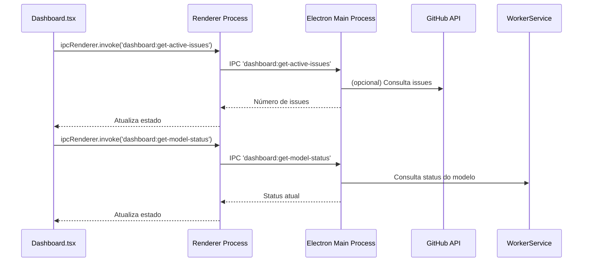

# ADR-0009: Refatorar Dashboard para Buscar Dados Dinamicamente via IPC

## Status
Proposto

## Contexto
O componente `dashboard.tsx` atualmente utiliza valores fixos (hardcoded) para exibir métricas como número de issues, PRs, arquivos gerados, status do modelo e atividades recentes. Isso limita a utilidade do dashboard, que não reflete o estado real do sistema.

## Decisão
Refatorar o componente `dashboard.tsx` para buscar todos os dados dinamicamente, utilizando **integração IPC com o backend Electron**. Serão criados canais IPC específicos para cada métrica, e o backend será responsável por fornecer os dados, integrando-se com serviços internos ou externos conforme necessário.

## Detalhes da Implementação

### Backend (Electron Main Process)
- Criar handlers IPC para:
  - `dashboard:get-active-issues`
  - `dashboard:get-open-prs`
  - `dashboard:get-generated-files`
  - `dashboard:get-model-status`
  - `dashboard:get-recent-activity`
- Cada handler retornará os dados necessários, consultando:
  - GitHub API (diretamente ou via cache) para issues e PRs
  - WorkerService para status do modelo
  - Sistema de arquivos ou cache para arquivos gerados
  - Logs ou fontes diversas para atividades recentes

### Frontend (Renderer Process)
- Substituir valores fixos por chamadas assíncronas via `ipcRenderer.invoke`.
- Armazenar os dados em estados React (`useState`).
- Buscar os dados na montagem do componente (`useEffect`).
- Permitir atualização manual via botão "Refresh".

### Fluxo de Dados

## Consequências
- O dashboard refletirá o estado real do sistema, melhorando a experiência do usuário.
- A arquitetura baseada em IPC mantém a separação entre frontend e backend.
- Inicialmente, os dados podem ser mockados no backend para facilitar a implementação incremental.
- Futuramente, os handlers podem ser expandidos para buscar dados reais de APIs externas ou serviços internos.

## Alternativas Consideradas
- Utilizar API REST HTTP para buscar os dados (descartado para manter integração via IPC).
- Manter dados fixos (descartado por não atender aos requisitos de atualização dinâmica).

## Autor
Roo (assistente arquitetural)

## Data
07/04/2025