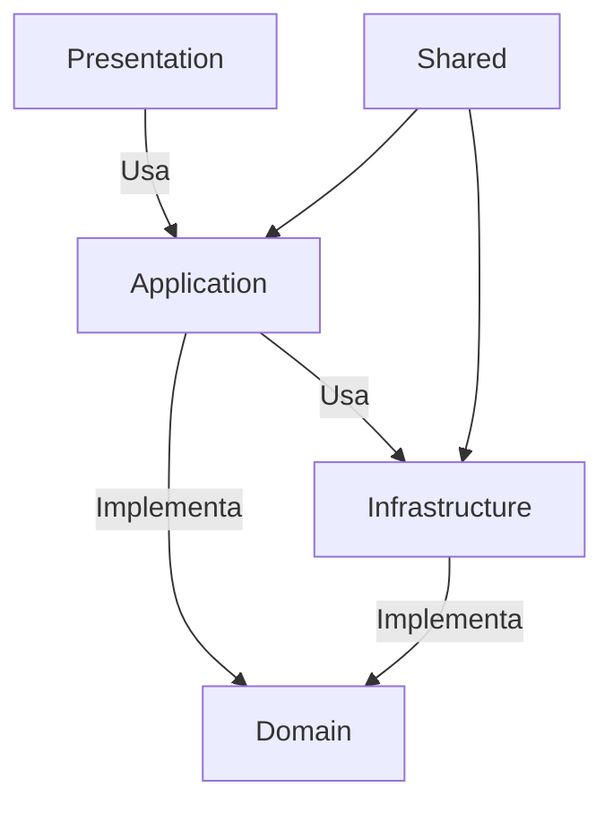

# ADR 0012: Implementação de Clean Architecture para Serviços LLM

## Status

Aceito

## Contexto

O serviço LLM atual apresenta os seguintes desafios:
- Alto acoplamento com a implementação do Electron
- Dificuldade para testar componentes isoladamente
- Complexidade para adicionar novos provedores LLM
- Dependência direta do client com detalhes de implementação

## Decisão

Adotar Clean Architecture para organizar o código em camadas bem definidas:

```plaintext
src/
├── core/
│   ├── domain/       # Entidades e interfaces de negócio
│   │   ├── entities/ # prompt, session, model
│   │   └── ports/    # model-manager, llm-service
│   │
│   ├── application/  # Casos de uso e serviços
│   │   └── services/ # model-manager, prompt-service
│   │
│   └── infrastructure/ # Implementações concretas
│       └── llm/      # electron-adapters, workers
│   
├── client/ # Componentes UI (opcional)
│
└── shared/           # Utilitários compartilhados
   └── utils/         # Helpers, validadores
```

### Diagrama de Dependências


## Benefícios Esperados

1. **Separação de Responsabilidades**:
   - Domínio independente de frameworks
   - Regras de negócio isoladas em domain/

2. **Testabilidade**:
   - Domain pode ser testado sem Electron
   - Mocks fáceis para interfaces

3. **Flexibilidade**:
   - Troca de implementação sem afetar clientes
   - Adição de novos provedores LLM

4. **Manutenibilidade**:
   - Mudanças localizadas em uma camada
   - Menor impacto em refatorações

## Plano de Migração Detalhado

### Fase 1: Fundamentos da Arquitetura (1 semana)
1. **Estrutura de Diretórios**:
   ```bash
   src/core/
   ├── domain/
   │   ├── entities/ # Prompt.ts, Session.ts
   │   └── ports/    # ILLMService.ts, IPromptService.ts
   ├── application/
   │   └── services/ # LLMService.ts (casos de uso)
   └── infrastructure/
       └── llm/      # ElectronLLMAdapter.ts
   ```
2. **ModelManager**:
   - Extrair interface para `domain/ports/IModelManager.ts`
   - Implementação em `application/services/ModelManagerService.ts`
   - Adaptador em `infrastructure/llm/ElectronModelManager.ts`
3. **Contracts**:
   - Definir DTOs para todas as comunicações entre camadas
   - Tipos estritos para eventos de streaming

### Fase 2: Núcleo LLM (2 semanas)
1. **WorkerService**:
   - Interface: `domain/ports/IWorkerService.ts`
   - Implementação: `application/services/WorkerService.ts`
   - Adaptador: `infrastructure/llm/ElectronWorkerAdapter.ts`
2. **Streaming Protocol**:
   ```typescript
   // domain/entities/Streaming.ts
   interface StreamingChunk {
     content: string;
     isFinal: boolean;
     timestamp: number;
   }
   ```
3. **IPC Handlers**:
   - Definir contratos de mensagens
   - Implementar serialização/deserialização

### Fase 3: Client Integration (1 semana)
1. **Hook useLLM**:
   - Manter mesma interface pública
   - Adaptar para nova arquitetura internamente

### Fase 4: Validação (1 semana)
1. **Testes**:
   - 100% cobertura das interfaces
   - Testes de integração entre camadas
2. **Performance**:
   - Benchmark antes/depois
   - Monitorar uso de memória
3. **Documentação**:
   - Guia de migração para devs
   - Exemplos de uso

## Impacto nos Serviços LLM Existentes

1. **Gerenciador de Modelos**:
   - Será dividido em:
     - Interface (domain/ports/model-manager)
     - Serviço (application/services/model-manager)
     - Implementação (infrastructure/llm/electron-model-manager)

2. **WorkerService**:
   - Tornar-se-á um adaptador em infrastructure/
   - Comunicação via IPC mantida
   - Fluxo de streaming:
     ```mermaid
     sequenceDiagram
       Client->>+Application: promptStream(prompt, options)
       Application->>+Infrastructure: executePrompt(prompt)
       Infrastructure-->>-Application: stream chunks
       Application-->>-Client: stream events
     ```

3. **UI Components**:
   - Componentes específicos movidos para presentation/
   - Hooks (useLLM) permanecem no client/
   - Suporte a streaming via callbacks/events

## Implementação do Streaming

### Interfaces Principais
```typescript
// domain/ports/illm-service.port.ts
interface ILLMService {
  promptStream(
    prompt: string,
    options: PromptOptions,
    callback: (chunk: string) => void
  ): Promise<void>;
}

// domain/entities/prompt.ts
interface PromptOptions {
  model?: string;
  temperature?: number;
  maxTokens?: number;
}
```

### Fluxo de Migração para Streaming
1. Definir interfaces de domínio (semana 1)
2. Implementar serviço de aplicação (semana 2)
3. Adaptar WorkerManager existente (semana 3)
4. Atualizar client hooks (semana 4)

## Links relacionados

- [ADR-0005 - Estrutura anterior](docs/adr/ADR-0005-Estrutura-de-Pastas-Electron.md)
- [ISSUE-0065 - Reorganização de pastas](issues/backlog/improvement/ISSUE-0065-Reorganizacao-estrutura-pastas)
- [ISSUE-0068 - Consolidação serviços LLM](issues/working/improvement/ISSUE-0068-Consolidacao-servicos-LLM)