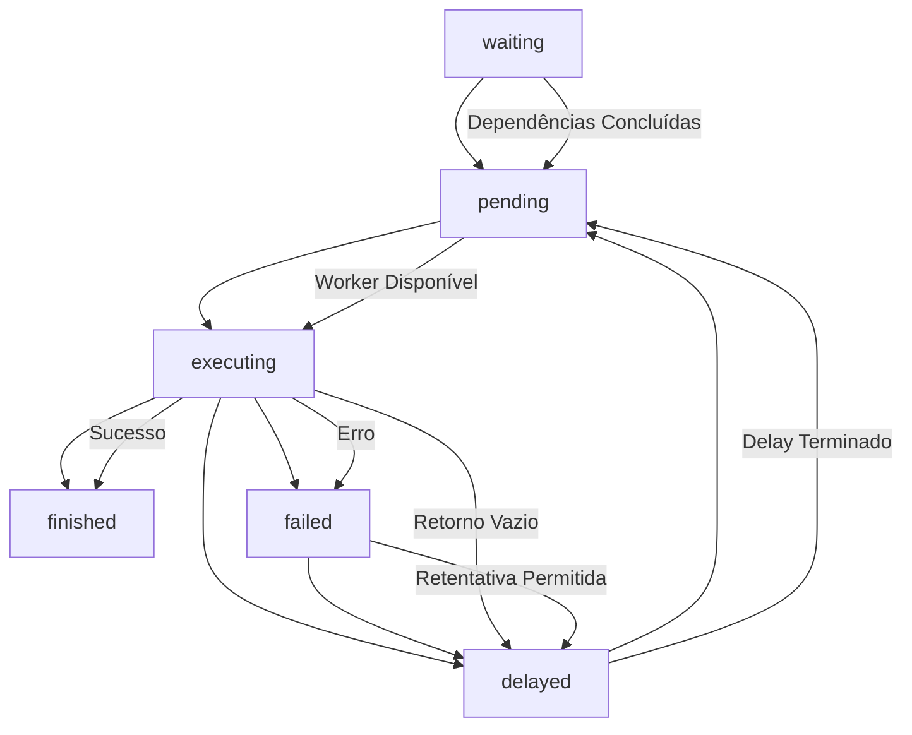

# Conceito Chave: Job

Uma **Job** é a representação persistida de uma unidade de trabalho dentro do sistema. Ela atua como um registro de dados que descreve "o que" precisa ser feito e é gerenciada exclusivamente pela **Queue**. A Queue é o componente central responsável pelo gerenciamento do ciclo de vida das Jobs, incluindo persistência, transições de status, retentativas, atrasos e dependências.

No contexto dos Agentes Autônomos, a entidade Job foi estendida para atuar como uma **Activity** completa. Isso significa que uma Job encapsula todo o contexto e histórico de uma Activity do agente, armazenando detalhes específicos no campo `data`, como o `ActivityContext`.

## Atributos da Entidade Job

A entidade Job possui os seguintes atributos:

- `id`: Identificador único da Job.
- `name`: Nome descritivo da Job.
- `payload`: O payload de entrada inicial da Job. Este campo não deve ser alterado internamente durante a execução da Job.
- `data`: Campo utilizado para armazenar informações mutáveis que podem ser salvas durante a execução da Job. No contexto dos Agentes, este campo contém o `ActivityContext`, que inclui detalhes como `messageContent`, `sender`, `toolName`, `toolArgs`, `goalToPlan`, `plannedSteps`, `activityNotes`, `validationCriteria`, `validationResult`, e o crucial `activityHistory` (um array de mensagens que armazena a conversa e interações relacionadas exclusivamente a esta Activity, garantindo contexto isolado para o LLM).
- `result`: O resultado final da execução da Job. É opcional e preenchido ao final do processamento.
- `max_attempts`: A quantidade máxima de tentativas permitidas para a execução da Job em caso de falha.
- `attempts`: A quantidade de tentativas de execução que já foram realizadas para esta Job.
- `max_retry_delay`: O tempo máximo de espera entre as retentativas em caso de falha.
- `retry_delay`: O tempo de espera calculado entre as retentativas, utilizando a fórmula `((attempts+1) ** 2) * retry_delay`.
- `delay`: O tempo de espera ou atraso definido para a Job, seja no momento de sua criação ou ao entrar no status `delayed` após uma retentativa.
- `priority`: Um valor numérico que indica a prioridade da Job. **Menor número significa MAIOR prioridade.**
- `status`: O estado atual da Job no seu ciclo de vida. Veja a seção "Estados do Status da Job" para mais detalhes.
- `depends_on`: Uma lista de `jobIds` das quais esta Job depende para poder ser executada. A Job só passará para o status `pending` quando todas as Jobs listadas em `depends_on` estiverem no status `finished`. A saída dessas Jobs dependentes pode ser incluída no `payload` ou `data` da Job atual pela Queue.
- `parentId`: O ID da Job pai, caso esta Job seja uma sub-Job ou sub-Activity. É opcional.
- `relatedActivityIds`: Uma lista opcional de IDs de Activities relacionadas a esta Job.
- `blockingActivityId`: O ID opcional de uma Activity que está bloqueando a execução desta Job.

## Estados do Status da Job

O atributo `status` da Job pode assumir os seguintes estados:

- `pending`: A Job está pronta para ser executada e aguarda ser pega por um Worker.
- `waiting`: A Job está esperando que as Jobs listadas em `depends_on` sejam concluídas (`finished`).
- `delayed`: A Job está em um estado de espera devido a um atraso. Isso pode ocorrer porque a Job foi criada com um delay inicial ou porque entrou neste estado após uma retentativa (`failed` -> `delayed`).
- `finished`: A Job foi concluída com sucesso ou com erro de execução. Este é um estado final.
- `executing`: A Job está sendo processada ativamente por um Worker.
- `failed`: Ocorreu um erro durante a execução da Job e o número máximo de tentativas (`max_attempts`) foi atingido. Este é um estado final.

## Diagrama de Transição de Status da Job

