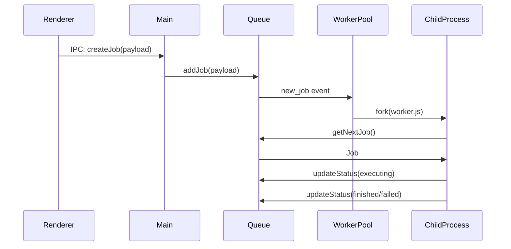

# Conceito Chave: WorkerPool

O WorkerPool é um componente fundamental na arquitetura do sistema de processamento assíncrono do `project-wiz`. Ele atua como um gerente centralizado para um conjunto de [Workers](docs/agents-automato/02-conceitos-chave/worker.md), orquestrando a execução de [Jobs](docs/agents-automato/02-conceitos-chave/job.md) (que representam [Activities](docs/agents-automato/02-conceitos-chave/activity.md) dos agentes) de forma concorrente.

Seu papel principal é monitorar a [Queue](docs/agents-automato/02-conceitos-chave/queue.md) em busca de Jobs disponíveis no status `pending`. Quando uma Job está pronta para ser processada e um Worker no pool está ocioso, o WorkerPool atribui essa Job ao Worker disponível. Isso permite que múltiplas Jobs sejam processadas simultaneamente, aproveitando os recursos do sistema de forma eficiente.

Uma característica importante da arquitetura é a capacidade de escalabilidade horizontal do WorkerPool. Isso significa que, se a carga de trabalho aumentar, é possível adicionar mais instâncias do WorkerPool para lidar com o volume crescente de Jobs, garantindo que o sistema continue responsivo e eficiente.

O diagrama de sequência abaixo ilustra a interação entre os principais componentes do sistema, incluindo o WorkerPool, no fluxo de processamento de uma Job/Activity:

