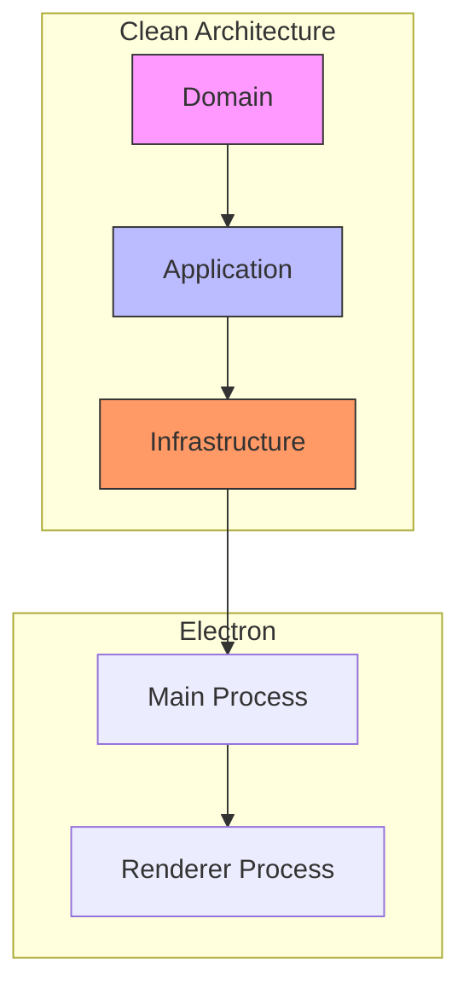

# Arquitetura Geral do Sistema

A arquitetura do sistema de Agentes Autônomos e Processamento de Jobs do `project-wiz` foi projetada seguindo os princípios da **Clean Architecture**. O objetivo principal é garantir que as regras de negócio mais importantes (o "coração" do sistema) sejam independentes de detalhes externos, como banco de dados, frameworks ou interfaces de usuário.

## Princípios da Clean Architecture

A Clean Architecture organiza o código em camadas concêntricas, onde as dependências sempre fluem de fora para dentro. Isso significa que as camadas mais internas (mais próximas do centro) não sabem nada sobre as camadas mais externas.

- **Camadas Internas:** Contêm as regras de negócio mais abstratas e importantes.
- **Camadas Externas:** Contêm detalhes de implementação, como banco de dados, UI, frameworks, etc.

Essa estrutura torna o sistema mais fácil de testar, manter e evoluir, pois as mudanças em detalhes externos (como trocar o banco de dados) não afetam a lógica de negócio central.

## Camadas da Arquitetura

Nosso sistema é dividido nas seguintes camadas principais:

### 1. Domain Layer (O Núcleo)

Esta é a camada mais interna. Ela contém as **regras de negócio** e as **entidades** mais importantes do sistema. É totalmente independente de qualquer tecnologia externa.

- **Entidades:** Representam os conceitos principais do nosso negócio (ex: Job, Worker, AgentInternalState).
- **Value Objects:** Objetos pequenos e imutáveis que representam valores do domínio (ex: JobId, ActivityType).
- **Interfaces de Repositório:** Contratos que definem como salvar e recuperar as entidades, sem se preocupar _como_ isso é feito (ex: IJobRepository).

### 2. Application Layer (Casos de Uso)

Esta camada contém a lógica de **aplicação** que orquestra as entidades do domínio para realizar tarefas específicas (os "casos de uso"). Ela depende apenas da camada de Domínio.

- **Use Cases:** Classes que implementam fluxos de trabalho específicos (ex: CreateJobUseCase, ProcessJobUseCase).
- **Ports (Interfaces de Saída):** Interfaces que a camada de Aplicação usa para "falar" com o mundo exterior (a camada de Infraestrutura), sem saber quem está do outro lado (ex: IJobQueue, IWorkerPool).
- **Serviços de Aplicação:** Componentes que coordenam a lógica de negócio (ex: AutonomousAgent, ProcessJobService).
- **Factories:** Componentes para criar objetos complexos (ex: TaskFactory).

### 3. Infrastructure Layer (Implementações)

Esta é a camada mais externa. Ela contém as **implementações concretas** das interfaces definidas nas camadas internas. É aqui que lidamos com detalhes como banco de dados, comunicação externa, frameworks, etc.

- **Repositórios:** Implementações concretas das interfaces de repositório do Domínio (ex: JobDrizzleRepository, que usa Drizzle para interagir com o banco de dados).
- **Adapters:** Implementações concretas das interfaces de Ports da Aplicação para interagir com tecnologias externas (ex: OpenAILLMAdapter para LLMs, FileSystemToolAdapter para acesso a arquivos).
- **Serviços de Infraestrutura:** Implementações concretas de serviços que dependem de detalhes de infraestrutura (ex: ChildProcessWorkerPoolService para gerenciar processos de worker).

## Integração com Electron e IPC

A integração com o Electron e a comunicação Inter-processos (IPC) entre o Main Process e o Renderer Process são tratadas inteiramente na camada de **Infraestrutura**. Isso garante que a lógica de negócio (Domain e Application) não tenha conhecimento sobre o ambiente Electron, mantendo-a portátil.

Os handlers de IPC no Main Process (Infraestrutura) recebem requisições da interface (Renderer Process) e utilizam os Use Cases e Serviços da camada de Aplicação para realizar as operações.

## Diagrama da Clean Architecture

O diagrama abaixo ilustra a estrutura de camadas e o fluxo de dependências:

Este diagrama mostra como as camadas mais externas (Infrastructure, Electron Processes) dependem das camadas mais internas (Application, Domain), mas nunca o contrário. Isso reforça a independência do núcleo de negócio.

Em resumo, a arquitetura do sistema de Agentes Autônomos e Processamento de Jobs é baseada na Clean Architecture para garantir um design robusto, testável e evolutivo, isolando a lógica de negócio dos detalhes de implementação e da integração com o ambiente Electron.
