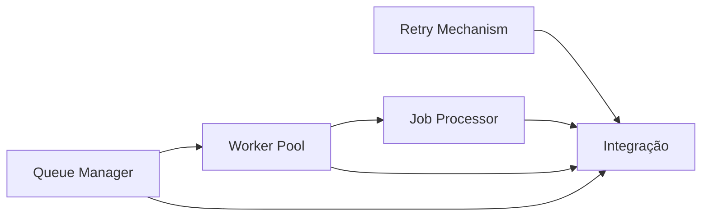

# Análise de Complexidade das Issues

## Visão Geral
Análise detalhada da complexidade de cada issue relacionada ao sistema de workers e jobs, incluindo sub-tarefas e ordem recomendada de implementação.

## Complexidade por Issue

### 1. Implementar Queue Manager
- **Complexidade**: 4 (Muito complexo)
- **Sub-tarefas**:
  - Implementar JobRepository
  - Criar máquina de estados básica
  - Adicionar sistema de dependências entre jobs
  - Implementar API de gerenciamento
  - Adicionar políticas de retentativa configuráveis

### 2. Implementar Worker Pool
- **Complexidade**: 3 (Complexo)
- **Sub-tarefas**:
  - Implementar Worker entity
  - Criar pool básico com workers fixos
  - Adicionar health checks periódicos
  - Implementar escalonamento dinâmico
  - Gerenciar timeouts de execução

### 3. Implementar Job Processor  
- **Complexidade**: 3 (Complexo)
- **Sub-tarefas**:
  - Criar use case base (process-job.usecase.ts)
  - Implementar integração com Agent
  - Adicionar suporte a Tools específicas
  - Criar handlers para diferentes tipos de jobs
  - Padronizar formatos de resultado/erro

### 4. Implementar Retry Mechanism
- **Complexidade**: 2 (Moderado)
- **Sub-tarefas**: Não necessárias (pode ser implementado como uma única unidade)

### 5. Integrar Componentes
- **Complexidade**: 5 (Extremamente complexo)
- **Sub-tarefas**:
  - Definir interfaces de comunicação entre componentes
  - Implementar adaptadores para conexão entre módulos
  - Criar testes de integração abrangentes
  - Configurar fluxo completo de processamento
  - Implementar tratamento de erros global

## Ordem Recomendada de Implementação

1. Implementar Retry Mechanism
2. Implementar Job Processor
3. Implementar Worker Pool  
4. Implementar Queue Manager
5. Integrar todos os componentes

## Dependências Críticas
- Queue Manager depende do Worker Pool estar pronto
- Worker Pool depende do Job Processor
- A integração final depende de todos os outros componentes