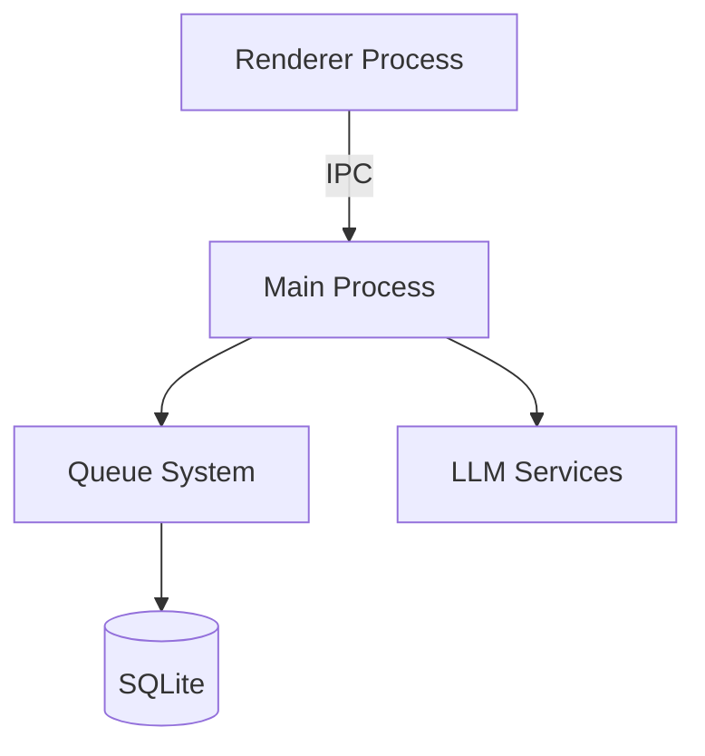

# Decisões Arquiteturais - Project Wiz

## 1. Visão Geral da Arquitetura

### 1.1 Princípios Fundamentais
- **Clean Architecture**: Separação clara entre domínio, aplicação e infraestrutura
- **Domain-Driven Design**: Agregados bem definidos (Queue, Job)
- **SOLID**: Princípios aplicados em todas as camadas

### 1.2 Diagrama de Alto Nível

## 2. Decisões Chave

### 2.1 Sistema de Filas
- **Persistência**: SQLite para armazenamento local
- **Concorrência**: Limite configurável por fila
- **Retentativas**: Política exponencial com jitter

### 2.2 Comunicação IPC
- Padrão de mensagens: `[scope]:[entity]:[action]`
- Tipos de eventos:
  - Queries (síncronas)
  - Commands (assíncronas)
  - Events (pub/sub)

### 2.3 Monitoramento
- Coleta de métricas via `perf-monitor`
- Dashboard integrado na UI

## 3. Considerações para Produção

### 3.1 Escalabilidade
- Limite máximo de 10 workers concorrentes
- Tamanho máximo de payload: 5MB

### 3.2 Resiliência
- Timeout padrão: 30s para operações IPC
- Retry automático para falhas transitórias

### 3.3 Segurança
- Isolamento de processos
- Validação de payloads IPC