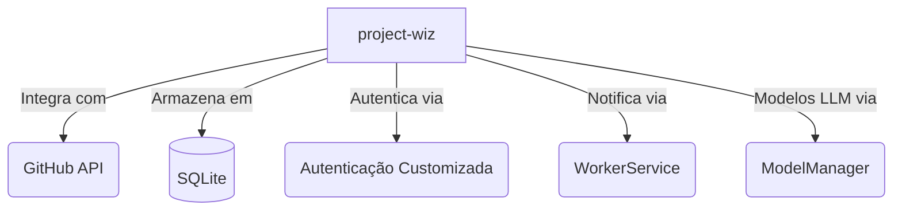
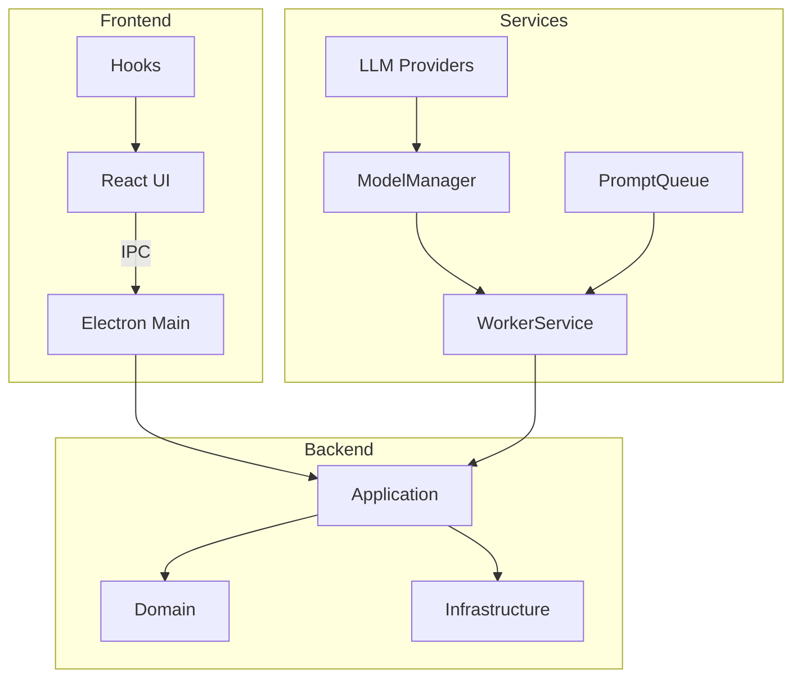
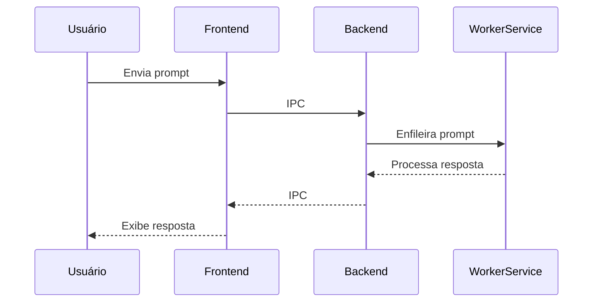
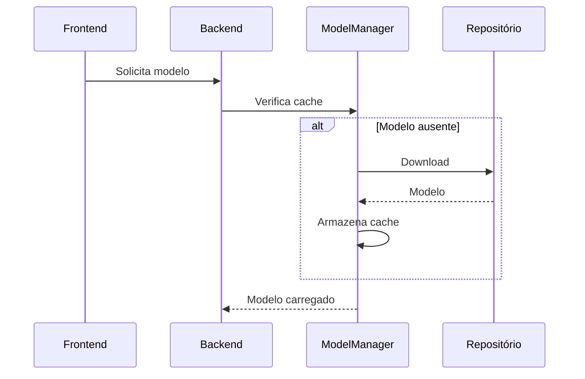

# Arquitetura e Design Modernizado

## Visão Geral

O Project Wiz é uma aplicação Electron que utiliza React no frontend e Node.js no backend (com comunicação IPC). O objetivo é fornecer uma interface para automatizar tarefas de desenvolvimento usando LLMs.

### Metas Arquiteturais
1. **Extensibilidade:** Suportar diferentes modos e ferramentas
2. **Performance:** Execução eficiente de pipelines LLM
3. **Manutenibilidade:** Código bem documentado e testado
4. **Segurança:** Práticas seguras de autenticação e logs

## Diagrama de Contexto

## Estrutura de Camadas

A arquitetura segue os princípios da **Clean Architecture** ([ADR-0012](adr/ADR-0012-Clean-Architecture-LLM.md)), com as seguintes camadas:

1. **Domain:** Entidades e regras de negócio puras
2. **Application:** Casos de uso e serviços
3. **Infrastructure:** Implementações concretas
4. **Client:** Componentes UI ([ui-components.md](ui-components.md))
5. **Shared:** Utilitários comuns

## Diagrama de Componentes

## Fluxos Principais

### 1. Execução de Prompts

### 2. Download de Modelos

## Módulos Principais

| Módulo | Responsabilidade |
|--------|----------------|
| Core | Gerenciamento de modos e ferramentas |
| Client | Interface do usuário e interações |
| Services | WorkerService, ModelManager, PromptQueue |

## Tecnologias Chave

- **Frontend:** Electron, React, TypeScript, Vite
- **Backend:** Node.js, Drizzle ORM, SQLite
- **LLM:** Mistral, Llama 2
- **Ferramentas:** Mermaid (diagramação)

## Padrões de Documentação

Todos os documentos seguem os padrões definidos em:
- [ADR-0020: Padrão de Documentação](architecture/decisions/adr-0020.md)
- [ADR-0021: Diagramação com Mermaid](architecture/decisions/adr-0021.md)

## Links Relacionados

- [Visão do Domínio](domain-overview.md)
- [Infraestrutura](infrastructure-overview.md)
- [Referência da API](api-reference.md)
- [Guia de Desenvolvimento](development.md)
