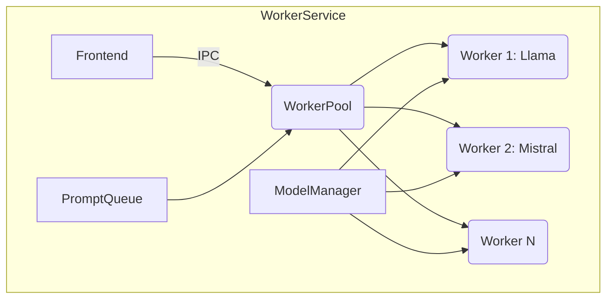

# Arquitetura e Design

## Visão Geral

O Project Wiz é uma aplicação Electron que utiliza React no frontend e Node.js no backend (com comunicação IPC). O objetivo é fornecer uma interface para automatizar tarefas de desenvolvimento usando LLMs.

## Estrutura de Pastas

A aplicação segue uma estrutura organizada por processos Electron e responsabilidades:

```plaintext
src/
├── client/       # Processo renderer (frontend)
│   ├── components/ # Componentes customizados
│   │   └── ui/    # Componentes shadcn/ui
│   ├── hooks/    # Custom hooks
│   ├── services/ # Serviços frontend
│   ├── utils/    # Utilitários específicos
│   ├── styles/   # Estilos globais
│   └── lib/      # Bibliotecas auxiliares
│
├── core/         # Processo main (backend)
│   ├── main/     # Código principal
│   ├── preload/  # Código de preload
│   ├── services/ # Serviços backend
│   │   └── llm/  # Implementação dos serviços LLM
│   ├── utils/    # Utilitários do backend
│   └── events/   # Comunicação IPC
│
└── shared/       # Recursos compartilhados
    ├── types/    # Tipos TypeScript
    ├── constants/# Constantes e enums
    └── config/   # Configurações
```

Esta estrutura está documentada no [ADR-0005](adr/ADR-0005-Estrutura-de-Pastas-Electron.md).

## Componentes Principais

### Frontend (src/client)
- **ui/**: Componentes React organizados por funcionalidade:
  - App.tsx: Componente principal
  - Dashboard, ActivityLog, Documentation, RepositorySettings, ModelSettings
- **hooks/**: Custom hooks (useLLM, useMobile, etc)
- **services/**: Chamadas de API e integrações frontend
- **utils/**: Utilitários específicos do frontend

### Core (src/core)
- **main/**:
  - main.ts: Processo principal do Electron
- **preload/**:
  - preload.ts: Exposição segura de APIs Node.js
- **services/**:
  - llm/: Implementação dos serviços LLM
  - Outros serviços backend
- **events/**:
  - bridge.ts: Comunicação IPC entre processos

### Shared (src/shared)
- **types/**: Tipos TypeScript compartilhados
- **constants/**: Constantes e enums globais
- **config/**: Configurações compartilhadas
## Gerenciamento de Recursos e Escalabilidade

O WorkerService implementa várias estratégias para otimizar o uso de recursos e garantir a escalabilidade:

- **Cache de modelos**: Os modelos são armazenados em cache para reduzir a latência e o tempo de carregamento.
- **Monitoramento de memória**: O uso de memória é monitorado para evitar o esgotamento de recursos.
- **Políticas de descarregamento**: Modelos não utilizados são descarregados para liberar memória.
- **Limites de recursos configuráveis**: Os limites de recursos podem ser configurados para controlar o uso de memória e CPU.

## Integração com ADR-0007

Esta refatoração do WorkerService está detalhada no [ADR-0007](docs/adr/ADR-0007-Refatoracao-WorkerService-Mistral-GGUF.md). O ADR explica a decisão arquitetural, as alternativas consideradas e as consequências da decisão.

## Fluxo de Processamento de Prompts

1. Frontend envia prompt via IPC
2. WorkerService coloca na PromptQueue
3. Worker Process:
   - Verifica se modelo necessário está em cache
   - Carrega modelo se necessário (ou usa cache)
   - Processa prompt
   - Retorna resultado via IPC
4. WorkerService envia resposta para Frontend

## Diagrama do WorkerService



## WorkerService

### Nova Estrutura do WorkerService

O WorkerService foi refatorado para suportar múltiplos modelos de LLM e implementar uma fila de prompts. A nova arquitetura inclui os seguintes componentes principais:

- **WorkerPool**: Gerencia um pool de workers, cada um responsável por executar prompts em um modelo LLM específico.
- **PromptQueue**: Implementa uma fila para gerenciar prompts recebidos, garantindo que sejam processados na ordem correta e evitando sobrecarga do sistema.
- **ModelManager**: Responsável por carregar, armazenar em cache e descarregar modelos LLM conforme necessário.

A nova estrutura permite:

- **Suporte a múltiplos modelos**: O WorkerService pode carregar e gerenciar vários modelos simultaneamente (Llama, Mistral, etc.).
- **Carregamento dinâmico de modelos GGUF**: Os modelos GGUF são carregados dinamicamente conforme necessário, otimizando o uso de memória.
- **Fila de prompts**: Garante que os prompts sejam processados de forma ordenada, evitando sobrecarga e garantindo a estabilidade do sistema.
- **Gerenciamento de recursos**: Otimiza o uso de recursos (CPU, memória, GPU) para garantir a escalabilidade e o desempenho do sistema.


## Fluxo de Dados

1. **Interação do Usuário**: O usuário interage com a interface do usuário (React).
2. **Envio do Prompt**: O frontend envia o prompt para o WorkerService via IPC.
3. **Enfileiramento do Prompt**: O WorkerService enfileira o prompt na PromptQueue.
4. **Processamento do Prompt**: O WorkerPool retira o prompt da fila e o atribui a um worker disponível.
5. **Geração da Resposta**: O worker carrega o modelo LLM necessário (se ainda não estiver carregado) e gera a resposta.
6. **Retorno da Resposta**: O worker retorna a resposta para o WorkerService.
7. **Envio da Resposta ao Frontend**: O WorkerService envia a resposta para o frontend via IPC.
4.  **Retorno dos Resultados**: O backend retorna os resultados para o frontend (via IPC).
8. **Atualização da Interface**: O frontend atualiza a interface do usuário com os resultados.

## Tecnologias Utilizadas

- Electron
- React
- TypeScript
- Vite
- Shadcn/ui (para componentes da interface)
- Node.js
- GitHub API (via Octokit)
- Modelos LLM (ex: Mistral, Llama 2, etc.)
