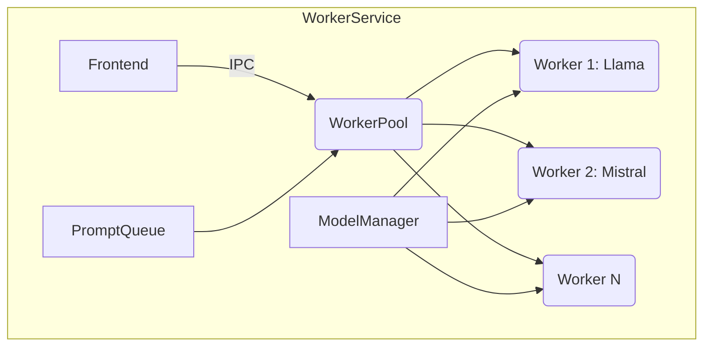

# Arquitetura e Design

## Visão Geral

O Project Wiz é uma aplicação Electron que utiliza React no frontend e Node.js no backend (com comunicação IPC). O objetivo é fornecer uma interface para automatizar tarefas de desenvolvimento usando LLMs.

A arquitetura segue os princípios da **Clean Architecture** ([ADR-0008](adr/ADR-0008-Clean-Architecture-LLM.md)), separando claramente domínio, aplicação, infraestrutura e apresentação.

### Diagrama Geral da Arquitetura

```mermaid
flowchart TD
    subgraph Frontend
        A1[React UI]
        A2[Hooks (useLLM, useHistory)]
        A1 --> A2
    end

    subgraph IPC
        B1[IPC Electron]
    end

    subgraph Backend
        C1[Application Layer]
        C2[Domain Layer]
        C3[Infrastructure Layer]
        C1 --> C2
        C1 --> C3
        C3 --> C2
    end

    subgraph Services
        D1[WorkerService]
        D2[ModelManager]
        D3[PromptQueue]
        D4[LLM Providers]
    end

    A2 -->|via IPC| B1 --> C1
    C1 --> D3
    D3 --> D1
    D1 --> D2
    D2 --> D4
    D1 --> C1
    C1 -->|via IPC| B1 --> A2
```

---

## Estrutura de Pastas

A estrutura detalhada está documentada no [ADR-0005](adr/ADR-0005-Estrutura-de-Pastas-Electron.md).

```plaintext
src/
├── client/       # Processo renderer (frontend)
│   ├── components/ # Componentes React
│   ├── hooks/      # Custom hooks
│   ├── services/   # Serviços frontend
│   ├── utils/      # Utilitários
│   ├── styles/     # Estilos
│   └── lib/        # Bibliotecas auxiliares
│
├── core/         # Processo main (backend)
│   ├── domain/         # Entidades, interfaces, regras de negócio
│   ├── application/    # Casos de uso, serviços de aplicação
│   ├── infrastructure/ # Implementações concretas, gateways, adapters
│
└── shared/       # Recursos compartilhados
    ├── types/
    ├── constants/
    └── config/
```

---

## Decisões Arquiteturais Importantes

- **Clean Architecture para LLMs:** [ADR-0008](adr/ADR-0008-Clean-Architecture-LLM.md)
- **Refatoração WorkerService com múltiplos modelos GGUF:** [ADR-0007](adr/ADR-0007-Refatoracao-WorkerService-Mistral-GGUF.md)
- **Estrutura de pastas Electron:** [ADR-0005](adr/ADR-0005-Estrutura-de-Pastas-Electron.md)
- **DSL para fluxos de trabalho:** [ADR-0006](adr/ADR-0006-DSL-para-fluxos-de-trabalho.md)
- **Implementação TanStack Router + Drizzle ORM:** [ADR-0007](adr/ADR-0007-Implementacao-TanStack-Router-Drizzle.md)
- **Histórico de conversas com SQLite + Drizzle:** [ADR-0010](adr/ADR-0010-Historico-Conversas-SQLite-Drizzle.md)

---

## Fluxos Principais

### Execução de Prompts

1. **Usuário** interage com a interface React.
2. **Frontend** envia prompt via IPC para backend.
3. **Application Layer** recebe e enfileira o prompt na **PromptQueue**.
4. **WorkerService** consome a fila, verifica o cache de modelos via **ModelManager**.
5. Se necessário, **ModelManager** baixa/carrega o modelo.
6. **WorkerService** processa o prompt com o modelo LLM.
7. Resposta é enviada via IPC para o frontend.
8. Interface é atualizada com a resposta.

### Download e Gerenciamento de Modelos

1. **Solicitação** para usar um modelo específico.
2. **ModelManager** verifica se o modelo está disponível localmente.
3. Se não estiver, inicia **download** do repositório remoto.
4. Após download, o modelo é armazenado em cache.
5. **ModelManager** carrega o modelo na memória.
6. **WorkerService** utiliza o modelo carregado para processar prompts.

---

## Módulos Principais

### Core (`src/core`)

- **Domain:** Entidades (Prompt, Session, Model), interfaces (ports) para LLM, ModelManager, WorkerService.
- **Application:** Casos de uso (criar prompt, atualizar prompt, streaming), serviços de orquestração.
- **Infrastructure:** Implementações concretas, gateways para Electron, workers, integrações com LLMs.

### Client (`src/client`)

- **Componentes React:** UI, dashboards, configurações, histórico.
- **Hooks:** `useLLM`, `useHistory`, `useRepositorySettings`.
- **Services:** Integrações frontend, temas, armazenamento local.
- **Roteamento:** TanStack Router ([ADR-0007](adr/ADR-0007-Implementacao-TanStack-Router-Drizzle.md)).

#### Autenticação: Contratos e Responsabilidades

- **API (`auth-api.ts`)**: Responsável por chamadas HTTP/IPC para autenticação (login, logout, register, refresh). Não manipula estado ou storage.
- **Actions (`auth-actions.ts`)**: Funções puras, sem dependência de React ou UI. Recebem apenas dados, retornam objetos de resultado (`{ user }`, `{ session }`, `{ success: true }`) ou lançam erros previsíveis. Não manipulam setters de estado nem efeitos colaterais de UI. Persistem tokens via storage.
- **Storage (`auth-storage.ts`)**: Camada de persistência local de tokens (get, save, clear). Não possui lógica de negócio.
- **Hooks (`useAuth`, etc.)**: Responsáveis por consumir as actions puras, atualizar o estado da UI e tratar feedback ao usuário. Toda manipulação de estado React ocorre apenas nos hooks.

**Contrato das actions:**
- Todas as funções são assíncronas e retornam objetos de resultado ou lançam erros tratados.
- Exemplo: `loginUser(email, password): Promise<{ session: AuthSession }>`
- Erros são lançados e devem ser tratados pelo consumidor (hook/UI).

**Observação:**
- Está BLOQUEADA a implementação de novas features de autenticação/sessão até a conclusão total desta refatoração, para garantir a padronização e evitar regressões.

### Services

- **WorkerService:** Gerencia pool de workers, fila de prompts, execução paralela.
- **ModelManager:** Download, cache, carregamento e descarregamento de modelos.
- **PromptQueue:** Fila assíncrona para controle de carga.
- **LLM Providers:** Integração com diferentes modelos (Mistral, Llama, etc).

---

## Diagramas Específicos

### WorkerService



---

## Links Relacionados

- [Visão do Domínio](domain-overview.md)
- [Contratos e Value Objects](domain-contratos-e-value-objects.md)
- [Infraestrutura](infrastructure-overview.md)
- [Referência da API](api-reference.md)
- [Guia de Desenvolvimento](development.md)
- [Guia de Testes](testing-strategy.md)
- [Guia do Usuário](user-guide.md)

---

## Tecnologias Utilizadas

- Electron
- React
- TypeScript
- Vite
- Shadcn/ui
- Node.js
- Drizzle ORM
- SQLite
- Octokit (GitHub API)
- Modelos LLM (Mistral, Llama 2, etc)
