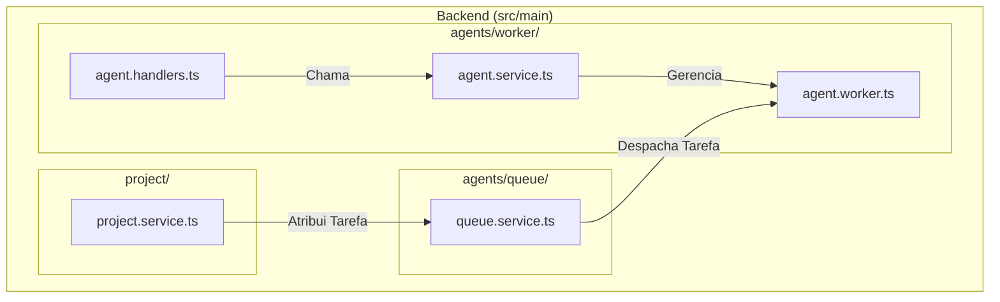
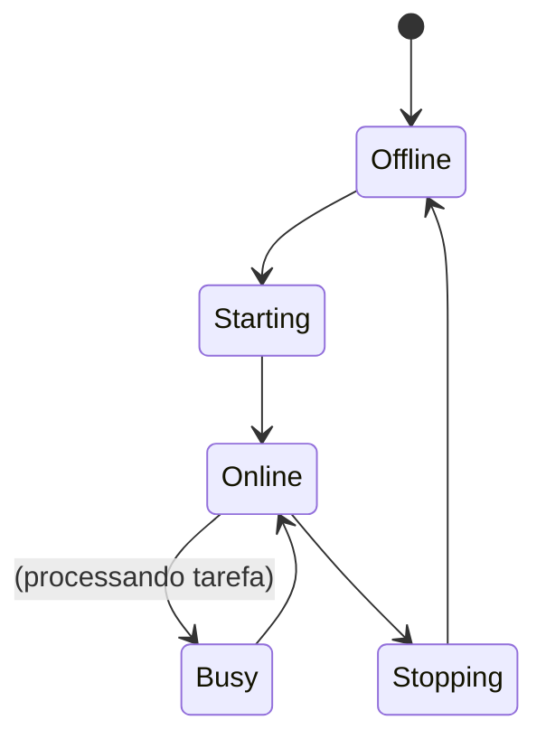

# 5. Sistema de Agentes Autônomos

**Versão:** 3.0  
**Status:** Design Final  
**Data:** 2025-01-17

---

## 🎯 Visão Geral do Sistema de Agentes

O sistema de agentes é o componente mais dinâmico e poderoso do Project Wiz. Ele consiste em **workers de IA autônomos** que operam em processos de background para executar tarefas complexas de desenvolvimento de software. Cada agente é projetado para ser especializado, colaborativo e autônomo.

### Capacidades dos Agentes

- **Execução em Background**: Operam em processos independentes, não bloqueando a interface do usuário.
- **Processamento de Tarefas**: Executam uma variedade de tarefas, como implementação de código, revisão, testes e documentação.
- **Comunicação**: Interagem com usuários através de mensagens diretas (DMs) e participam de discussões em canais de projetos.
- **Colaboração**: Múltiplos agentes podem trabalhar juntos em um mesmo projeto, cada um contribuindo com sua especialidade.
- **Integração com Git**: Acessam e modificam o código-fonte dos projetos de forma segura, utilizando `worktrees` do Git para trabalhar em paralelo sem conflitos.
- **Especialização**: Cada agente possui um `role` (ex: `developer`, `tester`) e `expertise` (ex: `react`, `typescript`) que determinam suas capacidades.

---

## 🏗️ Arquitetura e Localização no Projeto

O código para o sistema de agentes está localizado no Bounded Context `src/main/agents/`. A lógica é dividida em dois agregados principais:

- **`agents/worker/`**: Contém a lógica principal de cada agente individual, incluindo o `agent.worker.ts`, o `agent.service.ts` para gerenciar o ciclo de vida e o `agent.handlers.ts` para a comunicação IPC.
- **`agents/queue/`**: Gerencia as filas de tarefas para os agentes.

### Diagrama da Arquitetura



### Ciclo de Vida de um Worker

Um agente pode estar em um dos seguintes estados, que são gerenciados pelo `AgentService` e refletidos na UI.



---

## 🤖 O Core do Agent Worker (`agent.worker.ts`)

Cada `AgentWorker` é uma classe que encapsula a lógica de um agente específico.

### Fluxo de Execução de uma Tarefa de Código

Este é o fluxo mais comum e complexo para um agente desenvolvedor:

1.  **Criação de Worktree**: Para isolar o trabalho, o `GitService` cria um `worktree` do Git. Isso permite que o agente trabalhe em uma cópia limpa do repositório sem interferir em outros trabalhos em andamento.

    ```typescript
    const worktreePath = await GitService.createWorktreeForTask(
      task.projectId,
      task.id,
    );
    ```

2.  **Análise do Código**: O agente analisa o código existente no `worktree` para entender o contexto da tarefa.

3.  **Geração da Implementação**: O agente monta um prompt detalhado para o LLM, incluindo a descrição da tarefa e o contexto do código. A resposta do LLM é um plano de implementação estruturado (geralmente em JSON).

    ```typescript
    const implementation = await this.generateImplementation(task, codeContext);
    ```

4.  **Escrita dos Arquivos**: O agente aplica as mudanças sugeridas pelo LLM, criando ou modificando os arquivos no `worktree`.

5.  **Execução de Testes**: Se houver testes no projeto, o agente os executa para validar a implementação.

6.  **Commit das Mudanças**: Se os testes passarem, o agente faz o commit das mudanças no `worktree` com uma mensagem descritiva.

    ```typescript
    await GitService.commitChanges(worktreePath, `feat: ${task.description}`);
    ```

7.  **Relato do Resultado**: O agente envia uma mensagem para o canal do projeto, informando que a tarefa foi concluída e que o código está pronto para revisão.

---

## 💬 Roteamento e Processamento de Mensagens

Quando um usuário envia uma mensagem em um canal, o `MessageRouter` (localizado em `src/main/conversations/routing/`) entra em ação para determinar se um agente deve intervir.

1.  **Análise de Intenção**: O `LLMService` analisa o conteúdo da mensagem para determinar a intenção do usuário.
2.  **Roteamento por Expertise**: Se a mensagem requer uma expertise específica (ex: "preciso de ajuda com o CSS"), o roteador procura um agente online no projeto com a expertise `css`.
3.  **Roteamento Direto**: Se a mensagem menciona um agente pelo nome (`@dev-agent`), a mensagem é enviada diretamente para aquele agente.
4.  **Atribuição de Tarefa**: Se a análise de intenção indicar que a mensagem é uma solicitação de trabalho, uma nova `AgentTask` é criada e adicionada à fila do agente apropriado através do `QueueService`.
