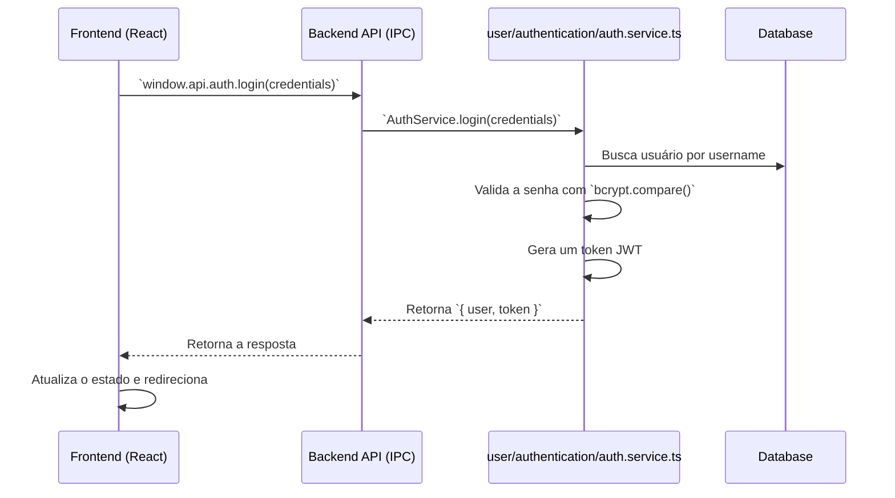

# 6. Autenticação e Fluxos de Usuário

**Versão:** 3.0  
**Status:** Design Final  
**Data:** 2025-01-17

---

## 🎯 Visão Geral

Este documento descreve o sistema de autenticação e como ele se integra aos principais fluxos de funcionalidades da aplicação, sempre seguindo a arquitetura de domínios estabelecida.

---

## 1. Sistema de Autenticação Local e Multi-Conta

O Project Wiz utiliza um sistema de autenticação local, com os dados armazenados no dispositivo do usuário. A lógica de autenticação está contida no Bounded Context `user`, dentro do agregado `authentication` (`src/main/user/authentication/`).

### Características Principais

- **Múltiplas Contas Locais**: Um usuário pode criar e gerenciar várias contas no mesmo dispositivo.
- **Dados Isolados**: Cada conta possui seus próprios projetos, agentes e configurações.
- **Segurança Local**: Senhas são hasheadas com `bcrypt`, e sessões são gerenciadas por tokens JWT locais.

### Fluxo de Autenticação (Login)

O processo de login ilustra a interação entre as camadas e domínios:

---

## 2. Fluxos de Funcionalidades Principais

A seguir, detalhamos como as interações do usuário se traduzem em operações através dos diferentes domínios da aplicação.

### Fluxo 1: Criação de um Novo Projeto

Este fluxo mostra a colaboração entre o frontend e o Bounded Context `project`.

1.  **Ação do Usuário**: O usuário preenche o formulário de criação de projeto na UI.
2.  **Frontend (UI)**: O hook `useProjects` (em `src/renderer/features/project/hooks/`) chama `window.api.projects.create(data)`.
3.  **Backend (API & Service)**: O handler em `src/main/project/project.handlers.ts` recebe a chamada e a delega para o `ProjectService` em `src/main/project/project.service.ts`.
4.  **Lógica de Negócio (Service)**: O `ProjectService` orquestra a criação:
    - Valida os dados.
    - Chama o `GitService` para inicializar o repositório.
    - Insere o projeto no banco de dados.
    - **Chama o `ChannelService`** (do agregado `channels`) para criar os canais padrão.
5.  **Resposta e Atualização da UI**: O novo projeto é retornado ao frontend, que atualiza o estado e navega para a página do novo projeto.

### Fluxo 2: Envio de Mensagem e Interação do Agente

Este fluxo demonstra a reatividade do sistema e a interação entre os contextos `conversations` e `agents`.

1.  **Ação do Usuário**: O usuário envia uma mensagem em um canal.
2.  **Frontend (UI)**: A UI faz uma **atualização otimista** e envia a mensagem para o backend via `window.api.messages.send(data)`.
3.  **Backend (Contexto `conversations`)**: O `MessageService` (`src/main/conversations/message.service.ts`) salva a mensagem.
4.  **Análise e Roteamento**: O `MessageRouter` (`src/main/conversations/routing/message.router.ts`) analisa a intenção da mensagem.
5.  **Ativação do Agente (Contexto `agents`)**: Se a intenção requer uma ação, o roteador notifica o `AgentService` (`src/main/agents/worker/agent.service.ts`), que cria uma tarefa e a adiciona à fila do agente apropriado.
6.  **Resposta do Agente**: O `AgentWorker` executa a lógica, envia uma mensagem de confirmação de volta para o canal através do `MessageService`, e a UI é atualizada em tempo real.

### Fluxo 3: Agente Executando uma Tarefa de Código

Este fluxo é o coração do trabalho autônomo e ocorre inteiramente no backend, dentro do Bounded Context `agents`.

1.  **Início da Tarefa**: O `AgentWorker` (`src/main/agents/worker/agent.worker.ts`) pega uma tarefa de sua fila.
2.  **Isolamento com Git**: Utiliza o `GitService` para criar um **worktree** isolado.
3.  **Geração de Código (AI)**: O worker interage com o `LLMService` para analisar o código e gerar a implementação necessária.
4.  **Validação**: O worker escreve os arquivos no worktree, executa testes para validar as mudanças e faz o commit.
5.  **Relato de Conclusão**: O agente usa o `MessageService` para postar uma atualização no canal do projeto, informando sobre a conclusão da tarefa.
