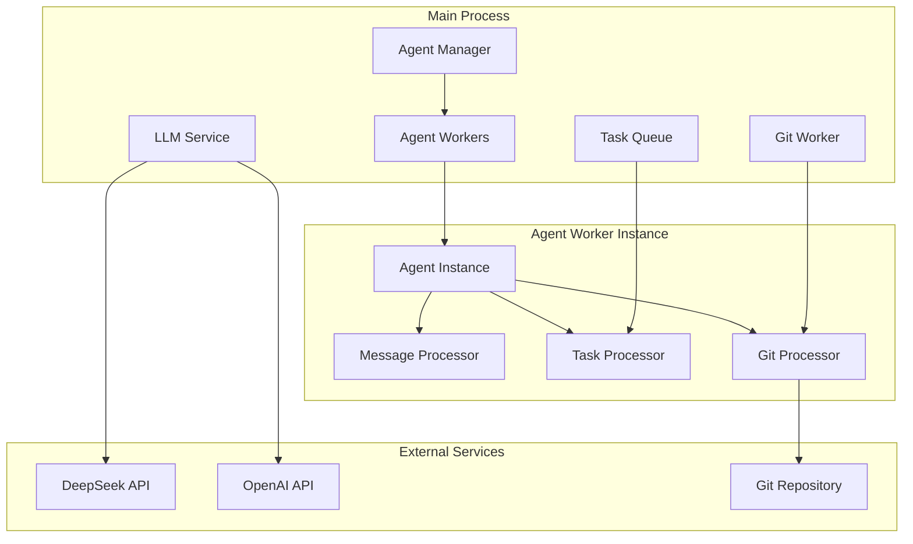
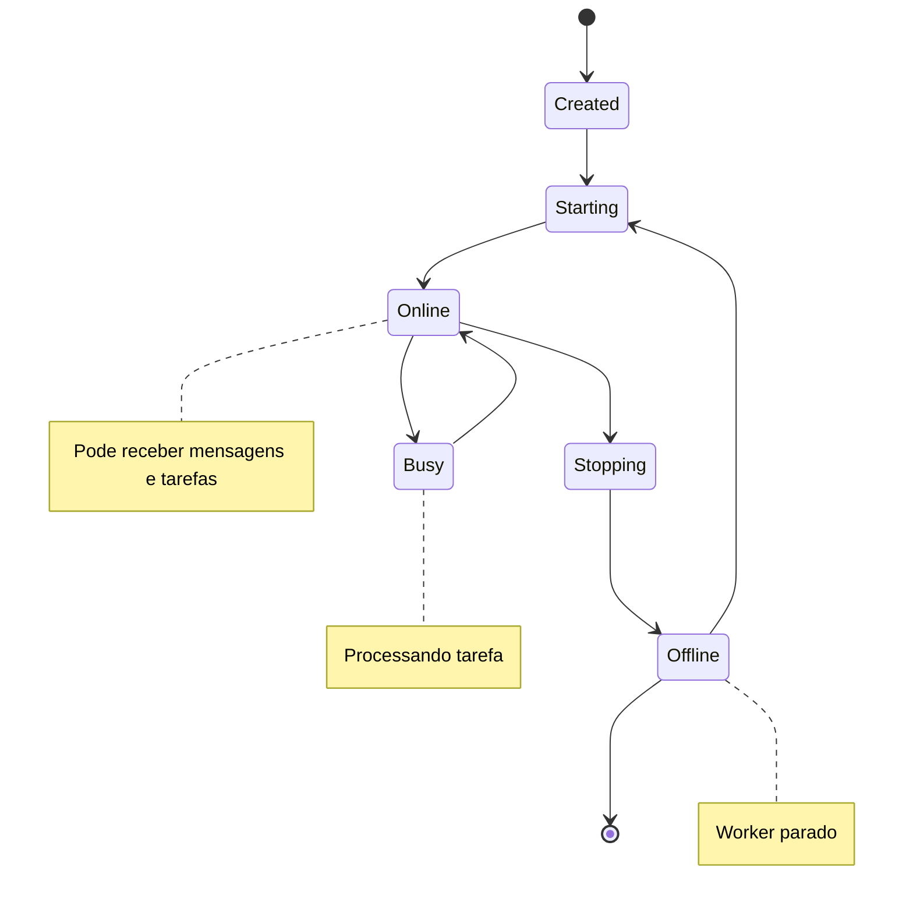

# Project Wiz: Sistema de Agentes Background

**Versão:** 3.0  
**Status:** Design Final  
**Data:** 2025-01-17  

---

## 🎯 Visão Geral dos Agentes

O sistema de **agentes background** é o coração do Project Wiz. Os agentes são **workers autônomos de IA** que:

1. **Rodam em background** - Processo contínuo independente
2. **Processam tarefas** - Executam trabalho de desenvolvimento
3. **Comunicam-se** - Respondem DMs e participam de canais
4. **Colaboram** - Trabalham juntos em projetos
5. **Acessam repositórios** - Modificam código usando Git
6. **São especializados** - Cada agente tem expertise específica

---

## 🏗️ Arquitetura dos Workers

### Diagrama de Sistema



### Worker Lifecycle



---

## 🤖 Agent Worker Core

### Worker Manager

```typescript
// src/main/workers/agent-worker.ts
import { EventEmitter } from 'events';
import { LLMService } from '../services/llm-service';
import { GitService } from '../services/git-service';
import type { Agent, AgentTask, AgentMessage } from '../../shared/types/agent';

export class AgentWorkerManager {
  private static workers = new Map<string, AgentWorker>();
  private static eventBus = new EventEmitter();
  
  /**
   * Iniciar worker de agente
   */
  static async startWorker(agentId: string): Promise<void> {
    if (this.workers.has(agentId)) {
      throw new Error(`Worker for agent ${agentId} already running`);
    }
    
    // Buscar dados do agente
    const agent = await AgentService.findById(agentId);
    if (!agent) {
      throw new Error(`Agent ${agentId} not found`);
    }
    
    // Criar e iniciar worker
    const worker = new AgentWorker(agent);
    await worker.start();
    
    this.workers.set(agentId, worker);
    
    // Atualizar status do agente
    await AgentService.updateStatus(agentId, 'online');
    
    console.log(`Agent worker started: ${agent.name} (${agentId})`);
  }
  
  /**
   * Parar worker de agente
   */
  static async stopWorker(agentId: string): Promise<void> {
    const worker = this.workers.get(agentId);
    if (!worker) {
      return; // Já parado
    }
    
    await worker.stop();
    this.workers.delete(agentId);
    
    // Atualizar status do agente
    await AgentService.updateStatus(agentId, 'offline');
    
    console.log(`Agent worker stopped: ${agentId}`);
  }
  
  /**
   * Enviar mensagem para agente
   */
  static async sendMessage(
    agentId: string, 
    message: AgentMessage
  ): Promise<string> {
    const worker = this.workers.get(agentId);
    if (!worker) {
      throw new Error(`Worker for agent ${agentId} not running`);
    }
    
    return await worker.processMessage(message);
  }
  
  /**
   * Atribuir tarefa para agente
   */
  static async assignTask(
    agentId: string, 
    task: AgentTask
  ): Promise<void> {
    const worker = this.workers.get(agentId);
    if (!worker) {
      throw new Error(`Worker for agent ${agentId} not running`);
    }
    
    await worker.addTask(task);
  }
  
  /**
   * Listar workers ativos
   */
  static getActiveWorkers(): string[] {
    return Array.from(this.workers.keys());
  }
  
  /**
   * Parar todos os workers
   */
  static async stopAllWorkers(): Promise<void> {
    const stopPromises = Array.from(this.workers.keys()).map(id => 
      this.stopWorker(id)
    );
    
    await Promise.all(stopPromises);
  }
}
```

### Individual Agent Worker

```typescript
// src/main/workers/agent-worker.ts (continuação)
export class AgentWorker {
  private agent: Agent;
  private taskQueue: AgentTask[] = [];
  private isProcessing = false;
  private messageHistory: AgentMessage[] = [];
  private llmClient: any;
  
  constructor(agent: Agent) {
    this.agent = agent;
    this.initializeLLMClient();
  }
  
  /**
   * Iniciar worker
   */
  async start(): Promise<void> {
    console.log(`Starting agent worker: ${this.agent.name}`);
    
    // Carregar histórico recente de conversas
    await this.loadRecentHistory();
    
    // Iniciar processamento de tarefas
    this.startTaskProcessing();
  }
  
  /**
   * Parar worker
   */
  async stop(): Promise<void> {
    console.log(`Stopping agent worker: ${this.agent.name}`);
    this.isProcessing = false;
    
    // Finalizar tarefas pendentes
    await this.finalizePendingTasks();
  }
  
  /**
   * Processar mensagem
   */
  async processMessage(message: AgentMessage): Promise<string> {
    try {
      // Adicionar à história
      this.messageHistory.push(message);
      
      // Preparar contexto para LLM
      const context = this.buildLLMContext(message);
      
      // Gerar resposta com LLM
      const response = await this.llmClient.generateResponse({
        messages: context,
        temperature: this.agent.temperature,
        maxTokens: this.agent.maxTokens,
      });
      
      // Adicionar resposta ao histórico
      const agentResponse: AgentMessage = {
        id: generateId(),
        content: response.content,
        authorId: this.agent.id,
        authorType: 'agent',
        timestamp: new Date(),
      };
      
      this.messageHistory.push(agentResponse);
      
      // Analisar se mensagem requer ação adicional
      await this.analyzeForActions(message, response.content);
      
      return response.content;
    } catch (error) {
      console.error(`Error processing message for agent ${this.agent.id}:`, error);
      return "I'm sorry, I encountered an error processing your message. Please try again.";
    }
  }
  
  /**
   * Adicionar tarefa à fila
   */
  async addTask(task: AgentTask): Promise<void> {
    this.taskQueue.push(task);
    
    // Se não estiver processando, iniciar
    if (!this.isProcessing) {
      this.processNextTask();
    }
  }
  
  // Métodos privados
  private initializeLLMClient(): void {
    this.llmClient = LLMService.createClient({
      provider: this.agent.llmProvider,
      model: this.agent.llmModel,
      apiKey: process.env[`${this.agent.llmProvider.toUpperCase()}_API_KEY`],
    });
  }
  
  private async loadRecentHistory(): Promise<void> {
    // Carregar mensagens recentes dos canais e DMs do agente
    // Implementação específica baseada nos projetos do agente
  }
  
  private buildLLMContext(message: AgentMessage): any[] {
    const systemPrompt = {
      role: 'system',
      content: this.agent.systemPrompt,
    };
    
    const recentHistory = this.messageHistory
      .slice(-10) // Últimas 10 mensagens
      .map(msg => ({
        role: msg.authorType === 'agent' ? 'assistant' : 'user',
        content: msg.content,
      }));
    
    return [systemPrompt, ...recentHistory];
  }
  
  private async analyzeForActions(
    message: AgentMessage, 
    response: string
  ): Promise<void> {
    // Analisar se a resposta indica que uma tarefa deve ser criada
    const intent = await LLMService.analyzeIntent(message.content);
    
    if (intent.requiresCodeWork) {
      const task: AgentTask = {
        id: generateId(),
        type: intent.taskType,
        description: intent.description,
        projectId: message.projectId,
        priority: intent.priority || 'medium',
        createdAt: new Date(),
      };
      
      await this.addTask(task);
    }
  }
  
  private async startTaskProcessing(): Promise<void> {
    this.isProcessing = true;
    
    while (this.isProcessing) {
      if (this.taskQueue.length > 0) {
        await this.processNextTask();
      } else {
        // Aguardar por novas tarefas
        await new Promise(resolve => setTimeout(resolve, 1000));
      }
    }
  }
  
  private async processNextTask(): Promise<void> {
    if (this.taskQueue.length === 0) return;
    
    const task = this.taskQueue.shift()!;
    
    try {
      // Atualizar status do agente
      await AgentService.updateStatus(this.agent.id, 'busy');
      
      // Processar tarefa baseada no tipo
      await this.executeTask(task);
      
      // Atualizar status de volta para online
      await AgentService.updateStatus(this.agent.id, 'online');
    } catch (error) {
      console.error(`Error processing task ${task.id}:`, error);
      await this.handleTaskError(task, error);
    }
  }
  
  private async executeTask(task: AgentTask): Promise<void> {
    switch (task.type) {
      case 'code_implementation':
        await this.executeCodeTask(task);
        break;
      case 'code_review':
        await this.executeReviewTask(task);
        break;
      case 'documentation':
        await this.executeDocumentationTask(task);
        break;
      case 'testing':
        await this.executeTestingTask(task);
        break;
      default:
        console.warn(`Unknown task type: ${task.type}`);
    }
  }
  
  private async executeCodeTask(task: AgentTask): Promise<void> {
    // 1. Criar worktree para a tarefa
    const worktreePath = await GitService.createWorktreeForTask(
      task.projectId!, 
      task.id
    );
    
    // 2. Analisar código existente
    const codeContext = await this.analyzeCodebase(worktreePath);
    
    // 3. Gerar implementação com LLM
    const implementation = await this.generateImplementation(task, codeContext);
    
    // 4. Escrever arquivos
    await this.writeImplementationFiles(worktreePath, implementation);
    
    // 5. Executar testes se disponíveis
    const testResults = await this.runTests(worktreePath);
    
    // 6. Fazer commit das mudanças
    await GitService.commitChanges(
      worktreePath, 
      `Implement: ${task.description}\\n\\nGenerated by ${this.agent.name}`
    );
    
    // 7. Reportar resultado
    await this.reportTaskCompletion(task, {
      worktreePath,
      testResults,
      implementation,
    });
  }
  
  private async generateImplementation(
    task: AgentTask, 
    codeContext: any
  ): Promise<any> {
    const prompt = `
As a ${this.agent.role} expert, implement the following task:

Task: ${task.description}

Current codebase context:
${JSON.stringify(codeContext, null, 2)}

Please provide:
1. File changes needed
2. New files to create
3. Dependencies to add
4. Tests to write

Respond in JSON format with the implementation plan.
`;
    
    const response = await this.llmClient.generateResponse({
      messages: [
        { role: 'system', content: this.agent.systemPrompt },
        { role: 'user', content: prompt }
      ],
      temperature: 0.3, // Mais determinístico para código
      maxTokens: 4000,
    });
    
    return JSON.parse(response.content);
  }
  
  private async reportTaskCompletion(
    task: AgentTask, 
    results: any
  ): Promise<void> {
    // Enviar mensagem no canal apropriado reportando conclusão
    const reportMessage = `✅ **Task Completed**

**Task:** ${task.description}
**Agent:** ${this.agent.name}
**Branch:** ${results.worktreePath}

**Summary:**
${this.generateTaskSummary(results)}

The implementation is ready for review.`;
    
    // Enviar para canal do projeto ou criar issue
    await this.sendTaskCompletionMessage(task, reportMessage);
  }
}
```

---

## 🔧 Git Integration

### Git Worker

```typescript
// src/main/workers/git-worker.ts
import simpleGit from 'simple-git';
import path from 'path';

export class GitWorker {
  /**
   * Criar worktree para tarefa específica
   */
  static async createWorktreeForTask(
    projectId: string, 
    taskId: string
  ): Promise<string> {
    const project = await ProjectService.findById(projectId);
    if (!project) {
      throw new Error(`Project ${projectId} not found`);
    }
    
    const branchName = `task-${taskId}-${Date.now()}`;
    const worktreePath = path.join(
      project.localPath!, 
      '.worktrees', 
      branchName
    );
    
    const git = simpleGit(project.localPath!);
    
    // Criar nova branch
    await git.checkoutLocalBranch(branchName);
    
    // Criar worktree
    await git.raw(['worktree', 'add', worktreePath, branchName]);
    
    return worktreePath;
  }
  
  /**
   * Fazer commit das mudanças
   */
  static async commitChanges(
    worktreePath: string, 
    message: string
  ): Promise<string> {
    const git = simpleGit(worktreePath);
    
    // Adicionar todas as mudanças
    await git.add('.');
    
    // Fazer commit
    const result = await git.commit(message);
    
    return result.commit;
  }
  
  /**
   * Push das mudanças
   */
  static async pushChanges(
    worktreePath: string, 
    branchName: string
  ): Promise<void> {
    const git = simpleGit(worktreePath);
    
    // Push para origin
    await git.push('origin', branchName);
  }
  
  /**
   * Criar pull request
   */
  static async createPullRequest(
    projectId: string,
    branchName: string,
    title: string,
    description: string
  ): Promise<string> {
    // Implementação específica baseada no provider (GitHub, GitLab, etc.)
    // Por enquanto, apenas retorna URL simulada
    return `https://github.com/user/repo/pull/${Date.now()}`;
  }
  
  /**
   * Limpar worktree
   */
  static async cleanupWorktree(
    projectPath: string,
    worktreePath: string
  ): Promise<void> {
    const git = simpleGit(projectPath);
    
    // Remover worktree
    await git.raw(['worktree', 'remove', worktreePath]);
  }
}
```

---

## 💬 Message Processing

### Message Router

```typescript
// src/main/workers/message-router.ts
export class MessageRouter {
  /**
   * Rotear mensagem para agente apropriado
   */
  static async routeMessage(message: any): Promise<void> {
    // Analisar intenção da mensagem
    const intent = await LLMService.analyzeIntent(message.content);
    
    if (intent.targetAgent) {
      // Mensagem direcionada a agente específico
      await AgentWorkerManager.sendMessage(intent.targetAgent, message);
    } else if (intent.requiresExpertise) {
      // Buscar agente com expertise apropriada
      const appropriateAgent = await this.findAppropriateAgent(
        message.projectId,
        intent.expertise
      );
      
      if (appropriateAgent) {
        await AgentWorkerManager.sendMessage(appropriateAgent.id, message);
      }
    } else if (intent.isGeneral) {
      // Mensagem geral - responder com agente disponível
      const availableAgent = await this.findAvailableAgent(message.projectId);
      
      if (availableAgent) {
        await AgentWorkerManager.sendMessage(availableAgent.id, message);
      }
    }
  }
  
  private static async findAppropriateAgent(
    projectId: string,
    requiredExpertise: string[]
  ): Promise<Agent | null> {
    const projectAgents = await AgentService.listByProject(projectId);
    
    // Scoring baseado em expertise match
    const scoredAgents = projectAgents.map(agent => ({
      agent,
      score: this.calculateExpertiseScore(agent.expertise, requiredExpertise),
    }));
    
    // Ordenar por score e filtrar apenas online
    scoredAgents.sort((a, b) => b.score - a.score);
    
    const bestAgent = scoredAgents.find(
      scored => scored.agent.status === 'online' && scored.score > 0
    );
    
    return bestAgent?.agent || null;
  }
  
  private static calculateExpertiseScore(
    agentExpertise: string[],
    requiredExpertise: string[]
  ): number {
    const matches = requiredExpertise.filter(skill => 
      agentExpertise.includes(skill)
    );
    
    return matches.length / requiredExpertise.length;
  }
}
```

---

## 📋 Task Queue System

### Task Queue Manager

```typescript
// src/main/workers/task-queue.ts
export class TaskQueueManager {
  private static queues = new Map<string, AgentTask[]>();
  
  /**
   * Adicionar tarefa à fila de agente
   */
  static async addTask(agentId: string, task: AgentTask): Promise<void> {
    if (!this.queues.has(agentId)) {
      this.queues.set(agentId, []);
    }
    
    const queue = this.queues.get(agentId)!;
    
    // Inserir tarefa baseada na prioridade
    const insertIndex = this.findInsertIndex(queue, task.priority);
    queue.splice(insertIndex, 0, task);
    
    // Notificar worker
    await AgentWorkerManager.assignTask(agentId, task);
    
    // Persistir tarefa
    await this.persistTask(task);
  }
  
  /**
   * Obter próxima tarefa da fila
   */
  static getNextTask(agentId: string): AgentTask | null {
    const queue = this.queues.get(agentId);
    if (!queue || queue.length === 0) {
      return null;
    }
    
    return queue.shift()!;
  }
  
  /**
   * Listar tarefas pendentes
   */
  static getPendingTasks(agentId: string): AgentTask[] {
    return this.queues.get(agentId) || [];
  }
  
  /**
   * Cancelar tarefa
   */
  static async cancelTask(taskId: string): Promise<void> {
    for (const [agentId, queue] of this.queues.entries()) {
      const taskIndex = queue.findIndex(task => task.id === taskId);
      if (taskIndex !== -1) {
        queue.splice(taskIndex, 1);
        await this.markTaskCancelled(taskId);
        break;
      }
    }
  }
  
  private static findInsertIndex(queue: AgentTask[], priority: string): number {
    const priorityOrder = { urgent: 0, high: 1, medium: 2, low: 3 };
    const taskPriority = priorityOrder[priority] || 2;
    
    for (let i = 0; i < queue.length; i++) {
      const queuePriority = priorityOrder[queue[i].priority] || 2;
      if (taskPriority < queuePriority) {
        return i;
      }
    }
    
    return queue.length;
  }
}
```

---

## 🎯 Agent Specialization

### Agent Types e Expertise

```typescript
// Tipos de agentes especializados
export const AGENT_TYPES = {
  DEVELOPER: {
    role: 'developer',
    defaultExpertise: ['javascript', 'typescript', 'react', 'node.js'],
    capabilities: ['code_implementation', 'bug_fixing', 'refactoring'],
  },
  DESIGNER: {
    role: 'designer',
    defaultExpertise: ['ui/ux', 'figma', 'css', 'design-systems'],
    capabilities: ['ui_design', 'prototyping', 'design_review'],
  },
  TESTER: {
    role: 'tester',
    defaultExpertise: ['testing', 'qa', 'automation', 'cypress'],
    capabilities: ['test_writing', 'test_automation', 'bug_detection'],
  },
  ARCHITECT: {
    role: 'architect',
    defaultExpertise: ['system-design', 'architecture', 'patterns'],
    capabilities: ['architecture_design', 'code_review', 'documentation'],
  },
  PM: {
    role: 'project-manager',
    defaultExpertise: ['project-management', 'agile', 'planning'],
    capabilities: ['task_planning', 'progress_tracking', 'coordination'],
  },
};

// Factory para criar agentes especializados
export class AgentFactory {
  static createSpecialistAgent(type: keyof typeof AGENT_TYPES, overrides?: Partial<CreateAgentInput>): CreateAgentInput {
    const template = AGENT_TYPES[type];
    
    return {
      name: overrides?.name || `${template.role} Agent`,
      role: template.role,
      expertise: overrides?.expertise || template.defaultExpertise,
      systemPrompt: this.generateSpecialistPrompt(template),
      ...overrides,
    };
  }
  
  private static generateSpecialistPrompt(template: any): string {
    return `You are a specialized ${template.role} AI assistant.

Your expertise includes: ${template.defaultExpertise.join(', ')}.
Your primary capabilities: ${template.capabilities.join(', ')}.

You work collaboratively with other agents and humans to deliver high-quality software.
Always focus on your area of expertise while being helpful for general questions.

When working on code:
- Write clean, maintainable code
- Follow best practices
- Add appropriate comments
- Consider performance and security
- Write tests when applicable

When collaborating:
- Communicate clearly and professionally
- Ask for clarification when needed
- Share knowledge and insights
- Respect other team members' expertise`;
  }
}
```

---

## 🔄 Event System

### Agent Events

```typescript
// Events emitidos pelos agentes
export const AGENT_EVENTS = {
  WORKER_STARTED: 'agent.worker.started',
  WORKER_STOPPED: 'agent.worker.stopped',
  MESSAGE_PROCESSED: 'agent.message.processed',
  TASK_STARTED: 'agent.task.started',
  TASK_COMPLETED: 'agent.task.completed',
  TASK_FAILED: 'agent.task.failed',
  STATUS_CHANGED: 'agent.status.changed',
  CODE_GENERATED: 'agent.code.generated',
  PR_CREATED: 'agent.pr.created',
};

// Event handlers
export class AgentEventHandler {
  static setupEventHandlers(): void {
    EventBus.on(AGENT_EVENTS.TASK_COMPLETED, this.handleTaskCompleted);
    EventBus.on(AGENT_EVENTS.CODE_GENERATED, this.handleCodeGenerated);
    EventBus.on(AGENT_EVENTS.PR_CREATED, this.handlePRCreated);
  }
  
  private static async handleTaskCompleted(event: any): Promise<void> {
    // Notificar canal do projeto
    await ChatService.sendSystemMessage(
      event.projectId,
      `✅ Task completed by ${event.agentName}: ${event.taskDescription}`
    );
    
    // Atualizar issue se relacionada
    if (event.issueId) {
      await IssueService.updateStatus(event.issueId, 'review');
    }
  }
  
  private static async handleCodeGenerated(event: any): Promise<void> {
    // Log de código gerado para análise
    console.log(`Code generated by ${event.agentId}:`, {
      files: event.files,
      linesOfCode: event.linesOfCode,
      timestamp: event.timestamp,
    });
  }
}
```

---

## 🎯 Benefícios do Sistema

### ✅ Autonomia
- **Background processing** - Agentes trabalham independentemente
- **Self-managing** - Gerenciam suas próprias filas de tarefa
- **Proactive** - Podem sugerir melhorias e detectar problemas

### ✅ Especialização
- **Domain expertise** - Cada agente é especialista em sua área
- **Appropriate routing** - Tarefas vão para o agente certo
- **Collaborative** - Agentes trabalham juntos quando necessário

### ✅ Scalability
- **Isolated workers** - Cada agente é um processo isolado
- **Horizontal scaling** - Fácil adicionar mais agentes
- **Resource management** - Controle de uso de recursos

### ✅ Git Integration
- **Parallel work** - Worktrees permitem trabalho simultâneo
- **Version control** - Todas as mudanças são versionadas
- **Code review** - PRs automáticos para revisão humana

---

## 📈 Próximos Documentos

1. **CODING-STANDARDS.md** - Padrões e convenções de código
2. **TESTING-STRATEGY.md** - Estratégia de testes
3. **DEVELOPMENT-GUIDE.md** - Guia para desenvolvedores juniores

---

*Este sistema de agentes foi projetado para ser autônomo, especializado e colaborativo, permitindo desenvolvimento de software assistido por IA de forma eficiente e organizada.*