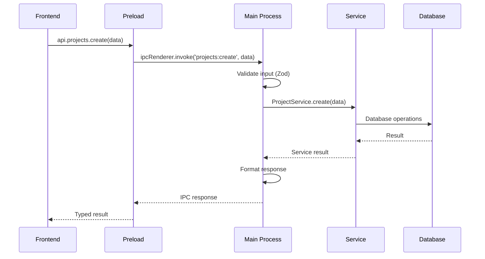

# Project Wiz: API Specification - Comunicação IPC

**Versão:** 3.0  
**Status:** Design Final  
**Data:** 2025-01-17

---

## 🎯 Visão Geral da API

O Project Wiz utiliza **Electron IPC (Inter-Process Communication)** para comunicação entre o frontend (renderer) e backend (main process). A API segue os princípios:

1. **Type-Safe** - Tipagem completa com TypeScript
2. **RESTful-like** - Convenções similares ao REST
3. **Domain-Driven** - Organizadas por domínio de negócio
4. **Consistent** - Padrões consistentes em todas as APIs
5. **Error Handling** - Tratamento robusto de erros
6. **Validation** - Validação com Zod schemas

---

## 🏗️ Arquitetura IPC

### Padrão de Comunicação



### Convenções de Naming

```typescript
// Padrão: {domain}:{action}[:{sub-action}]
"auth:login";
"auth:register";
"projects:create";
"projects:find-by-id";
"projects:update";
"projects:delete";
"agents:create";
"agents:list-global";
"messages:send";
"messages:list-by-channel";
```

---

## 🔐 Auth API

### Endpoints

```typescript
interface AuthAPI {
  login(input: LoginInput): Promise<AuthResponse>;
  register(input: RegisterInput): Promise<AuthResponse>;
  logout(): Promise<void>;
  validateToken(token: string): Promise<User>;
  listAccounts(): Promise<User[]>;
  isFirstRun(): Promise<boolean>;
  createDefaultAccount(): Promise<AuthResponse>;
}
```

### Types

```typescript
// Input Types
interface LoginInput {
  username: string;
  password: string;
}

interface RegisterInput {
  username: string;
  displayName: string;
  password: string;
  email?: string;
}

// Response Types
interface AuthResponse {
  user: User;
  token: string;
}

interface User {
  id: string;
  username: string;
  displayName: string;
  email?: string;
  avatarUrl?: string;
  bio?: string;
  preferences: Record<string, any>;
  isActive: boolean;
  lastLoginAt?: Date;
  createdAt: Date;
  updatedAt: Date;
}
```

### Implementation

```typescript
// Backend Handler
export function setupAuthAPI(): void {
  ipcMain.handle("auth:login", async (_, input: LoginInput) => {
    const validated = LoginSchema.parse(input);
    return await AuthService.login(validated);
  });

  ipcMain.handle("auth:register", async (_, input: RegisterInput) => {
    const validated = RegisterSchema.parse(input);
    return await AuthService.register(validated);
  });

  // ... outros handlers
}

// Frontend Client
export const authAPI: AuthAPI = {
  login: (input) => ipcRenderer.invoke("auth:login", input),
  register: (input) => ipcRenderer.invoke("auth:register", input),
  logout: () => ipcRenderer.invoke("auth:logout"),
  validateToken: (token) => ipcRenderer.invoke("auth:validate-token", token),
  listAccounts: () => ipcRenderer.invoke("auth:list-accounts"),
  isFirstRun: () => ipcRenderer.invoke("auth:is-first-run"),
  createDefaultAccount: () => ipcRenderer.invoke("auth:create-default-account"),
};
```

---

## 📁 Projects API

### Endpoints

```typescript
interface ProjectsAPI {
  create(input: CreateProjectInput): Promise<Project>;
  findById(id: string): Promise<Project | null>;
  findByUser(userId: string): Promise<Project[]>;
  update(id: string, input: UpdateProjectInput): Promise<Project>;
  delete(id: string): Promise<void>;
  archive(id: string): Promise<void>;

  // Git operations
  initializeGit(id: string, gitUrl?: string): Promise<void>;
  cloneRepository(id: string, gitUrl: string): Promise<void>;

  // Agent management
  addAgentAssociation(
    projectId: string,
    agentId: string,
    role?: string,
  ): Promise<void>;
  removeAgentAssociation(projectId: string, agentId: string): Promise<void>;
  listProjectAgents(projectId: string): Promise<ProjectAgent[]>;
}
```

### Types

```typescript
interface CreateProjectInput {
  name: string;
  description?: string;
  gitUrl?: string;
  iconEmoji?: string;
}

interface UpdateProjectInput {
  name?: string;
  description?: string;
  iconEmoji?: string;
  settings?: Record<string, any>;
}

interface Project {
  id: string;
  name: string;
  description?: string;
  gitUrl?: string;
  localPath?: string;
  iconUrl?: string;
  iconEmoji?: string;
  status: "active" | "archived" | "deleted";
  settings: Record<string, any>;
  ownerId: string;
  createdAt: Date;
  updatedAt: Date;
}

interface ProjectAgent {
  projectId: string;
  agentId: string;
  isActive: boolean;
  createdAt: Date;
  updatedAt: Date;
}
```

---

## 🤖 Agents API

### Endpoints

```typescript
interface AgentsAPI {
  create(input: CreateAgentInput): Promise<Agent>;
  findById(id: string): Promise<Agent | null>;
  list(): Promise<Agent[]>;
  update(id: string, input: UpdateAgentInput): Promise<Agent>;
  delete(id: string): Promise<void>;

  // Agent operations
  start(id: string): Promise<void>;
  stop(id: string): Promise<void>;
  getStatus(id: string): Promise<AgentStatus>;

  // Direct messaging, group or from channel
  sendMessage(agentId: string, message: string): Promise<string>;
}
```

### Types

```typescript
interface CreateAgentInput {
  name: string;
  description?: string;
  role: string;
  backstory: string;
  providerModelId?: string;
  temperature?: number;
}

interface UpdateAgentInput {
  name?: string;
  description?: string;
  role?: string;
  backstory?: string;
  providerModelId?: string;
  temperature?: number;
}

interface Agent {
  id: string;
  name: string;
  description?: string;
  role: string;
  backstory: string;
  avatarUrl?: string;
  status: AgentStatus;
  providerModelId: string;
  temperature: number;
  userId: string;
  createdAt: Date;
  updatedAt: Date;
}

type AgentStatus = "online" | "busy" | "offline";
```

---

## 💬 Messages API

### Endpoints

```typescript
interface MessagesAPI {
  send(input: SendMessageInput): Promise<Message>;
  listByChannel(channelId: string, options?: ListOptions): Promise<Message[]>;
  listByDM(conversationId: string, options?: ListOptions): Promise<Message[]>;
  update(id: string, content: string): Promise<Message>;
  delete(id: string): Promise<void>;

  // Real-time features
  subscribe(
    channelId: string,
    callback: (message: Message) => void,
  ): () => void;
  markAsRead(channelId: string): Promise<void>;
}
```

### Types

```typescript
interface SendMessageInput {
  content: string;
  channelId?: string;
  dmConversationId?: string;
  messageType?: MessageType;
  replyToId?: string;
  metadata?: Record<string, any>;
}

interface ListOptions {
  limit?: number;
  offset?: number;
  before?: string;
  after?: string;
}

interface Message {
  id: string;
  conversationId?: string; // implementar conversation, que pode ser do tipo dm, group ou channel
  content: string;
  contentType: "text"; // | "image" | "file" | "code";
  authorId: string;
  authorType: "user" | "agent";
  messageType: MessageType;
  metadata?: Record<string, any>;
  replyToId?: string;
  threadId?: string;
  createdAt: Date;
  updatedAt?: Date;
  deletedAt?: Date;
}

type MessageType = "text" | "system" | "task_result" | "notification";
```

---

## 📺 Channels API

### Endpoints

```typescript
interface ChannelsAPI {
  create(input: CreateChannelInput): Promise<Channel>;
  findById(id: string): Promise<Channel | null>;
  listByProject(projectId: string): Promise<Channel[]>;
  update(id: string, input: UpdateChannelInput): Promise<Channel>;
  delete(id: string): Promise<void>;
  reorder(projectId: string, channelOrders: ChannelOrder[]): Promise<void>;
}
```

### Types

```typescript
interface CreateChannelInput {
  projectId: string;
  name: string;
  description?: string;
  type?: "text";
  position?: number;
}

interface UpdateChannelInput {
  name?: string;
  description?: string;
  position?: number;
}

interface Channel {
  id: string;
  projectId: string;
  name: string;
  description?: string;
  type: "text";
  position: number;
  createdBy: string;
  createdAt: Date;
  updatedAt: Date;
}

interface ChannelOrder {
  id: string;
  position: number;
}
```

---

## 💭 Forum API

### Endpoints

```typescript
interface ForumAPI {
  // Topics
  createTopic(input: CreateTopicInput): Promise<ForumTopic>;
  findTopicById(id: string): Promise<ForumTopic | null>;
  listTopics(
    projectId: string,
    options?: ForumListOptions,
  ): Promise<ForumTopic[]>;
  updateTopic(id: string, input: UpdateTopicInput): Promise<ForumTopic>;
  closeTopic(id: string): Promise<void>;

  // Posts
  createPost(input: CreatePostInput): Promise<ForumPost>;
  listPosts(topicId: string, options?: ListOptions): Promise<ForumPost[]>;
  updatePost(id: string, content: string): Promise<ForumPost>;
  deletePost(id: string): Promise<void>;
}
```

### Types

```typescript
interface CreateTopicInput {
  projectId: string;
  title: string;
  description?: string;
  category?: string;
  tags?: string[];
  priority?: "low" | "medium" | "high" | "urgent";
}

interface UpdateTopicInput {
  title?: string;
  description?: string;
  status?: "open" | "closed" | "resolved";
  tags?: string[];
}

interface CreatePostInput {
  topicId: string;
  content: string;
  contentType?: "markdown" | "code" | "image";
  replyToId?: string;
}

interface ForumTopic {
  id: string;
  projectId: string;
  title: string;
  description?: string;
  status: "open" | "closed" | "resolved";
  priority: "low" | "medium" | "high" | "urgent";
  category?: string;
  tags: string[];
  createdBy: string;
  createdByType: "user" | "agent";
  viewCount: number;
  postCount: number;
  lastActivityAt?: Date;
  createdAt: Date;
  updatedAt: Date;
}

interface ForumPost {
  id: string;
  topicId: string;
  content: string;
  contentType: "markdown" | "code" | "image";
  authorId: string;
  authorType: "user" | "agent";
  replyToId?: string;
  position: number;
  metadata?: Record<string, any>;
  createdAt: Date;
  updatedAt: Date;
  deletedAt?: Date;
}

interface ForumListOptions {
  status?: "open" | "closed" | "resolved";
  category?: string;
  tags?: string[];
  limit?: number;
  offset?: number;
}
```

---

## 📋 Issues API

### Endpoints

```typescript
interface IssuesAPI {
  create(input: CreateIssueInput): Promise<Issue>;
  findById(id: string): Promise<Issue | null>;
  listByProject(
    projectId: string,
    options?: IssueListOptions,
  ): Promise<Issue[]>;
  update(id: string, input: UpdateIssueInput): Promise<Issue>;
  delete(id: string): Promise<void>;

  // Status management
  updateStatus(id: string, status: IssueStatus): Promise<Issue>;
  assignTo(
    id: string,
    assigneeId: string,
    assigneeType: "user" | "agent",
  ): Promise<Issue>;

  // Comments
  addComment(input: AddCommentInput): Promise<IssueComment>;
  listComments(issueId: string): Promise<IssueComment[]>;

  // Activities
  listActivities(issueId: string): Promise<IssueActivity[]>;

  // Git integration
  createBranch(issueId: string): Promise<string>;
  linkCommit(issueId: string, commitHash: string): Promise<void>;
}
```

### Types

```typescript
interface CreateIssueInput {
  projectId: string;
  title: string;
  description?: string;
  type?: IssueType;
  priority?: IssuePriority;
  assigneeId?: string;
  assigneeType?: "user" | "agent";
  labels?: string[];
  estimatedHours?: number;
  dueDate?: Date;
}

interface UpdateIssueInput {
  title?: string;
  description?: string;
  status?: IssueStatus;
  priority?: IssuePriority;
  labels?: string[];
  estimatedHours?: number;
  actualHours?: number;
  dueDate?: Date;
}

interface AddCommentInput {
  issueId: string;
  content: string;
  contentType?: "markdown" | "code";
}

interface Issue {
  id: string;
  projectId: string;
  title: string;
  description?: string;
  status: IssueStatus;
  priority: IssuePriority;
  type: IssueType;
  assigneeId?: string;
  assigneeType?: "user" | "agent";
  estimatedHours?: number;
  actualHours?: number;
  storyPoints?: number;
  labels: string[];
  gitBranch?: string;
  gitCommits: string[];
  pullRequestUrl?: string;
  metadata?: Record<string, any>;
  createdBy: string;
  createdByType: "user" | "agent";
  dueDate?: Date;
  startedAt?: Date;
  completedAt?: Date;
  createdAt: Date;
  updatedAt: Date;
}

type IssueStatus = "todo" | "in_progress" | "review" | "done" | "cancelled";
type IssuePriority = "low" | "medium" | "high" | "urgent";
type IssueType = "task" | "bug" | "feature" | "epic" | "story";

interface IssueListOptions {
  status?: IssueStatus;
  assigneeId?: string;
  labels?: string[];
  type?: IssueType;
  priority?: IssuePriority;
  limit?: number;
  offset?: number;
}
```

---

## 🔧 Git API

### Endpoints

```typescript
interface GitAPI {
  initRepository(projectId: string): Promise<void>;
  cloneRepository(projectId: string, gitUrl: string): Promise<void>;

  // Branch management
  createBranch(projectId: string, branchName: string): Promise<void>;
  switchBranch(projectId: string, branchName: string): Promise<void>;
  listBranches(projectId: string): Promise<GitBranch[]>;

  // Worktree management
  createWorktree(projectId: string, issueId: string): Promise<string>;
  removeWorktree(projectId: string, worktreePath: string): Promise<void>;
  listWorktrees(projectId: string): Promise<GitWorktree[]>;

  // Commit operations
  commit(
    worktreePath: string,
    message: string,
    files?: string[],
  ): Promise<string>;
  push(worktreePath: string, branch?: string): Promise<void>;
  pull(worktreePath: string): Promise<void>;

  // Status and info
  getStatus(projectPath: string): Promise<GitStatus>;
  getCommitHistory(projectPath: string, limit?: number): Promise<GitCommit[]>;
}
```

### Types

```typescript
interface GitBranch {
  name: string;
  isCurrent: boolean;
  lastCommit: string;
  lastCommitDate: Date;
}

interface GitWorktree {
  path: string;
  branch: string;
  issueId?: string;
  isActive: boolean;
}

interface GitStatus {
  branch: string;
  ahead: number;
  behind: number;
  staged: string[];
  unstaged: string[];
  untracked: string[];
}

interface GitCommit {
  hash: string;
  message: string;
  author: string;
  date: Date;
  files: string[];
}
```

---

## 🌐 Preload API Configuration

### Preload Script

```typescript
// src/main/preload.ts
import { contextBridge, ipcRenderer } from "electron";
import type {
  AuthAPI,
  ProjectsAPI,
  AgentsAPI,
  MessagesAPI,
  ChannelsAPI,
  ForumAPI,
  IssuesAPI,
  GitAPI,
} from "../shared/types/api";

const api = {
  auth: {
    login: (input) => ipcRenderer.invoke("auth:login", input),
    register: (input) => ipcRenderer.invoke("auth:register", input),
    // ... outros métodos
  } as AuthAPI,

  projects: {
    create: (input) => ipcRenderer.invoke("projects:create", input),
    findById: (id) => ipcRenderer.invoke("projects:find-by-id", id),
    // ... outros métodos
  } as ProjectsAPI,

  agents: {
    create: (input) => ipcRenderer.invoke("agents:create", input),
    listGlobal: () => ipcRenderer.invoke("agents:list-global"),
    // ... outros métodos
  } as AgentsAPI,

  messages: {
    send: (input) => ipcRenderer.invoke("messages:send", input),
    listByChannel: (id, options) =>
      ipcRenderer.invoke("messages:list-by-channel", id, options),
    // ... outros métodos
  } as MessagesAPI,

  channels: {
    create: (input) => ipcRenderer.invoke("channels:create", input),
    listByProject: (id) => ipcRenderer.invoke("channels:list-by-project", id),
    // ... outros métodos
  } as ChannelsAPI,

  forum: {
    createTopic: (input) => ipcRenderer.invoke("forum:create-topic", input),
    listTopics: (id, options) =>
      ipcRenderer.invoke("forum:list-topics", id, options),
    // ... outros métodos
  } as ForumAPI,

  issues: {
    create: (input) => ipcRenderer.invoke("issues:create", input),
    listByProject: (id, options) =>
      ipcRenderer.invoke("issues:list-by-project", id, options),
    // ... outros métodos
  } as IssuesAPI,

  git: {
    initRepository: (id) => ipcRenderer.invoke("git:init-repository", id),
    createWorktree: (id, issueId) =>
      ipcRenderer.invoke("git:create-worktree", id, issueId),
    // ... outros métodos
  } as GitAPI,
};

contextBridge.exposeInMainWorld("api", api);

declare global {
  interface Window {
    api: typeof api;
  }
}
```

---

## ❌ Error Handling

### Error Types

```typescript
// Base error class
export class APIError extends Error {
  constructor(
    message: string,
    public code: string,
    public statusCode: number = 500,
    public details?: any,
  ) {
    super(message);
    this.name = "APIError";
  }
}

// Specific error types
export class ValidationError extends APIError {
  constructor(message: string, details?: any) {
    super(message, "VALIDATION_ERROR", 400, details);
  }
}

export class NotFoundError extends APIError {
  constructor(resource: string, id: string) {
    super(`${resource} not found: ${id}`, "NOT_FOUND", 404);
  }
}

export class AuthenticationError extends APIError {
  constructor(message: string = "Authentication required") {
    super(message, "AUTHENTICATION_ERROR", 401);
  }
}

export class AuthorizationError extends APIError {
  constructor(message: string = "Insufficient permissions") {
    super(message, "AUTHORIZATION_ERROR", 403);
  }
}
```

### Error Handler Middleware

```typescript
// Global error handler for IPC
export function handleIpcError(error: unknown): never {
  if (error instanceof APIError) {
    throw error;
  }

  if (error instanceof Error) {
    throw new APIError(error.message, "INTERNAL_ERROR", 500);
  }

  throw new APIError("Unknown error occurred", "UNKNOWN_ERROR", 500);
}

// Usage in handlers
ipcMain.handle("projects:create", async (_, input) => {
  try {
    const validated = CreateProjectSchema.parse(input);
    return await ProjectService.create(validated);
  } catch (error) {
    handleIpcError(error);
  }
});
```

### Frontend Error Handling

```typescript
// Error handling no frontend
export async function withErrorHandling<T>(
  apiCall: () => Promise<T>,
): Promise<T> {
  try {
    return await apiCall();
  } catch (error) {
    if (error.code === "AUTHENTICATION_ERROR") {
      // Redirect to login
      authStore.clearAuth();
    } else if (error.code === "VALIDATION_ERROR") {
      // Show validation errors
      toast.error(error.message);
    } else {
      // Generic error handling
      toast.error("An unexpected error occurred");
      console.error(error);
    }
    throw error;
  }
}
```

---

## 🎯 Benefícios da API

### ✅ Type Safety

- **End-to-end typing** com TypeScript
- **Compile-time validation** de interfaces
- **Intellisense completo** no frontend
- **Prevenção** de erros de runtime

### ✅ Consistency

- **Naming conventions** consistentes
- **Response formats** padronizados
- **Error handling** unificado
- **Documentation** sempre atualizada

### ✅ Developer Experience

- **Auto-completion** no IDE
- **Quick navigation** entre definições
- **Refactoring** seguro e automático
- **Testing** facilitado com types

### ✅ Maintainability

- **Single source of truth** para interfaces
- **Versioning** clara das APIs
- **Breaking changes** detectados automaticamente
- **Backwards compatibility** mantida

---

## 📈 Próximos Documentos

1. **BUSINESS-LOGIC.md** - Services e regras de negócio
2. **COMPONENT-LIBRARY.md** - Sistema de design e componentes UI
3. **AGENT-WORKERS.md** - Sistema de agentes background

---

_Esta especificação de API foi projetada para ser type-safe, consistente e developer-friendly, facilitando o desenvolvimento e manutenção do Project Wiz._
