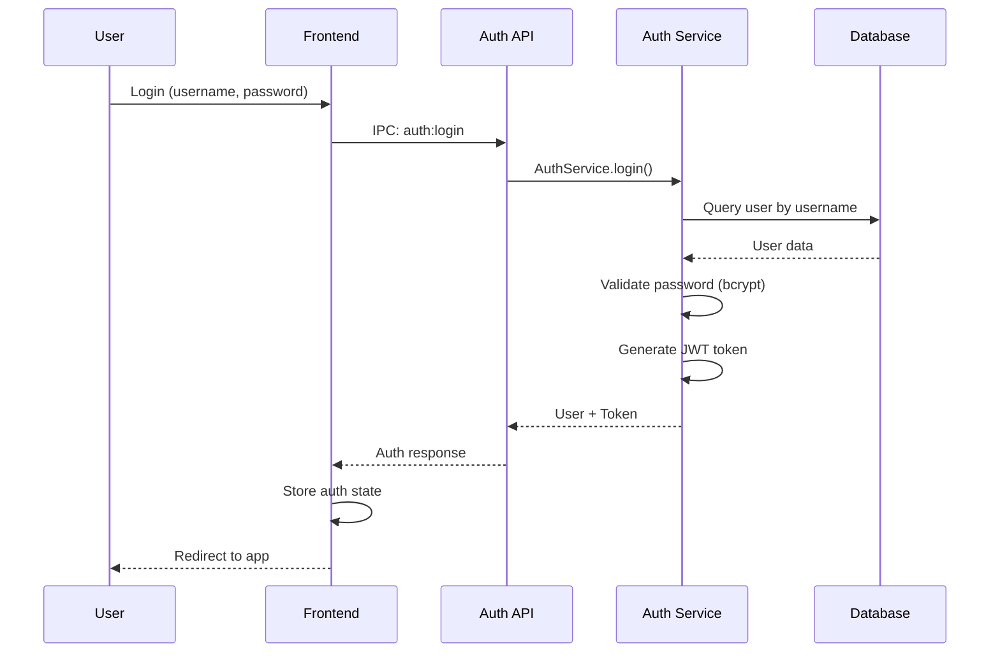

# Project Wiz: Sistema de Autenticação Multi-conta

**Versão:** 3.0  
**Status:** Design Final  
**Data:** 2025-01-17  

---

## 🎯 Visão Geral da Autenticação

O Project Wiz implementa um sistema de **autenticação multi-conta local** que permite:

1. **Múltiplas contas locais** - Usuários podem ter várias contas no mesmo dispositivo
2. **Troca rápida de contas** - Switch entre contas sem logout/login
3. **Dados isolados** - Cada conta tem seus próprios projetos e agentes
4. **Segurança local** - Senhas hasheadas com bcrypt
5. **Tokens JWT locais** - Sessões seguras e stateless
6. **Primeira execução** - Setup automático da primeira conta

---

## 🏗️ Arquitetura de Autenticação

### Fluxo de Autenticação



### Estados de Autenticação

```typescript
type AuthState = 
  | { status: 'loading' }
  | { status: 'unauthenticated' }
  | { status: 'authenticated'; user: User; token: string }
  | { status: 'first-run' } // Primeira execução
  | { status: 'account-selection' } // Múltiplas contas
```

---

## 🔐 Implementação Backend

### Auth Service

```typescript
// src/main/services/auth-service.ts
import bcrypt from 'bcrypt';
import jwt from 'jsonwebtoken';
import { eq } from 'drizzle-orm';
import { db } from '../database/connection';
import { users } from '../database/schema';
import type { LoginInput, RegisterInput, User } from '../../shared/types/auth';

export class AuthService {
  private static readonly JWT_SECRET = 'project-wiz-local-secret';
  private static readonly TOKEN_EXPIRY = '7d';
  
  /**
   * Fazer login com username/password
   */
  static async login(input: LoginInput): Promise<{ user: User; token: string }> {
    const { username, password } = input;
    
    // Buscar usuário
    const user = await db.query.users.findFirst({
      where: eq(users.username, username),
    });
    
    if (!user) {
      throw new AuthError('Invalid username or password');
    }
    
    if (!user.isActive) {
      throw new AuthError('Account is deactivated');
    }
    
    // Validar senha
    const isValidPassword = await bcrypt.compare(password, user.passwordHash);
    if (!isValidPassword) {
      throw new AuthError('Invalid username or password');
    }
    
    // Atualizar último login
    await db.update(users)
      .set({ 
        lastLoginAt: new Date(),
        updatedAt: new Date(),
      })
      .where(eq(users.id, user.id));
    
    // Gerar token JWT
    const token = jwt.sign(
      { userId: user.id, username: user.username },
      this.JWT_SECRET,
      { expiresIn: this.TOKEN_EXPIRY }
    );
    
    // Remover senha do retorno
    const { passwordHash, ...userWithoutPassword } = user;
    
    return {
      user: userWithoutPassword,
      token,
    };
  }
  
  /**
   * Registrar nova conta
   */
  static async register(input: RegisterInput): Promise<{ user: User; token: string }> {
    const { username, email, password, displayName } = input;
    
    // Verificar se username já existe
    const existingUser = await db.query.users.findFirst({
      where: eq(users.username, username),
    });
    
    if (existingUser) {
      throw new AuthError('Username already exists');
    }
    
    // Verificar se email já existe (se fornecido)
    if (email) {
      const existingEmail = await db.query.users.findFirst({
        where: eq(users.email, email),
      });
      
      if (existingEmail) {
        throw new AuthError('Email already exists');
      }
    }
    
    // Hash da senha
    const passwordHash = await bcrypt.hash(password, 12);
    
    // Criar usuário
    const newUser = {
      id: generateId(),
      username,
      email: email || null,
      passwordHash,
      displayName,
      avatarUrl: null,
      bio: null,
      preferences: JSON.stringify({}),
      isActive: true,
      lastLoginAt: new Date(),
      createdAt: new Date(),
      updatedAt: new Date(),
    };
    
    await db.insert(users).values(newUser);
    
    // Gerar token
    const token = jwt.sign(
      { userId: newUser.id, username: newUser.username },
      this.JWT_SECRET,
      { expiresIn: this.TOKEN_EXPIRY }
    );
    
    // Remover senha do retorno
    const { passwordHash: _, ...userWithoutPassword } = newUser;
    
    return {
      user: userWithoutPassword,
      token,
    };
  }
  
  /**
   * Validar token JWT
   */
  static async validateToken(token: string): Promise<User> {
    try {
      const decoded = jwt.verify(token, this.JWT_SECRET) as { userId: string };
      
      const user = await db.query.users.findFirst({
        where: eq(users.id, decoded.userId),
      });
      
      if (!user || !user.isActive) {
        throw new AuthError('Invalid token');
      }
      
      const { passwordHash, ...userWithoutPassword } = user;
      return userWithoutPassword;
    } catch (error) {
      throw new AuthError('Invalid token');
    }
  }
  
  /**
   * Listar todas as contas locais
   */
  static async listAccounts(): Promise<User[]> {
    const allUsers = await db.query.users.findMany({
      where: eq(users.isActive, true),
      columns: {
        id: true,
        username: true,
        displayName: true,
        avatarUrl: true,
        lastLoginAt: true,
      },
    });
    
    return allUsers;
  }
  
  /**
   * Verificar se é primeira execução
   */
  static async isFirstRun(): Promise<boolean> {
    const userCount = await db.select({ count: count() })
      .from(users)
      .where(eq(users.isActive, true));
    
    return userCount[0].count === 0;
  }
  
  /**
   * Criar conta padrão (primeira execução)
   */
  static async createDefaultAccount(): Promise<{ user: User; token: string }> {
    return this.register({
      username: 'user',
      displayName: 'User',
      password: 'password',
    });
  }
  
  /**
   * Logout (invalidar token localmente)
   */
  static async logout(): Promise<void> {
    // No sistema local, logout é feito no frontend removendo o token
    // Aqui podemos adicionar logs ou cleanup se necessário
  }
}

export class AuthError extends Error {
  constructor(message: string) {
    super(message);
    this.name = 'AuthError';
  }
}
```

### Auth API Handler

```typescript
// src/main/api/auth-api.ts
import { ipcMain } from 'electron';
import { AuthService } from '../services/auth-service';
import type { LoginInput, RegisterInput } from '../../shared/types/auth';

export function setupAuthAPI(): void {
  // Login
  ipcMain.handle('auth:login', async (_, input: LoginInput) => {
    return await AuthService.login(input);
  });
  
  // Register
  ipcMain.handle('auth:register', async (_, input: RegisterInput) => {
    return await AuthService.register(input);
  });
  
  // Validate token
  ipcMain.handle('auth:validate-token', async (_, token: string) => {
    return await AuthService.validateToken(token);
  });
  
  // List accounts
  ipcMain.handle('auth:list-accounts', async () => {
    return await AuthService.listAccounts();
  });
  
  // Check first run
  ipcMain.handle('auth:is-first-run', async () => {
    return await AuthService.isFirstRun();
  });
  
  // Create default account
  ipcMain.handle('auth:create-default-account', async () => {
    return await AuthService.createDefaultAccount();
  });
  
  // Logout
  ipcMain.handle('auth:logout', async () => {
    return await AuthService.logout();
  });
}
```

---

## 🎨 Implementação Frontend

### Auth Store (Zustand)

```typescript
// src/renderer/store/auth-store.ts
import { create } from 'zustand';
import { persist } from 'zustand/middleware';
import type { User } from '../../shared/types/auth';

interface AuthState {
  status: 'loading' | 'unauthenticated' | 'authenticated' | 'first-run' | 'account-selection';
  user: User | null;
  token: string | null;
  availableAccounts: User[];
  
  // Actions
  setAuth: (user: User, token: string) => void;
  clearAuth: () => void;
  setStatus: (status: AuthState['status']) => void;
  setAvailableAccounts: (accounts: User[]) => void;
  
  // Async actions
  login: (username: string, password: string) => Promise<void>;
  register: (username: string, displayName: string, password: string, email?: string) => Promise<void>;
  logout: () => Promise<void>;
  switchAccount: (userId: string) => Promise<void>;
  checkAuth: () => Promise<void>;
}

export const useAuthStore = create<AuthState>()(
  persist(
    (set, get) => ({
      status: 'loading',
      user: null,
      token: null,
      availableAccounts: [],
      
      setAuth: (user, token) => {
        set({ user, token, status: 'authenticated' });
      },
      
      clearAuth: () => {
        set({ user: null, token: null, status: 'unauthenticated' });
      },
      
      setStatus: (status) => {
        set({ status });
      },
      
      setAvailableAccounts: (accounts) => {
        set({ availableAccounts: accounts });
      },
      
      login: async (username, password) => {
        try {
          const response = await window.api.auth.login({ username, password });
          get().setAuth(response.user, response.token);
        } catch (error) {
          throw new Error(error.message || 'Login failed');
        }
      },
      
      register: async (username, displayName, password, email) => {
        try {
          const response = await window.api.auth.register({
            username,
            displayName,
            password,
            email,
          });
          get().setAuth(response.user, response.token);
        } catch (error) {
          throw new Error(error.message || 'Registration failed');
        }
      },
      
      logout: async () => {
        try {
          await window.api.auth.logout();
          get().clearAuth();
          
          // Verificar se há outras contas
          const accounts = await window.api.auth.listAccounts();
          if (accounts.length > 0) {
            get().setAvailableAccounts(accounts);
            get().setStatus('account-selection');
          } else {
            get().setStatus('unauthenticated');
          }
        } catch (error) {
          console.error('Logout failed:', error);
          get().clearAuth();
        }
      },
      
      switchAccount: async (userId) => {
        const account = get().availableAccounts.find(acc => acc.id === userId);
        if (account) {
          // Para trocar conta, precisamos fazer login novamente
          // Isso poderia ser otimizado com refresh tokens no futuro
          get().clearAuth();
          get().setStatus('unauthenticated');
        }
      },
      
      checkAuth: async () => {
        const { token } = get();
        
        try {
          // Verificar se é primeira execução
          const isFirstRun = await window.api.auth.isFirstRun();
          if (isFirstRun) {
            get().setStatus('first-run');
            return;
          }
          
          // Verificar se há token válido
          if (token) {
            const user = await window.api.auth.validateToken(token);
            get().setAuth(user, token);
            return;
          }
          
          // Verificar contas disponíveis
          const accounts = await window.api.auth.listAccounts();
          if (accounts.length > 1) {
            get().setAvailableAccounts(accounts);
            get().setStatus('account-selection');
          } else {
            get().setStatus('unauthenticated');
          }
        } catch (error) {
          console.error('Auth check failed:', error);
          get().clearAuth();
          
          // Fallback para verificar contas
          try {
            const accounts = await window.api.auth.listAccounts();
            if (accounts.length > 0) {
              get().setAvailableAccounts(accounts);
              get().setStatus('account-selection');
            } else {
              get().setStatus('unauthenticated');
            }
          } catch {
            get().setStatus('unauthenticated');
          }
        }
      },
    }),
    {
      name: 'project-wiz-auth',
      partialize: (state) => ({
        token: state.token,
        user: state.user,
      }),
    }
  )
);
```

### Auth Hook

```typescript
// src/renderer/hooks/use-auth.ts
import { useEffect } from 'react';
import { useAuthStore } from '../store/auth-store';

export function useAuth() {
  const authStore = useAuthStore();
  
  useEffect(() => {
    authStore.checkAuth();
  }, []);
  
  return {
    ...authStore,
    isAuthenticated: authStore.status === 'authenticated',
    isLoading: authStore.status === 'loading',
    isFirstRun: authStore.status === 'first-run',
    needsAccountSelection: authStore.status === 'account-selection',
  };
}
```

### Componentes de Autenticação

```typescript
// src/renderer/components/auth/login-form.tsx
import { useState } from 'react';
import { useAuth } from '../../hooks/use-auth';
import { Button } from '../ui/button';
import { Input } from '../ui/input';
import { Card, CardContent, CardHeader, CardTitle } from '../ui/card';

export function LoginForm() {
  const [username, setUsername] = useState('');
  const [password, setPassword] = useState('');
  const [isLoading, setIsLoading] = useState(false);
  const [error, setError] = useState('');
  
  const { login } = useAuth();
  
  const handleSubmit = async (e: React.FormEvent) => {
    e.preventDefault();
    setIsLoading(true);
    setError('');
    
    try {
      await login(username, password);
    } catch (error) {
      setError(error.message);
    } finally {
      setIsLoading(false);
    }
  };
  
  return (
    <Card className="w-full max-w-md mx-auto">
      <CardHeader>
        <CardTitle>Login to Project Wiz</CardTitle>
      </CardHeader>
      <CardContent>
        <form onSubmit={handleSubmit} className="space-y-4">
          <div>
            <Input
              type="text"
              placeholder="Username"
              value={username}
              onChange={(e) => setUsername(e.target.value)}
              required
            />
          </div>
          <div>
            <Input
              type="password"
              placeholder="Password"
              value={password}
              onChange={(e) => setPassword(e.target.value)}
              required
            />
          </div>
          {error && (
            <div className="text-red-500 text-sm">{error}</div>
          )}
          <Button 
            type="submit" 
            className="w-full" 
            disabled={isLoading}
          >
            {isLoading ? 'Logging in...' : 'Login'}
          </Button>
        </form>
      </CardContent>
    </Card>
  );
}

// src/renderer/components/auth/account-switcher.tsx
import { useAuth } from '../../hooks/use-auth';
import { Button } from '../ui/button';
import { Card, CardContent, CardHeader, CardTitle } from '../ui/card';

export function AccountSwitcher() {
  const { availableAccounts, login, logout } = useAuth();
  
  return (
    <Card className="w-full max-w-md mx-auto">
      <CardHeader>
        <CardTitle>Select Account</CardTitle>
      </CardHeader>
      <CardContent className="space-y-4">
        {availableAccounts.map((account) => (
          <Button
            key={account.id}
            variant="outline"
            className="w-full justify-start"
            onClick={() => {
              // Redirecionar para login com username preenchido
              // ou implementar switch direto se tivermos refresh tokens
            }}
          >
            <div className="flex items-center gap-3">
              {account.avatarUrl ? (
                
              ) : (
                <div className="w-8 h-8 bg-gray-300 rounded-full flex items-center justify-center">
                  {account.displayName[0].toUpperCase()}
                </div>
              )}
              <div className="text-left">
                <div className="font-medium">{account.displayName}</div>
                <div className="text-sm text-gray-500">@{account.username}</div>
              </div>
            </div>
          </Button>
        ))}
        
        <hr />
        
        <Button variant="ghost" className="w-full">
          Add Another Account
        </Button>
      </CardContent>
    </Card>
  );
}
```

---

## 🛡️ Segurança

### Práticas de Segurança

1. **Hash de Senhas**
   - bcrypt com salt rounds = 12
   - Senhas nunca armazenadas em plain text
   - Validação segura com compare()

2. **JWT Tokens**
   - Tokens locais com expiração
   - Secret seguro para assinatura
   - Payload mínimo (userId, username)

3. **Validação de Input**
   - Sanitização de dados de entrada
   - Validação de força de senha
   - Prevenção de username/email duplicados

4. **Armazenamento Seguro**
   - Tokens persistidos com Zustand
   - Dados sensíveis não expostos ao renderer
   - Cleanup automático em logout

### Considerações de Segurança

```typescript
// Exemplo de validação de senha forte
export function validatePassword(password: string): string[] {
  const errors: string[] = [];
  
  if (password.length < 8) {
    errors.push('Password must be at least 8 characters');
  }
  
  if (!/[A-Z]/.test(password)) {
    errors.push('Password must contain uppercase letter');
  }
  
  if (!/[a-z]/.test(password)) {
    errors.push('Password must contain lowercase letter');
  }
  
  if (!/[0-9]/.test(password)) {
    errors.push('Password must contain number');
  }
  
  return errors;
}
```

---

## 🔄 Fluxos de Autenticação

### 1. Primeira Execução

```
App Start → Check if first run → Show setup → Create default account → Login
```

### 2. Login Normal

```
App Start → Check auth → Show login → Validate → Set auth state → Redirect to app
```

### 3. Múltiplas Contas

```
App Start → Check accounts → Show account selector → Select account → Login
```

### 4. Troca de Conta

```
Logged in → Account menu → Logout → Account selector → Select different account
```

---

## 📱 Estados da Interface

### Loading State
- Verificando autenticação
- Validando token
- Carregando contas

### First Run State
- Setup inicial
- Criação da primeira conta
- Onboarding

### Login State
- Form de login
- Validação de credenciais
- Handling de erros

### Account Selection State
- Lista de contas disponíveis
- Opção de adicionar nova conta
- Switch entre contas

### Authenticated State
- App principal
- Menu de conta
- Opção de logout

---

## 🎯 Benefícios da Implementação

### ✅ User Experience
- **Login único** por sessão
- **Troca rápida** entre contas
- **Setup simples** na primeira execução
- **Dados isolados** por conta

### ✅ Segurança
- **Senhas hasheadas** com bcrypt
- **Tokens JWT** seguros
- **Validação robusta** de entrada
- **Isolamento** de dados

### ✅ Flexibilidade
- **Múltiplas contas** no mesmo dispositivo
- **Extensível** para features futuras
- **Local-first** approach
- **Sem dependências externas**

### ✅ Desenvolvimento
- **Type-safe** com TypeScript
- **Estado centralizado** com Zustand
- **API limpa** para IPC
- **Testável** e manutenível

---

## 📈 Próximos Documentos

1. **API-SPECIFICATION.md** - Especificação completa das APIs IPC
2. **COMPONENT-LIBRARY.md** - Sistema de design e componentes
3. **BUSINESS-LOGIC.md** - Services e regras de negócio

---

*Este sistema de autenticação foi projetado para ser seguro, flexível e user-friendly, atendendo às necessidades do Project Wiz como aplicação desktop local.*