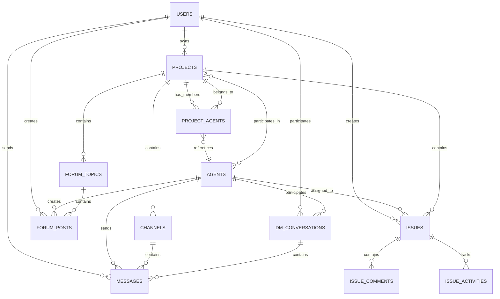

# Project Wiz: Database Schema com Drizzle ORM

**Versão:** 3.0  
**Status:** Design Final  
**Data:** 2025-01-17  

---

## 🎯 Visão Geral do Schema

O Project Wiz utiliza **SQLite + Drizzle ORM** para persistência de dados. O schema foi projetado para suportar:

1. **Multi-tenancy local** - Múltiplas contas de usuário
2. **Agentes globais por usuário** - IA workers independentes de projetos, mas por usuário
3. **Projetos como servidores** - Estrutura similar ao Discord
4. **Chat em tempo real** - Mensagens persistentes
5. **Fóruns estruturados** - Discussões organizadas
6. **Sistema de issues** - Gestão de tarefas
7. **Relacionamentos Git** - Tracking de branches e worktrees

---

## 📊 Diagrama de Relacionamentos



---

## 🗄️ Schemas Completos

### 1. Users Schema

```typescript
// src/main/database/schema/users.schema.ts
import { sqliteTable, text, integer } from 'drizzle-orm/sqlite-core';

export const users = sqliteTable('users', {
  id: text('id').primaryKey(),
  username: text('username').notNull().unique(),
  email: text('email').unique(),
  passwordHash: text('password_hash').notNull(),
  displayName: text('display_name').notNull(),
  avatarUrl: text('avatar_url'),
  bio: text('bio'),
  preferences: text('preferences'), // JSON: { theme, notifications, etc. }
  isActive: integer('is_active', { mode: 'boolean' }).default(true),
  lastLoginAt: integer('last_login_at', { mode: 'timestamp' }),
  createdAt: integer('created_at', { mode: 'timestamp' }).notNull(),
  updatedAt: integer('updated_at', { mode: 'timestamp' }).notNull(),
});

export type User = typeof users.$inferSelect;
export type NewUser = typeof users.$inferInsert;
```

### 2. Agents Schema

```typescript
// src/main/database/schema/agents.schema.ts
import { sqliteTable, text, integer } from 'drizzle-orm/sqlite-core';
import { users } from './users.schema';

export const agents = sqliteTable('agents', {
  id: text('id').primaryKey(),
  name: text('name').notNull(),
  description: text('description'),
  role: text('role').notNull(), // 'developer', 'designer', 'tester', 'architect', 'pm'
  expertise: text('expertise'), // JSON array: ['frontend', 'react', 'typescript']
  personality: text('personality'), // JSON: { tone, communication_style, etc. }
  systemPrompt: text('system_prompt').notNull(), // LLM system prompt
  avatarUrl: text('avatar_url'),
  status: text('status').notNull().default('online'), // 'online', 'busy', 'offline'
  isGlobal: integer('is_global', { mode: 'boolean' }).default(true),
  llmProvider: text('llm_provider').default('deepseek'), // 'openai', 'deepseek'
  llmModel: text('llm_model').default('deepseek-chat'),
  temperature: real('temperature').default(0.7),
  maxTokens: integer('max_tokens').default(4000),
  createdBy: text('created_by').notNull().references(() => users.id),
  createdAt: integer('created_at', { mode: 'timestamp' }).notNull(),
  updatedAt: integer('updated_at', { mode: 'timestamp' }).notNull(),
});

export type Agent = typeof agents.$inferSelect;
export type NewAgent = typeof agents.$inferInsert;
```

### 3. Projects Schema

```typescript
// src/main/database/schema/projects.schema.ts
import { sqliteTable, text, integer } from 'drizzle-orm/sqlite-core';
import { users } from './users.schema';

export const projects = sqliteTable('projects', {
  id: text('id').primaryKey(),
  name: text('name').notNull(),
  description: text('description'),
  gitUrl: text('git_url'), // URL do repositório remoto
  localPath: text('local_path'), // Caminho local do repositório
  iconUrl: text('icon_url'),
  iconEmoji: text('icon_emoji'), // Emoji como ícone alternativo
  visibility: text('visibility').default('private'), // 'private', 'internal'
  status: text('status').default('active'), // 'active', 'archived', 'deleted'
  settings: text('settings'), // JSON: { auto_agent_hiring, notifications, etc. }
  ownerId: text('owner_id').notNull().references(() => users.id),
  createdAt: integer('created_at', { mode: 'timestamp' }).notNull(),
  updatedAt: integer('updated_at', { mode: 'timestamp' }).notNull(),
});

export type Project = typeof projects.$inferSelect;
export type NewProject = typeof projects.$inferInsert;
```

### 4. Channels Schema

```typescript
// src/main/database/schema/channels.schema.ts
import { sqliteTable, text, integer } from 'drizzle-orm/sqlite-core';
import { projects } from './projects.schema';
import { users } from './users.schema';

export const channels = sqliteTable('channels', {
  id: text('id').primaryKey(),
  projectId: text('project_id').notNull().references(() => projects.id, { onDelete: 'cascade' }),
  name: text('name').notNull(),
  description: text('description'),
  type: text('type').notNull().default('text'), // 'text' (futuro: 'voice')
  position: integer('position').default(0), // Ordem na sidebar
  isPrivate: integer('is_private', { mode: 'boolean' }).default(false),
  permissions: text('permissions'), // JSON: roles e permissões
  createdBy: text('created_by').notNull().references(() => users.id),
  createdAt: integer('created_at', { mode: 'timestamp' }).notNull(),
  updatedAt: integer('updated_at', { mode: 'timestamp' }).notNull(),
});

export type Channel = typeof channels.$inferSelect;
export type NewChannel = typeof channels.$inferInsert;
```

### 5. Messages Schema

```typescript
// src/main/database/schema/messages.schema.ts
import { sqliteTable, text, integer } from 'drizzle-orm/sqlite-core';
import { channels } from './channels.schema';
import { users } from './users.schema';
import { agents } from './agents.schema';

export const messages = sqliteTable('messages', {
  id: text('id').primaryKey(),
  // Channel message ou DM
  channelId: text('channel_id').references(() => channels.id, { onDelete: 'cascade' }),
  dmConversationId: text('dm_conversation_id').references(() => dmConversations.id, { onDelete: 'cascade' }),
  
  content: text('content').notNull(),
  contentType: text('content_type').default('text'), // 'text', 'image', 'file', 'code'
  
  // Author pode ser user ou agent
  authorId: text('author_id').notNull(),
  authorType: text('author_type').notNull(), // 'user', 'agent'
  
  // Tipo de mensagem
  messageType: text('message_type').default('text'), // 'text', 'system', 'task_result', 'notification'
  
  // Metadata adicional
  metadata: text('metadata'), // JSON: { mentions, attachments, reactions, etc. }
  
  // Thread/Reply support
  replyToId: text('reply_to_id').references(() => messages.id),
  threadId: text('thread_id'), // Para agrupar respostas
  
  // Timestamps
  createdAt: integer('created_at', { mode: 'timestamp' }).notNull(),
  updatedAt: integer('updated_at', { mode: 'timestamp' }),
  deletedAt: integer('deleted_at', { mode: 'timestamp' }),
});

export type Message = typeof messages.$inferSelect;
export type NewMessage = typeof messages.$inferInsert;
```

### 6. DM Conversations Schema

```typescript
// src/main/database/schema/dm-conversations.schema.ts
import { sqliteTable, text, integer } from 'drizzle-orm/sqlite-core';
import { users } from './users.schema';
import { agents } from './agents.schema';

export const dmConversations = sqliteTable('dm_conversations', {
  id: text('id').primaryKey(),
  userId: text('user_id').notNull().references(() => users.id, { onDelete: 'cascade' }),
  agentId: text('agent_id').notNull().references(() => agents.id, { onDelete: 'cascade' }),
  
  // Estado da conversa
  isActive: integer('is_active', { mode: 'boolean' }).default(true),
  isPinned: integer('is_pinned', { mode: 'boolean' }).default(false),
  
  // Tracking
  lastMessageAt: integer('last_message_at', { mode: 'timestamp' }),
  lastReadAt: integer('last_read_at', { mode: 'timestamp' }),
  unreadCount: integer('unread_count').default(0),
  
  createdAt: integer('created_at', { mode: 'timestamp' }).notNull(),
  updatedAt: integer('updated_at', { mode: 'timestamp' }).notNull(),
});

export type DmConversation = typeof dmConversations.$inferSelect;
export type NewDmConversation = typeof dmConversations.$inferInsert;

// Import no messages schema
import { dmConversations } from './dm-conversations.schema';
```

### 7. Forum Schema

```typescript
// src/main/database/schema/forum.schema.ts
import { sqliteTable, text, integer } from 'drizzle-orm/sqlite-core';
import { projects } from './projects.schema';
import { users } from './users.schema';
import { agents } from './agents.schema';

export const forumTopics = sqliteTable('forum_topics', {
  id: text('id').primaryKey(),
  projectId: text('project_id').notNull().references(() => projects.id, { onDelete: 'cascade' }),
  
  title: text('title').notNull(),
  description: text('description'),
  
  // Status e metadata
  status: text('status').default('open'), // 'open', 'closed', 'resolved'
  priority: text('priority').default('medium'), // 'low', 'medium', 'high', 'urgent'
  category: text('category'), // 'discussion', 'decision', 'brainstorm', 'review'
  tags: text('tags'), // JSON array: ['frontend', 'architecture', 'bug']
  
  // Author
  createdBy: text('created_by').notNull(),
  createdByType: text('created_by_type').notNull(), // 'user', 'agent'
  
  // Tracking
  viewCount: integer('view_count').default(0),
  postCount: integer('post_count').default(0),
  lastActivityAt: integer('last_activity_at', { mode: 'timestamp' }),
  
  createdAt: integer('created_at', { mode: 'timestamp' }).notNull(),
  updatedAt: integer('updated_at', { mode: 'timestamp' }).notNull(),
});

export const forumPosts = sqliteTable('forum_posts', {
  id: text('id').primaryKey(),
  topicId: text('topic_id').notNull().references(() => forumTopics.id, { onDelete: 'cascade' }),
  
  content: text('content').notNull(),
  contentType: text('content_type').default('markdown'), // 'markdown', 'code', 'image'
  
  // Author
  authorId: text('author_id').notNull(),
  authorType: text('author_type').notNull(), // 'user', 'agent'
  
  // Thread support
  replyToId: text('reply_to_id').references(() => forumPosts.id),
  position: integer('position').default(0), // Ordem no tópico
  
  // Metadata
  metadata: text('metadata'), // JSON: { attachments, mentions, votes, etc. }
  
  createdAt: integer('created_at', { mode: 'timestamp' }).notNull(),
  updatedAt: integer('updated_at', { mode: 'timestamp' }).notNull(),
  deletedAt: integer('deleted_at', { mode: 'timestamp' }),
});

export type ForumTopic = typeof forumTopics.$inferSelect;
export type NewForumTopic = typeof forumTopics.$inferInsert;
export type ForumPost = typeof forumPosts.$inferSelect;
export type NewForumPost = typeof forumPosts.$inferInsert;
```

### 8. Issues Schema

```typescript
// src/main/database/schema/issues.schema.ts
import { sqliteTable, text, integer, real } from 'drizzle-orm/sqlite-core';
import { projects } from './projects.schema';
import { users } from './users.schema';
import { agents } from './agents.schema';

export const issues = sqliteTable('issues', {
  id: text('id').primaryKey(),
  projectId: text('project_id').notNull().references(() => projects.id, { onDelete: 'cascade' }),
  
  // Informações básicas
  title: text('title').notNull(),
  description: text('description'),
  
  // Status e tipo
  status: text('status').notNull().default('todo'), // 'todo', 'in_progress', 'review', 'done', 'cancelled'
  priority: text('priority').default('medium'), // 'low', 'medium', 'high', 'urgent'
  type: text('type').default('task'), // 'task', 'bug', 'feature', 'epic', 'story'
  
  // Atribuição
  assigneeId: text('assignee_id'), // Pode ser user_id ou agent_id
  assigneeType: text('assignee_type'), // 'user', 'agent'
  
  // Estimativas e tracking
  estimatedHours: real('estimated_hours'),
  actualHours: real('actual_hours'),
  storyPoints: integer('story_points'),
  
  // Labels e categorização
  labels: text('labels'), // JSON array: ['frontend', 'urgent', 'bug']
  
  // Git integration
  gitBranch: text('git_branch'), // Branch criada para esta issue
  gitCommits: text('git_commits'), // JSON array de commit hashes
  pullRequestUrl: text('pull_request_url'),
  
  // Metadata
  metadata: text('metadata'), // JSON: { attachments, checklists, etc. }
  
  // Tracking
  createdBy: text('created_by').notNull(),
  createdByType: text('created_by_type').notNull(), // 'user', 'agent'
  
  // Timestamps
  dueDate: integer('due_date', { mode: 'timestamp' }),
  startedAt: integer('started_at', { mode: 'timestamp' }),
  completedAt: integer('completed_at', { mode: 'timestamp' }),
  createdAt: integer('created_at', { mode: 'timestamp' }).notNull(),
  updatedAt: integer('updated_at', { mode: 'timestamp' }).notNull(),
});

export const issueComments = sqliteTable('issue_comments', {
  id: text('id').primaryKey(),
  issueId: text('issue_id').notNull().references(() => issues.id, { onDelete: 'cascade' }),
  
  content: text('content').notNull(),
  contentType: text('content_type').default('markdown'),
  
  // Author
  authorId: text('author_id').notNull(),
  authorType: text('author_type').notNull(), // 'user', 'agent'
  
  createdAt: integer('created_at', { mode: 'timestamp' }).notNull(),
  updatedAt: integer('updated_at', { mode: 'timestamp' }).notNull(),
  deletedAt: integer('deleted_at', { mode: 'timestamp' }),
});

export const issueActivities = sqliteTable('issue_activities', {
  id: text('id').primaryKey(),
  issueId: text('issue_id').notNull().references(() => issues.id, { onDelete: 'cascade' }),
  
  activityType: text('activity_type').notNull(), // 'status_change', 'assignment', 'comment', 'git_commit'
  description: text('description').notNull(), // "Status changed from 'todo' to 'in_progress'"
  
  // Mudanças
  oldValue: text('old_value'),
  newValue: text('new_value'),
  
  // Actor
  actorId: text('actor_id').notNull(),
  actorType: text('actor_type').notNull(), // 'user', 'agent', 'system'
  
  metadata: text('metadata'), // JSON com dados específicos da atividade
  
  createdAt: integer('created_at', { mode: 'timestamp' }).notNull(),
});

export type Issue = typeof issues.$inferSelect;
export type NewIssue = typeof issues.$inferInsert;
export type IssueComment = typeof issueComments.$inferSelect;
export type NewIssueComment = typeof issueComments.$inferInsert;
export type IssueActivity = typeof issueActivities.$inferSelect;
export type NewIssueActivity = typeof issueActivities.$inferInsert;
```

### 9. Relacionamentos (Junction Tables)

```typescript
// src/main/database/schema/relationships.schema.ts
import { sqliteTable, text, integer, primaryKey } from 'drizzle-orm/sqlite-core';
import { projects } from './projects.schema';
import { agents } from './agents.schema';
import { users } from './users.schema';

export const projectAgents = sqliteTable('project_agents', {
  projectId: text('project_id').notNull().references(() => projects.id, { onDelete: 'cascade' }),
  agentId: text('agent_id').notNull().references(() => agents.id, { onDelete: 'cascade' }),
  
  role: text('role'), // 'developer', 'reviewer', 'tester', 'lead'
  permissions: text('permissions'), // JSON array: ['read', 'write', 'admin']
  isActive: integer('is_active', { mode: 'boolean' }).default(true),
  
  addedBy: text('added_by').notNull().references(() => users.id),
  addedAt: integer('added_at', { mode: 'timestamp' }).notNull(),
  removedAt: integer('removed_at', { mode: 'timestamp' }),
}, (table) => ({
  pk: primaryKey({ columns: [table.projectId, table.agentId] }),
}));

export const projectUsers = sqliteTable('project_users', {
  projectId: text('project_id').notNull().references(() => projects.id, { onDelete: 'cascade' }),
  userId: text('user_id').notNull().references(() => users.id, { onDelete: 'cascade' }),
  
  role: text('role').default('member'), // 'owner', 'admin', 'member', 'viewer'
  permissions: text('permissions'), // JSON array
  
  joinedAt: integer('joined_at', { mode: 'timestamp' }).notNull(),
  leftAt: integer('left_at', { mode: 'timestamp' }),
}, (table) => ({
  pk: primaryKey({ columns: [table.projectId, table.userId] }),
}));

export type ProjectAgent = typeof projectAgents.$inferSelect;
export type NewProjectAgent = typeof projectAgents.$inferInsert;
export type ProjectUser = typeof projectUsers.$inferSelect;
export type NewProjectUser = typeof projectUsers.$inferInsert;
```

---

## 🔧 Configuração Drizzle

### drizzle.config.ts

```typescript
import type { Config } from 'drizzle-kit';

export default {
  schema: './src/main/database/schema/*.ts',
  out: './src/main/database/migrations',
  driver: 'sqlite',
  dbCredentials: {
    url: './project-wiz.db',
  },
  verbose: true,
  strict: true,
} satisfies Config;
```

### Database Connection

```typescript
// src/main/database/connection.ts
import { drizzle } from 'drizzle-orm/better-sqlite3';
import Database from 'better-sqlite3';
import * as schema from './schema';

const sqlite = new Database('./project-wiz.db');
sqlite.pragma('journal_mode = WAL');
sqlite.pragma('foreign_keys = ON');

export const db = drizzle(sqlite, { schema });

export type DatabaseType = typeof db;
```

### Index Schema Consolidado

```typescript
// src/main/database/schema/index.ts
export * from './users.schema';
export * from './agents.schema';
export * from './projects.schema';
export * from './channels.schema';
export * from './messages.schema';
export * from './dm-conversations.schema';
export * from './forum.schema';
export * from './issues.schema';
export * from './relationships.schema';

// Relations (para queries)
import { relations } from 'drizzle-orm';
import { 
  users, agents, projects, channels, messages, 
  dmConversations, forumTopics, forumPosts, 
  issues, issueComments, projectAgents 
} from './';

export const usersRelations = relations(users, ({ many }) => ({
  ownedProjects: many(projects),
  messages: many(messages),
  dmConversations: many(dmConversations),
}));

export const projectsRelations = relations(projects, ({ one, many }) => ({
  owner: one(users, {
    fields: [projects.ownerId],
    references: [users.id],
  }),
  channels: many(channels),
  issues: many(issues),
  forumTopics: many(forumTopics),
  agents: many(projectAgents),
}));

export const agentsRelations = relations(agents, ({ one, many }) => ({
  creator: one(users, {
    fields: [agents.createdBy],
    references: [users.id],
  }),
  messages: many(messages),
  projects: many(projectAgents),
  dmConversations: many(dmConversations),
}));

// ... outras relations
```

---

## 📋 Queries Comuns

### Buscar Projeto com Agentes

```typescript
const projectWithAgents = await db.query.projects.findFirst({
  where: eq(projects.id, projectId),
  with: {
    agents: {
      with: {
        agent: true,
      },
    },
    channels: true,
  },
});
```

### Buscar Mensagens de Canal

```typescript
const channelMessages = await db.query.messages.findMany({
  where: eq(messages.channelId, channelId),
  orderBy: [asc(messages.createdAt)],
  limit: 50,
});
```

### Buscar DMs de Usuário

```typescript
const userDMs = await db.query.dmConversations.findMany({
  where: eq(dmConversations.userId, userId),
  with: {
    agent: true,
  },
  orderBy: [desc(dmConversations.lastMessageAt)],
});
```

---

## 🚀 Migrações

### Script de Migração

```typescript
// src/main/database/migrate.ts
import { migrate } from 'drizzle-orm/better-sqlite3/migrator';
import { db } from './connection';

export async function runMigrations() {
  try {
    await migrate(db, { migrationsFolder: './src/main/database/migrations' });
    console.log('Migrations completed successfully');
  } catch (error) {
    console.error('Migration failed:', error);
    throw error;
  }
}
```

### Comandos de Migração

```bash
# Gerar migração
npm run db:generate

# Aplicar migrações
npm run db:migrate

# Reset database (desenvolvimento)
npm run db:reset

# Visualizar dados
npm run db:studio
```

---

## 🎯 Benefícios do Schema

### ✅ Type Safety
- **Inferência automática** de tipos TypeScript
- **Validação em tempo de compilação**
- **Intellisense completo** para queries

### ✅ Performance
- **Índices otimizados** para queries comuns
- **WAL mode** para melhor concorrência
- **Foreign keys** para integridade referencial

### ✅ Flexibilidade
- **JSON fields** para dados dinâmicos
- **Soft deletes** onde necessário
- **Extensibilidade** para recursos futuros

### ✅ Manutenibilidade
- **Migrações versionadas** automaticamente
- **Schema como código** versionado
- **Rollbacks** seguros e previsíveis

---

## 📈 Próximos Documentos

1. **API-SPECIFICATION.md** - Especificação APIs IPC
2. **AUTHENTICATION.md** - Sistema autenticação multi-conta
3. **COMPONENT-LIBRARY.md** - Sistema design componentes

---

*Este schema foi projetado para ser robusto, type-safe e escalável, suportando todas as funcionalidades do Project Wiz.*