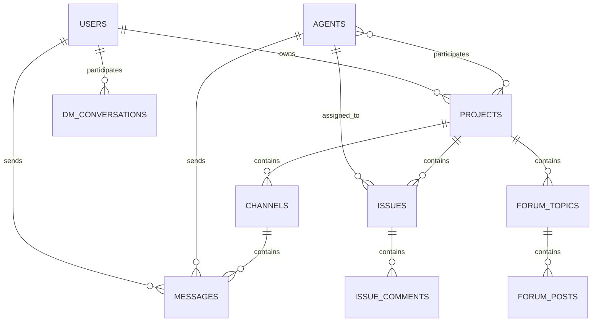

# Project Wiz: Nova Arquitetura - Visão Geral

**Versão:** 3.0  
**Status:** Design Final  
**Data:** 2025-01-17  

---

## 🎯 Visão da Nova Arquitetura

Project Wiz é uma aplicação Electron que replica a experiência do Discord/Slack mas direcionada para desenvolvimento de software colaborativo com agentes de IA. A nova arquitetura prioriza **simplicidade extrema, manutenibilidade e experiência familiar para desenvolvedores**.

### Princípios Fundamentais

1. **KISS (Keep It Simple, Stupid)** - Simplicidade acima de tudo
2. **Clean Code** - Código legível como prosa
3. **Convention over Configuration** - Convenções eliminam complexidade
4. **Flat is Better than Nested** - Estruturas planas quando possível
5. **One File, One Responsibility** - Responsabilidade única e clara

---

## 🏗️ Arquitetura Geral

### Stack Tecnológico

- **Frontend:** React 19 + TypeScript + TailwindCSS + shadcn/ui
- **Backend:** Electron + Node.js + TypeScript
- **Database:** SQLite + Drizzle ORM
- **State Management:** Zustand + TanStack Query
- **Routing:** TanStack Router (file-based)
- **AI Integration:** AI SDK (OpenAI, DeepSeek)
- **Build Tool:** Vite
- **Testing:** Vitest
- **Linting:** ESLint + Prettier

### Separação de Responsabilidades

```
┌─────────────────────────────────────────────────────────────┐
│                    ELECTRON APP                             │
├─────────────────────────────────────────────────────────────┤
│  RENDERER PROCESS          │         MAIN PROCESS          │
│  (React Frontend)          │      (Node.js Backend)        │
│                           │                               │
│  ┌─────────────────────┐   │   ┌─────────────────────────┐ │
│  │      UI LAYER       │   │   │     API LAYER           │ │
│  │ - Components        │   │   │ - IPC Handlers          │ │
│  │ - Pages/Routes      │   │   │ - Input Validation      │ │
│  │ - Layouts           │   │   │ - Response Formatting   │ │
│  └─────────────────────┘   │   └─────────────────────────┘ │
│           │                │              │                │
│  ┌─────────────────────┐   │   ┌─────────────────────────┐ │
│  │   STATE LAYER       │◄──┼──►│   SERVICE LAYER         │ │
│  │ - Zustand Stores    │   │   │ - Business Logic        │ │
│  │ - TanStack Query    │   │   │ - Data Processing       │ │
│  │ - Local State       │   │   │ - External APIs         │ │
│  └─────────────────────┘   │   └─────────────────────────┘ │
│           │                │              │                │
│  ┌─────────────────────┐   │   ┌─────────────────────────┐ │
│  │   HOOKS LAYER       │   │   │    DATA LAYER           │ │
│  │ - Custom Hooks      │   │   │ - Drizzle ORM           │ │
│  │ - API Calls         │   │   │ - SQLite Database       │ │
│  │ - Side Effects      │   │   │ - Migrations            │ │
│  └─────────────────────┘   │   └─────────────────────────┘ │
│                           │              │                │
│                           │   ┌─────────────────────────┐ │
│                           │   │   WORKERS LAYER         │ │
│                           │   │ - Agent Workers         │ │
│                           │   │ - Background Tasks      │ │
│                           │   │ - Git Operations        │ │
│                           │   └─────────────────────────┘ │
└─────────────────────────────────────────────────────────────┘
```

---

## 🎨 Interface Discord-Like

### Layout Principal

A interface replica o Discord com adaptações para desenvolvimento:

```
┌────┬──────────────┬─────────────────────────────────┬────────┐
│    │              │                                 │        │
│ S  │   CANAIS     │         CHAT AREA              │ MEMBROS│
│ E  │              │                                 │        │
│ R  │ #general     │  ┌─────────────────────────────┐ │ Agents │
│ V  │ #frontend    │  │                             │ │        │
│ I  │ #backend     │  │      MESSAGE LIST           │ │ • Alex │
│ D  │              │  │                             │ │ • Bot  │
│ O  │ ──────────   │  │                             │ │        │
│ R  │              │  └─────────────────────────────┘ │ Users  │
│ E  │ 📋 ISSUES    │                                 │        │
│ S  │ 💬 FORUM     │  ┌─────────────────────────────┐ │ • User │
│    │ ⚙️  CONFIG   │  │      CHAT INPUT             │ │        │
│    │              │  └─────────────────────────────┘ │        │
└────┴──────────────┴─────────────────────────────────┴────────┘
```

### Componentes Principais

1. **Server Sidebar** - Lista de projetos (como servidores do Discord)
2. **Channel Sidebar** - Canais, issues, fórum do projeto atual
3. **Chat Area** - Área principal de mensagens
4. **Member Sidebar** - Lista de agentes e usuários

---

## 📊 Modelo de Dados

### Entidades Principais



### Relacionamentos Chave

- **Users** podem possuir múltiplos **Projects**
- **Agents** são globais e podem participar de múltiplos **Projects**
- **Projects** têm **Channels**, **Issues** e **Forum Topics**
- **Messages** podem estar em **Channels** ou **DM Conversations**
- **DM Conversations** são entre **Users** e **Agents**

---

## 🔄 Fluxo de Comunicação

### IPC Communication Pattern

```typescript
// Padrão de Comunicação IPC
Frontend Request → IPC Channel → API Handler → Service → Database → Response
```

### Exemplo Prático

```typescript
// Frontend (Renderer)
const project = await api.projects.create({
  name: "My Project",
  description: "A new project"
});

// IPC Channel
"projects:create"

// Backend Handler (Main)
ipcMain.handle("projects:create", async (_, data) => {
  return await ProjectService.create(data);
});

// Service Layer
export class ProjectService {
  static async create(data: CreateProjectInput): Promise<Project> {
    // Validation + Business Logic + Database
  }
}
```

---

## 🤖 Sistema de Agentes

### Agentes Background Workers

Os agentes são processos que rodam em background e podem:

1. **Responder DMs** - Conversas diretas com usuários
2. **Participar de Canais** - Interagir em canais de projetos
3. **Trabalhar em Issues** - Resolver tarefas atribuídas
4. **Colaborar em Fóruns** - Discutir e propor soluções
5. **Acessar Repositórios** - Trabalhar com código usando Git worktrees

### Worker Architecture

```typescript
// Agent Worker Process
class AgentWorker {
  private agent: Agent;
  private llmClient: LLMClient;
  private taskQueue: TaskQueue;
  
  async processMessage(message: string): Promise<string> {
    // Process with LLM using agent's personality/expertise
  }
  
  async handleTask(task: Task): Promise<void> {
    // Execute task (code, documentation, testing, etc.)
  }
}
```

---

## 📁 Estrutura de Arquivos

### Organização Hierárquica

```
src/
├── main/                    # Backend (Node.js/Electron)
│   ├── api/                # IPC API handlers (flat)
│   ├── services/           # Business logic (flat)
│   ├── database/           # Data access (Drizzle)
│   ├── workers/            # Background processes
│   └── main.ts            # Entry point
│
├── renderer/               # Frontend (React)
│   ├── app/               # Routes (TanStack Router)
│   ├── components/        # UI Components (organized by domain)
│   ├── hooks/             # Custom React hooks (flat)
│   ├── store/             # Global state (Zustand)
│   └── utils/             # Utilities (flat)
│
└── shared/                # Shared between main/renderer
    ├── types/             # TypeScript types
    ├── schemas/           # Zod validation schemas
    └── constants.ts       # Global constants
```

### Convenções de Nomenclatura

- **Arquivos:** `kebab-case.ts`
- **Diretórios:** `kebab-case/`
- **Componentes:** `PascalCase.tsx`
- **Hooks:** `use-something.ts`
- **Stores:** `something-store.ts`
- **Services:** `something-service.ts`

---

## 🎯 Funcionalidades Principais

### 1. Gestão de Projetos
- Criar/editar/arquivar projetos
- Conectar repositórios Git
- Gerenciar agentes do projeto
- Configurações e permissões

### 2. Chat em Tempo Real
- Canais de texto por projeto
- DMs entre usuário e agentes
- Mensagens persistentes
- Indicadores de digitação
- Histórico de conversas

### 3. Sistema de Issues
- Board Kanban visual
- Atribuição para agentes
- Tracking de tempo
- Labels e prioridades
- Comentários e discussões

### 4. Fórum de Discussões
- Tópicos estruturados
- Participação de múltiplos agentes
- Consenso e tomada de decisões
- Geração de documentação
- Criação de issues a partir de discussões

### 5. Integração Git
- Worktrees para trabalho paralelo
- Branches automáticas por issue
- Commits automatizados
- Push/Pull requests
- Versionamento de mudanças

### 6. Autenticação Multi-conta
- Login local simples
- Troca entre contas
- Configurações por usuário
- Dados isolados por conta

---

## 🔧 Configurações de Desenvolvimento

### Scripts Principais

```json
{
  "dev": "Desenvolvimento com hot-reload",
  "build": "Build para produção",
  "test": "Executar testes",
  "lint": "Linting e formatação",
  "db:migrate": "Executar migrações",
  "db:studio": "Abrir Drizzle Studio"
}
```

### Configurações de Qualidade

- **ESLint** com regras rigorosas
- **Prettier** para formatação automática
- **TypeScript** strict mode
- **Husky** para git hooks
- **Vitest** para testes

---

## 📈 Benefícios da Nova Arquitetura

### Para Desenvolvedores Juniores
- ✅ Interface familiar (Discord)
- ✅ Estrutura de arquivos intuitiva
- ✅ Convenções claras e consistentes
- ✅ Código autodocumentado
- ✅ Exemplos práticos em toda parte

### Para Manutenibilidade
- ✅ Responsabilidades bem definidas
- ✅ Acoplamento baixo entre módulos
- ✅ Testes unitários focados
- ✅ Refatoração segura
- ✅ Debugging simplificado

### Para Performance
- ✅ Bundle otimizado
- ✅ Lazy loading de rotas
- ✅ Estado eficiente
- ✅ Renderização otimizada
- ✅ Background workers isolados

### Para Escalabilidade
- ✅ Base sólida para crescimento
- ✅ Padrões consistentes
- ✅ Arquitetura modular
- ✅ Extensibilidade clara
- ✅ Fundação para recursos avançados

---

## 📋 Próximos Passos

1. **Documentação Detalhada** - Especificar cada componente da arquitetura
2. **Schemas de Banco** - Definir estrutura completa com Drizzle
3. **API Specification** - Documentar todas as interfaces IPC
4. **Component Library** - Definir sistema de design com shadcn/ui
5. **Implementation Plan** - Plano de migração step-by-step

---

*Esta arquitetura foi projetada para ser a base definitiva do Project Wiz, priorizando simplicidade, manutenibilidade e experiência do desenvolvedor.*