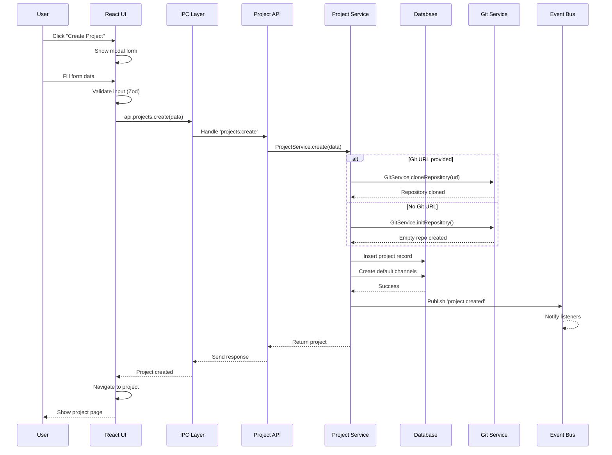
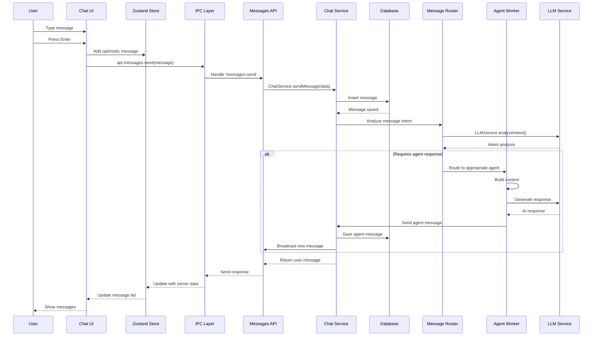
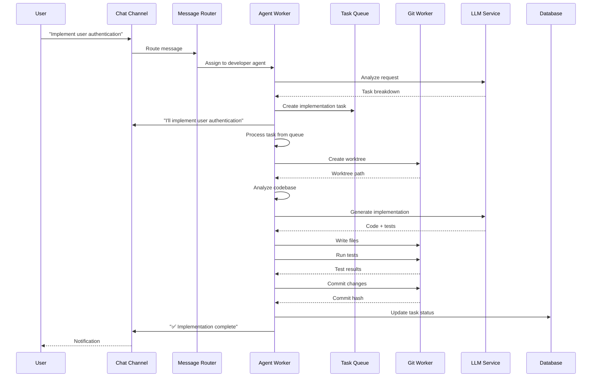
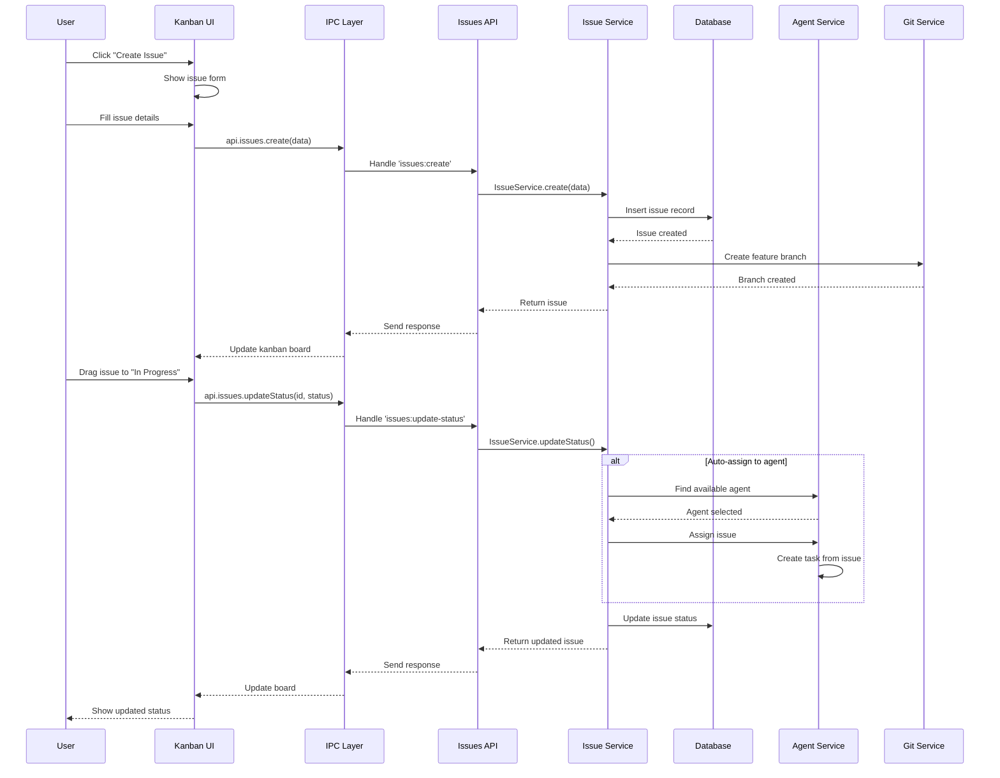
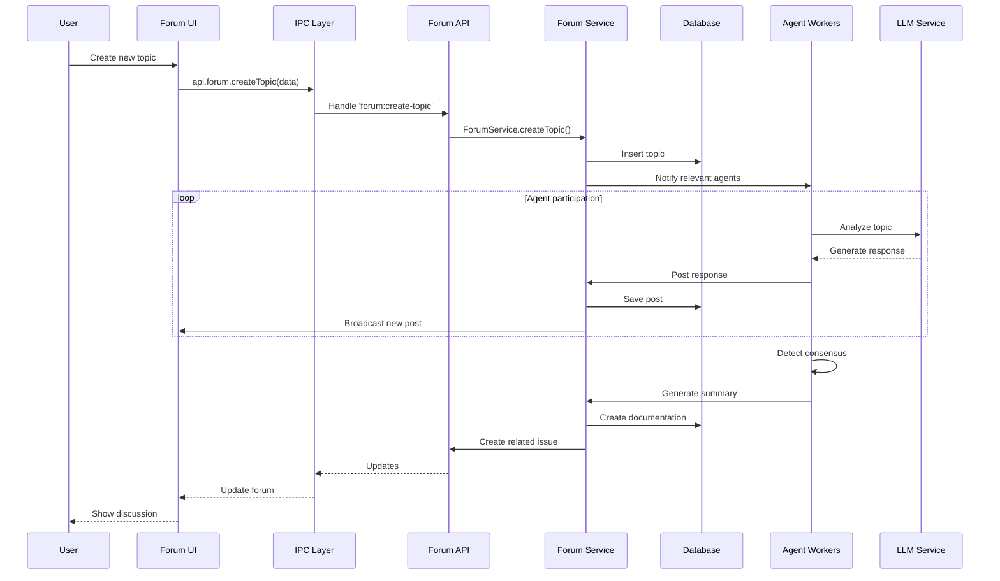
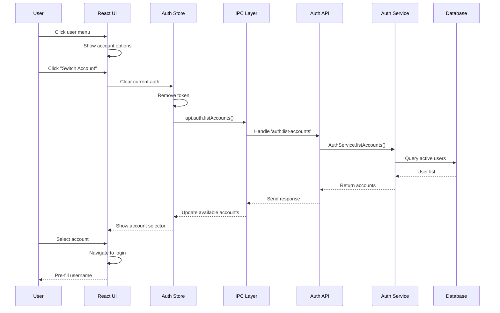

# Project Wiz: Fluxos de Funcionalidades Principais

**Versão:** 3.0  
**Status:** Design Final  
**Data:** 2025-01-17  

---

## 🎯 Visão Geral dos Fluxos

Este documento detalha os **fluxos completos das funcionalidades principais** do Project Wiz, desde a ação do usuário até a resposta do sistema, incluindo todas as camadas da aplicação.

---

## 🚀 Fluxo 1: Criar Novo Projeto

### Visão do Usuário
1. Clica no botão "+" na sidebar de projetos
2. Preenche formulário (nome, descrição, Git URL opcional)
3. Clica em "Create Project"
4. É redirecionado para o novo projeto

### Fluxo Técnico Completo



### Código do Fluxo

```typescript
// Frontend: Create Project Form
function CreateProjectModal() {
  const { createProject } = useProjects();
  const [isLoading, setIsLoading] = useState(false);
  
  const handleSubmit = async (data: CreateProjectInput) => {
    setIsLoading(true);
    try {
      const project = await createProject(data);
      navigate(`/project/${project.id}`);
      toast.success('Project created successfully');
    } catch (error) {
      toast.error(error.message);
    } finally {
      setIsLoading(false);
    }
  };
}

// Backend: Project Service
static async create(input: CreateProjectInput, ownerId: string): Promise<Project> {
  // 1. Validação
  const validated = CreateProjectSchema.parse(input);
  
  // 2. Verificar limites
  await this.validateProjectLimits(ownerId);
  
  // 3. Criar projeto
  const project = {
    id: generateId(),
    ...validated,
    ownerId,
    createdAt: new Date(),
  };
  
  // 4. Persistir
  await db.insert(projects).values(project);
  
  // 5. Criar canais padrão
  await this.createDefaultChannels(project.id, ownerId);
  
  // 6. Configurar Git
  if (validated.gitUrl) {
    await GitService.cloneRepository(project.id, validated.gitUrl);
  } else {
    await GitService.initRepository(project.id);
  }
  
  // 7. Publicar evento
  await EventBus.publish('project.created', { projectId: project.id });
  
  return project;
}
```

---

## 💬 Fluxo 2: Enviar Mensagem no Chat

### Visão do Usuário
1. Digita mensagem no chat input
2. Pressiona Enter ou clica Send
3. Vê a mensagem aparecer na lista
4. Agentes podem responder automaticamente

### Fluxo Técnico Completo



### Código do Fluxo

```typescript
// Frontend: Chat Input
function ChatInput({ channelId }: { channelId: string }) {
  const [message, setMessage] = useState('');
  const { sendMessage } = useMessages(channelId);
  
  const handleSend = async () => {
    if (!message.trim()) return;
    
    // Optimistic update
    const optimisticMessage = {
      id: `temp-${Date.now()}`,
      content: message,
      channelId,
      authorId: currentUser.id,
      authorType: 'user',
      createdAt: new Date(),
    };
    
    addOptimisticMessage(optimisticMessage);
    setMessage('');
    
    try {
      const realMessage = await sendMessage(message);
      replaceOptimisticMessage(optimisticMessage.id, realMessage);
    } catch (error) {
      removeOptimisticMessage(optimisticMessage.id);
      toast.error('Failed to send message');
    }
  };
}

// Backend: Message Processing
static async processMessage(message: Message): Promise<void> {
  // Analisar intenção
  const intent = await LLMService.analyzeIntent(message.content);
  
  if (intent.requiresAgent) {
    // Encontrar agente apropriado
    const agent = await this.findAppropriateAgent(
      message.channelId!,
      intent.expertise
    );
    
    if (agent) {
      // Enviar para processamento do agente
      await AgentWorkerManager.sendMessage(agent.id, message);
    }
  }
  
  // Publicar evento de nova mensagem
  await EventBus.publish('message.sent', {
    messageId: message.id,
    channelId: message.channelId,
  });
}
```

---

## 🤖 Fluxo 3: Agente Executando Tarefa

### Visão do Usuário
1. Envia mensagem solicitando implementação
2. Vê resposta do agente confirmando
3. Acompanha progresso no canal
4. Recebe notificação quando completo

### Fluxo Técnico Completo



### Código do Fluxo

```typescript
// Agent Worker: Task Execution
private async executeCodeTask(task: AgentTask): Promise<void> {
  // 1. Criar worktree isolado
  const worktreePath = await GitService.createWorktreeForTask(
    task.projectId!,
    task.id
  );
  
  // 2. Analisar código existente
  const codeContext = await this.analyzeCodebase(worktreePath);
  
  // 3. Gerar implementação com IA
  const implementation = await this.generateImplementation(task, codeContext);
  
  // 4. Escrever arquivos
  for (const file of implementation.files) {
    await fs.writeFile(
      path.join(worktreePath, file.path),
      file.content
    );
  }
  
  // 5. Executar testes
  const testResults = await this.runTests(worktreePath);
  
  // 6. Commit se testes passaram
  if (testResults.success) {
    await GitService.commitChanges(
      worktreePath,
      `feat: ${task.description}\n\nImplemented by ${this.agent.name}`
    );
    
    // 7. Reportar sucesso
    await this.reportTaskCompletion(task, {
      status: 'completed',
      testResults,
      files: implementation.files,
    });
  } else {
    // Reportar falha nos testes
    await this.reportTaskFailure(task, testResults);
  }
}
```

---

## 📋 Fluxo 4: Criar e Gerenciar Issues

### Visão do Usuário
1. Acessa o Kanban board do projeto
2. Clica em "Create Issue"
3. Preenche detalhes da issue
4. Arrasta issue entre colunas
5. Agente pode pegar a issue

### Fluxo Técnico Completo



### Código do Fluxo

```typescript
// Frontend: Kanban Board
function KanbanBoard({ projectId }: { projectId: string }) {
  const { issues, moveIssue } = useIssues(projectId);
  
  const handleDragEnd = async (result: DropResult) => {
    if (!result.destination) return;
    
    const issue = issues.find(i => i.id === result.draggableId);
    if (!issue) return;
    
    // Optimistic update
    moveIssue(issue.id, result.destination.droppableId as IssueStatus);
    
    try {
      await api.issues.updateStatus(issue.id, result.destination.droppableId);
    } catch (error) {
      // Revert on error
      moveIssue(issue.id, issue.status);
      toast.error('Failed to update issue');
    }
  };
  
  return (
    <DragDropContext onDragEnd={handleDragEnd}>
      <div className="kanban-board">
        {columns.map(column => (
          <KanbanColumn
            key={column.id}
            column={column}
            issues={issues.filter(i => i.status === column.id)}
          />
        ))}
      </div>
    </DragDropContext>
  );
}

// Backend: Issue Service
static async updateStatus(
  issueId: string,
  newStatus: IssueStatus
): Promise<Issue> {
  const issue = await this.findById(issueId);
  if (!issue) throw new NotFoundError('Issue', issueId);
  
  const oldStatus = issue.status;
  
  // Atualizar status
  await db.update(issues)
    .set({ 
      status: newStatus,
      updatedAt: new Date(),
    })
    .where(eq(issues.id, issueId));
  
  // Se movendo para "In Progress", pode auto-atribuir
  if (newStatus === 'in_progress' && !issue.assigneeId) {
    await this.autoAssignToAgent(issueId);
  }
  
  // Registrar atividade
  await this.logActivity(issueId, 'status_change', {
    from: oldStatus,
    to: newStatus,
  });
  
  // Publicar evento
  await EventBus.publish('issue.status_changed', {
    issueId,
    oldStatus,
    newStatus,
  });
  
  return this.findById(issueId)!;
}
```

---

## 💬 Fluxo 5: Discussão no Fórum

### Visão do Usuário
1. Cria tópico de discussão
2. Descreve o problema/proposta
3. Agentes participam da discussão
4. Consenso gera documentação/issue

### Fluxo Técnico Completo



### Código do Fluxo

```typescript
// Backend: Forum Discussion with Agents
static async processTopicForAgents(topic: ForumTopic): Promise<void> {
  // Encontrar agentes relevantes
  const relevantAgents = await this.findRelevantAgents(topic);
  
  for (const agent of relevantAgents) {
    // Notificar agente sobre novo tópico
    await AgentWorkerManager.notifyNewTopic(agent.id, topic);
  }
  
  // Agendar análise de consenso
  setTimeout(() => this.checkForConsensus(topic.id), 30 * 60 * 1000); // 30 min
}

static async checkForConsensus(topicId: string): Promise<void> {
  const posts = await this.getTopicPosts(topicId);
  
  if (posts.length < 3) return; // Precisa de discussão mínima
  
  // Usar IA para detectar consenso
  const consensus = await LLMService.analyzeConsensus(posts);
  
  if (consensus.reached) {
    // Gerar documentação
    const doc = await this.generateDocumentation(topicId, consensus);
    
    // Criar issue se necessário
    if (consensus.requiresImplementation) {
      await IssueService.createFromForum({
        title: consensus.title,
        description: consensus.summary,
        topicId,
      });
    }
    
    // Marcar tópico como resolvido
    await this.updateTopicStatus(topicId, 'resolved');
  }
}
```

---

## 🔄 Fluxo 6: Troca de Conta

### Visão do Usuário
1. Clica no menu de usuário
2. Seleciona "Switch Account"
3. Escolhe outra conta
4. Interface recarrega com nova conta

### Fluxo Técnico Completo



---

## 🎯 Padrões nos Fluxos

### Comunicação em Camadas
1. **UI** → Validação local → Optimistic updates
2. **IPC** → Type-safe bridge → Error serialization
3. **API** → Input validation → Service delegation
4. **Service** → Business logic → Event publishing
5. **Database** → Atomic operations → Consistency

### Tratamento de Erros
- Validação em múltiplas camadas
- Rollback de optimistic updates
- User-friendly error messages
- Logging para debugging

### Performance
- Optimistic updates no frontend
- Lazy loading de dados
- Background processing para tarefas pesadas
- Caching com TanStack Query

### Segurança
- Validação de entrada em todas as camadas
- Autenticação verificada no backend
- Permissões verificadas por operação
- Dados sensíveis nunca expostos

---

## 📈 Benefícios dos Fluxos

### ✅ User Experience
- **Feedback imediato** com optimistic updates
- **Operações assíncronas** não bloqueiam UI
- **Notificações claras** de progresso
- **Recovery automático** de erros

### ✅ Developer Experience  
- **Fluxos previsíveis** e debugáveis
- **Type safety** end-to-end
- **Separation of concerns** clara
- **Testabilidade** em cada camada

### ✅ Scalability
- **Background workers** para tarefas pesadas
- **Event-driven** architecture
- **Modular design** permite extensão
- **Performance** otimizada por design

---

*Estes fluxos representam as interações principais do Project Wiz, demonstrando como a arquitetura suporta operações complexas mantendo simplicidade e clareza.*