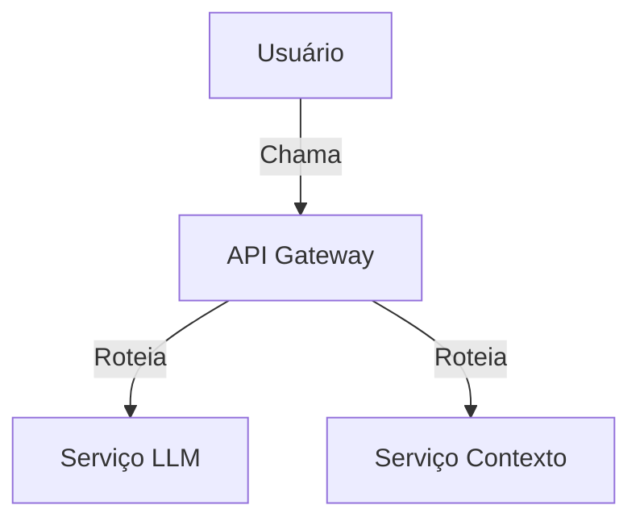

# Arquitetura do Sistema

## Visão Executiva

### Objetivos do Sistema
1. Fornecer uma plataforma integrada para desenvolvimento de aplicações com LLM
2. Garantir escalabilidade para milhares de requisições simultâneas
3. Manter baixa latência em operações críticas

### Capacidades Principais
- Integração com múltiplos modelos LLM
- Gerenciamento de contexto de conversação
- Cache inteligente de respostas
- Monitoramento detalhado de desempenho

### Restrições Arquiteturais
- Compatibilidade com Python 3.10+
- Uso exclusivo de bancos de dados NoSQL
- Implantação em containers Docker

### Stakeholders Chave
| Papel | Responsabilidade |
|-------|------------------|
| Product Owner | Definição de roadmap |
| Arquiteto | Decisões técnicas |
| DevOps | Implantação e monitoração |

## Visão Técnica

### Decisões Arquiteturais (ADR)
1. **ADR-001**: Uso de GraphQL para APIs
2. **ADR-002**: Cache distribuído com Redis
3. **ADR-003**: Autenticação JWT

### Componentes Principais

#### Serviço de LLM
- **Responsabilidade**: Gerenciar integração com modelos
- **Interfaces**: 
  ```graphql
  type Query {
    generateText(prompt: String!): TextResponse
  }
  ```
- **Dependências**: Redis, Modelos LLM

#### Serviço de Contexto
- **Responsabilidade**: Manter histórico de conversas
- **Interfaces**: REST API
- **Dependências**: MongoDB

## Diagramas

### Diagrama de Contexto


## Visão de Implementação

### Guias de Estilo
1. **Python**: PEP-8 com type hints
2. **GraphQL**: Schema-first design
3. **Testes**: 80%+ coverage

### Métricas de Qualidade
| Métrica | Alvo | Ação |
|---------|------|------|
| Latência API | <300ms | Otimizar queries |
| Uso CPU | <70% | Scale horizontal |