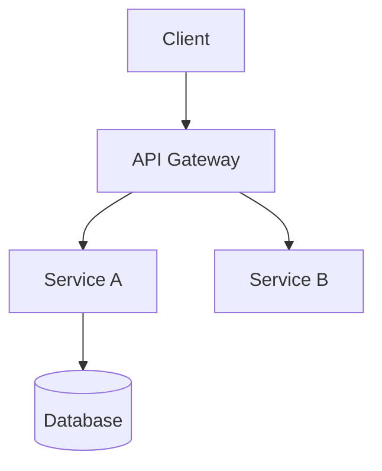

# ADR-0021: Diagramação de Componentes com Mermaid

## Status

- 🟢 **Aceito**

## Contexto

Necessidade de padronizar a representação visual da arquitetura do sistema, substituindo diagramas estáticos por uma abordagem mais dinâmica e versionável.

Problemas identificados:
1. Diagramas em imagens difíceis de manter
2. Falta de sincronia com código-fonte
3. Dificuldade de versionamento

## Decisão

Adotar Mermaid.js como padrão para diagramação arquitetural, com:

1. **Tipos de Diagramas**:
   - Contexto: `graph TD`
   - Containers: `graph LR`
   - Componentes: `graph TB`
   - Fluxos: `sequenceDiagram`

2. **Convenções**:
   - Nomes em inglês para elementos
   - Estilo consistente (formas, cores)
   - Links para código relacionado

3. **Localização**:
   - Diagramas embutidos em arquivos .md
   - Pasta `/docs/architecture/diagrams/` para complexos

4. **Exemplo de Implementação**:

## Consequências

**Positivas**:
- Diagramas versionáveis
- Fácil manutenção
- Integração com documentação

**Negativas**:
- Curva de aprendizado
- Limitações vs. ferramentas dedicadas

## Alternativas Consideradas

- PlantUML — rejeitado por requerer pré-processamento
- Imagens estáticas — rejeitado por problemas de manutenção
- Ferramentas externas — rejeitado para manter tudo no repositório

## Links Relacionados

- [ADR-0020: Padrão de Documentação Técnica](../decisions/adr-0020.md)
- [Mermaid Documentation](https://mermaid.js.org/)