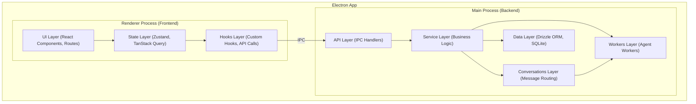

# Documentação Completa da Arquitetura do Project Wiz

**Versão:** 3.0  
**Status:** Design Final  
**Data:** 2025-07-18 (Data de Consolidação)

---

## 🎯 Visão Geral e Princípios Fundamentais

O Project Wiz é uma aplicação de desktop (Electron) focada no desenvolvimento de software colaborativo, com forte integração de **agentes de IA autônomos**. A arquitetura é projetada para ser **simples, manutenível e familiar**, priorizando clareza e eficiência.

**Princípios Fundamentais:**

1.  **KISS (Keep It Simple, Stupid)**: Evitar complexidade desnecessária.
2.  **Clean Code**: Código legível e de fácil manutenção.
3.  **Convention over Configuration**: Convenções claras para reduzir a necessidade de configurações complexas.
4.  **Flat is Better than Nested**: Estruturas de arquivos e código o mais planas possível.
5.  **One File, One Responsibility**: Cada arquivo com um propósito único e bem definido.

---

## 🏗️ Stack Tecnológico

A seleção de tecnologias visa maximizar a produtividade e a qualidade, utilizando ferramentas modernas e amplamente adotadas:

- **Frontend:** React 19 + TypeScript + TailwindCSS + shadcn/ui
- **Backend:** Electron + Node.js + TypeScript
- **Database:** SQLite + Drizzle ORM (local-first)
- **State Management:** Zustand + TanStack Query
- **Routing:** TanStack Router (file-based)
- **AI Integration:** AI SDK (para OpenAI, DeepSeek, etc.)
- **Build Tool:** Vite
- **Testing:** Vitest
- **Linting & Formatting:** ESLint + Prettier

---

## 🏛️ Arquitetura em Camadas

A aplicação é dividida em dois processos principais do Electron: **Renderer (Frontend)** e **Main (Backend)**, com clara separação de responsabilidades.



### Camadas do Backend (Main Process)

1.  **API Layer**: Recebe chamadas do frontend via IPC, valida dados e delega para a camada de serviço.
2.  **Service Layer**: Contém a lógica de negócio principal, orquestra operações e interage com outras camadas.
3.  **Conversations Layer**: Processa e roteia mensagens, acionando agentes de IA quando necessário.
4.  **Data Layer**: Persistência de dados com Drizzle ORM para comunicação type-safe com SQLite.
5.  **Workers Layer**: Onde os agentes de IA rodam como processos em background.

### Camadas do Frontend (Renderer Process)

1.  **UI Layer**: Componentes React (shadcn/ui, TailwindCSS) e rotas (TanStack Router).
2.  **State Layer**: Gerencia o estado da aplicação: Zustand para estado global da UI e TanStack Query para estado do servidor.
3.  **Hooks Layer**: Hooks customizados que encapsulam lógica de acesso a dados e efeitos colaterais, comunicando-se com o backend via `window.api` (IPC).

---

## 📁 Estrutura do Projeto

A estrutura de código é organizada em `src` e dividida em `main` (backend) e `renderer` (frontend). A organização interna segue uma abordagem de Domain-Driven Design (DDD) com Bounded Contexts e Aggregates.

```
src/
├── main/                            # Backend (Node.js/Electron)
│   ├── user/                        # Bounded Context: User
│   │   ├── authentication/          # Aggregate: Authentication
│   │   │   ├── auth.handlers.ts
│   │   │   ├── auth.service.ts
│   │   │   └── users.schema.ts
│   │   └── profile/                 # Aggregate: Profile
│   │       └── profile.service.ts
│   ├── project/                     # Bounded Context: Project
│   │   ├── project.handlers.ts      # Handlers do projeto principal
│   │   ├── project.service.ts       # Serviço do projeto principal
│   │   ├── projects.schema.ts       # Schema do projeto principal
│   │   ├── channels/                # Aggregate: Channels
│   │   ├── issues/                  # Aggregate: Issues
│   │   └── ...
│   ├── agents/                      # Bounded Context: Agents
│   │   ├── worker/                  # Aggregate: Worker
│   │   │   ├── agent.handlers.ts
│   │   │   ├── agent.service.ts
│   │   │   └── agent.worker.ts
│   │   └── queue/                   # Aggregate: Queue
│   │       └── queue.service.ts
│   ├── conversations/               # Bounded Context: Conversations
│   │   ├── message.service.ts       # Core messaging logic
│   │   ├── routing/                 # Agent interaction routing
│   │   └── ...                      # DMs, channel messages
│   ├── database/                    # Camada de Dados (Drizzle ORM)
│   │   ├── connection.ts
│   │   ├── migrations/
│   │   └── index.ts
│   └── main.ts                      # Ponto de entrada do Electron
│
└── renderer/                        # Frontend (React)
    ├── app/                         # Rotas (TanStack Router)
    │   ├── __root.tsx
    │   ├── index.tsx
    │   └── project/
    │       └── [project-id]/        # Rota de Projeto
    │           └── ...
    ├── features/                    # Features organizadas por domínio
    │   ├── user/
    │   │   └── authentication/      # Aggregate: Authentication
    │   │       ├── components/      # Componentes de Autenticação
    │   │       │   └── login-form.tsx
    │   │       ├── hooks/
    │   │       │   └── use-auth.ts
    │   │       └── store/
    │   │           └── auth-store.ts
    │   ├── project/               # Feature: Project
    │   │   ├── components/        # Componentes do projeto
    │   │   │   ├── project-card.tsx
    │   │   │   └── kanban-board.tsx  # Componente do agregado Issues
    │   │   ├── hooks/             # Hooks do projeto
    │   │   │   ├── use-projects.ts
    │   │   │   └── use-issues.ts     # Hook do agregado Issues
    ├── components/                  # Componentes de UI compartilhados
    │   ├── layout/
    │   └── ui/                      # Componentes base (shadcn/ui)
    ├── hooks/                       # Hooks globais
    ├── store/                       # Stores globais
    └── utils/                       # Utilitários do Frontend
```

### `src/main` - Backend Detalhado

- **Bounded Contexts (`user/`, `project/`, `agents/`, `conversations/`)**: Cada diretório representa um domínio de negócio principal.
- **Aggregates (`authentication/`, `channels/`, `worker/`)**: Dentro de um Bounded Context, agregados agrupam funcionalidades relacionadas. A lógica principal do contexto reside na raiz do diretório do contexto e orquestra os serviços dos agregados filhos.

### `src/renderer` - Frontend Detalhado

- **`app/`**: Rotas da aplicação, seguindo a convenção do TanStack Router.
- **`features/`**: Implementação da UI para os domínios de negócio, espelhando a estrutura do backend.
- **`components/`**: Componentes de UI puramente visuais e reutilizáveis.

---

## 📏 Padrões de Código e Convenções

Nossos padrões visam clareza e consistência, alinhados com a arquitetura de domínios.

### Convenções de Nomenclatura

- **Arquivos e Diretórios**: `kebab-case` (ex: `user-service.ts`).
- **Componentes React**: `PascalCase` para a função/classe (ex: `ProjectCard`), mas `kebab-case` para o nome do arquivo (`project-card.tsx`).
- **Backend (Domain-Driven)**: A estrutura de pastas define o domínio. Ex: `src/main/project/project.service.ts`.
- **Frontend (Features)**: A estrutura espelha o backend. Ex: `src/renderer/features/project/hooks/use-projects.ts`.
- **Variáveis de Schema Drizzle**: `camelCase` com sufixo `Table` (ex: `projectsTable`, `usersTable`).
- **Propriedades de Interface/Tipo**: `snake_case` é permitido para colunas de banco de dados e integração com APIs externas que usam essa convenção.

### Padrões de Linting

- **Componentes UI padrões**: Todos os componentes em `src/renderer/components/ui/` são padrões do shadcn/ui e devem seguir as regras de linting.
- **Arquivos Gerados**: Apenas arquivos realmente gerados (como `routeTree.gen.ts` e `locales/*.ts`) são excluídos do linting.

### Checklist de Qualidade Antes do Commit

- [ ] O código está formatado (`npm run format`)?
- [ ] Não há erros de lint ou tipo (`npm run lint:check && npm run type-check`)?
- [ ] Novos testes foram adicionados e todos estão passando (`npm run test`)?
- [ ] O código segue a estrutura de domínios e as convenções de nomenclatura?

---

## 💡 Exemplos de Padrões de Código

### Exemplo de Schema Drizzle

Schemas Drizzle são definidos dentro de seus respectivos domínios/agregados. IDs são gerados pelo banco de dados.

```typescript
// src/main/project/projects.schema.ts
import { sqliteTable, text, integer } from "drizzle-orm/sqlite-core";
import { sql } from "drizzle-orm";

export const projectsTable = sqliteTable("projects", {
  id: text("id").primaryKey(), // ID gerado pelo banco de dados
  name: text("name").notNull(),
  createdAt: integer("created_at", { mode: "timestamp" })
    .notNull()
    .default(sql`CURRENT_TIMESTAMP`),
  updatedAt: integer("updated_at", { mode: "timestamp" })
    .notNull()
    .default(sql`CURRENT_TIMESTAMP`),
});

export type Project = typeof projectsTable.$inferSelect;
export type NewProject = typeof projectsTable.$inferInsert;

// Exemplo de tipo de input para criação, sem o ID
export type CreateProjectInput = {
  name: string;
  // ... outros campos necessários para criação
};
```

### Exemplo de Serviço (Backend)

Serviços contêm a lógica de negócio principal.

```typescript
// src/main/project/project.service.ts
import { db } from "@/main/database/connection";
import {
  projectsTable,
  Project,
  CreateProjectInput,
} from "@/main/project/projects.schema";
import { ChannelService } from "@/main/project/channels/channel.service";
import { sql } from "drizzle-orm";

export class ProjectService {
  static async create(input: CreateProjectInput): Promise<Project> {
    // O ID é gerado pelo banco de dados na inserção
    const [newProject] = await db
      .insert(projectsTable)
      .values(input)
      .returning();

    await ChannelService.createDefaultChannels(newProject.id);

    return newProject;
  }

  static async findById(id: string): Promise<Project | undefined> {
    return db.query.projectsTable.findFirst({ where: sql`id = ${id}` });
  }
}
```

### Exemplo de Comunicação IPC (Inter-Process Communication)

A comunicação entre frontend e backend é feita via Electron IPC.

**Backend Handler:**

```typescript
// src/main/project/project.handlers.ts
import { ipcMain } from "electron";
import { ProjectService } from "@/main/project/project.service";

export function setupProjectHandlers(): void {
  ipcMain.handle("projects:create", async (_, data) => {
    return await ProjectService.create(data);
  });

  ipcMain.handle("projects:findById", async (_, id) => {
    return await ProjectService.findById(id);
  });
}
```

**Frontend (usando `window.api` e TanStack Query):**

```typescript
// src/renderer/features/project/hooks/use-projects.ts
import { useQuery, useMutation, useQueryClient } from "@tanstack/react-query";

// Assumindo que window.api.projects está tipado em window.d.ts
declare global {
  interface Window {
    api: {
      projects: {
        create: (data: { name: string }) => Promise<Project>;
        findById: (id: string) => Promise<Project | undefined>;
      };
      // ... outros módulos IPC
    };
  }
}

export function useProjects() {
  const queryClient = useQueryClient();

  const { data: projects, isLoading } = useQuery({
    queryKey: ["projects"],
    queryFn: () => window.api.projects.listAll(), // Assumindo um método listAll
  });

  const createProjectMutation = useMutation({
    mutationFn: (data: { name: string }) => window.api.projects.create(data),
    onSuccess: () => {
      queryClient.invalidateQueries({ queryKey: ["projects"] });
    },
  });

  return { projects, isLoading, createProjectMutation };
}
```

### Exemplo de Definição de Tipos (Types/Interfaces)

Tipos e interfaces são definidos diretamente dentro de seus Bounded Contexts, próximos ao código que os utiliza.

```typescript
// src/main/user/authentication/users.schema.ts (exemplo de tipo inferido do Drizzle)
import { sqliteTable, text, integer } from "drizzle-orm/sqlite-core";

export const usersTable = sqliteTable("users", {
  id: text("id").primaryKey(),
  username: text("username").notNull().unique(),
  passwordHash: text("password_hash").notNull(),
  // ...
});

export type User = typeof usersTable.$inferSelect;
export type NewUser = typeof usersTable.$inferInsert;

// src/main/user/authentication/auth.service.ts (exemplo de interface de input)
interface LoginCredentials {
  username: string;
  password: string;
}
```

### Uso de Aliases de Caminho

O projeto utiliza aliases de caminho para importações, configurados no `tsconfig.json` e `vite.config.mts`. O alias principal é `@/` que aponta para `src/`.

**Exemplo:**

```typescript
// Importando de um módulo dentro de src/main
import { ProjectService } from "@/main/project/project.service";

// Importando de um módulo dentro de src/renderer
import { useProjects } from "@/renderer/features/project/hooks/use-projects";
```

### Configurações (Exemplo de `drizzle.config.ts`)

As configurações são gerenciadas em arquivos específicos para cada ferramenta.

```typescript
// drizzle.config.ts
import type { Config } from "drizzle-kit";

export default {
  schema: "./src/main/database/schema-consolidated.ts", // Ou schemas individuais por domínio
  out: "./drizzle",
  driver: "better-sqlite",
  dbCredentials: {
    url: "./project-wiz.db",
  },
} satisfies Config;
```

---

## 🧪 Estratégia de Testes

Nossa estratégia de testes pragmática garante a qualidade em todas as camadas da arquitetura.

### Pirâmide de Testes

- **Unit Tests (70%)**: Foco principal. Testam a lógica de negócio dentro de um `service` de um agregado ou a lógica de um componente React de uma `feature`.
- **Integration Tests (20%)**: Verificam a interação entre diferentes partes do sistema, como a comunicação IPC entre frontend e backend ou a interação de um serviço com o banco de dados.
- **End-to-End (E2E) Tests (10%)**: Simulam fluxos de usuário completos para os cenários mais críticos.

### Onde os Testes Ficam?

Os testes são colocados em um diretório `tests/` na raiz, espelhando a estrutura de `src/` para facilitar a localização.

---

## ✨ Funcionalidades Principais

### 1. Autenticação e Fluxos de Usuário

- **Sistema de Autenticação Local e Multi-Conta**: Autenticação local com dados armazenados no dispositivo, suporte a múltiplas contas, senhas hasheadas com `bcrypt` e sessões gerenciadas por tokens JWT locais.
- **Fluxo de Criação de Projeto**: Interação entre frontend e backend para criar projetos, inicializar repositórios Git e criar canais padrão.
- **Fluxo de Envio de Mensagem e Interação do Agente**: Mensagens enviadas do frontend para o backend, analisadas pelo `MessageRouter` para possível ativação de agentes.
- **Fluxo de Agente Executando Tarefa de Código**: Agentes pegam tarefas da fila, criam worktrees isolados, geram código com LLMs, executam testes e fazem commits.

### 2. Espaço Pessoal e Mensagens Diretas (DMs)

- **Mensagens Diretas (DMs)**: Conversas 1-para-1 com Personas (agentes de IA) no backend (`conversations`) e UI no frontend (`direct-messages`).
- **Configurações Globais**: Gerenciamento de tema, notificações e chaves de API do usuário via `ProfileService` no backend e UI no frontend (`user/settings`).

### 3. Gerenciamento de Projetos

- **Ciclo de Vida do Projeto**: Criação, listagem e arquivamento de projetos. Suporte para criar do zero (inicializa Git localmente) ou clonar de URL.
- **Configurações do Projeto**: Painel de configurações específico por projeto, incluindo contratação automática de Personas baseada na análise de código.

### 4. Gerenciamento de Agentes (Equipe de IA)

- **Contratação Automática**: Análise de código do projeto para sugerir/contratar agentes com expertise correspondente.
- **Criação Manual**: Wizard para criar agentes customizadas, definindo nome, role, expertise e personalidade (`systemPrompt`).
- **Gerenciamento da Equipe**: Visualização e gerenciamento de agentes associados a um projeto.

### 5. Fórum de Discussão

- **Tópicos de Discussão**: Usuários e Personas podem iniciar tópicos para discussões estruturadas.
- **Colaboração em Tópicos**: Usuários e agentes podem postar mensagens, trechos de código, etc., para colaborar na resolução de problemas, com potencial para gerar Issues ou documentação.

### 6. Interação e Fluxo de Trabalho

- **Iniciação de Tarefas Conversacional**: Iniciar trabalho através do chat, onde o `MessageRouter` identifica a intenção e enfileira tarefas para agentes.
- **Painel de Atividades**: Monitoramento do progresso das tarefas dos agentes.
- **Intervenção de Exceção**: Capacidade de pausar ou cancelar tarefas em andamento.

---

## 🗓️ Plano de Desenvolvimento (Visão Geral)

O plano de desenvolvimento é dividido em fases sequenciais, garantindo a construção correta e eficiente de cada componente do sistema.

- **Fase 0: Configuração e Infraestrutura Essencial**: Setup inicial do projeto, configuração de banco de dados (SQLite + Drizzle ORM), pontos de entrada (Main e Renderer), e comunicação IPC.
- **Fase 1: Backend - Domínio de Usuário e Autenticação**: Implementação da lógica de backend para gerenciamento de usuários, autenticação e perfis.
- **Fase 2: Backend - Domínio de Gerenciamento de Projetos**: Implementação da lógica de backend para CRUD de projetos, incluindo integração inicial com Git.
- **Fase 3: Backend - Domínio de Conversas e Mensagens**: Implementação da lógica de backend para gerenciamento de mensagens e roteamento inicial de interações.
- **Fase 4: Backend - Domínio do Sistema de Agentes**: Implementação da lógica de backend para gerenciamento de agentes, filas de tarefas e execução de workers.
- **Fase 5: Frontend - Estrutura da UI e Roteamento**: Configuração da estrutura básica do frontend, incluindo roteamento, componentes globais e gerenciamento de estado.
- **Fase 6: Frontend - UI de Usuário e Autenticação**: Implementação das interfaces de usuário para login, registro e gerenciamento de perfil/configurações.
- **Fase 7: Frontend - UI de Gerenciamento de Projetos**: Implementação das interfaces de usuário para listar, criar e visualizar projetos.
- **Fase 8: Funcionalidade - Espaço Pessoal e Mensagens Diretas (DMs)**: Implementação da funcionalidade de mensagens diretas com agentes (Personas) no espaço pessoal do usuário.
- **Fase 9: Funcionalidade - Gerenciamento de Agentes (Equipe de IA)**: Implementação da funcionalidade de contratação e gerenciamento de agentes (Personas) para projetos.
- **Fase 10: Funcionalidade - Fórum de Discussão**: Implementação da funcionalidade de fórum para discussões estruturadas e assíncronas dentro dos projetos.
- **Fase 11: Funcionalidade - Interação e Fluxo de Trabalho**: Implementação do fluxo de trabalho conversacional para iniciar tarefas e monitorar o progresso.
- **Fase 12: Qualidade e Refinamento**: Garantia contínua da qualidade do código, cobertura de testes e conformidade com os padrões de desenvolvimento.
