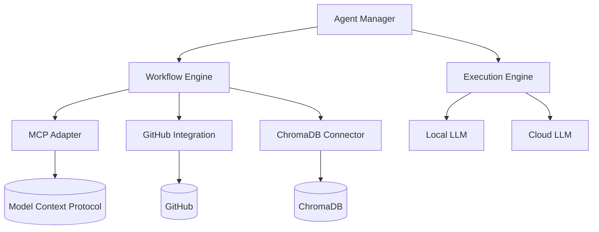

# Arquitetura do Sistema de Agentes LLM

## Visão Geral
O sistema de Agentes LLM é composto por módulos especializados que trabalham em conjunto para permitir a execução autônoma de workflows complexos. A arquitetura segue os princípios definidos nas ADRs 0034 e 0035, com foco em modularidade, segurança e escalabilidade.

## Componentes Principais

### 1. Agent Manager
- Gerencia o ciclo de vida dos agentes
- Controla alocação de recursos
- Implementa políticas de segurança

### 2. Workflow Engine
- Orquestra fluxos de trabalho complexos
- Gerencia dependências entre tarefas
- Implementa mecanismos de retry e fallback

### 3. MCP Adapter
- Interface padrão para comunicação via Model Context Protocol
- Gerencia conexões com servidores MCP
- Implementa cache e retry para operações

### 4. GitHub Integration Service
- Interface com API do GitHub
- Gerencia autenticação e autorização
- Implementa webhooks e polling para monitoramento

### 5. ChromaDB Connector
- Interface com banco de dados vetorial
- Gerencia conexões e queries
- Implementa cache local para melhor desempenho

## Diagrama Arquitetural

## Comunicação
- **Entre componentes principais**: Event-driven architecture
- **Integrações externas**: REST APIs
- **Mobile**: WebSockets para comunicação em tempo real

## Segurança
- Isolamento de processos por agente
- Sandboxing para execução de código
- Criptografia end-to-end para dados sensíveis
- Autenticação baseada em tokens JWT

## Documentação Relacionada
- [ADR-0034: Arquitetura de Agentes LLM](../adr/ADR-0034-arquitetura-agentes-llm.md)
- [ADR-0035: Integração com Model Context Protocol](../adr/ADR-0035-integracao-model-context-protocol.md)
- [PRD Agentes LLM](../requirements/prd-agentes-llm.md)