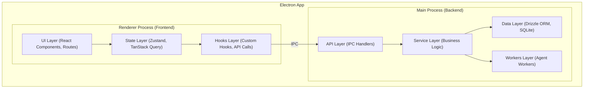

# 1. Visão Geral e Princípios da Arquitetura

**Versão:** 3.0  
**Status:** Design Final  
**Data:** 2025-01-17  

---

## 🎯 Visão Geral

O Project Wiz é uma aplicação de desktop (Electron) que replica a experiência de usuário do Discord, mas é especificamente projetada para o desenvolvimento de software colaborativo, com um foco central na integração de **agentes de IA autônomos**.

A arquitetura foi concebida para ser **extremamente simples, manutenível e familiar** para desenvolvedores, permitindo um onboarding rápido e um desenvolvimento eficiente.

### Princípios Fundamentais

A arquitetura é guiada por uma filosofia que prioriza a clareza e a simplicidade:

1.  **KISS (Keep It Simple, Stupid)**: A simplicidade é o principal objetivo. Evitamos complexidade desnecessária em todas as camadas.
2.  **Clean Code**: O código deve ser legível como prosa, facilitando a compreensão e a manutenção.
3.  **Convention over Configuration**: Convenções claras e consistentes eliminam a necessidade de configurações complexas.
4.  **Flat is Better than Nested**: Estruturas de arquivos e de código são mantidas o mais planas possível para facilitar a navegação.
5.  **One File, One Responsibility**: Cada arquivo no sistema tem um propósito único e bem definido.

> *"Qualquer tolo pode escrever código que um computador entende. Bons programadores escrevem código que humanos entendem."* - Martin Fowler

---

## 🏗️ Stack Tecnológico

A seleção de tecnologias foi feita para maximizar a produtividade e a qualidade, utilizando ferramentas modernas e amplamente adotadas:

-   **Frontend:** React 19 + TypeScript + TailwindCSS + shadcn/ui
-   **Backend:** Electron + Node.js + TypeScript
-   **Database:** SQLite + Drizzle ORM (local-first)
-   **State Management:** Zustand + TanStack Query
-   **Routing:** TanStack Router (file-based)
-   **AI Integration:** AI SDK (para OpenAI, DeepSeek, etc.)
-   **Build Tool:** Vite
-   **Testing:** Vitest
-   **Linting & Formatting:** ESLint + Prettier

---

## 🏛️ Arquitetura em Camadas

A aplicação é dividida em dois processos principais do Electron: **Renderer (Frontend)** e **Main (Backend)**, com uma clara separação de responsabilidades.

### Camadas do Backend (Main Process)

1.  **API Layer**: Recebe chamadas do frontend via IPC, valida os dados de entrada e delega para a camada de serviço.
2.  **Service Layer**: Contém a lógica de negócio principal, orquestra operações, interage com serviços externos (como LLMs) e o banco de dados.
3.  **Data Layer**: Responsável pela persistência dos dados, utilizando Drizzle ORM para uma comunicação type-safe com o banco de dados SQLite.
4.  **Workers Layer**: Onde os agentes de IA rodam como processos em background, executando tarefas de longa duração como análise de código, implementação e testes.

### Camadas do Frontend (Renderer Process)

1.  **UI Layer**: Composta por componentes React (construídos com shadcn/ui e TailwindCSS) e as rotas da aplicação (gerenciadas pelo TanStack Router).
2.  **State Layer**: Gerencia o estado da aplicação. **Zustand** para o estado global da UI e **TanStack Query** para o estado do servidor (dados vindos do backend).
3.  **Hooks Layer**: Hooks customizados que encapsulam a lógica de acesso a dados e efeitos colaterais, comunicando-se com o backend através do `window.api` (IPC).

---

## ✨ Benefícios da Arquitetura

Esta arquitetura foi projetada para oferecer vantagens claras em várias frentes:

-   **Para Desenvolvedores Juniores**: A familiaridade da interface (Discord) e a clareza das convenções permitem um onboarding rápido e produtivo.
-   **Para Manutenibilidade**: O baixo acoplamento entre os módulos e a separação clara de responsabilidades tornam o sistema fácil de depurar e refatorar.
-   **Para Performance**: O uso de Vite, lazy loading de rotas e um gerenciamento de estado eficiente garantem uma aplicação rápida e responsiva.
-   **Para Escalabilidade**: A base modular e os padrões consistentes permitem que a aplicação cresça de forma organizada, facilitando a adição de novas funcionalidades.
