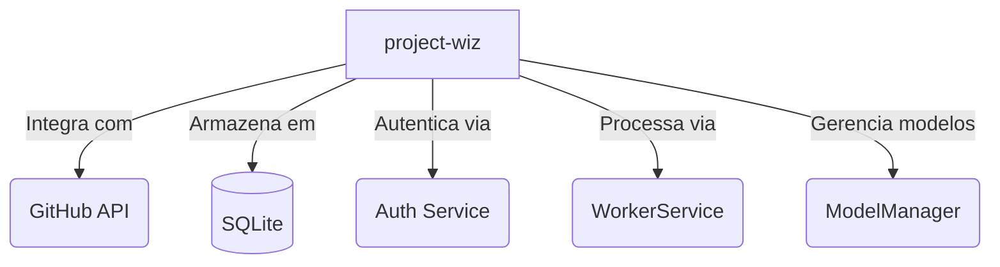
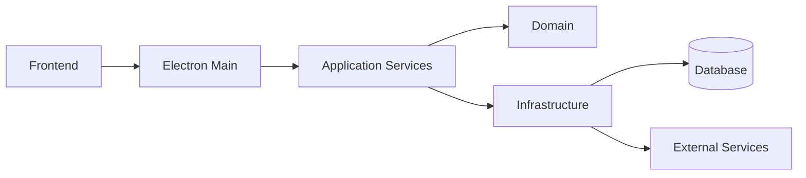

# Visão Arquitetural Detalhada

## 1. Contexto do Sistema

## 2. Componentes Principais

### 2.1 Core
- **Modos:** Gerencia diferentes modos de operação
- **Ferramentas:** Execução de pipelines LLM
- **MCP:** Integração com servidores MCP

### 2.2 Client
- **UI:** Interface React com Electron
- **Hooks:** useLLM, useHistory, useAuth
- **Temas:** Suporte a dark/light mode

### 2.3 Infrastructure
- **Database:** SQLite + Drizzle ORM
- **Config:** Vite multi-config
- **Testes:** Vitest + Testing Library

## 3. Diagrama de Containers

## 4. Decisões Chave

1. **Clean Architecture** ([ADR-0012](decisions/adr-0012.md))
2. **WorkerService** ([ADR-0007](decisions/adr-0007.md))
3. **ModelManager** ([ADR-0010](decisions/adr-0010.md))
4. **Documentação** ([ADR-0020](decisions/adr-0020.md))

## 5. Evolução Arquitetural

| Versão | Mudanças Principais | Data |
|--------|---------------------|------|
| 1.0 | Implementação inicial | 15/03/2025 |
| 1.1 | Adoção Clean Architecture | 01/04/2025 |
| 2.0 | Refatoração WorkerService | 10/04/2025 |

[Atualizado em 17/04/2025 conforme ADR-0020 e ADR-0021]