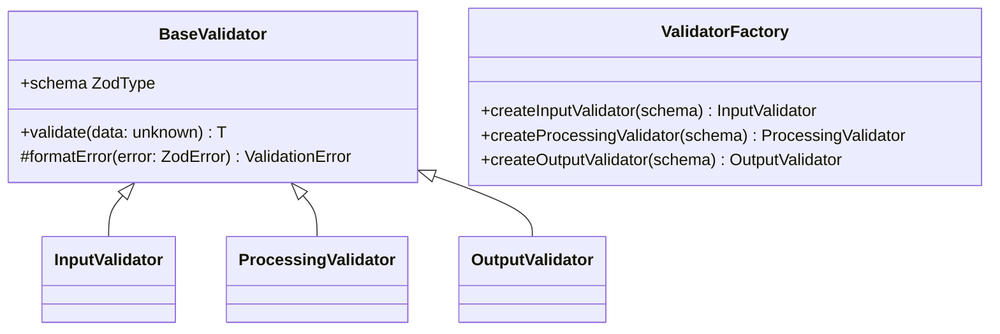

# Sistema de Validação da Infraestrutura

## Visão Geral
Implementação de validações robustas na camada de infraestrutura seguindo o ADR-0019. Combina:
- Validação estrutural com Zod
- Validadores customizados para regras complexas
- Design by Contract para interfaces críticas

## Camadas de Validação
1. **Entrada**: Validação imediata de payloads/requests
2. **Processamento**: Verificação de invariantes durante operações
3. **Saída**: Garantia de conformidade com contratos

## Estrutura Principal


## Tipos Básicos
```typescript
// Exemplo de tipos compartilhados
export const StringValidation = z.string().min(1).max(255);
export const IdValidation = z.string().uuid();
export const EmailValidation = z.string().email();
```

## Exemplo de Uso
### Criando um Validador
```typescript
import { ValidatorFactory, StringValidation } from '...';

const UserSchema = z.object({
  id: IdValidation,
  name: StringValidation,
  email: EmailValidation
});

const userValidator = ValidatorFactory.createInputValidator(UserSchema);
```

### Validando Dados
```typescript
try {
  const validUser = userValidator.validate(inputData);
} catch (error) {
  if (error.code === 'INVALID_INPUT') {
    // Tratar erro específico
  }
}
```

## Boas Práticas
1. **Reutilização**: Use os validadores básicos compartilhados sempre que possível
2. **Erros Específicos**: Implemente mensagens de erro claras por contexto
3. **Testes**: Valide todos os casos extremos nos testes unitários

## Referências
- [ADR-0019: Validações na Infraestrutura](./adr/adr-0019-validacoes-infraestrutura.md)
- [Documentação Zod](https://zod.dev/)