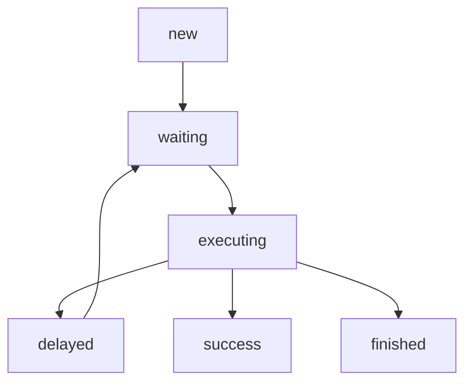

---

## Documentação da Arquitetura: Sistema de Jobs e Workers

### 1. Visão Geral

Este documento descreve a arquitetura do nosso sistema de processamento assíncrono, focado na execução de unidades de trabalho chamadas **Jobs** por **Workers (Agentes)**, gerenciadas por uma **Fila (Queue)** com persistência em SQLite.

---

### 2. Conceitos Fundamentais

* **Job**: A representação persistida de uma unidade de trabalho no sistema. É um registro de dados que descreve "o que" precisa ser feito. Uma Job é gerenciada exclusivamente pela Fila.
* **Task**: É a lógica de execução em memória para um tipo específico de trabalho. A Task sabe "como" interagir com serviços externos para realizar a parte computacional de uma Job. A Task não se preocupa com persistência ou status de fila.
* **Fila (Queue)**: O componente central responsável pelo gerenciamento do ciclo de vida das Jobs. Ela persiste o estado das Jobs, controla as transições de status, gerencia retentativas, atrasos e dependências. Sua persistência inicial é em SQLite.
* **Worker**: Uma classe que recebe a fila a ser escutada (identificada pelo ID do agente) e a função de processamento que será executada. O Worker é responsável por orquestrar a execução e notificar a Fila sobre o desfecho da Job.
* **Agente**: Contém a lógica específica de como executar uma determinada Task. A função de processamento passada para o Worker é um método da classe do Agente.

---

### 3. Entidade Job

A entidade `Job` armazena todas as informações necessárias para o gerenciamento de uma unidade de trabalho pela Fila.

* `id`: Identificador único da Job.
* `name`: Nome da Job.
* `payload`: Payload de entrada da Job, não pode ser alterado internamente durante a execução da Job.
* `data`: Informações que podem ser salvas dentro da execução da Job.
* `result`: Resultado da execução da Job.
* `max_attempts`: Quantidade máxima de tentativas.
* `attempts`: Quantidade de tentativas realizadas.
* `max_retry_delay`: Tempo máximo de espera entre as retentativas.
* `retry_delay`: Tempo de espera entre as retentativas: `((attempts+1) ** 2) * retry_delay`.
* `delay`: Tempo de espera/atraso quando entra no status `delayed`.
* `priority`: Valor de prioridade. **Menor número significa MAIOR prioridade.**
* `status`:
    * `pending`: Pronta para ser executada.
    * `waiting`: Esperando pelas Jobs de qual depende.
    * `delayed`: Postergado por delay (pode ser por conta de um retry ou por já ter sido inserida com delay de início).
    * `finished`: Quando foi concluída com ou sem erro de execução.
    * `executing`: Durante o processamento da Job.
* `depends_on`: Lista de `jobIds` da qual essa Job depende para poder ser executada. A Job receberá a saída dessas Jobs como parte do seu `payload` (em `job.data`).

#### Transição de Status da Job

* **`pending` -> `executing`**: Worker pegou a Job para processar.
* **`executing` -> `finished`**: Job concluída com sucesso (Agente retorna um valor).
* **`executing` -> `delayed`**: Job não concluída, mas sem erro (Agente não retorna nada). A Job será re-agendada.
* **`executing` -> `failed`**: Ocorreu um erro durante a execução da Job (Agente lançou uma exceção).
* **`failed` -> `delayed`**: A Job é colocada em `delayed` para uma retentativa.
* **`delayed` -> `pending`**: Após o delay (que pode ser 0), a Job está pronta para ser re-executada.
* **Jobs com `depends_on`**: Entram em `waiting` se suas dependências não estiverem `finished`.
* **`waiting` -> `pending`**: Quando todas as dependências estão `finished`, a Job em `waiting` recebe os resultados das dependências em seu `payload` (pela Fila) e passa para `pending`.

---

### 4. Componentes e Fluxo de Interação

#### 4.1. Fila (`Queue`)

* **Responsabilidade Principal**: Gerenciamento de estado e ciclo de vida das **Jobs**.
* **Persistência**: As Jobs são persistidas em SQLite.
* **Funções**: A Fila é a **única** responsável por atualizar o `status` de uma Job, incrementar `attempts`, gerenciar `delay`, `depends_on`, e `result`. Ela recebe notificações do Worker sobre o desfecho da execução.

#### 4.2. Worker

* **Responsabilidade Principal**: Orquestrar a execução das Jobs.
* **Funcionamento**:
    1.  Recebe o ID do agente para saber qual fila escutar.
    2.  Recebe a função de processamento (um método da classe Agente) que será executada.
    3.  Internamente, o Worker pega a **Job** da Fila.
    4.  Chama a função de processamento do Agente, passando a Job.
    5.  **Captura exceções (`throw new Error`)** lançadas pela função de processamento.
    6.  **Com base no sucesso ou no erro capturado**, o Worker notifica a Fila para que esta faça a alteração necessária nos status da Job.

#### 4.3. Agente

* **Responsabilidade Principal**: Executar a lógica da **Task**.
* **Funcionamento**:
    1.  Recebe uma **Job** do Worker.
    2.  Instancia a classe **Task** apropriada (que sabe interagir com a LLM), usando os dados da Job e as **Tools** do Agente.
    3.  Executa a `taskInstance`. O Agente não sabe sobre a fila ou o status da Job.

#### **Regras de Retorno do Agente (para o Worker):**

* **Retorno de Sucesso (retorna um valor):**
    * **Significado**: A Task concluiu seu trabalho para esta Job.
    * **Ação do Worker**: Notifica a Fila sobre o sucesso e o resultado. A Fila marca a **Job como `finished`**.
* **Retorno Vazio (`return;` ou `return undefined/null`):**
    * **Significado**: A Task não concluiu, mas não houve um erro. Precisa de mais passos e deve ser re-agendada.
    * **Ação do Worker**: Notifica a Fila sobre a necessidade de continuação. A Fila coloca a **Job em `delayed`** (e depois `pending` se o delay for 0).
* **Lançamento de Erro (`throw new Error`):**
    * **Significado**: Ocorreu uma falha na execução da Task.
    * **Ação do Worker**: Captura a exceção e notifica a Fila sobre a falha. A Fila lida com o **`retry`** ou marca a Job como `failed` (se `max_attempts` atingido).

#### 4.4. Task

* **Responsabilidade Principal**: Encapsular a lógica de interação com LLMs e o uso de **Tools**.
* **Funcionamento**:
    * Recebe os dados da Job e as **Tools** injetadas pelo Agente.
    * Realiza chamadas à LLM usando o `ai-sdk`.
    * A LLM usa **Tools** fornecidas.
    * O retorno da Task (ou a ausência dele) e o lançamento de erros seguem as regras definidas para o Agente.

---

### 5. Interação com LLMs e Tools

* As chamadas para LLMs são feitas usando o `ai-sdk`, fornecendo **Tools** para serem executadas.
* Uma "step" da Job pode ter várias chamadas à LLM. Uma step finaliza quando a LLM usa a Tool `finalAnswer`.
* A Tool `finalAnswer` possui os parâmetros `answer` e `taskFinished` (booleano).
* As **Tools** são de dois tipos: **Tools do Agente** (genéricas) e **Tools da Task/Job** (específicas). O `tipo da task` no `payload` da Job influencia como o prompt é criado e quais **Tools** (além das do Agente) estão disponíveis. A classe **Task** cuida de quais **Tools** estarão disponíveis.