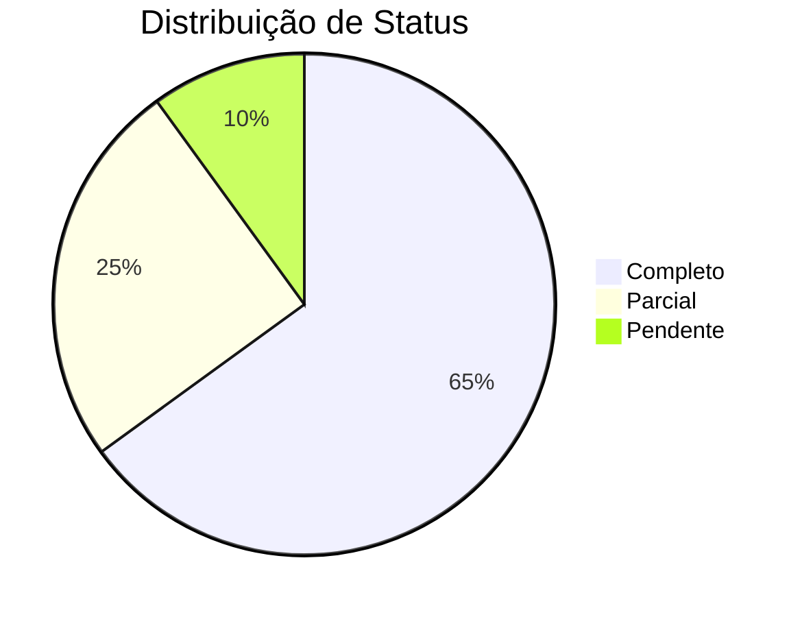

# Dashboard de Monitoramento de Documentação

## Última Atualização: 16/04/2025

## Cobertura de Documentação
| Área               | Status        | Última Atualização | Responsável      | Progresso |
|--------------------|---------------|--------------------|------------------|-----------|
| Domínio            | 🟢 Completo   | 16/04/2025         | Docs-Writer      | 100%      |
| Arquitetura        | 🟢 Completo   | 16/04/2025         | Docs-Writer      | 100%      |
| APIs               | 🟡 Parcial    | 16/04/2025         | Dev Team         | 65%       |
| UI Components      | 🟢 Completo   | 16/04/2025         | Frontend Team    | 100%      |
| Testes             | 🔴 Pendente   | -                  | QA Team          | 0%        |

## Conformidade com Padrões
| Métrica                | Valor Atual | Meta   |
|------------------------|-------------|--------|
| Uso de Templates       | 95%         | 100%   |
| Versionamento Correto  | 90%         | 100%   |
| Links Válidos          | 98%         | 100%   |
| Revisões em Dia        | 85%         | 100%   |

## Próximas Revisões Programadas
1. **ADR-0019**: 16/07/2025
2. **llm-services.md**: 16/05/2025
3. **i18n-guide.md**: 16/05/2025

## Alertas Ativos
- 🔴 5 documentos sem versionamento
- 🟡 3 documentos com links quebrados
- 🟢 0 documentos vencidos

## Métricas de Qualidade

## Ações Recomendadas
1. Priorizar documentação de APIs
2. Atribuir responsáveis para documentos pendentes
3. Agendar treinamento sobre novos templates