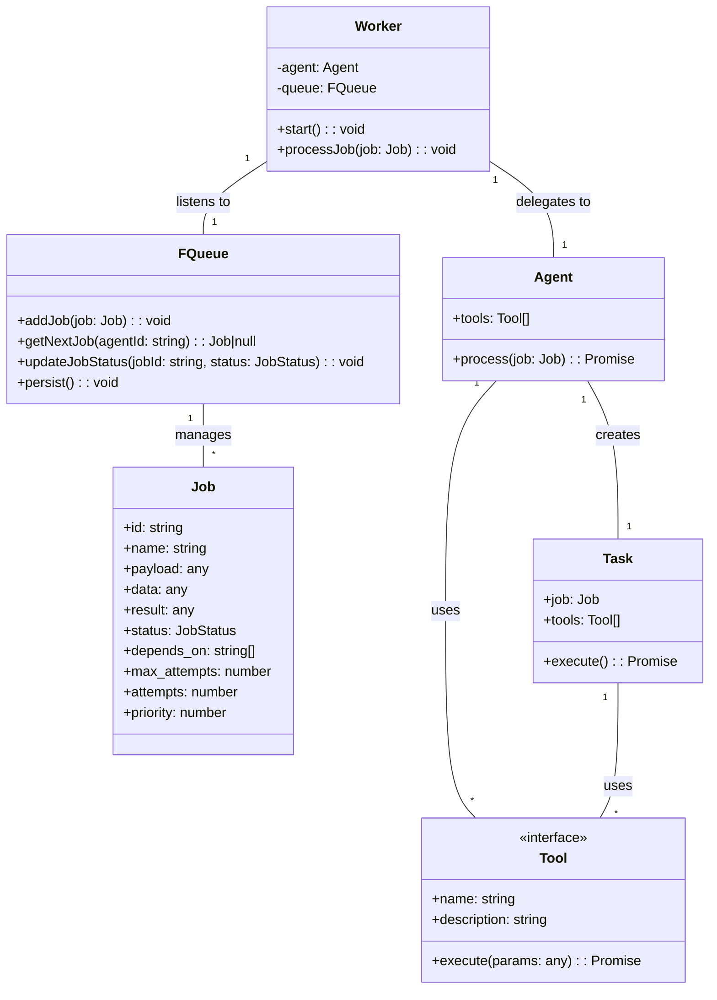
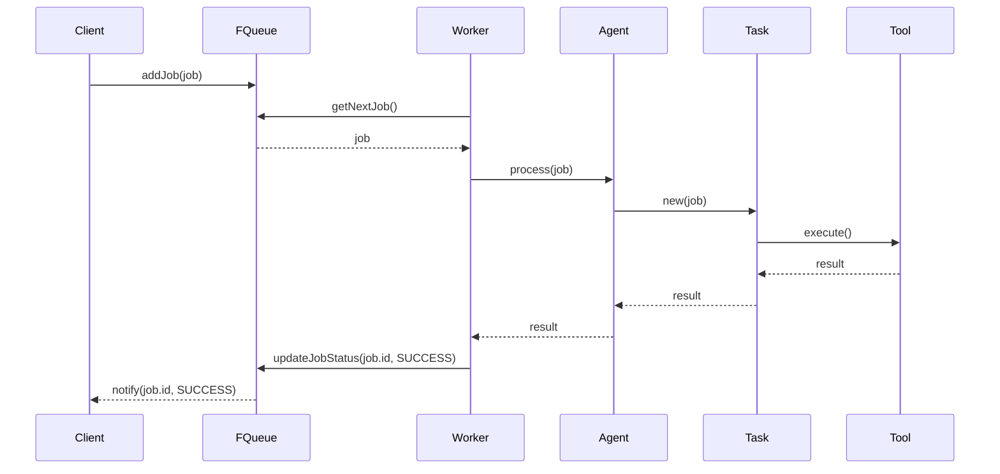

# Agent Architecture

## Component Diagram



## Sequence Diagram



## Key Interfaces

### Job Interface
```typescript
interface Job {
  id: string;
  name: string;
  payload: any;
  data: any;
  result: any;
  status: 'waiting' | 'delayed' | 'success' | 'failed' | 'executing';
  depends_on: string[];
  max_attempts: number;
  attempts: number;
  priority: number;
  delay: number;
  max_retry_delay: number;
  retry_delay: number;
}
```

### Tool Interface
```typescript
interface Tool {
  name: string;
  description: string;
  parameters: z.ZodTypeAny;
  execute(params: any): Promise<any>;
}
```

### Agent Interface
```typescript
abstract class Agent {
  protected tools: Tool[] = [];
  
  constructor(protected queue: FQueue) {}

  abstract process(job: Job): Promise<any>;

  registerTool(tool: Tool): void {
    this.tools.push(tool);
  }
}
```

### FQueue Interface
```typescript
interface FQueue {
  addJob(job: Omit<Job, 'id' | 'status' | 'attempts'>): Promise<Job>;
  getNextJob(agentId: string): Promise<Job | null>;
  updateJobStatus(jobId: string, status: Job['status'], result?: any): Promise<void>;
}