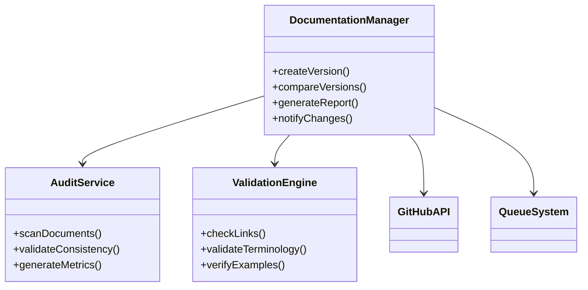

# Design do Sistema de Gestão de Documentação

## 1. Visão Geral
Sistema para gerenciamento centralizado da documentação técnica do projeto, com:
- Versionamento automático
- Validação de conteúdo
- Integração com GitHub e agents
- Geração de relatórios

## 2. Arquitetura



## 3. Componentes Principais

### 3.1 DocumentationManager
- **Responsabilidades**:
  - Gerenciar ciclo de vida dos documentos
  - Controlar versões e revisões
  - Orquestrar integrações

### 3.2 AuditService
- **Responsabilidades**:
  - Executar verificações diárias
  - Gerar métricas de qualidade
  - Alertar sobre inconsistências

### 3.3 ValidationEngine
- **Responsabilidades**:
  - Validar links e referências
  - Verificar terminologia
  - Checar exemplos de código

## 4. Fluxos Principais

### 4.1 Versionamento de Documentos
1. Mudança detectada no arquivo
2. Criação de nova versão
3. Armazenamento no histórico
4. Notificação aos stakeholders

### 4.2 Validação Automática
1. Scanner diário acionado
2. Execução das verificações
3. Geração de relatório
4. Criação de issues para problemas

## 5. Integrações

### 5.1 GitHub API
- Monitorar mudanças em docs/
- Criar tags para versões
- Atualizar issues relacionadas

### 5.2 Sistema de Filas
- Processar verificações em background
- Gerenciar notificações
- Orquestrar tasks assíncronas

## 6. Modelo de Dados

```typescript
interface DocumentVersion {
  id: string;
  path: string;
  content: string;
  hash: string;
  createdAt: Date;
  author: string;
  metadata: {
    links: string[];
    terms: string[];
    examples: number;
  };
}
```

## 7. Plano de Implementação

1. **Fase 1**: Core Module (2 semanas)
   - Implementar classes base
   - Sistema de versionamento
   - Integração básica com GitHub

2. **Fase 2**: Validação (1 semana)
   - Módulo de auditoria
   - Motor de validação
   - Relatórios básicos

3. **Fase 3**: Melhorias (1 semana)
   - Otimizações de performance
   - Dashboard de métricas
   - Testes completos

## 8. Referências
- [Issue #45 - Gestão de Documentação](docs/issues/README.md)
- [Padrões de Documentação](docs/standards.md)
- [Arquitetura do Sistema](docs/architecture.md)