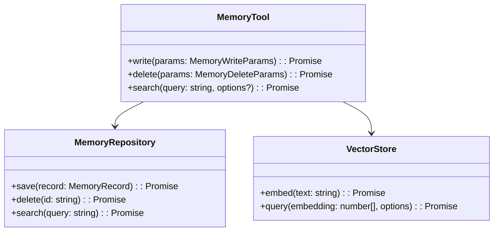

# Arquitetura do Sistema de Tools

## Visão Geral

O sistema de tools permite que os agentes interajam com o ambiente e realizem tarefas específicas. As tools seguem os princípios da Clean Architecture, sendo divididas em:

1. **Camada Core**: Define interfaces e contratos
2. **Camada Infrastructure**: Implementações concretas
3. **Camada Application**: Integração com o sistema de agentes

## MemoryTool

### Diagrama de Componentes

### Fluxo de Operações

1. **Write**:
   - Validação dos parâmetros com Zod
   - Geração de embedding do conteúdo
   - Persistência no repositório
   - Indexação no vector store

2. **Search**:
   - Geração de embedding da query
   - Busca semântica no vector store
   - Recuperação dos registros completos
   - Ordenação por relevância

## TaskTool

(Será documentado após implementação da MemoryTool)

## Princípios de Implementação

- Tipagem estrita com TypeScript
- Validação de entrada com Zod
- Separação clara de responsabilidades
- Testabilidade
- Documentação completa