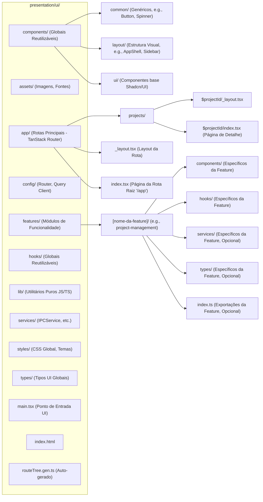

# Padrões de Código e Diretrizes de Desenvolvimento para o Project Wiz

## 1. Introdução

Este documento é o guia mestre e a fonte única de verdade para todos os padrões de codificação, estilo, e boas práticas de desenvolvimento no Project Wiz. Seu propósito é garantir a criação de um codebase consistente, de alta qualidade, manutenível, legível e robusto.

Ele consolida e detalha as decisões formais tomadas nas diversas **Architecture Decision Records (ADRs)** do projeto, que podem ser encontradas em `docs/reference/adrs/`. Enquanto as ADRs registram as decisões e suas justificativas em um momento específico, este documento serve como um manual prático e vivo, aplicando essas decisões ao contexto diário de desenvolvimento.

Adicionalmente, este guia complementa o documento de arquitetura principal, `docs/reference/software-architecture.md`, que descreve a visão arquitetural de alto nível, as camadas e os principais componentes do sistema. Enquanto o documento de arquitetura foca no "o quê" e no "porquê" da estrutura, este guia foca no "como" implementar o código dentro dessa arquitetura.

A adesão estrita a este documento é mandatória para todo o código novo e para refatorações no Project Wiz, tanto para desenvolvedores humanos quanto para Agentes de IA. O objetivo é um codebase exemplar, e isso requer atenção meticulosa aos detalhes, não apenas o cumprimento mínimo das regras.

## 2. Princípios Fundamentais de Design

Os seguintes princípios de design de software são a base para nossas decisões arquiteturais e de codificação. Eles são cruciais para alcançar a qualidade e manutenibilidade desejadas. Detalhes mais amplos sobre sua aplicação na arquitetura geral podem ser encontrados em `docs/reference/software-architecture.md`.

*   **DRY (Don't Repeat Yourself - Não se Repita):**
    *   **Definição:** Evite a duplicação de código, lógica e conhecimento. Abstraia comportamentos comuns em funções, classes, módulos ou serviços reutilizáveis.
    *   **Porquê:** Reduz a redundância, melhora a manutenibilidade (alterações são feitas em um só lugar), diminui a chance de inconsistências e facilita a compreensão, pois o comportamento é definido uma única vez.
    *   **Aplicação no Project Wiz:**
        *   Criação de Objetos de Valor (VOs) para encapsular dados com regras de validação e formatação próprias, evitando lógica duplicada em múltiplos locais (ver **ADR-010**).
        *   Uso de Serviços de Aplicação para orquestrar lógica de negócios que pode ser invocada por diferentes Casos de Uso (ver **ADR-012**).
        *   Desenvolvimento de hooks customizados no frontend para encapsular lógica de UI reutilizável (ver **ADR-025**).

*   **KISS (Keep It Simple, Stupid - Mantenha Simples, Estúpido):**
    *   **Definição:** Priorize soluções simples e diretas em detrimento de complexidade desnecessária ou engenharia excessiva (over-engineering).
    *   **Porquê:** Código simples é mais fácil de entender, testar, depurar e manter. Complexidade acidental aumenta a carga cognitiva e a probabilidade de erros.
    *   **Aplicação no Project Wiz:**
        *   Preferir implementações diretas e claras, mesmo que uma solução "mais inteligente" ou "mais genérica" seja possível, se esta última adicionar complexidade sem um benefício claro e imediato.
        *   Adoção de padrões de design apenas quando a complexidade do problema realmente os justifica.

*   **YAGNI (You Aren't Gonna Need It - Você Não Vai Precisar Disso):**
    *   **Definição:** Implemente apenas as funcionalidades e abstrações que são estritamente necessárias com base nos requisitos atuais. Evite adicionar código especulativamente para um futuro incerto.
    *   **Porquê:** Previne o desperdício de esforço em funcionalidades que podem nunca ser usadas, mantém o código mais enxuto, focado e reduz a complexidade geral do sistema.
    *   **Aplicação no Project Wiz:**
        *   Focar na entrega de valor para os requisitos definidos para o MVP ou para o incremento atual.
        *   Evitar a criação de abstrações genéricas ou pontos de extensão complexos antes que a necessidade real seja identificada e compreendida.

*   **Clean Code (Código Limpo):**
    *   **Definição:** Escreva código que seja fácil de ler, entender e modificar por qualquer desenvolvedor da equipe (incluindo seu "eu" futuro). Siga as práticas descritas por Robert C. Martin e outros.
    *   **Porquê:** Código limpo melhora a colaboração, reduz a curva de aprendizado, diminui a probabilidade de introdução de bugs durante modificações e torna o desenvolvimento mais eficiente e prazeroso.
    *   **Aplicação no Project Wiz:**
        *   Adesão estrita às convenções de nomenclatura (ADR-028), formatação (Prettier), e linting (ESLint).
        *   Aplicação dos princípios SOLID e Object Calisthenics (ADR-016).
        *   Escrever funções e métodos curtos e com responsabilidade única.

*   **SOLID:** Estes cinco princípios de design orientado a objetos ajudam a criar software mais compreensível, flexível e manutenível. A aplicação destes princípios é fundamental na estruturação das camadas da Clean Architecture (ver `docs/reference/software-architecture.md`).
    *   **S - Single Responsibility Principle (Princípio da Responsabilidade Única):**
        *   **Definição:** Uma classe, módulo ou função deve ter apenas uma razão para mudar, ou seja, deve ter apenas uma responsabilidade ou tarefa bem definida.
        *   **Porquê:** Torna os componentes mais focados, coesos, fáceis de entender, testar e menos propensos a efeitos colaterais quando modificados.
        *   **Aplicação no Project Wiz:** Entidades e VOs com responsabilidades claras (ADR-010), Casos de Uso focados em uma única operação de aplicação (ADR-012), Serviços de Aplicação com um conjunto coeso de funcionalidades relacionadas.
    *   **O - Open/Closed Principle (Princípio Aberto/Fechado):**
        *   **Definição:** Entidades de software devem ser abertas para extensão, mas fechadas para modificação do seu código fonte já testado.
        *   **Porquê:** Permite adicionar novas funcionalidades (extensões) sem alterar código existente e estável, reduzindo o risco de introduzir bugs em funcionalidades antigas e promovendo a reutilização através de abstrações.
        *   **Aplicação no Project Wiz:** Uso de interfaces (Portas) para Adaptadores de Infraestrutura (ADR-018) permite adicionar novas implementações (e.g., um novo provedor de LLM) sem modificar o código da camada de aplicação que usa a interface.
    *   **L - Liskov Substitution Principle (Princípio da Substituição de Liskov):**
        *   **Definição:** Subtipos devem ser substituíveis por seus tipos base sem alterar a corretude ou o comportamento esperado do programa. Ou seja, uma classe filha deve poder ser usada em qualquer lugar que sua classe pai é esperada, sem causar problemas.
        *   **Porquê:** Garante que a herança (e polimorfismo) seja usada corretamente, mantendo a consistência, a previsibilidade do sistema e a integridade dos contratos estabelecidos pelas classes base.
        *   **Aplicação no Project Wiz:** Ao usar herança (e.g., `AbstractEntity` - ADR-010), garantir que as classes filhas respeitem o contrato da classe base.
    *   **I - Interface Segregation Principle (Princípio da Segregação de Interfaces):**
        *   **Definição:** Clientes não devem ser forçados a depender de interfaces que não utilizam. É melhor ter várias interfaces pequenas e específicas do cliente do que uma interface grande e genérica.
        *   **Porquê:** Evita interfaces "gordas" (fat interfaces) e o acoplamento desnecessário a métodos não utilizados, resultando em um design mais flexível, modular e coeso.
        *   **Aplicação no Project Wiz:** Interfaces de Repositório específicas por entidade (ADR-011) e interfaces de Adaptadores focadas em um conjunto coeso de operações (ADR-018).
    *   **D - Dependency Inversion Principle (Princípio da Inversão de Dependência):**
        *   **Definição:** Módulos de alto nível (e.g., lógica de aplicação) não devem depender de módulos de baixo nível (e.g., detalhes de infraestrutura). Ambos devem depender de abstrações (interfaces, tipos abstratos). Além disso, abstrações não devem depender de detalhes; detalhes devem depender de abstrações.
        *   **Porquê:** Promove baixo acoplamento e alta flexibilidade, facilitando a substituição de implementações (e.g., trocar um banco de dados ou um serviço externo) e a testabilidade (permitindo mocks para dependências externas).
        *   **Aplicação no Project Wiz:** A Clean Architecture é uma manifestação direta deste princípio. A Camada de Aplicação depende de Portas (interfaces) como `IUserRepository` (ADR-011) ou `ILLMAdapter` (ADR-018), cujas implementações concretas residem na Camada de Infraestrutura. O framework de Injeção de Dependência InversifyJS (ADR-019) é usado para realizar essa inversão.

## 3. Diretrizes de Linguagem: TypeScript

TypeScript é a linguagem primária do Project Wiz. Esta seção detalha como utilizar seus recursos de forma eficaz e padronizada, baseando-se fortemente na **ADR-015: Padrões para Uso Avançado e Melhores Práticas de TypeScript**.

### 3.1. Configurações do Compilador (`tsconfig.json`)
*   **Padrão:** Manter `strict: true` (ou todas as suas sub-flags individuais como `strictNullChecks`, `noImplicitAny`, `noImplicitThis`, `alwaysStrict`, `strictBindCallApply`, `strictFunctionTypes`, `strictPropertyInitialization`) habilitado.
*   **Outras Flags Importantes:**
    *   `esModuleInterop: true`: Para melhor compatibilidade com módulos CommonJS.
    *   `isolatedModules: true`: Garante que cada arquivo possa ser transpilado como um módulo separado.
    *   `forceConsistentCasingInFileNames: true`: Previne problemas de casing em imports.
    *   `noUnusedLocals: true` e `noUnusedParameters: true`: Para manter o código limpo.
    *   `skipLibCheck: true`: Pode acelerar a compilação (usar com cautela).
*   **Porquê:** Configurações estritas maximizam os benefícios de segurança de tipo do TypeScript, detectando mais erros em tempo de compilação e levando a um código mais robusto, confiável e fácil de refatorar.

### 3.2. Tipos Avançados e Utilitários

*   **Utility Types (Tipos Utilitários):** Utilizar os tipos utilitários nativos do TypeScript para manipulações comuns e seguras de tipos.
    *   `Partial<T>`: Constrói um tipo com todas as propriedades de `T` opcionais.
        *   *Uso:* Ideal para representar atualizações parciais de um objeto, como em DTOs de update.
        *   *Exemplo:* `interface User { id: string; name: string; email: string; } type UserUpdateDto = Partial<Omit<User, 'id'>>; // { name?: string; email?: string; }`
    *   `Required<T>`: Constrói um tipo com todas as propriedades de `T` obrigatórias.
    *   `Readonly<T>`: Constrói um tipo com todas as propriedades de `T` como `readonly`.
        *   *Uso:* Para garantir imutabilidade em objetos de configuração, props de componentes React que não devem ser alteradas, ou dados que devem permanecer constantes após a criação.
        *   *Exemplo:* `type AppConfig = Readonly<{ api_key: string; version: string; }>;`
    *   `ReadonlyArray<T>`: Para arrays imutáveis.
    *   `Record<Keys, Type>`: Constrói um tipo de objeto cujas chaves são do tipo `Keys` (geralmente `string | number | symbol`) e os valores são do tipo `Type`.
        *   *Uso:* Excelente para dicionários, mapas ou objetos onde as chaves são dinâmicas mas os valores têm um tipo consistente.
        *   *Exemplo:* `type UserRoles = Record<UserId, 'admin' | 'editor' | 'viewer'>;`
    *   `Pick<Type, Keys>`: Constrói um tipo selecionando um conjunto de propriedades `Keys` de `Type`.
    *   `Omit<Type, Keys>`: Constrói um tipo omitindo um conjunto de propriedades `Keys` de `Type`.
        *   *Uso (Pick/Omit):* Para criar DTOs, tipos de visualização ou subtipos com um subconjunto específico de propriedades de um tipo maior, promovendo interfaces mais enxutas.
        *   *Exemplo:* `interface DetailedUser { id: string; name: string; email: string; address: string; } type UserSummary = Omit<DetailedUser, 'address'>;`
    *   `ReturnType<typeof someFunction>`: Extrai o tipo de retorno de uma função.
    *   `Parameters<typeof someFunction>`: Extrai os tipos dos parâmetros de uma função como uma tupla.
    *   `NonNullable<Type>`: Exclui `null` e `undefined` de `Type`.
        *   *Uso:* Útil após uma verificação de nulidade para informar ao compilador que o valor é definitivamente não-nulo/não-undefined.
    *   `Awaited<Type>`: Obtém o tipo resolvido de uma `Promise`. Útil para tipar o resultado de uma função `async`.
        *   *Exemplo:* `async function fetchData(): Promise<string[]> { /* ... */ } type FetchedData = Awaited<ReturnType<typeof fetchData>>; // string[]`
    *   **Porquê (Utility Types):** Permitem manipulações de tipo complexas de forma declarativa e segura, evitando a necessidade de criar manualmente tipos derivados e reduzindo a verbosidade.

*   **Mapped Types (Tipos Mapeados):** Usar para criar novos tipos baseados na transformação das propriedades de um tipo existente, aplicando modificadores como `readonly` ou `?` (opcional), ou alterando os tipos das propriedades.
    *   **Exemplo (Criar um tipo onde todas as propriedades são funções que retornam o tipo original da propriedade):**
        ```typescript
        // type GetterMethods<T> = {
        //   [K in keyof T as `get${Capitalize<string & K>}`]: () => T[K]
        // };
        // interface Point { x: number; y: number; }
        // type PointGetters = GetterMethods<Point>;
        // // Result: { getX: () => number; getY: () => number; }
        ```
    *   **Porquê:** Permite criar tipos derivados de forma programática e DRY, mantendo uma relação clara com o tipo original.

*   **Conditional Types (Tipos Condicionais):** Usar a sintaxe `T extends U ? X : Y` para criar tipos que são escolhidos dinamicamente com base em uma condição de tipo. Sąo a base para muitos tipos utilitários avançados.
    *   **Exemplo (Extrair o tipo do conteúdo de uma `Box` ou retornar `never`):**
        ```typescript
        // type BoxedValue<T> = { value: T };
        // type Unbox<B> = B extends BoxedValue<infer V> ? V : never;

        // type NumberBox = BoxedValue<number>; // { value: number }
        // type UnboxedNumber = Unbox<NumberBox>; // number
        // type NotABox = Unbox<string>; // never
        ```
    *   **Porquê:** Permitem lógica de tipo sofisticada e a criação de abstrações de tipo poderosas, especialmente úteis em bibliotecas ou código genérico complexo.

*   **Template Literal Types (Tipos de Template Literal):** Usar para criar tipos de string específicos baseados na concatenação de strings e outros tipos literais.
    *   **Exemplo (Criar tipos para nomes de eventos com prefixo e sufixo):**
        ```typescript
        // type HttpMethod = 'GET' | 'POST' | 'PUT' | 'DELETE';
        // type ApiRoute = `/api/${string}`;
        // type Endpoint = `${HttpMethod} ${ApiRoute}`;

        // const getProjects: Endpoint = 'GET /api/projects';
        // // const postUser: Endpoint = 'POST /users'; // Erro: '/users' não corresponde a ApiRoute
        ```
    *   **Porquê:** Permitem modelar e validar formatos de string específicos em tempo de compilação, aumentando a segurança de tipo para constantes ou identificadores baseados em string.

*   **Indexed Access Types (`Type[Key]`):** Usar para acessar o tipo de uma propriedade específica `Key` de um tipo `Type`.
    *   **Exemplo:**
        ```typescript
        // interface AppSettings {
        //   theme: 'dark' | 'light';
        //   notifications: { enabled: boolean; sound: string };
        // }
        // type ThemeType = AppSettings['theme']; // 'dark' | 'light'
        // type NotificationSoundType = AppSettings['notifications']['sound']; // string
        ```
    *   **Porquê:** Permite referenciar tipos de subpropriedades de forma dinâmica e segura, útil para criar tipos relacionados ou acessar partes de um tipo maior.

### 3.3. Genéricos (`<T>`)

*   **Padrão:** Usar genéricos para criar funções, classes, interfaces e tipos que podem operar sobre uma variedade de tipos de dados de forma segura e reutilizável.
*   **Constraints Genéricas (`<T extends SomeType>`):** Aplicar constraints para especificar que um tipo genérico deve atender a um certo contrato (e.g., ter certas propriedades ou métodos), permitindo o acesso seguro a essas propriedades dentro da lógica genérica.
    *   **Exemplo (Função que opera em objetos com uma propriedade `id` e `name`):**
        ```typescript
        // interface IdentifiableAndNameable { id: string | number; name: string; }
        // function createLabel<T extends IdentifiableAndNameable>(item: T): string {
        //   return `${item.name} (ID: ${item.id})`;
        // }
        // const userLabel = createLabel({ id: 1, name: "Alice", age: 30 }); // OK
        // // const productLabel = createLabel({ code: "P123", price: 100 }); // Erro: 'code' e 'price' não satisfazem a constraint
        ```
*   **Inferência:** Deixar o TypeScript inferir os tipos genéricos sempre que possível para manter o código conciso. Especificar os tipos genéricos explicitamente (<TipoConcreto>) se a inferência falhar, for ambígua, ou se a clareza for comprometida.
*   **Quando Usar:** Quando uma funcionalidade, estrutura de dados ou contrato pode ser aplicado a diferentes tipos de dados sem alterar sua lógica fundamental ou estrutura.
*   **Porquê:** Promove DRY (Don't Repeat Yourself) e reutilização de código, mantendo a segurança de tipo e evitando a necessidade de `any` ou duplicação de código para diferentes tipos.

### 3.4. Type Guards (Guardas de Tipo) e Type Narrowing (Estreitamento de Tipo)

*   **Padrão:** Utilizar type guards para estreitar (narrow) o tipo de uma variável dentro de um escopo condicional, permitindo o acesso seguro a propriedades ou métodos específicos do tipo estreitado.
*   **User-Defined Type Guards (Funções `is`):** Criar funções que retornam `parametro is TipoDesejado` para verificações de tipo customizadas e complexas.
    ```typescript
    // interface Circle { kind: "circle"; radius: number; }
    // interface Square { kind: "square"; sideLength: number; }
    // type Shape = Circle | Square;
    // function isSquare(shape: Shape): shape is Square { // Type guard
    //   return shape.kind === "square";
    // }
    // function getArea(shape: Shape): number {
    //   if (isSquare(shape)) {
    //     return shape.sideLength * shape.sideLength; // shape é Square aqui
    //   }
    //   return Math.PI * shape.radius * shape.radius; // shape é Circle aqui
    // }
    ```
*   **Operadores `typeof`, `instanceof`, `in`:**
    *   `typeof variable === "typename"`: Para estreitar tipos primitivos (`string`, `number`, `boolean`, `symbol`, `bigint`, `undefined`, `function`).
    *   `variable instanceof ClassName`: Para estreitar tipos de instâncias de classe.
    *   `"propertyName" in object`: Para verificar a existência de uma propriedade em um objeto (usar com cautela, pois verifica a existência da chave, não o tipo do valor).
*   **Discriminated Unions (Uniões Discriminadas / Tagged Unions):** Este é um padrão altamente recomendado para modelar estados ou tipos variantes de forma segura e exaustiva. Consiste em adicionar uma propriedade literal comum (o "discriminante" ou "tag", e.g., `kind`, `type`, `status`) em cada tipo da união. Permite narrowing exaustivo com `switch` ou `if/else if` statements.
    *   **Exemplo (Resposta de API com discriminante `status`):**
        ```typescript
        // interface ApiSuccessResponse<TData> { status: 'success'; data: TData; }
        // interface ApiErrorResponse { status: 'error'; error: { code: string; message: string; }; }
        // type ApiResponse<TData> = ApiSuccessResponse<TData> | ApiErrorResponse<TData>;

        // function handleApiResponse<TData>(response: ApiResponse<TData>) {
        //   switch (response.status) {
        //     case 'success':
        //       console.log("Data:", response.data); // response é ApiSuccessResponse<TData>
        //       break;
        //     case 'error':
        //       console.error("Error:", response.error.message); // response é ApiErrorResponse
        //       break;
        //     default:
        //       const _exhaustiveCheck: never = response; // Garante que todos os casos foram tratados
        //       return _exhaustiveCheck;
        //   }
        // }
        ```
*   **Porquê:** Permite trabalhar com tipos de união e `unknown` de forma segura e explícita, garantindo que o código acesse apenas propriedades ou métodos que realmente existem no tipo estreitado, prevenindo erros em tempo de execução. A verificação de exaustividade com `never` em uniões discriminadas é uma prática poderosa.

### 3.5. `unknown` vs. `any`

*   **Padrão:** **SEMPRE preferir `unknown` em vez de `any`** quando o tipo de um valor não é conhecido antecipadamente (e.g., dados de uma API externa, conteúdo de um arquivo, entrada do usuário).
    *   `unknown` é o "irmão type-safe" do `any`. Ele força uma verificação de tipo explícita (usando type guards, `instanceof`, asserção de tipo após verificação) antes que qualquer operação possa ser realizada sobre o valor.
    *   `any` desabilita efetivamente todas as verificações de tipo para aquela variável, tornando-se uma "porta de escape" perigosa que deve ser evitada a todo custo, pois anula os benefícios do TypeScript.
*   **Quando `any` é (cautelosamente e raramente) Aceitável:**
    *   Ao interagir com código JavaScript legado que não pode ser migrado ou tipado.
    *   Para algumas bibliotecas de terceiros muito dinâmicas que não possuem tipos adequados (e não há tipos da comunidade em `@types/`).
    *   Em código de teste para mocks muito complexos onde a tipagem completa seria excessivamente verbosa e não traria benefício proporcional (mesmo assim, buscar alternativas).
    *   **Sempre justifique o uso de `any` com um comentário explicando o porquê e restrinja seu escopo ao mínimo absoluto.**
*   **Exemplo (`unknown` e Type Guard):**
    ```typescript
    // async function fetchDataFromExternalApi(endpoint: string): Promise<unknown> {
    //   const response = await fetch(endpoint);
    //   return response.json();
    // }

    // interface ExpectedData { id: number; value: string; }
    // const ExpectedDataSchema = z.object({ id: z.number(), value: z.string() }); // Usando Zod para validação

    // async function processExternalData() {
    //   const rawData = await fetchDataFromExternalApi("/api/some-data");

    //   // Validando e estreitando o tipo de 'unknown'
    //   const validationResult = ExpectedDataSchema.safeParse(rawData);
    //   if (validationResult.success) {
    //     const typedData: ExpectedData = validationResult.data;
    //     console.log(typedData.id, typedData.value.toUpperCase()); // Acesso seguro
    //   } else {
    //     console.error("Invalid data structure received:", validationResult.error.flatten());
    //   }
    // }
    ```
*   **Porquê:** `unknown` mantém a segurança de tipo do sistema, forçando o desenvolvedor a lidar explicitamente com o tipo desconhecido de forma segura, enquanto `any` sacrifica essa segurança e pode esconder bugs que só aparecerão em tempo de execução.

### 3.6. Enums

*   **Padrão:**
    *   Para conjuntos simples e fixos de valores string, **prefira Tipos de União Literal** (e.g., `type OrderStatus = 'PENDING' | 'PROCESSING' | 'SHIPPED';`). São mais leves e diretos.
    *   Use `enum` do TypeScript quando:
        *   Se necessita de um objeto no runtime que mapeia nomes para valores (e vice-versa para enums numéricos).
        *   Para interoperabilidade com APIs ou código legado que espera ou retorna enums numéricos.
        *   Para conjuntos de constantes numéricas onde os valores em si são importantes e podem não ser sequenciais, ou quando se deseja um comportamento de bit flags.
    *   Se usar `enum`, prefira `const enum` quando os valores são usados apenas em contextos onde podem ser inlined em tempo de compilação (e.g., não precisa iterar sobre as chaves/valores do enum no runtime). `const enum` é completamente removido durante a transpilação, resultando em código JavaScript menor.
    *   Para enums string, os valores devem ser explícitos para evitar que a refatoração do nome da chave altere o valor.
*   **Exemplo (String Literal Union vs. String Enum vs. Const Enum):**
    ```typescript
    // Preferido para status simples:
    type PaymentStatus = 'PENDING' | 'COMPLETED' | 'FAILED';
    let status: PaymentStatus = 'PENDING';

    // String Enum (se o objeto enum for útil no runtime ou para maior clareza em alguns contextos):
    enum LogLevel {
      ERROR = "ERROR",
      WARN = "WARN",
      INFO = "INFO",
      DEBUG = "DEBUG"
    }
    function logMessage(level: LogLevel, message: string) { /* ... */ }
    logMessage(LogLevel.ERROR, "Falha crítica no sistema!");

    // Const Enum (valores inlinados, sem objeto no runtime):
    const enum Direction { UP, DOWN, LEFT, RIGHT }
    let move: Direction = Direction.UP; // 'move' será '0' no JavaScript transpilado
    ```
*   **Porquê:** Uniões literais são frequentemente a opção mais simples e leve para strings. Enums (especialmente `const enum`) podem ser eficientes para valores numéricos ou quando o objeto enum é necessário, mas sua necessidade deve ser avaliada caso a caso para evitar verbosidade desnecessária ou as particularidades dos enums JavaScript (como enums numéricos reversos).

### 3.7. Módulos e Namespaces

*   **Padrão:** Utilizar exclusivamente Módulos ES6 (`import`/`export`) para organização de código em arquivos. Cada arquivo `.ts` ou `.tsx` é implicitamente um módulo.
*   **Desencorajar Uso de `namespace`:** O uso de `namespace` do TypeScript (anteriormente "internal modules") deve ser FORTEMENTE DESENCORAJADO para organizar código dentro do projeto.
    *   **Exceções Raras:**
        *   Ao criar arquivos de declaração de tipo ambiente (`.d.ts`) para bibliotecas JavaScript globais (não modulares) muito antigas que expõem seus tipos em um objeto global.
        *   Para agrupar um conjunto grande de tipos relacionados em um arquivo de declaração, se isso melhorar a organização e não for possível usar módulos.
*   **Porquê:** Módulos ES6 são o padrão moderno para JavaScript e TypeScript, promovem melhor organização de código, encapsulamento, clareza de dependências e são otimizados por ferramentas de build (e.g., para tree-shaking). `namespace` é um padrão mais antigo, menos comum em código moderno e pode levar a uma organização de código menos clara ou a dificuldades com o sistema de módulos ES6.

### 3.8. Sobrecarga de Funções (Function Overloads)

*   **Padrão:** Usar sobrecargas de função com moderação e apenas quando estritamente necessário para fornecer múltiplas assinaturas de tipo para uma única função de implementação. Isso ocorre tipicamente quando uma função pode aceitar diferentes combinações de tipos de parâmetros e/ou ter tipos de retorno diferentes baseados nesses parâmetros, e quando alternativas (como usar tipos de união para parâmetros com narrowing ou um objeto de opções como único parâmetro) não são mais claras ou ergonômicas.
*   **Estrutura:** Defina as assinaturas de sobrecarga (sem corpo) primeiro, seguidas pela assinatura de implementação real (com corpo). A assinatura de implementação deve ser compatível com todas as assinaturas de sobrecarga e geralmente usa `any` ou tipos de união para os parâmetros, necessitando de type guards ou verificações no corpo da função para lidar com as diferentes assinaturas.
*   **Exemplo:**
    ```typescript
    // function formatValue(value: string, mode: 'uppercase'): string;
    // function formatValue(value: number, mode: 'currency', currencySymbol?: string): string;
    // function formatValue(value: Date, mode: 'iso'): string;
    // function formatValue(value: string | number | Date, mode: 'uppercase' | 'currency' | 'iso', option?: string): string {
    //   if (mode === 'uppercase' && typeof value === 'string') {
    //     return value.toUpperCase();
    //   } else if (mode === 'currency' && typeof value === 'number') {
    //     const symbol = option || '$';
    //     return `${symbol}${value.toFixed(2)}`;
    //   } else if (mode === 'iso' && value instanceof Date) {
    //     return value.toISOString();
    //   }
    //   throw new Error('Invalid arguments for formatValue');
    // }
    // const upper = formatValue("hello", "uppercase"); // string
    // const price = formatValue(123.45, "currency", "R$"); // string
    ```
*   **Porquê:** Fornece type-safety e melhor autocompletar em IDEs para funções que genuinamente operam de maneiras diferentes com base nos tipos ou número de argumentos. No entanto, podem aumentar a complexidade da implementação da função e devem ser evitadas se uma assinatura única com tipos de união e narrowing for mais simples.

### 3.9. Decorators

*   **Padrão:**
    *   O uso de Decorators é primariamente para interagir com frameworks ou bibliotecas que os utilizam como parte de sua API, como o InversifyJS para Injeção de Dependência (`@injectable()`, `@inject()`, `@multiInject()`, etc.), conforme detalhado na **ADR-019**.
    *   A criação de decorators customizados para lógica de aplicação (e.g., logging aspect-oriented, caching, transformação de dados) deve ser considerada uma técnica avançada, usada com muita cautela e apenas quando traz um benefício claro em termos de DRY e separação de responsabilidades que não pode ser alcançado de forma mais simples com composição de funções ou classes.
    *   Decorators customizados DEVEM ser bem justificados, documentados extensivamente (seu propósito, como funcionam, e quaisquer efeitos colaterais ou requisitos de configuração) e testados rigorosamente.
*   **Configuração:** Requer que as opções `experimentalDecorators` e `emitDecoratorMetadata` sejam habilitadas no `tsconfig.json` (o que já é o caso para InversifyJS).
*   **Porquê:** Decorators são necessários para frameworks como InversifyJS e podem ser uma ferramenta poderosa para metaprogramação e adicionar comportamento a classes e seus membros de forma declarativa. No entanto, podem adicionar uma camada de "mágica" ou complexidade ao código se usados excessivamente ou para tarefas que poderiam ser resolvidas com padrões mais simples. A depuração de decorators também pode ser mais desafiadora.

### 3.10. Código Assíncrono (`async`/`await`, `Promise`)

*   **Padrão:**
    *   Utilizar `async/await` para todo código assíncrono que envolve Promises. Isso melhora a legibilidade e permite que o fluxo de controle se assemelhe ao código síncrono.
    *   Sempre tratar erros de Promises de forma explícita. Em funções `async`, isso significa usar blocos `try/catch` para capturar rejeições de `await`ed Promises.
    *   Evitar o anti-padrão "async executor" (passar uma função `async` para o construtor de `new Promise((resolve, reject) => { /* async code aqui */ })`). Funções `async` já retornam Promises.
    *   Ao lidar com múltiplas Promises:
        *   `Promise.all()`: Usar quando todas as Promises precisam ser resolvidas com sucesso para continuar, e uma falha em qualquer uma deve rejeitar o conjunto.
        *   `Promise.allSettled()`: Usar quando se deseja esperar que todas as Promises sejam concluídas (resolvidas ou rejeitadas) e então inspecionar o resultado de cada uma individualmente.
        *   `Promise.race()`: Usar quando se deseja o resultado da primeira Promise a ser resolvida ou rejeitada.
    *   Evitar o uso de `void` em Promises não tratadas (e.g., `async function update(): Promise<void> { await someAsyncCall(); }` sem um `try/catch` interno ou tratamento pelo chamador). Isso pode levar a "unhandled promise rejections". Configurar o ESLint (`@typescript-eslint/no-floating-promises`) para detectar isso.
*   **Porquê:** `async/await` torna o código assíncrono significativamente mais fácil de ler, escrever e depurar. O tratamento explícito de erros de Promises é crucial para a robustez da aplicação, prevenindo que exceções não capturadas causem comportamento inesperado ou crashes.

### 3.11. Estilo de Código para Tipos Complexos

*   **Padrão:** Para definições de tipo complexas (e.g., uniões longas, tipos mapeados extensos, tipos condicionais aninhados), usar quebras de linha, indentação e comentários para melhorar a legibilidade, de forma similar a como se formata código regular.
*   Ferramentas como Prettier podem ajudar a formatar tipos de forma consistente, mas a clareza manual pode ser necessária.
*   **Exemplo:**
    ```typescript
    // Ruim: Difícil de ler
    // type ComplexType<T, U> = T extends string ? (U extends number ? { value: T; count: U; } : { value: T; error: string; }) : T extends number ? { result: T[]; } : never;

    // Bom: Mais legível
    // type ComplexType<T, U> = T extends string
    //   ? U extends number
    //     ? { value: T; count: U } // T é string, U é number
    //     : { value: T; error: string } // T é string, U não é number
    //   : T extends number
    //     ? { result: T[] } // T é number
    //     : never; // T não é string nem number
    ```
*   **Porquê:** Definições de tipo complexas podem se tornar tão difíceis de ler e entender quanto código algorítmico complexo se não forem bem formatadas. A clareza é essencial para a manutenibilidade.

## 4. Object Calisthenics no Project Wiz

Os princípios de Object Calisthenics são um conjunto de nove regras que visam promover código orientado a objetos de alta qualidade, coesão e baixo acoplamento. A aplicação detalhada e exemplos para cada regra estão formalizados na **ADR-016: Aplicação Prática de Object Calisthenics no Project Wiz**. Esta seção resume os princípios e reitera sua importância.

*   **1. Apenas Um Nível de Indentação por Método:**
    *   *Resumo:* Extrair lógica aninhada para métodos privados/funções. Usar Guard Clauses.
    *   *Exemplo (Conceitual):* Ver ADR-016 ou `coding-standards.md` para "antes e depois".
*   **2. Não Use a Palavra-Chave `else`:**
    *   *Resumo:* Priorizar Guard Clauses, polimorfismo ou State/Strategy pattern.
    *   *Exemplo (Conceitual):* Ver ADR-016 ou `coding-standards.md`.
*   **3. Envolva Todas as Primitivas e Strings:**
    *   *Resumo:* Usar Objetos de Valor (VOs) para primitivas com significado de domínio (ADR-010).
    *   *Exemplo (Conceitual):* `userId: UserId` em vez de `userId: string`.
*   **4. Coleções de Primeira Classe:**
    *   *Resumo:* Encapsular coleções e suas operações em classes dedicadas.
    *   *Exemplo (Conceitual):* `ActivityLogVO` contendo `LogEntryVO[]` e métodos de manipulação.
*   **5. Apenas Um Ponto Por Linha (Lei de Demeter):**
    *   *Resumo:* Limitar chamadas encadeadas, preferir "Tell, Don't Ask".
    *   *Exemplo (Conceitual):* `order.processPayment()` em vez de `order.getPaymentGateway().chargeCard(...)`.
*   **6. Não Abreviar:**
    *   *Resumo:* Usar nomes completos e descritivos em inglês (ADR-028).
*   **7. Mantenha Todas as Entidades Pequenas (Classes e Métodos):**
    *   *Resumo:* Classes < 100 linhas (ideal < 50), Métodos < 15 linhas (ideal < 10).
*   **8. Nenhuma Classe Com Mais de Duas Variáveis de Instância:**
    *   *Resumo:* Aplicar pragmaticamente, focando no estado interno. Dependências injetadas podem exceder, mas questionar SRP.
*   **9. Sem Getters/Setters/Properties (para acesso/mutação direta de estado):**
    *   *Resumo:* VOs expõem valor via `get`. Entidades expõem estado via `get`, mutações via métodos de negócio retornando nova instância (ADR-010).

## 5. Convenções de Nomenclatura Abrangentes

Convenções de nomenclatura consistentes são vitais. Esta seção sumariza as diretrizes principais, detalhadas na **ADR-028: Convenções Abrangentes de Nomenclatura** e, para aspectos específicos de UI, na **ADR-027: Estrutura de Diretórios e Convenções de Nomenclatura para o Frontend**.

*   **1. Mandato da Língua Inglesa no Código:**
    *   **Padrão:** TODOS os identificadores no código-fonte (variáveis, funções, classes, arquivos, diretórios, etc.) e comentários DEVEM ser em Inglês.
    *   **Porquê:** Inglês é a língua franca no desenvolvimento, facilitando colaboração e uso de ferramentas.
*   **2. Convenções Gerais de Casing:**
    *   **`camelCase`:** Variáveis, parâmetros, nomes de funções/métodos. (e.g., `currentUser`, `calculatePrice()`).
    *   **`PascalCase`:** Classes, Interfaces, Tipos, Enums. (e.g., `UserService`, `IOrderRepository`).
    *   **`UPPER_SNAKE_CASE`:** Constantes, membros de Enums significativos, Tokens de DI. (e.g., `MAX_RETRIES`, `USER_REPOSITORY_TOKEN`).
*   **3. Convenções de Nomenclatura de Arquivos:**
    *   **Padrão Principal:** `kebab-case.ts` (e.g., `job-validator.service.ts`).
    *   **Exceções:**
        *   Componentes React UI: `PascalCase.tsx` (e.g., `UserProfileCard.tsx`).
        *   Hooks React: `useCamelCase.ts` ou `usePascalCase.ts` (e.g., `useAuth.ts`).
    *   **Sufixos Descritivos:** Usar sufixos padronizados (e.g., `.entity.ts`, `.vo.ts`, `.service.ts`, `.repository.ts`, `.adapter.ts`, `.use-case.ts`, `.schema.ts`, `.handlers.ts`, `.config.ts`, `.types.ts`, `.constants.ts`, `.utils.ts`).

### 5.4. Seção Prominente: Convenções de Nomenclatura de Arquivos Detalhadas

Esta seção reitera e expande as convenções para nomenclatura de arquivos, dada sua importância para a organização e legibilidade do projeto.

*   **Regra Principal: Kebab-Case Obrigatório**
    *   Todos os nomes de arquivos DEVEM ser em `kebab-case` (minúsculas, palavras separadas por hífens).
    *   **Exemplos (Bom):**
        *   `user-authentication.service.ts`
        *   `project-settings-form.component.tsx` (se não for um componente React UI principal)
        *   `api-response.types.ts`
        *   `database-migration-001.sql`
        *   `contributing-guide.md`
        *   `package.json` (mantido por convenção npm)
        *   `vite.config.ts` (convenção da ferramenta)

*   **Aplicação Ampla:**
    *   Esta regra aplica-se a TODOS os tipos de arquivo (`.ts`, `.tsx`, `.md`, `.json`, `.sql`, `.yml`, etc.) dentro do projeto.

*   **Exceções Documentadas:**
    *   **Componentes React UI Principais:** Podem usar `PascalCase.tsx` para melhor alinhamento com as convenções de nomenclatura de componentes React (e.g., `UserProfileCard.tsx`, `MainNavigation.tsx`). No entanto, componentes auxiliares ou mais genéricos dentro de uma feature podem seguir o `kebab-case`.
    *   **Hooks React:** Podem usar `useCamelCase.ts` ou `usePascalCase.ts` (e.g., `useAuth.ts`, `useUserProfileData.ts`).
    *   **Frameworks ou Bibliotecas Específicas:** Se um framework, biblioteca ou ferramenta adotada no projeto (e.g., Next.js para roteamento de páginas, arquivos de configuração específicos como `vite.config.ts`, `tailwind.config.ts`) EXPLICITAMENTE requer uma convenção de nomenclatura diferente, essa convenção DEVE ser seguida para esses arquivos específicos.
    *   **Justificativa Mandatória:** Qualquer exceção a esta regra principal (fora as listadas acima) DEVE ser documentada no `README.md` do módulo relevante ou em uma ADR, com uma justificativa clara.

*   **Exemplos Comparativos:**

    | Bom Nome de Arquivo                     | Mau Nome de Arquivo                     | Justificativa do Mau Nome                               |
    | :-------------------------------------- | :-------------------------------------- | :------------------------------------------------------ |
    | `user-profile.service.ts`             | `UserProfileService.ts`                 | Não está em kebab-case.                                 |
    | `data-transformer.util.ts`            | `DataTransformer.ts`                    | Não está em kebab-case.                                 |
    | `image-processor.worker.ts`           | `imageProcessor.worker.ts`              | Não está em kebab-case (camelCase).                     |
    | `README.md`                             | `readme.MD`                             | Casing inconsistente da extensão.                       |
    | `main-styles.css`                       | `MainStyles.css`                        | Não está em kebab-case.                                 |
    | `auth-guard.ts`                         | `Auth_Guard.ts`                         | Usa snake_case em vez de kebab-case.                    |
    | `UserProfileCard.tsx` (Componente UI) | `user-profile-card.component.tsx`       | Para componentes UI React, PascalCase é uma exceção aceita. |
    | `useAuth.ts` (Hook React)             | `auth-hook.ts`                          | Para hooks React, useCamelCase é uma exceção aceita.    |
    | `vite.config.ts` (Ferramenta)         | `vite-config.ts`                        | `vite.config.ts` é a convenção da ferramenta Vite.    |

*   **Porquê:** A consistência no nome de arquivos melhora a previsibilidade, facilita a navegação e a criação de scripts, e reduz a carga cognitiva. O `kebab-case` é amplamente adotado, URL-friendly, e evita problemas de sensibilidade ao caso em diferentes sistemas operacionais.

*   **4. Convenções de Nomenclatura de Diretórios:**
    *   **Padrão Principal:** `kebab-case` (e.g., `user-authentication`, `value-objects`).
    *   **Exceção:** Diretórios de rotas dinâmicas do TanStack Router (e.g., `$projectId`).
*   **5. Padrões Específicos por Tipo de Identificador:**
    *   **Interfaces:** `I[Nome]` (e.g., `IUserRepository`).
    *   **Classes Abstratas:** `Abstract[Nome]` (e.g., `AbstractEntity`).
    *   **Booleanos:** Prefixo `is`, `has`, `should`, `can`, etc. (e.g., `isActive`).
    *   **Eventos (EventEmitter):** `objeto.evento` (e.g., `job.completed`).
    *   **Esquemas Zod:** `[Nome]Schema` (e.g., `CreateUserInputSchema`).
*   **6. Clareza e Descritividade:** Evitar abreviações desnecessárias.

## 6. Estrutura de Arquivos e Diretórios

Uma estrutura de projeto bem organizada é crucial para a navegabilidade, manutenibilidade e compreensão da arquitetura. As convenções aqui detalhadas baseiam-se nas decisões da **ADR-027 (Frontend Directory Structure and Naming Conventions)** para a UI e nas práticas da Clean Architecture para o backend, conforme descrito em `docs/reference/software-architecture.md`.

**Porquê Geral:** Uma estrutura padronizada reduz a carga cognitiva, facilita a localização de código relevante, promove a consistência entre diferentes partes do projeto e simplifica a integração de novos desenvolvedores.

### 6.1. Estrutura do Frontend (`src_refactored/presentation/ui/`)

A interface do usuário (UI) é uma SPA React e sua estrutura visa agrupar arquivos por funcionalidade (feature-sliced) e por tipo técnico.



*   **`app/`**: Contém os componentes de rota e layouts definidos pelo TanStack Router (convenção file-based routing). Ver ADR-027.
    *   **Porquê:** Separa os pontos de entrada de rotas da lógica de features reutilizáveis.
*   **`components/`**: Componentes React globais e reutilizáveis.
    *   `common/`: Pequenos componentes de UI genéricos (e.g., `LoadingSpinner`).
    *   `layout/`: Componentes para a estrutura visual principal (e.g., `AppShell`).
    *   `ui/`: Componentes base da biblioteca Shadcn/UI.
    *   **Porquê:** Promove reuso e consistência visual.
*   **`features/<nome-da-feature>/`**: Módulos de UI agrupados por funcionalidade (e.g., `project-management`, `user-authentication`).
    *   Contém subdiretórios para `components/`, `hooks/`, `pages/` (se não em `app/`), `services/`, `types/` específicos da feature.
    *   **Porquê (Feature-Sliced Design):** Alta coesão, baixo acoplamento, facilita desenvolvimento e manutenção.
*   **Outros diretórios (`assets`, `config`, `hooks`, `lib`, `services`, `styles`, `types`):** Conforme descrito na ADR-027 e no `software-architecture.md`, cada um com seu propósito específico para organizar configurações, utilitários, serviços globais da UI e tipos.

### 6.2. Estrutura do Backend (`src_refactored/`)

Segue a Clean Architecture, detalhada em `docs/reference/software-architecture.md`:

*   **`core/`**: Lógica de negócios central, independente de frameworks.
    *   `domain/<entidade>/`: Contém Entidades (`*.entity.ts`), Objetos de Valor (`*.vo.ts`), e as interfaces de seus repositórios (`<entidade>-repository.interface.ts` em subdiretório `ports/`).
        *   **Porquê (ADR-010, ADR-011):** Isola o domínio, com VOs e Entidades definindo suas próprias regras e os repositórios definindo contratos de persistência agnósticos.
    *   `application/`: Casos de Uso (`*.use-case.ts`), Serviços de Aplicação (`*.service.ts`), DTOs e esquemas Zod (`*.schema.ts`), e Portas para a infraestrutura (`ports/`).
        *   **Porquê (ADR-012):** Orquestra a lógica de domínio e medeia com o mundo externo.
*   **`infrastructure/`**: Implementações concretas de preocupações externas.
    *   `persistence/drizzle/schema/`: Esquemas de tabela Drizzle (`*.schema.ts`) (ADR-017).
    *   `persistence/drizzle/<entidade>/`: Implementações de repositório Drizzle (`*.repository.ts`) e mappers (`*.mapper.ts`) (ADR-017).
    *   `adapters/<tipo_adaptador>/`: Adaptadores para serviços externos (e.g., `llm/openai-llm.adapter.ts`) (ADR-018).
    *   `queue/drizzle/`: Implementação do sistema de filas com Drizzle (`drizzle-queue.facade.ts` e serviços internos) (ADR-020).
    *   `ioc/`: Configuração do InversifyJS (`inversify.config.ts`) (ADR-019).
*   **`presentation/electron/`**: Código específico do Electron.
    *   `main/`: Lógica do processo principal, incluindo `main.ts` e `handlers/` para IPC (ADR-023, ADR-024).
    *   `preload/`: Scripts de preload (`preload.ts`) (ADR-024).
*   **`shared/`**: Código utilitário, tipos comuns, erros customizados (`errors/core.error.ts` e subclasses - ADR-014), DTOs de resposta de caso de uso (`application/use-case-response.dto.ts` - ADR-008). Usar com cautela para não violar dependências da Clean Architecture.

## 7. Formatação de Código (Prettier)

*   **Padrão:** Prettier é a ferramenta padrão para formatação automática de código, garantindo um estilo visual consistente em toda a codebase.
*   **Configuração:** As regras de formatação estão definidas no arquivo `.prettierrc.js` na raiz do projeto. As principais incluem:
    *   Indentação: 2 espaços.
    *   Aspas: Simples (`singleQuote: true`).
    *   Ponto e vírgula: Sempre no final das instruções (`semi: true`).
    *   Vírgula Trailing: `es5` (vírgulas no final de arrays e objetos multi-linha).
    *   Comprimento da Linha: ~120 caracteres (configurável, mas manter um limite razoável).
*   **Integração:**
    *   **ESLint:** Integrado com ESLint via `eslint-config-prettier` para desabilitar regras de estilo do ESLint que conflitam com o Prettier.
    *   **Tailwind CSS (ADR-026):** O plugin `eslint-plugin-tailwindcss` (mencionado na seção de Linting) geralmente inclui ou recomenda um plugin Prettier (`prettier-plugin-tailwindcss`) para ordenar automaticamente as classes utilitárias do Tailwind.
*   **Uso Mandatório:** Formatação automática ao salvar (configuração no editor) é ALTAMENTE RECOMENDADA. Código enviado em Pull Requests DEVE estar formatado pelo Prettier.
*   **Porquê:** Elimina debates sobre estilo de formatação, melhora a legibilidade, e permite que os desenvolvedores foquem na lógica. A consistência visual facilita a leitura e a revisão de código.

## 8. Linting de Código (ESLint)

*   **Padrão:** ESLint é a ferramenta padrão para análise estática de código, identificando padrões problemáticos, potenciais erros e garantindo a adesão a boas práticas de codificação não cobertas pela formatação.
*   **Configuração:** As regras e plugins são definidos em `eslint.config.js` (formato Flat Config).
*   **Plugins Essenciais (conforme menção prévia, a serem formalizados em ADR de Tooling):**
    *   `@typescript-eslint/eslint-plugin` e `@typescript-eslint/parser`: Para código TypeScript.
    *   `eslint-plugin-import`: Para organizar e validar importações.
    *   `eslint-plugin-react` e `eslint-plugin-react-hooks`: Para código React.
    *   `eslint-plugin-jsx-a11y`: Para acessibilidade em JSX.
    *   `eslint-plugin-tailwindcss` (ADR-026): Para regras específicas do Tailwind CSS.
    *   *Sugestões (a serem avaliadas e formalizadas em ADR de Tooling):* `eslint-plugin-sonarjs` (code smells), `eslint-plugin-security` (vulnerabilidades), plugins para nomenclatura de arquivos (e.g., `eslint-plugin-filenames-simple` ou `eslint-plugin-unicorn`).
*   **Uso Mandatório:**
    *   Todo código DEVE passar pelas verificações do ESLint sem erros antes de ser commitado.
    *   Warnings devem ser tratados ou justificados com um comentário `// eslint-disable-next-line ...` se for uma exceção válida e documentada.
    *   Utilizar `npm run lint` e `npm run lint:fix`.
*   **Porquê:** Ajuda a manter a alta qualidade do código, previne erros comuns, melhora a consistência e a manutenibilidade, e reforça os padrões definidos.

## 9. Comentários no Código

As diretrizes para comentários visam maximizar a clareza do código, minimizando a necessidade de explicações externas. Baseado em **ADR-028** e **ADR-016**.

*   **Idioma:** TODOS os comentários DEVEM ser escritos em **Inglês**.
    *   **Porquê:** Consistência com o código e facilita a colaboração global.
*   **Priorizar Código Autoexplicativo:**
    *   **Padrão:** O código deve ser o mais claro e expressivo possível, através de boa nomenclatura (ADR-028), estrutura lógica e adesão a padrões, reduzindo a necessidade de comentários.
    *   **Porquê:** Comentários podem ficar desatualizados; código claro é a melhor documentação.
*   **Quando Comentar:**
    *   **Explicar o "Porquê", Não o "O quê":** Se um bloco de código é complexo e não pode ser simplificado mais, ou se uma decisão de design não é óbvia, o comentário deve explicar *por que* o código está escrito daquela forma, não *o que* ele faz (isso deve ser claro pelo código).
    *   **Documentar Trade-offs:** Explicar por que uma determinada solução foi escolhida em detrimento de outras, especialmente se envolveu trade-offs.
    *   **Workarounds:** Comentar workarounds para bugs de bibliotecas externas ou comportamentos inesperados.
    *   **Documentação de API Pública (JSDoc/TSDoc):** Funções, classes e métodos exportados que formam uma API pública de um módulo ou serviço devem ter comentários de documentação (e.g., TSDoc) explicando seu propósito, parâmetros e tipo de retorno.
*   **O Que Evitar:**
    *   **Comentários Redundantes:** Não comente código que já é óbvio.
    *   **Código Comentado:** Remova código não utilizado. Use o Git para histórico.
    *   **Comentários de Metadados Supérfluos:** (Autores, datas, logs de mudança no arquivo) - Git lida com isso.
*   **Porquê (Geral):** Comentários bem utilizados melhoram a compreensão e manutenção do código. Comentários ruins ou desatualizados pioram.

## 10. Controle de Versão com Git

Práticas consistentes de controle de versão são essenciais para a colaboração e o histórico do projeto. Baseado em **ADR-028**.

*   **Commits Atômicos:**
    *   **Padrão:** Cada commit deve representar uma única mudança lógica, funcional ou correção. Evite commits que misturem múltiplas alterações não relacionadas.
    *   **Porquê:** Facilita a revisão, rastreamento (`git blame`), reversão (`git revert`) e compreensão do histórico.
*   **Mensagens de Commit (Semantic Commits):**
    *   **Padrão:** Siga o padrão [Conventional Commits](https://www.conventionalcommits.org/).
        *   Formato: `tipo(escopo_opcional): descrição concisa no imperativo`
        *   Ex: `feat(auth): implement password reset via email`
        *   Corpo e rodapé opcionais para mais detalhes ou breaking changes/issues.
    *   **Tipos Comuns:**
        | Tipo       | Descrição (Português)                                      |
        | ---------- | ---------------------------------------------------------- |
        | `feat`     | Nova funcionalidade para o usuário                         |
        | `fix`      | Correção de bug para o usuário                             |
        | `docs`     | Mudanças na documentação                                   |
        | `style`    | Formatação, estilos; sem mudança na lógica                |
        | `refactor` | Refatoração de código sem mudança de comportamento externo |
        | `test`     | Adição ou correção de testes                               |
        | `chore`    | Manutenção, build, config de pacotes, etc.                |
        | `perf`     | Melhoria de performance                                    |
        | `ci`       | Mudanças em scripts/config de CI/CD                         |
        | `build`    | Mudanças no sistema de build ou dependências externas      |
        | `revert`   | Reverte um commit anterior                                 |
    *   **Idioma:** Mensagens de commit DEVEM ser em Inglês.
    *   **Porquê:** Histórico legível, automação de changelogs, versionamento semântico.
*   **Nomenclatura de Branches:**
    *   **Padrão:** Usar `kebab-case` e prefixos descritivos.
        *   Features: `feature/nome-da-feature` (e.g., `feature/user-profile-editing`)
        *   Correções: `fix/descricao-curta-do-bug` (e.g., `fix/login-redirect-issue`)
        *   Chores/Refactors: `chore/tarefa-especifica` (e.g., `chore/update-eslint-config`)
    *   **Porquê:** Organização e clareza sobre o propósito da branch.

## 11. Padrões de Tratamento de Erros

Uma estratégia consistente para lidar com erros é crucial para a robustez e depuração. Baseado na **ADR-014: Estratégia Principal de Tratamento de Erros**.

*   **Classe Base `CoreError`:**
    *   **Padrão:** Usar `CoreError` (de `shared/errors/core.error.ts` ou similar) como base para todos os erros customizados da aplicação. Ela inclui `name`, `message`, `code?`, `context?`, `originalError?`.
    *   **Porquê:** Base comum para tratamento polimórfico e inclusão de informações estruturadas.
*   **Tipos de Erro Customizados:**
    *   **Padrão:** Criar classes de erro específicas herdando de `CoreError` (e.g., `ValueError`, `EntityError`, `NotFoundError`, `ApplicationError`, `InfrastructureError`, `AuthenticationError`, `AuthorizationError`).
    *   **Porquê:** Permite tratamento granular e específico baseado no tipo de erro.
*   **Criação e Lançamento:** Lançar (`throw`) instâncias de erros customizados assim que a condição de erro for detectada, preenchendo os campos relevantes.
*   **Encapsulamento (Wrapping):** Erros de camadas inferiores ou bibliotecas DEVEM ser encapsulados em um erro customizado apropriado, com o erro original em `originalError`.
    *   **Porquê:** Abstrai detalhes da camada inferior e adiciona contexto de aplicação.
*   **Mapeamento para `IUseCaseResponse`:** Conforme **ADR-008** e **ADR-012**, o `UseCaseWrapper` mapeia `CoreError` (e outros) para a estrutura `IUseCaseErrorDetails` da resposta padronizada.
*   **Segurança:** Não vazar informações sensíveis ou stack traces detalhados para o cliente em produção.

## 12. Estratégia de Logging

Logging eficaz é vital para monitoramento e depuração. Baseado na **ADR-013: Estratégia de Logging Principal da Aplicação**.

*   **Interface Padrão `ILogger`:**
    *   **Padrão:** Usar a interface `ILogger` (de `core/common/services/i-logger.service.ts`) via DI para todas as necessidades de logging.
    *   **Métodos:** `error(message, error?, context?)`, `warn(message, context?)`, `info(message, context?)`, `debug(message, context?)`.
    *   **Porquê:** Abstrai a implementação, permitindo diferentes backends de log.
*   **Uso de `console.*`:** Fortemente desencorajado, exceto em cenários muito específicos (scripts de exemplo, logs de bootstrap inicial).
*   **Níveis de Log:** Usar `ERROR`, `WARN`, `INFO`, `DEBUG` (e opcionalmente `VERBOSE`) consistentemente.
*   **Logging Estruturado e Contextual:**
    *   **Padrão:** Logs devem ser estruturados (preferencialmente JSON em produção) e incluir `timestamp`, `level`, `message`.
    *   Usar o parâmetro `context` para adicionar dados estruturados relevantes (e.g., `jobId`, `userId`).
    *   **Porquê:** Facilita a análise e consulta por ferramentas de agregação de logs.
*   **Logging por Camada:**
    *   Domínio: Geralmente não loga, lança erros.
    *   Aplicação: Loga início/fim de operações, decisões, erros.
    *   Infraestrutura: Loga interações com sistemas externos, erros.
    *   UI (Renderer): Usa `IPCService` para enviar logs críticos para o processo principal.
*   **Logging de Jobs (`JobEntity.addLog()`):** Distinto do `ILogger`, é para o histórico operacional específico de um job.
*   **Dados Sensíveis:** NUNCA logar dados sensíveis em plain text.
*   **Performance:** Considerar o impacto do logging em caminhos críticos.

## 13. Padrões de Testes Automatizados

Testes automatizados são cruciais para garantir a qualidade, prevenir regressões e facilitar refatorações seguras. Esta seção sintetiza as decisões da **ADR-029: Estratégia e Padrões de Testes Automatizados**.

*   **Framework Padrão:** Vitest.
    *   **Porquê:** Integração com Vite, API compatível com Jest, suporte a TypeScript/ESM, performance.
*   **Localização e Nomenclatura:**
    *   Testes co-localizados em `__tests__` (e.g., `user.entity.test.ts` para `user.entity.ts`).
    *   **Porquê:** Facilita encontrar e manter testes junto ao código testado.
*   **Tipos de Testes:**
    *   **Unitários (Obrigatórios):** Foco em isolar a menor unidade lógica (funções, métodos, componentes React simples, hooks). Dependências externas DEVEM ser mockadas (`vi.mock`, `vi.fn`).
        *   *O Quê:* Lógica de negócios (Entidades, VOs, Serviços), utilitários, renderização de componentes baseada em props, lógica de hooks.
    *   **Integração (Altamente Recomendados):** Verificar interação entre componentes/camadas, mockando o mínimo (geralmente sistemas externos).
        *   *Exemplos:* Caso de Uso + Repositório (real ou mock), Serviço + Adaptador (mockado), UI + `IPCService` (mockado), Repositório + DB de teste.
    *   **End-to-End (E2E) (Opcional/Futuro):** Testar fluxos completos. Ferramentas como Playwright ou Spectron.
*   **Mocking (`vitest`):**
    *   Usar `vi.mock()`, `vi.fn()`, `vi.spyOn()`.
    *   Mocks manuais em diretórios `__mocks__` adjacentes.
    *   Injetar mocks via DI para classes que usam InversifyJS.
*   **Cobertura de Testes:**
    *   Usar `c8` ou `istanbul` via Vitest. Metas iniciais sugeridas: Domínio >90%, Aplicação >80%, Infra >75%, UI >70%.
    *   **Foco na qualidade dos testes, não apenas na porcentagem.**
*   **Estrutura (`describe`, `it`, AAA):**
    *   `describe('Componente/Funcionalidade', () => { ... });`
    *   `it('should [resultado esperado] when [condição]', () => { /* Arrange, Act, Assert */ });`
    *   Descrições claras em Inglês.
*   **Execução e CI:**
    *   Scripts em `package.json`: `test`, `test:watch`, `test:coverage`.
    *   Integrar `npm test` no pipeline de CI.

## 14. Diretrizes de Segurança da Aplicação

A segurança é um pilar fundamental. Esta seção resume as diretrizes da **ADR-030: Diretrizes de Segurança da Aplicação**, complementando ADR-023 e ADR-024.

*   **Configuração Segura do Electron (ADR-023):**
    *   `contextIsolation: true`, `nodeIntegration: false`, `preload` script obrigatórios.
    *   `webSecurity: true`, `allowRunningInsecureContent: false` altamente recomendados.
    *   Implementar Content Security Policy (CSP) restritiva.
    *   Gerenciar permissões com `session.setPermissionRequestHandler`.
*   **Segurança IPC (ADR-024):**
    *   Validar TODAS as entradas do renderer nos handlers IPC (main process) usando Zod.
    *   API mínima exposta pelo preload script via `contextBridge`.
*   **Validação de Entradas Externas:** Validar todos os dados de fontes externas (APIs, arquivos) com Zod.
*   **Codificação e Sanitização de Saídas:** Evitar `dangerouslySetInnerHTML`. Usar bibliotecas de sanitização para HTML gerado dinamicamente.
*   **Manuseio e Armazenamento Seguro de Dados:**
    *   Não hardcodar segredos. Usar variáveis de ambiente (com `.env.example`).
    *   Usar `electron.safeStorage` para segredos do usuário persistidos localmente (e.g., API keys de LLMs).
    *   Não logar dados sensíveis (ADR-013).
    *   Princípio do Menor Privilégio.
*   **Gerenciamento de Dependências:** Auditorias regulares (`npm audit fix`), ferramentas como Snyk/Dependabot, manter dependências atualizadas.
*   **Tratamento de Erros Seguro (ADR-014):** Não vazar informações sensíveis/internas em mensagens de erro para o usuário.
*   **Acesso Seguro ao Sistema de Arquivos:** Validar e sanitizar caminhos rigorosamente. Prevenir Path Traversal.
*   **Autenticação e Autorização:** Se implementado, usar hashes fortes para senhas, tokens seguros, e realizar verificações de autorização explícitas.
*   **Manter Electron Atualizado:** Para patches de segurança.

## 15. Estratégia de Gerenciamento de Configuração

Gerenciamento de configuração consistente e seguro é vital. Baseado na **ADR-031: Estratégia de Gerenciamento de Configuração**.

*   **Tipos de Configuração:**
    *   **Build/Estática:** Arquivos como `vite.config.ts`, `tailwind.config.ts`. Versionados.
    *   **Variáveis de Ambiente em Runtime:**
        *   Main Process: Via arquivos `.env` (não versionados, com `.env.example`) e `process.env`.
        *   Renderer Process (UI): Prefixadas com `VITE_`, acessadas via `import.meta.env`.
    *   **Configuração Persistida do Usuário:** E.g., `LLMProviderConfig`. Gerenciadas como entidades de domínio, com segredos criptografados via `electron.safeStorage` (ADR-030).
    *   **Configuração de Comportamento da Aplicação:** Arquivos JSON/YAML dedicados, constantes TS, ou objetos injetados via DI.
*   **Acesso à Configuração:**
    *   **Padrão:** Evitar `process.env` direto. Usar objetos de configuração tipados e injetados via DI (ADR-019).
    *   UI: `import.meta.env` para variáveis `VITE_` é aceitável; agrupar em serviços/hooks se complexo.
*   **Validação:** Usar Zod para validar objetos de configuração na inicialização. Falhar rapidamente se inválido.
*   **Segurança:** Não hardcodar segredos. Usar `.env` e `electron.safeStorage`. Não logar.
*   **Hierarquia/Overrides:** Definir precedência clara (e.g., Env Vars > Arquivo específico do ambiente > Arquivo base > Defaults).
*   **Ambientes (`NODE_ENV`):** Usar para controlar comportamento específico do ambiente.

## 16. Implementação de Padrões Arquiteturais Chave (Guia Prático)

Esta seção serve como um guia prático resumido para implementar os principais padrões arquiteturais definidos nas ADRs. Consulte sempre a ADR específica para detalhes completos.

*   **Entidades e Objetos de Valor (VOs) (ADR-010):**
    *   **Como:** Use classes herdando de `AbstractEntity` ou `AbstractValueObject`. Construtor `private`. Método estático `create()` com validação Zod. VOs são imutáveis (`readonly props`). Entidades usam imutabilidade funcional (métodos retornam nova instância). Exponha props via `get` accessors. Implemente `toPersistence()` e `fromPersistenceData()` em Entidades.
    *   **Exemplo (VO):** `class UserEmail extends AbstractValueObject<Props> { public static create(email: string): UserEmail { /* valida com Zod */ return new UserEmail({value: email}); } public get value(): string {return this.props.value} }`
*   **Repositórios (Interfaces e Implementações Drizzle) (ADR-011, ADR-017):**
    *   **Como:** Interfaces em `core/domain/<entidade>/ports/`, nome `I[NomeEntidade]Repository`. Implementações Drizzle em `infrastructure/persistence/drizzle/<entidade>/`, nome `Drizzle[NomeEntidade]Repository`. Mappers co-localizados para converter entre POJO de persistência da entidade e formato Drizzle. `save()` como upsert. Tratamento de erro Drizzle encapsulado em `InfrastructureError`.
    *   **Exemplo (Interface):** `interface IUserRepository { findById(id: UserId): Promise<User | null>; save(user: User): Promise<void>; }`
*   **Casos de Uso e Serviços de Aplicação (ADR-012):**
    *   **Como:** Casos de Uso implementam `IUseCase<Input, IUseCaseResponse<Output>>`. Validam DTOs de entrada com Zod (`*.schema.ts`). Retornam `successUseCaseResponse` ou `errorUseCaseResponse` (ADR-008). Serviços de Aplicação para lógica mais complexa, podem também retornar `IUseCaseResponse`.
    *   **Exemplo (Caso de Uso):** `class CreateUserUseCase implements IUseCase<Input, Resp> { async execute(input: Input): Promise<Resp> { /* valida, cria entidade, salva, retorna */ } }`
*   **Adaptadores de Infraestrutura (ADR-018):**
    *   **Como:** Implementam portas de `core/ports/adapters/` (e.g., `ILLMAdapter`). Encapsulam lógica de API externa. Retornam `Promise<TipoEspecifico>` (NÃO `IUseCaseResponse`). Erros externos são encapsulados em `InfrastructureError`. Incluem logging e mocks.
    *   **Exemplo (Adaptador):** `class OpenAILLMAdapter implements ILLMAdapter { async generate(prompt: string): Promise<string> { /* try/catch, chama API, mapeia resposta/erro */ } }`
*   **Sistema de Filas (`AbstractQueue`, `DrizzleQueueFacade`, etc.) (ADR-020):**
    *   **Como:** `AbstractQueue` define a API. `DrizzleQueueFacade` implementa, compondo `QueueServiceCore`, `JobProcessingService`, `QueueMaintenanceService`. Jobs são `JobEntity`.
    *   **Exemplo (Adicionar Job):** `const job = await injectedQueue.add("process-image", { imageId: "123" });`
*   **`WorkerService` e Funções Processadoras de Job (ADR-021, ADR-022):**
    *   **Como:** `WorkerService` pega jobs da fila e executa uma `ProcessorFunction<(job: JobEntity) => Promise<ResultType>>`. O Worker instrumenta `job.addLog/updateProgress` para persistência via fila.
    *   **Exemplo (Processor):** `const myJobProcessor: ProcessorFunction<Payload, Result> = async (job) => { /* ... lógica ...; job.addLog("etapa1"); return resultado; */ }`
*   **Injeção de Dependência (InversifyJS) (ADR-019):**
    *   **Como:** Classes `@injectable()`. Dependências injetadas no construtor com `@inject(TOKEN_SIMBOLO)`. Configuração em `inversify.config.ts`.
    *   **Exemplo (Serviço):** `@injectable() class MyService { constructor(@inject(ILogger_TOKEN) private logger: ILogger) {} }`
*   **IPC (Electron) (ADR-024):**
    *   **Como:** Preload script expõe API segura (`window.electronIPC`) via `contextBridge`. Handlers no main validam DTOs (Zod) e chamam casos de uso. UI usa `IPCService` e hooks (`useIpcQuery/Mutation`) que chamam `window.electronIPC`.
    *   **Exemplo (Handler Main):** `ipcMain.handle("channel", async (_event, dto) => { /* valida dto, chama useCase.execute(), retorna IUseCaseResponse */ });`
*   **Componentes React e Estado (ADR-025):**
    *   **Como:** Componentes funcionais, hooks. Estado local (`useState/Reducer`), compartilhado (Context, levantar estado), servidor (`useIpcQuery/Mutation`), global (Context ou Zustand/Jotai se complexo).
*   **Estilização (Tailwind/Shadcn) (ADR-026):**
    *   **Como:** Utility-first com Tailwind. Componentes Shadcn/UI customizados no projeto. Função `cn(clsx, twMerge)` para classes.

---
Este documento será mantido atualizado conforme novas ADRs são propostas e aprovadas, e conforme os padrões evoluem.

[end of docs/developer/coding-standards.md]
