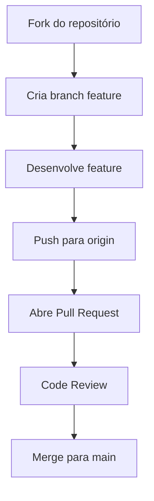

# Fluxo de Trabalho Git

## Visão Geral
Este documento define o fluxo completo de trabalho com Git no projeto Project Wiz, incluindo convenções de branches, commits e processo de revisão.

## Convenções de Branches
| Tipo de Branch | Padrão de Nome | Descrição |
|----------------|----------------|-----------|
| Feature | `feature/nome-da-feature` | Desenvolvimento de novas funcionalidades |
| Hotfix | `hotfix/nome-do-fix` | Correções críticas para produção |
| Release | `release/versao` | Preparação para novas versões |

## Processo de Commit
1. Mensagens devem seguir o padrão:
```
<tipo>: <descrição>

[corpo opcional]

[rodapé opcional]
```

2. Tipos válidos:
- `feat`: Nova funcionalidade
- `fix`: Correção de bug
- `docs`: Alterações na documentação
- `style`: Formatação de código
- `refactor`: Refatoração de código
- `test`: Adição de testes
- `chore`: Tarefas de build/automação

**Exemplo:**
```bash
git commit -m "feat: Adiciona autenticação JWT"
```

## Fluxo Completo


## Revisão de Código
1. Todo PR deve:
- Ter descrição clara
- Referenciar issue relacionada
- Passar em todos os testes
- Ter aprovação de pelo menos 1 revisor

2. Checklist do revisor:
- [ ] Código segue convenções
- [ ] Testes adequados
- [ ] Documentação atualizada
- [ ] Não introduz regressões

## Histórico de Versões
| Versão | Data       | Mudanças          |
|--------|------------|-------------------|
| 1.0.0  | 2025-04-17 | Versão inicial    |

## Links Relacionados
- [Guia de Desenvolvimento](../development.md)
- [Convenções de Código](../guides/convencoes-codigo.md)