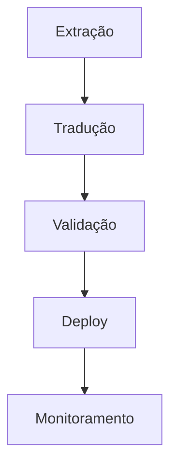

# Guia de Internacionalização (i18n)

## Estrutura de Arquivos
```
locales/
├── en/
│   ├── common.json    # Termos gerais
│   ├── auth.json      # Autenticação
│   └── errors.json    # Mensagens de erro
└── pt-BR/
    ├── common.json
    ├── auth.json
    └── errors.json
```

## Fluxo de Tradução


## Padrões de Código

### Exemplo Correto
```javascript
// Usar namespaces e chaves hierárquicas
t('auth.login.submit_button')
t('common.buttons.cancel')
```

### Exemplo Incorreto
```javascript
// Evitar chaves planas ou descritivas
t('submit_login_button')
t('cancel_button')
```

## Ferramentas Recomendadas

### Extração
1. `i18next-scanner` - Extrai strings do código
2. `i18next-parser` - Gera arquivos de locale

### Tradução
1. `Crowdin` - Plataforma colaborativa
2. `LocaleApp` - Gerenciamento profissional

### Validação
1. `i18next-locales-validator` - Checa consistência
2. `eslint-plugin-i18next` - Regras para ESLint

## Scripts Úteis
```bash
# Extrair strings
npm run i18n:extract

# Validar locales
npm run i18n:validate