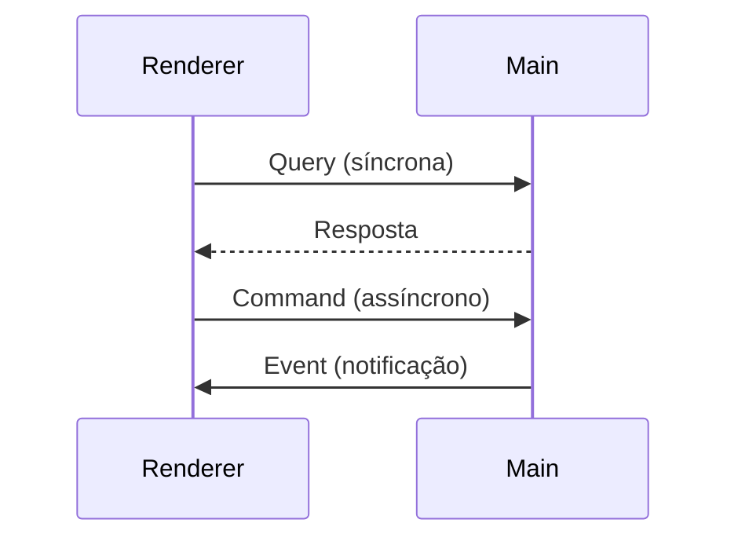

# Documentação Técnica do Sistema IPC

## 1. Visão Geral
O sistema IPC (Inter-Process Communication) é responsável pela comunicação entre os processos Main (Node.js) e Renderer (Browser) na aplicação Electron. Segue uma arquitetura padronizada conforme [ADR-003](docs/adr/003-ipc-architecture.md).

## 2. Diagrama de Fluxo



## 3. Handlers Principais

### 3.1 ChatHandler
Responsável por mensagens de chat. (A implementar)

### 3.2 CommandHandler
Manipula comandos assíncronos. Exemplo:
```typescript
ipcMain.handle("command:user:create", async (e, data) => {
  const usecase = new CreateUserUseCase(userRepository);
  return await usecase.execute(data);
});
```

### 3.3 QueryHandler
Processa consultas síncronas. Exemplo:
```typescript
ipcMain.handle("query:user:get", async (e) => {
  const query = new UserQuery(userRepository);
  return await query.execute();
});
```

## 4. Modelo de Mensagens

### 4.1 Estrutura Padrão
```typescript
interface IpcMessage<T = any> {
  type: string;
  payload?: T;
  meta?: {
    timestamp: number;
    correlationId?: string;
    source?: string;
  };
}
```

### 4.2 Tipos de Payload
- Qualquer dado serializável via `deepSerialize`
- Tipos específicos por canal definidos em `AgentIpcChannels`

### 4.3 Códigos de Erro
Padrão `Result`:
```typescript
type Result<T> = OK<T> | NOK<Error>;
```

## 5. Padrões

### 5.1 Serialização
- Usa `deepSerialize` e `deepDeserialize` para objetos complexos
- Suporta classes, Date, Map, Set, etc.

### 5.2 Retry Policy
Configurável por chamada:
```typescript
interface RetryPolicy {
  maxRetries: number; // padrão: 3
  delay: number; // ms, padrão: 1000
  timeoutRetries?: number; // retries específicos para timeout
}
```

### 5.3 Timeout
- Configurável por chamada via `options.timeout`
- Timeout padrão: 5000ms

## 6. Exemplos de Implementação

### 6.1 Renderer Process
```typescript
const result = await ipcService.invokeHandler(
  "query:user:get",
  { userId: 123 },
  { timeout: 3000 }
);
```

### 6.2 Main Process
```typescript
ipcManager.registerHandler(
  "query:user:get",
  async (event, payload) => {
    const query = new UserQuery(userRepository);
    return await query.execute(payload);
  },
  { timeout: 5000 }
);
```

## 7. Referências
- [ADR-003: Arquitetura IPC](docs/adr/003-ipc-architecture.md)
- [Código Fonte IPC](src/infrastructure/ipc/)