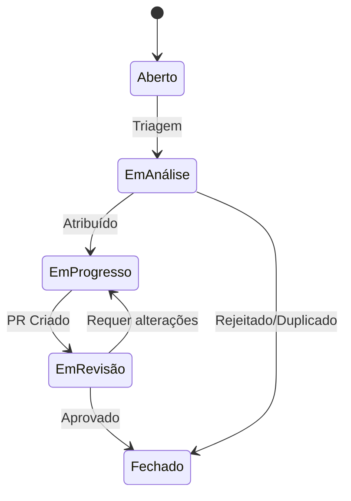

# Gerenciamento de Issues

## Introdução

Este documento define os padrões e fluxos para gerenciamento de issues no Project Wiz, incluindo classificação, ciclo de vida e integração com os agents.

## Tipos de Issues

### Classificação por Prioridade

| Prioridade | Definição                                           | SLA       |
| ---------- | --------------------------------------------------- | --------- |
| Crítica    | Bloqueia funcionalidade principal ou produção       | 24h       |
| Alta       | Impacta significativamente a experiência do usuário | 3 dias    |
| Média      | Problema ou melhoria não crítica                    | 1 semana  |
| Baixa      | Melhorias cosméticas ou tarefas administrativas     | 2 semanas |

### Categorias

1. **Bug**: Comportamento incorreto do sistema
2. **Feature**: Nova funcionalidade ou melhoria
3. **Documentação**: Atualização ou criação de docs
4. **Tarefa**: Atividade técnica ou administrativa
5. **Segurança**: Vulnerabilidade ou risco

### Template Padrão

```markdown
**Título**: Descrição concisa do problema/melhoria

**Tipo**: [Bug/Feature/Documentação/Tarefa/Segurança]
**Prioridade**: [Crítica/Alta/Média/Baixa]

**Descrição**:
[Contexto detalhado, comportamento esperado vs atual]

**Passos para Reproduzir** (para bugs):
1. Passo 1
2. Passo 2

**Critérios de Aceitação** (para features):
- [ ] Critério 1
- [ ] Critério 2

**Informações Adicionais**:
[Screenshots, logs, ambiente]
```

## Fluxo de Trabalho

### Estados do Ciclo de Vida



### Transições Permitidas

| De/Para     | Aberto | EmAnálise | EmProgresso | EmRevisão | Fechado |
| ----------- | ------ | --------- | ----------- | --------- | ------- |
| Aberto      | -      | ✔         | -           | -         | ✔       |
| EmAnálise   | ✔      | -         | ✔           | -         | ✔       |
| EmProgresso | -      | ✔         | -           | ✔         | ✔       |
| EmRevisão   | -      | -         | ✔           | -         | ✔       |
| Fechado     | ✔      | -         | -           | -         | -       |

### Papéis e Responsabilidades

| Papel         | Responsabilidades                     |
| ------------- | ------------------------------------- |
| Reporter      | Criar issue com informações completas |
| Triador       | Classificar prioridade e tipo         |
| Desenvolvedor | Implementar solução                   |
| Revisor       | Validar implementação                 |
| Product Owner | Priorizar backlog                     |

## Integração com Agents

### Monitoramento e Processamento

1. **Agente de Triagem**:
   - Classifica novas issues automaticamente usando LLM
   - Sugere templates e informações faltantes
   - Notifica responsáveis

2. **Agente de Progresso**:
   - Monitora tempo em cada estado
   - Alerta sobre SLAs próximos
   - Sugere realocação de recursos

3. **Agente de Documentação**:
   - Atualiza changelogs
   - Gera relatórios de métricas
   - Vincula issues a PRs relacionados

### Automatização de Fluxos

- Criação automática de branches com padrão `issue/{id}`
- Atualização de status via commit messages
- Notificações no canal #issues do projeto

## Exemplos Práticos

### Exemplo 1: Bug Crítico

1. **Criação**:
   - Usuário reporta erro na autenticação
   - Agente classifica como Bug/Crítica
   - Template preenchido automaticamente

2. **Processamento**:
   - Atribuído ao especialista em segurança
   - PR criado em 4 horas
   - Hotfix liberado em 12h

3. **Métricas**:
   - Tempo de resolução: 18h
   - Impacto: 100% dos usuários

### Exemplo 2: Feature Request

1. **Criação**:
   - PO sugere nova funcionalidade
   - Agente sugere template de feature
   - Prioridade definida como Média

2. **Processamento**:
   - Adicionado ao sprint backlog
   - Implementado em 2 semanas
   - Testes A/B realizados

3. **Métricas**:
   - Velocidade: 5 story points
   - Adoção: 78% em 1 mês

### Exemplo 3: Documentação

1. **Criação**:
   - Agente detecta doc desatualizada
   - Cria issue automática
   - Prioridade Baixa

2. **Processamento**:
   - Atualização feita em 1 dia
   - Revisão por pares
   - Publicação automática

3. **Métricas**:
   - Páginas atualizadas: 3
   - Acessos: +40% pós-atualização

## Referências

- [Fluxo de Desenvolvimento](docs/workflow.md)
- [Agentes do Sistema](docs/AGENT.md)
- [Políticas de SLA](docs/SLA.md)

## Issues Técnicas Ativas

### Implementar sistema de gestão de documentação

**Tipo**: Feature
**Prioridade**: Alta
**Status**: EmAnálise
**Responsável**: Equipe de Documentação

**Descrição**:
Implementar um sistema centralizado para gestão de documentação técnica do projeto, incluindo:
- Versionamento de documentos
- Controle de revisões
- Integração com agents de automação
- Relatórios de consistência

**Critérios de Aceitação**:
- [ ] Sistema armazena histórico de versões
- [ ] Interface para comparação entre versões
- [ ] Integração com agentes de documentação
- [ ] Geração automática de relatórios

**Etapas de Desenvolvimento**:
1. Definir modelo de armazenamento
2. Implementar API de gerenciamento
3. Desenvolver interface de visualização
4. Integrar com agents existentes
5. Testes e validação

**Prazo Estimado**: 2 sprints (4 semanas)
**Documentação Relacionada**:
- [Plano de Documentação](docs/plano-documentacao.md)
- [Agentes do Sistema](docs/AGENT.md)

---

### Validar consistência da documentação

**Tipo**: Documentação
**Prioridade**: Média
**Status**: Aberto
**Responsável**: QA e Technical Writers

**Checklist de Verificação**:
- [ ] Terminologia consistente
- [ ] Links funcionais
- [ ] Exemplos atualizados
- [ ] Diagramas precisos
- [ ] Versionamento correto

**Métricas de Qualidade**:
- 100% dos links válidos
- 95% de consistência terminológica
- Zero exemplos desatualizados
- 100% de diagramas com legendas

**Frequência**: Mensal
**Documentação Relacionada**:
- [Relatório de Consistência](docs/relatorio-consistencia.md)
- [Revisão de Documentação](docs/revisao-documentacao.md)

---

### Implementar auditoria automatizada

**Tipo**: Melhoria Contínua
**Prioridade**: Média
**Status**: EmAnálise

**Proposta de Automação**:
- Scanner diário de documentos
- Verificação de padrões
- Alertas para inconsistências

**Ferramentas Sugeridas**:
- Vale (lint para documentação)
- Markdown Link Check
- Custom scripts com Node.js

**Frequência de Execução**:
- Verificações diárias (incrementais)
- Scans completos semanais

**Benefícios Esperados**:
- Redução de 80% em erros manuais
- Detecção precoce de problemas
- Padronização automática

**Documentação Relacionada**:
- [Auditoria de Documentação](docs/audits/2025-06-13-documentation-review.md)
- [Plano de Implementação](docs/plano-implementacao.md)