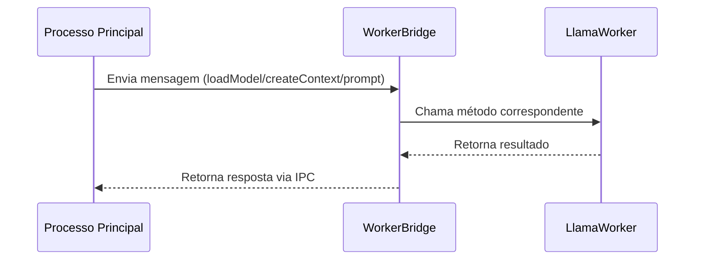

# Serviços LLM do Project Wiz

## Visão Geral

Os serviços LLM fornecem integração com modelos de linguagem locais via node-llama-cpp, permitindo:

- Carregamento de modelos Llama
- Criação de contextos de inferência
- Geração de respostas via prompts
- Comunicação IPC entre processos
- Download de modelos remotos
- Envio de prompts assíncronos

## Arquitetura

### Interface IPC do WorkerService

Os handlers IPC do WorkerService seguem um padrão uniforme, recebendo e repassando payloads idênticos aos do worker. Todos os handlers são registrados no processo principal e delegam as operações para o worker via IPC.

#### Handlers Disponíveis:

1. **worker:initialize**

   - **Payload:** `LlamaOptions`
   - **Descrição:** Inicializa o runtime Llama
   - **Exemplo:**
     ```typescript
     await ipcRenderer.invoke("worker:initialize", {
       modelPath: "model.bin",
       gpuLayers: 20,
     });
     ```

2. **worker:loadModel**

   - **Payload:** `LlamaModelOptions`
   - **Descrição:** Carrega um modelo na memória
   - **Exemplo:**
     ```typescript
     await ipcRenderer.invoke("worker:loadModel", {
       modelPath: "model.bin",
       gpuLayers: 20,
     });
     ```

3. **worker:createContext**

   - **Payload:** `LlamaContextOptions`
   - **Descrição:** Cria um novo contexto para inferência
   - **Exemplo:**
     ```typescript
     await ipcRenderer.invoke("worker:createContext", {
       seed: 42,
       threads: 4,
     });
     ```

4. **worker:initializeSession**

   - **Payload:** `LlamaChatSessionOptions`
   - **Descrição:** Inicializa uma sessão de chat
   - **Exemplo:**
     ```typescript
     await ipcRenderer.invoke("worker:initializeSession", {
       systemPrompt: "Você é um assistente útil",
     });
     ```

5. **worker:prompt**

   - **Payload:** `{ prompt: string, options?: LLamaChatPromptOptions }`
   - **Descrição:** Executa um prompt no modelo carregado
   - **Exemplo:**
     ```typescript
     const response = await ipcRenderer.invoke("worker:prompt", {
       prompt: "Explique clean architecture",
       options: { temperature: 0.7 },
     });
     ```

6. **worker:unloadModel**

   - **Payload:** `{ modelPath: string }`
   - **Descrição:** Descarrega um modelo da memória
   - **Exemplo:**
     ```typescript
     await ipcRenderer.invoke("worker:unloadModel", {
       modelPath: "model.bin",
     });
     ```

7. **worker:downloadModel**

   - **Payload:** `ModelDownloaderOptions`
   - **Descrição:** Baixa um modelo remoto
   - **Exemplo:**
     ```typescript
     await ipcRenderer.invoke("worker:downloadModel", {
       repo: "TheBloke/Llama-2-7B-GGUF",
       file: "llama-2-7b.Q4_K_M.gguf",
     });
     ```

8. **worker:sendPrompt**
   - **Payload:** `{ prompt: string, options?: LLamaChatPromptOptions }`
   - **Descrição:** Envia um prompt de forma assíncrona, retornando um ID de operação
   - **Exemplo:**
     ```typescript
     const operationId = await ipcRenderer.invoke("worker:sendPrompt", {
       prompt: "Explique clean architecture",
       options: { temperature: 0.7 },
     });
     ```

### Componentes Principais

#### LlamaWorker (`worker.ts`)

Classe principal que gerencia o ciclo de vida do modelo LLM:

- `loadModel()`: Carrega o modelo a partir do caminho especificado
- `createContext()`: Cria contexto para inferência
- `initializeSession()`: Inicializa sessão de chat
- `prompt()`: Executa inferência com o prompt fornecido

#### LlamaWorkerBridge (`worker-bridge.ts`)

Gerencia a comunicação IPC entre processos:

- Recebe mensagens via MessagePortMain
- Roteia chamadas para o LlamaWorker
- Implementa padrão EventEmitter para comunicação assíncrona

## Fluxo de Comunicação IPC



## Configuração de Modelos

1. Modelos devem ser colocados em `src/core/services/llm/llama/models/`
2. Configuração básica:

```typescript
const worker = await LlamaWorker.create();
await worker.loadModel({
  modelPath: "nome-do-modelo.bin",
  gpuLayers: 20,
});
```

## Exemplos de Uso

### Carregamento e Inferência Básica

```typescript
const worker = await LlamaWorker.create();
await worker.loadModel({ modelPath: "model.bin" });
await worker.createContext();
await worker.initializeSession();

const response = await worker.prompt("Qual é o sentido da vida?");
console.log(response);
```

### Tratamento de Erros

```typescript
try {
  await worker.prompt("...");
} catch (error) {
  if (error.message === "Session not loaded.") {
    // Tratar erro de sessão não inicializada
  }
}
```

## Integração com Hugging Face

> **Nota:** Esta funcionalidade está planejada para versões futuras. A integração permitirá:
>
> - Download direto de modelos do Hugging Face Hub
> - Conversão automática de formatos de modelo
> - Gerenciamento de repositórios de modelos

**Roadmap:**

- Q2 2025: Implementação inicial
- Q3 2025: Suporte a modelos específicos

## Referências

- [Documentação node-llama-cpp](https://github.com/withcatai/node-llama-cpp)
- [Padrões IPC do Electron](https://www.electronjs.org/docs/latest/tutorial/ipc)
