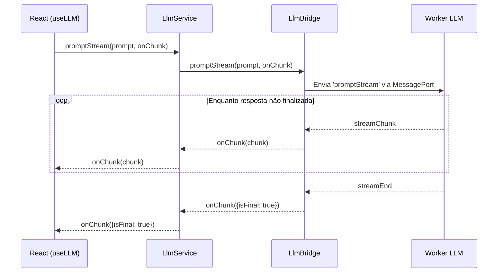

# Serviços LLM - Arquitetura Consolidada

## Visão Geral

A nova arquitetura dos serviços LLM do Project Wiz foi consolidada para garantir:

- Separação clara entre domínio, aplicação, infraestrutura e frontend
- Suporte nativo a **streaming** de respostas
- Comunicação eficiente via **IPC com MessagePort**
- Facilidade de uso via **hook React `useLLM`**
- Adoção dos princípios **Clean Architecture**

---

## Camadas e Componentes

### 1. Domain

- **Entidades:** `Prompt`, `StreamChunk`
- **Interfaces:** `ILlmService`, `IWorkerService`, `IModelManager`
- Define contratos para geração, carregamento e streaming

### 2. Application

- **Classe principal:** `LlmService`
- Orquestra carregamento de modelos, geração síncrona e streaming
- Expõe métodos:
  - `loadModel(modelPath: string)`
  - `prompt(promptText: string)`
  - `promptStream(prompt: Prompt, onChunk: (chunk: StreamChunk) => void)`

### 3. Infrastructure

- **Adaptadores IPC:** `ElectronWorkerAdapter`, `LlmBridge`
- Gerenciam comunicação com workers via MessagePort
- Tratam erros e propagam eventos de streaming

### 4. Frontend

- **Hook React:** `useLLM`
- Facilita integração com UI
- Suporte a geração síncrona e streaming com cancelamento

---

## Fluxo de Streaming Consolidado



- O fluxo é **assíncrono e incremental**
- Cada chunk parcial é propagado até a UI
- Cancelamento possível via método `cancel()`

---

## Protocolo IPC Atualizado

### Canais e Mensagens

| Tipo de Mensagem     | Direção             | Payload                               | Descrição                                 |
|----------------------|---------------------|---------------------------------------|-------------------------------------------|
| `loadModel`          | UI → Worker         | `{ modelPath }`                       | Carrega modelo                           |
| `prompt`             | UI → Worker         | `{ prompt }`                          | Geração síncrona                         |
| `promptStream`       | UI → Worker         | `{ prompt }`                          | Inicia geração via streaming             |
| `cancelStream`       | UI → Worker         | `{ requestId }`                       | Cancela streaming                        |
| `response`           | Worker → UI         | `string`                              | Resposta final síncrona                  |
| `streamChunk`        | Worker → UI         | `StreamChunk`                         | Pedaço parcial da resposta               |
| `streamEnd`          | Worker → UI         | `void`                                | Fim do streaming                         |
| `error`              | Worker → UI         | `Error`                               | Erro na operação                         |

- Cada requisição possui um `requestId` único
- Streaming envia múltiplos `streamChunk` e finaliza com `streamEnd`
- Cancelamento interrompe o fluxo

---

## Interfaces Principais

### `LlmService`

```typescript
const llmService = new LlmService(workerService, modelManager);

await llmService.loadModel('model.bin');

const resposta = await llmService.prompt('Explique Clean Architecture');

await llmService.promptStream(
  { text: 'Explique Clean Architecture' },
  (chunk) => {
    console.log('Chunk recebido:', chunk.content, 'Final?', chunk.isFinal);
  }
);
```

### Hook `useLLM`

```typescript
const {
  isLoading,
  error,
  loadModel,
  generate,
  generateStream,
} = useLLM(llmBridge);

// Carregar modelo
await loadModel({ modelPath: 'model.bin' });

// Geração simples
const resposta = await generate({ prompt: 'Explique Clean Architecture' });

// Geração com streaming
const { cancel } = generateStream(
  { text: 'Explique Clean Architecture' },
  (chunk) => {
    console.log('Chunk:', chunk.content, 'Final?', chunk.isFinal);
  }
);

// Cancelar se necessário
cancel();
```

---

## Guia de Migração

### Mudanças Principais

- **Substituição do uso direto de `ipcRenderer.invoke`** pelo `LlmBridge` via `MessagePort`
- **Uso do `LlmService`** para orquestração, em vez de chamadas diretas
- **Streaming via `promptStream`** com callback incremental
- **Hook `useLLM`** para integração React, substituindo chamadas manuais

### Passos para Adoção

1. **Atualize imports**

```typescript
// Antes
import { ipcRenderer } from 'electron';

// Depois
import { LlmService } from 'src/core/application/services/llm-service';
import { useLLM } from 'src/client/hooks/use-llm';
```

2. **Instancie o serviço**

```typescript
const llmService = new LlmService(workerService, modelManager);
```

3. **Adapte chamadas síncronas**

```typescript
// Antes
await ipcRenderer.invoke('worker:prompt', { prompt: '...' });

// Depois
await llmService.prompt('...');
```

4. **Implemente streaming**

```typescript
await llmService.promptStream(prompt, onChunk);
```

ou via hook:

```typescript
const { generateStream } = useLLM(bridge);
generateStream(prompt, onChunk);
```

5. **Gerencie cancelamento**

```typescript
const { cancel } = generateStream(prompt, onChunk);
cancel();
```

6. **Remova código legado**

- Handlers IPC antigos
- Chamadas diretas a `ipcRenderer.invoke`
- Listeners manuais

---

## Considerações Finais

- O fluxo de streaming **não remove listeners automaticamente** (ver `LlmService`), atenção para evitar vazamentos.
- O protocolo IPC é **baseado em mensagens com `requestId`** para múltiplas requisições simultâneas.
- A arquitetura segue **Clean Architecture**, facilitando testes e manutenção.
- Consulte os ADRs relacionados para decisões detalhadas:
  - [ADR-0006 - Nomenclatura Serviços LLM](../docs/adr/ADR-0006-Nomenclatura-Servicos-LLM.md)
  - [ADR-0008 - Clean Architecture LLM](../docs/adr/ADR-0008-Clean-Architecture-LLM.md)

---

## Referências

- [node-llama-cpp](https://github.com/withcatai/node-llama-cpp)
- [Electron IPC](https://www.electronjs.org/docs/latest/tutorial/ipc)
- [Documentação React](https://reactjs.org/docs/hooks-intro.html)
