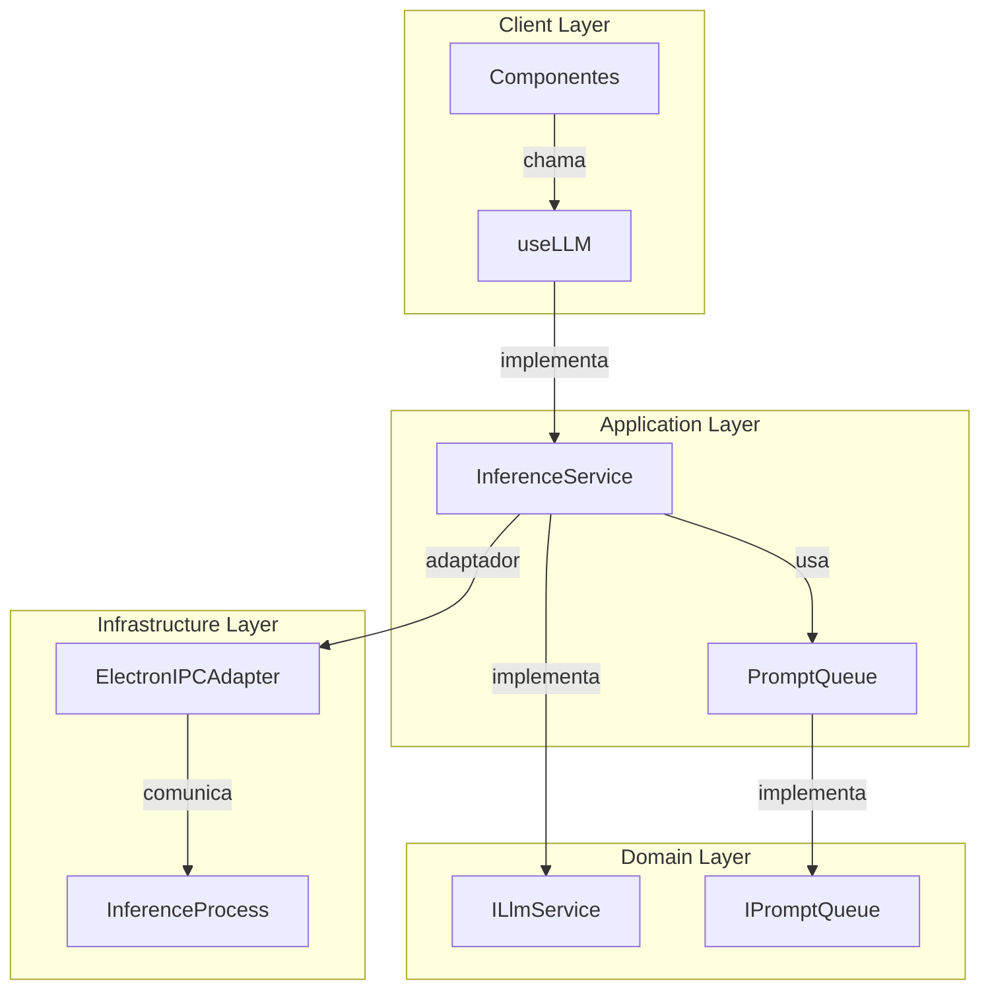

# Serviços LLM - Arquitetura e Protocolos

## Contexto Arquitetural (Atualizado)
- **Base:** [ADR-0012](../adr/ADR-0012-Clean-Architecture-LLM.md) (Clean Architecture)
- **Nomenclatura:** [ADR-0008](../adr/ADR-0008-Nomenclatura-Servicos-LLM.md)
- **Camadas:**
  - **Domain:**
    - Entidades (`Prompt`, `Model`)
    - Interfaces (`ILlmService`, `IStreamHandler`)
  - **Application:**
    - `InferenceService` (ex-LlmService)
    - `PromptOrchestrator`
  - **Infrastructure:**
    - `ElectronIPCAdapter`
    - `InferenceProcess` (ex-Worker)
  - **Client:**
    - Hook `useLLM` (interface única)

## Diagrama de Fluxo (Atualizado)

## Implementação Detalhada

### Fluxo de Streaming (Conforme ADR-0017)
1. **Inicialização:**
   - UI chama `useLLM().generateStream()`
   - `InferenceService` valida e enfileira prompt
   - Cria `StreamHandler` com timeout configurável

2. **Execução:**
   - `ElectronIPCAdapter` envia `inferenceRequest`
   - `InferenceProcess` inicia geração
   - Chunks são enviados via `streamChunk`

3. **Finalização:**
   - Sucesso: `streamEnd` com metadados
   - Erro: `streamError` com detalhes
   - Timeout: cancelamento automático

### Protocolo IPC (Completo)
| Mensagem            | Direção            | Payload                          | Timeout Padrão |
|---------------------|--------------------|----------------------------------|----------------|
| `inferenceRequest`  | App → Infra        | { prompt: string, params: {...} }| 30s            |
| `streamChunk`       | Infra → App        | { chunk: string, id: string }    | -              |
| `streamEnd`         | Infra → App        | { id: string, stats: {...} }     | -              |
| `streamError`       | Infra → App        | { id: string, error: string }    | -              |
| `cancelRequest`     | App → Infra        | { id: string }                   | -              |

### Gerenciamento de Recursos
- **Timeout:** Configurável por requisição
- **Retry:** Política exponencial (max 3 tentativas)
- **Cleanup:** Remove streams inativos após 5min

## Boas Práticas

1. **Client:**
   - Usar apenas `useLLM` hook
   - Tratar todos os estados (loading, error, success)
   - Implementar cancelamento via `AbortController`

2. **Application:**
   - Validar inputs no boundary
   - Logar métricas de performance
   - Implementar circuit breaker

3. **Infrastructure:**
   - Usar `MessageChannelMain` para IPC
   - Serializar/validar payloads com Zod
   - Monitorar recursos dos processos

## Referências

- [ADR-0012](../adr/ADR-0012-Clean-Architecture-LLM.md): Arquitetura
- [ADR-0008](../adr/ADR-0008-Nomenclatura-Servicos-LLM.md): Nomenclatura
- [ADR-0017](../adr/ADR-0017-Gerenciamento-Streams-Requisicoes-LlmService.md): Streams
- [IPC Best Practices](https://www.electronjs.org/docs/latest/api/ipc-best-practices)

**Histórico de Versões:**
| Versão | Data       | Mudanças                |
|--------|------------|-------------------------|
| 2.1.0  | 2025-04-16 | Timeouts e cancelamento |
| 2.0.0  | 2025-03-28 | Nova nomenclatura       |
| 1.0.0  | 2025-02-15 | Versão inicial          |
