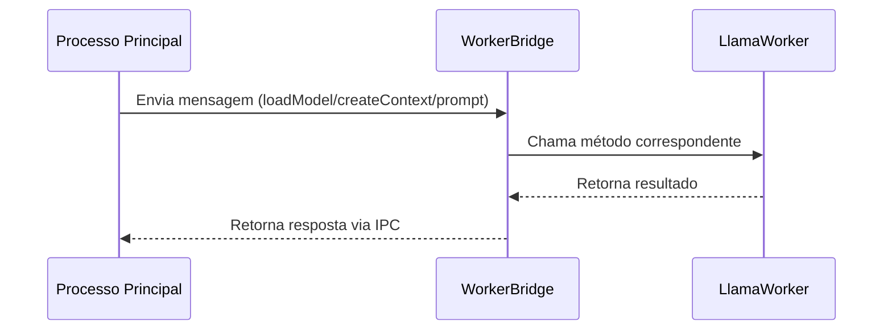

# Serviços LLM do Project Wiz

## Visão Geral

Os serviços LLM fornecem integração com modelos de linguagem locais via node-llama-cpp, permitindo:

- Carregamento de modelos Llama
- Criação de contextos de inferência
- Geração de respostas via prompts
- Comunicação IPC entre processos

## Arquitetura

### Componentes Principais

#### LlamaWorker (`worker.ts`)

Classe principal que gerencia o ciclo de vida do modelo LLM:

- `loadModel()`: Carrega o modelo a partir do caminho especificado
- `createContext()`: Cria contexto para inferência
- `initializeSession()`: Inicializa sessão de chat
- `prompt()`: Executa inferência com o prompt fornecido

#### LlamaWorkerBridge (`worker-bridge.ts`)

Gerencia a comunicação IPC entre processos:

- Recebe mensagens via MessagePortMain
- Roteia chamadas para o LlamaWorker
- Implementa padrão EventEmitter para comunicação assíncrona

## Fluxo de Comunicação IPC



## Configuração de Modelos

1. Modelos devem ser colocados em `src/core/services/llm/llama/models/`
2. Configuração básica:

```typescript
const worker = await LlamaWorker.create();
await worker.loadModel({
  modelPath: "nome-do-modelo.bin",
  gpuLayers: 20,
});
```

## Exemplos de Uso

### Carregamento e Inferência Básica

```typescript
const worker = await LlamaWorker.create();
await worker.loadModel({ modelPath: "model.bin" });
await worker.createContext();
await worker.initializeSession();

const response = await worker.prompt("Qual é o sentido da vida?");
console.log(response);
```

### Tratamento de Erros

```typescript
try {
  await worker.prompt("...");
} catch (error) {
  if (error.message === "Session not loaded.") {
    // Tratar erro de sessão não inicializada
  }
}
```

## Integração com Hugging Face

(Seção a ser preenchida quando a integração for implementada)

## Referências

- [Documentação node-llama-cpp](https://github.com/withcatai/node-llama-cpp)
- [Padrões IPC do Electron](https://www.electronjs.org/docs/latest/tutorial/ipc)
