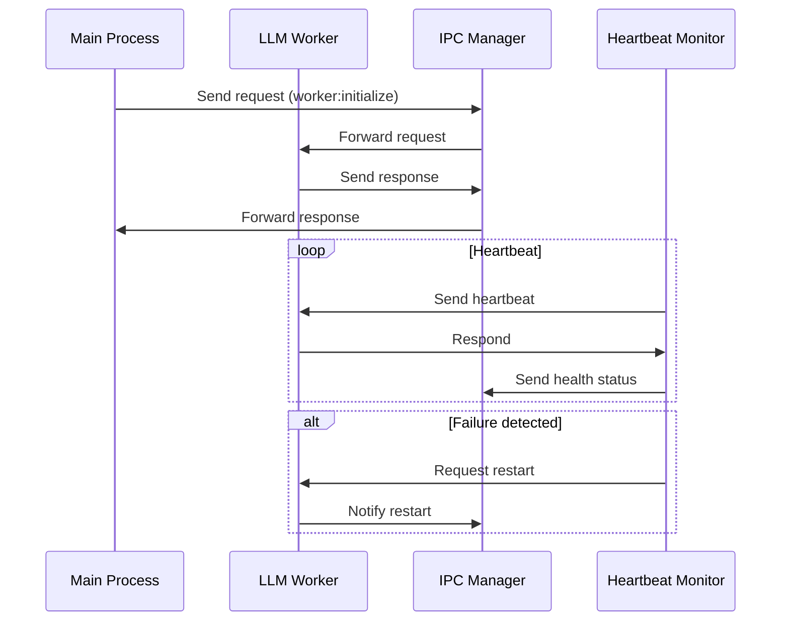

# LLM Worker Integration Documentation

## Communication Flow



## Configuration Guide

### Security Policies
```typescript
interface SecurityPolicy {
  sandbox: {
    enabled: boolean;
    nodeIntegration: boolean;
    contextIsolation: boolean;
  };
  csp: {
    directives: string;
  };
  allowedAPIs: string[];
  resourceLimits: {
    cpu: { maxUsage: number };
    memory: { maxMB: number };
  };
}

// Default policy:
{
  sandbox: { enabled: true, nodeIntegration: false, contextIsolation: true },
  csp: { directives: "default-src 'self'; script-src 'self' 'unsafe-eval'" },
  allowedAPIs: ["llm", "ipc", "fs:read"],
  resourceLimits: { cpu: { maxUsage: 80 }, memory: { maxMB: 1024 } }
}
```

## API Reference

### IPC Channels
| Channel               | Direction   | Payload                        | Description           |
| --------------------- | ----------- | ------------------------------ | --------------------- |
| worker:initialize     | Main→Worker | { options?: LlamaOptions }     | Initialize LLM worker |
| worker:loadModel      | Main→Worker | { options: LlamaModelOptions } | Load model            |
| worker:health-status  | Worker→Main | HeartbeatEvent                 | Health metrics        |
| worker:processRequest | Main→Worker | { prompt: string }             | Process LLM request   |

### Heartbeat Configuration
```typescript
interface HeartbeatConfig {
  intervalMs: number;  // Default: 3000
  timeoutMs: number;   // Default: 2000  
  maxRetries: number;  // Default: 3
}

interface HeartbeatEvent {
  status: "healthy" | "degraded" | "failed";
  metrics: {
    cpuUsage: number;
    memoryUsage: number;
    avgResponseTime: number;
  };
}
```

## Error Handling

### Common Error Scenarios
1. **Worker Crash**
   - Heartbeat detects failure
   - Process is automatically restarted
   - Pending requests are rejected

2. **IPC Timeout**
   - 30s timeout for requests
   - Error logged with request details
   - Channel automatically closed

3. **Resource Limits**
   - CPU/Memory limits enforced
   - Requests throttled when limits exceeded
   - Events logged for monitoring

## Performance Optimization

### Recommended Settings
```typescript
// For high-load scenarios:
{
  heartbeat: {
    intervalMs: 5000,
    timeoutMs: 3000,
    maxRetries: 5
  },
  resourceLimits: {
    cpu: { maxUsage: 90 },
    memory: { maxMB: 2048 } 
  }
}
```

### Monitoring Metrics
- Requests per second
- Average response time
- CPU/Memory usage
- Error rates
- Restart counts