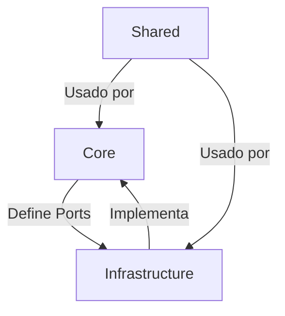
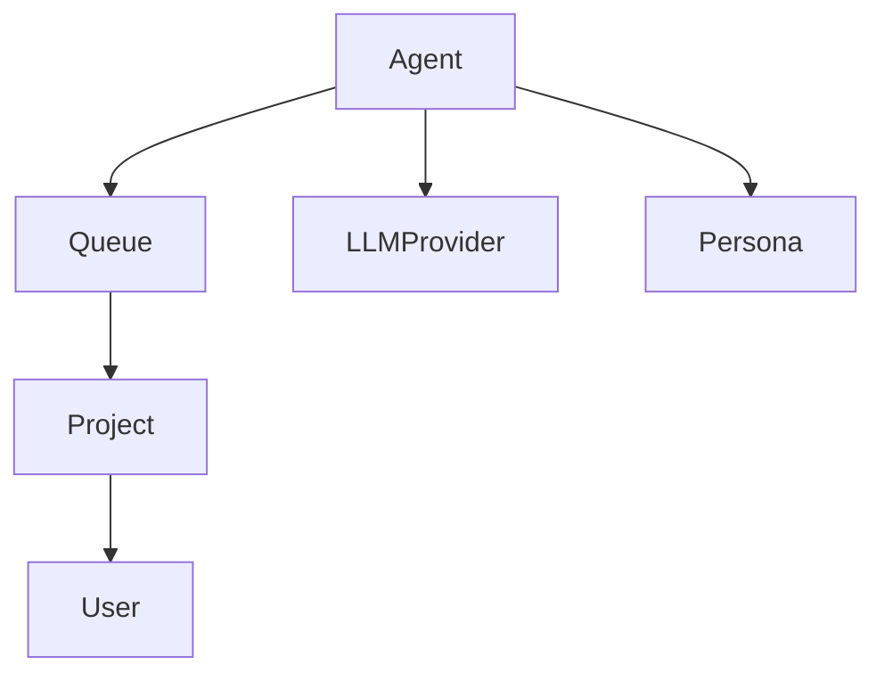
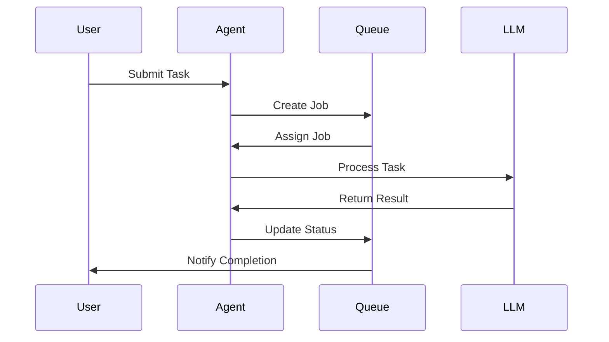

# Módulos do Sistema Project Wiz

## 1. Arquitetura de Módulos

### Visão Geral da Modularização
O sistema é organizado em módulos seguindo os princípios de Clean Architecture, com separação clara entre:
- **Core**: Lógica de domínio e casos de uso
- **Infrastructure**: Implementações concretas de adapters
- **Shared**: Utilitários e código compartilhado



### Princípios de Design Aplicados
1. **Inversão de Dependência**: Módulos de alto nível não dependem de baixo nível
2. **Separação de Responsabilidades**: Cada módulo tem uma única responsabilidade
3. **Baixo Acoplamento**: Comunicação via interfaces bem definidas
4. **Alta Coesão**: Funcionalidades relacionadas são agrupadas

### Módulos Principais
- **Agent**: Gerencia execução de tarefas e comunicação entre agentes
- **LLM Provider**: Integração com modelos de linguagem
- **Persona**: Configuração de personalidades dos agentes
- **Queue**: Gerenciamento de jobs e filas (FQueue)
- **Project**: Gestão de projetos e repositórios
- **User**: Autenticação e gestão de usuários

## 2. Dependências entre Módulos

### Mapa de Dependências


### Regras de Acoplamento
1. Módulos Core não podem depender de Infrastructure
2. Módulos podem depender apenas de Shared ou módulos do mesmo nível
3. Comunicação entre módulos deve ser via interfaces (Ports)

### Hierarquia de Módulos
| Nível              | Módulos                    |
| ------------------ | -------------------------- |
| **Core**           | Agent, Queue, Project      |
| **Infrastructure** | LLMProvider, Persona, User |
| **Shared**         | Result, TryCatch, Slugfy   |

## 3. APIs Internas

### Contratos Principais
1. **Queue Interface**:
```typescript
interface Queue {
  addJob(job: Job): Promise<Job>
  getNextJob(agentId: string): Promise<Job>
  updateJobStatus(jobId: string, status: JobStatus): Promise<void>
}
```

2. **Agent Communication**:
```typescript
interface AgentMessage {
  sender: string
  recipient: string
  content: string
  requiresResponse: boolean
}
```

3. **Error Handling**:
- Padrão de erros definido em `src/core/common/errors.ts`
- Retry com backoff exponencial configurável

### Protocolos de Comunicação
1. **IPC**: Comunicação entre processos Electron
2. **FQueue**: Mensagens entre agentes via fila
3. **Direct Calls**: Chamadas diretas entre módulos do mesmo nível

## 4. Diagramas

### Diagrama de Componentes
```mermaid
componentDiagram
    component Agent {
        TaskProcessor
        MessageHandler
        ToolExecutor
    }
    component Queue {
        JobManager
        PriorityScheduler
    }
    component LLM {
        ModelAdapter
        PromptEngine
    }
    Agent --> Queue: Uses
    Agent --> LLM: Calls
```

### Diagrama de Sequência (Fluxo Crítico)


### Diagrama de Implantação
```mermaid
deploymentDiagram
    deployment Electron {
        node MainProcess
        node RendererProcess
    }
    deployment Database {
        node SQLite
    }
    deployment LLM {
        node LocalModel
        node CloudAPI
    }
    
    MainProcess --> SQLite
    MainProcess --> LocalModel
    RendererProcess --> MainProcess
```

## Referências Cruzadas
- [Arquitetura Geral](docs/arquitetura.md)
- [Detalhes do Agente](docs/AGENT.md)
- [Casos de Uso](docs/use-cases/README.md)
- [Implementação da FQueue](src/core/application/queue)