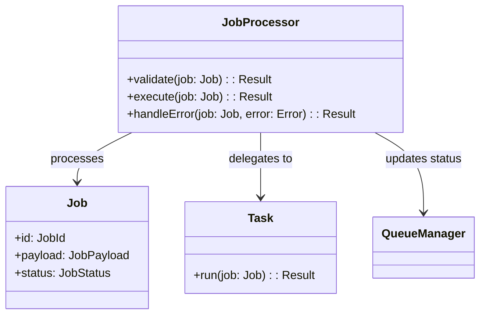

# Job Processor

## Descrição
Responsável por processar jobs individuais, incluindo:
- Validação do payload do job
- Execução da lógica específica do tipo de job
- Tratamento de erros e retentativas
- Atualização do status do job

## Diagrama de Componentes


## Interfaces
```typescript
interface JobProcessor {
  validate(job: Job): Promise<Result<boolean>>;
  execute(job: Job): Promise<Result<JobResult>>;
  handleError(job: Job, error: Error): Promise<Result<void>>;
}
```

## Dependências
- Queue Manager (para atualização de status)
- Task Factory (para criação de tasks específicas)
- Logger Service (para registro de execução)

## Relação com Casos de Uso
- [Processar Job](../use-cases/process-job.md)
- [Reprocessar Job com Falha](../use-cases/retry-failed-job.md)

## Entidades/Value Objects
- `Job` (entidade principal)
- `JobPayload` (value object)
- `JobResult` (value object)
- `JobError` (value object para erros)

## Fluxos Específicos
### Validação de Job
1. Verifica estrutura do payload
2. Valida tipos de dados
3. Verifica dependências

### Processamento
1. Cria Task específica para o tipo de job
2. Executa Task
3. Atualiza status conforme resultado

### Tratamento de Erros
1. Classifica erro (recuperável/não recuperável)
2. Calcula próximo horário de retentativa
3. Atualiza contagem de tentativas