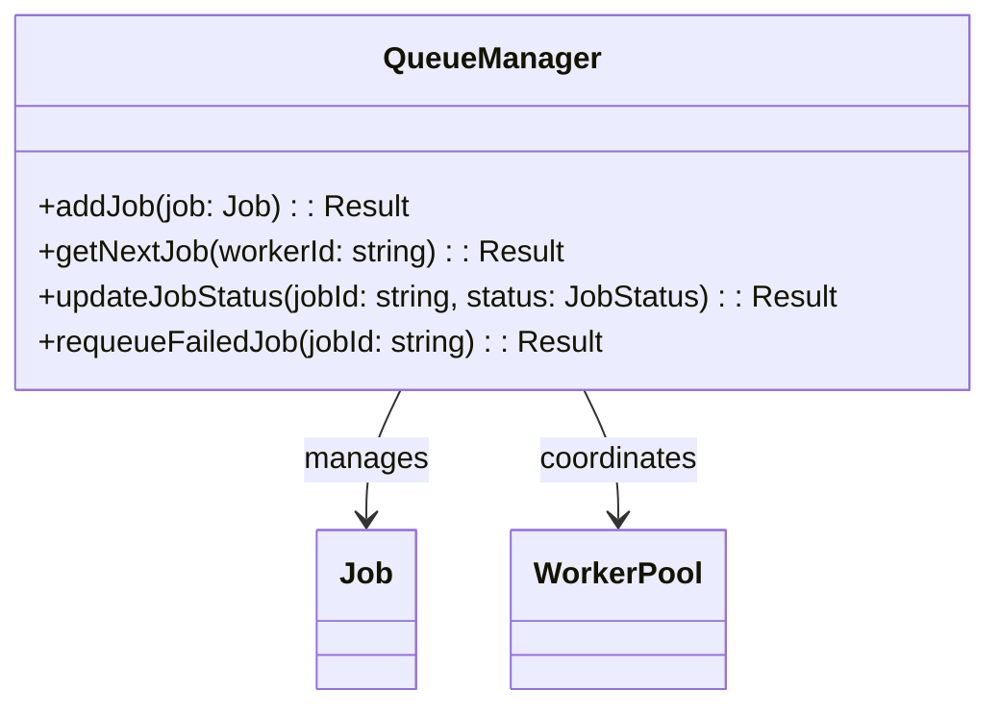

# Queue Manager

## Descrição
Responsável por gerenciar a fila de jobs, incluindo:
- Adição de novos jobs
- Priorização de jobs
- Distribuição para workers disponíveis
- Atualização de status

## Diagrama de Componentes


## Interfaces
```typescript
interface QueueManager {
  addJob(job: Job): Promise<Result<void>>;
  getNextJob(workerId: string): Promise<Result<Job>>;
  updateJobStatus(jobId: string, status: JobStatus): Promise<Result<void>>;
  requeueFailedJob(jobId: string): Promise<Result<void>>;
}
```

## Dependências
- Worker Pool (para disponibilidade de workers)
- Job Processor (para validação de jobs)
- Retry Mechanism (para reprocessamento)

## Relação com Casos de Uso
- [Adicionar Job à Fila](../use-cases/add-job-to-queue.md)
- [Priorizar Jobs](../use-cases/prioritize-jobs.md)
- [Reprocessar Job com Falha](../use-cases/retry-failed-job.md)

## Entidades/Value Objects
- `Job` (entidade principal)
- `JobStatus` (value object)
- `JobPriority` (value object)