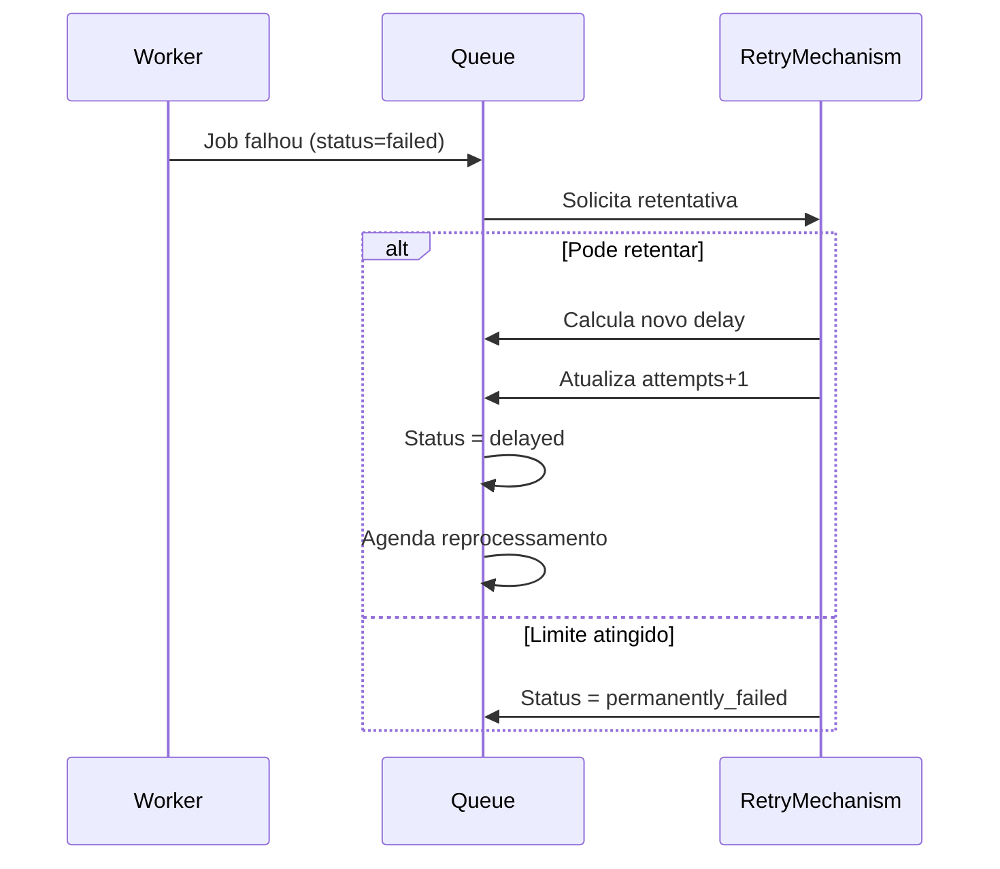

# Mecanismo de Retentativa

## Descrição
Responsável por gerenciar a reprocessamento automático de jobs que falharam, implementando estratégias de backoff e controle de tentativas.

## Diagrama de Sequência


## Estratégias Implementadas
1. **Backoff Exponencial**:
   - Delay inicial: 5 minutos
   - Fórmula: `delay = min(retry_delay * (2^(attempts-1)), max_retry_delay)`

2. **Controle de Tentativas**:
   - Máximo configurável por job (default: 3)
   - Contador incrementado a cada falha

3. **Filtro de Erros**:
   - Alguns erros (ex: validação) não disparam retentativa

## Configurações
| Parâmetro       | Tipo            | Default  | Descrição                          |
| --------------- | --------------- | -------- | ---------------------------------- |
| max_attempts    | PositiveInteger | 3        | Máximo de tentativas               |
| retry_delay     | Milliseconds    | 300000   | Delay base (5min) entre tentativas |
| max_retry_delay | Milliseconds    | 86400000 | Delay máximo (24h)                 |

## Interfaces
```typescript
interface RetryMechanism {
  shouldRetry(job: Job): boolean;
  calculateNextRetry(job: Job): Date;
  handleFailedJob(job: Job): Promise<Result<void>>;
}
```

## Dependências
- Queue Manager (para atualizar status)
- Job Processor (para validar reprocessamento)
- Logger (para registrar tentativas)

## Relação com Casos de Uso
- [Reprocessar Job com Falha](../use-cases/retry-failed-job.md)
- [Adicionar Job à Fila](../use-cases/add-job-to-queue.md) (configura retentativa)

## Exemplo de Configuração
```typescript
const job = {
  id: 'job_123',
  max_attempts: 5,
  retry_delay: 60000, // 1 minuto
  max_retry_delay: 3600000 // 1 hora
};