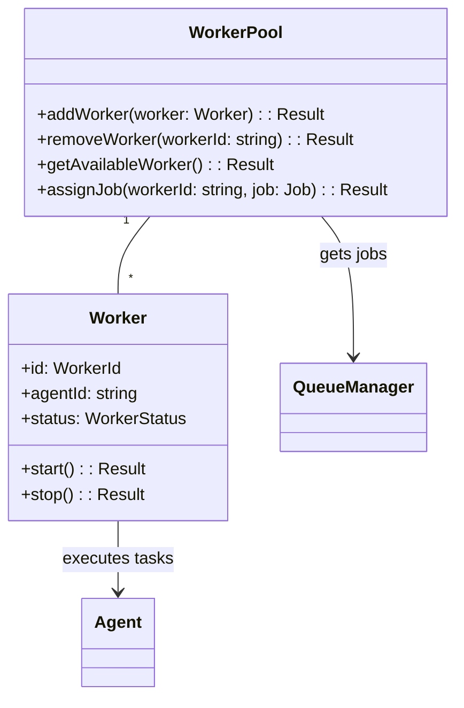

# Worker Pool

## Descrição
Responsável por gerenciar a pool de workers que processam jobs, incluindo:
- Alocação de workers para jobs
- Balanceamento de carga
- Tratamento de falhas
- Escalabilidade horizontal

## Diagrama de Componentes


## Interfaces
```typescript
interface WorkerPool {
  addWorker(worker: Worker): Promise<Result<void>>;
  removeWorker(workerId: string): Promise<Result<void>>;
  getAvailableWorker(): Promise<Result<Worker>>;
  assignJob(workerId: string, job: Job): Promise<Result<void>>;
}

interface Worker {
  readonly id: WorkerId;
  readonly status: WorkerStatus;
  start(): Promise<Result<void>>;
  stop(): Promise<Result<void>>;
  processJob(job: Job): Promise<Result<JobResult>>;
}
```

## Dependências
- Queue Manager (para obtenção de jobs)
- Agent Service (para execução das tasks)
- Monitoring Service (para métricas)

## Relação com Casos de Uso
- [Processar Job](../use-cases/process-job.md)
- [Adicionar Worker](../use-cases/add-worker.md)
- [Remover Worker](../use-cases/remove-worker.md)

## Entidades/Value Objects
- `Worker` (entidade principal)
- `WorkerId` (value object)
- `WorkerStatus` (value object: idle, working, stopped)
- `WorkerCapacity` (value object)