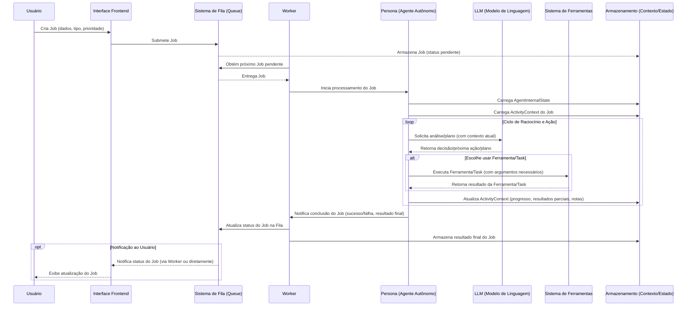

# Diagramas de Fluxo Atuais do Project Wiz ("As Is")

## Introdução

Os diagramas a seguir representam o entendimento atual dos fluxos de processo e da interação entre os componentes chave do Project Wiz. Esta representação é baseada na documentação conceitual existente nas pastas `docs/new_docs/application/`, `docs/new_docs/frontend/`, e `docs/new_docs/backend/`. O objetivo é fornecer uma visualização clara que possa auxiliar na identificação de gargalos, pontos de complexidade ou áreas que necessitem de maior detalhamento no design futuro.

## 1. Diagrama de Sequência: Fluxo de Vida de um Job

Este diagrama ilustra a sequência típica de interações desde a criação de um Job pelo usuário até sua conclusão pela Persona. Baseia-se fortemente no `docs/new_docs/backend/conceptual_flow.md`.



## 2. Diagrama de Blocos: Componentes Conceituais do Backend e suas Interações Principais

Este diagrama de blocos visualiza os principais componentes conceituais do backend, conforme descrito em `docs/new_docs/backend/components.md`, e as suas relações primárias.

```mermaid
graph TD
    subgraph Interação Usuário
        UI[Interface Frontend]
    end

    subgraph Núcleo do Backend
        Queue[Job/Activity Management System (Queue)]
        WorkerPool[Worker & Worker Pool]
        PersonaLogic[Persona Core Logic / Autonomous Agent]
        TaskManager[Task Execution System]
        ToolRegistry[Tool Framework/Registry]
        StateManager[State Management Subsystem]
        LLMIntegration[LLM Integration Point]
    end

    UI -- 1. Criação/Monitoramento de Jobs --> Queue
    WorkerPool -- 2. Obtém Jobs da --> Queue
    WorkerPool -- 3. Delega Job para --> PersonaLogic
    PersonaLogic -- 4. Carrega/Salva Estado (AgentInternalState, ActivityContext) --> StateManager
    PersonaLogic -- 5. Usa para Raciocínio e Decisão --> LLMIntegration
    PersonaLogic -- 6. Decide e Executa --> TaskManager
    TaskManager -- 7. Utiliza (descobre e invoca) --> ToolRegistry
    TaskManager -- 8. Pode interagir diretamente para Tasks complexas --> LLMIntegration
    PersonaLogic -- 9. Reporta Conclusão/Progresso do Job --> WorkerPool
    WorkerPool -- 10. Atualiza Status na --> Queue

    %% Detalhes de interdependência dentro da PersonaLogic (não são fluxos sequenciais diretos, mas usos)
    subgraph Detalhes da Lógica da Persona
        PersonaLogic --- StateManager
        PersonaLogic --- LLMIntegration
        PersonaLogic --- TaskManager
    end
```

## 3. Diagrama de Atividade: Tomada de Decisão Simplificada de uma Persona

Este diagrama de atividade ilustra o fluxo de controle interno simplificado de uma Persona ao processar um Job, focando no ciclo de decisão. É inferido da descrição da `Persona Core Logic` e dos conceitos de `LLM`, `Tasks` e `Tools`.

```mermaid
graph LR
    A[Início do Processamento do Job pela Persona] --> B{Carregar Contextos?};
    B -- Sucesso --> C[AgentInternalState + ActivityContext Carregados];
    C --> D{Analisar Objetivo do Job e Planejar Próximos Passos com LLM};
    D -- Plano/Ação Definida --> E{Selecionar Próxima Ação Concreta};
    E -- Ação requer uma Task específica? --> F[Executar Task via Task Execution System];
    E -- Ação requer uso direto de Tool? --> G[Executar Tool via Tool Framework/Registry];
    F --> H[Atualizar ActivityContext com Resultado da Task];
    G --> I[Atualizar ActivityContext com Resultado da Tool];
    H --> J{Job Concluído?};
    I --> J;
    J -- Sim (Objetivo Alcançado ou Falha Final) --> K[Finalizar Job e Notificar Worker];
    J -- Não (Mais Passos Necessários) --> C; %% Volta para carregar/reavaliar contexto atualizado ou direto para D

    B -- Falha ao Carregar --> Z[Erro Crítico: Impossível Carregar Contexto] --> K;
    D -- Falha no Planejamento/LLM Irrecuperável --> Y[Registrar Falha de Raciocínio] --> K;
    E -- Nenhuma ação válida pode ser selecionada --> X[Registrar Falha na Seleção de Ação] --> K;
```
